# 了解非关系型数据库 NoSQL - MongoDB | 安装使用以及 CRUD 操作

**课程目标**

MongoDB的副本集: 操作, 主要概念, 故障转移, 选举规则 MongoDB的分片集群：概念, 优点, 操作, 分片策略, 故障转移 MongoDB的安全认证

- 理解 MongoDB 的业务场景, 熟悉 MongoDB 的简介, 特点和体系结构, 数据类型等.
- 能够在 Windows 和 Linux 下安装和启动 MongoDB, 图形化管理界面 Compass 的安装使用
- 掌握 MongoDB 基本常用命令实现数据的 CRUD
- 掌握 MongoDB 的索引类型, 索引管理, 执行计划


# 安装相关


### 0: 安装参考官网
参见[官网](https://www.mongodb.com/docs/manual/tutorial/install-mongodb-on-os-x/)

官方可视化 [compass](https://www.mongodb.com/docs/compass/current/install/)

### 1: 启动

`MongoDB`的Shell工具`mongosh`是一个全功能的`JavaScript`和`Node.js`的`14.x REPL`与`MongoDB的`部署交互环境。我们通过它可以直接对数据库进行查询和操作。这个工具是需要在安装玩`MongoDB`后单独安装的。

因为之后我们使用`mongosh`来连接`MongoDB`实例，因此先要对 `MongoDB`服务进行启动。
启动服务主要有两种方式。大致启启动方式有两种：

> 因为是cs架构，一定是先启动服务，再启动应用。

- 比较繁琐，不常使用：

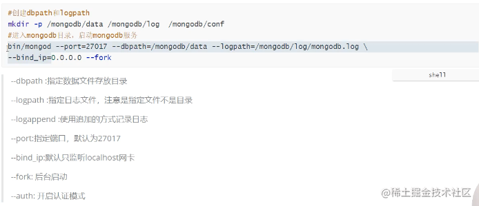
```
// 参考官网unix
#fork 后台运行  若要使用账号密码服务 需要在启动时加 --auth
mongod --dbpath /usr/local/var/mongodb --logpath /usr/local/var/log/mongodb/mongo.log --fork

// mac m1 具体可以官网直接查询即可
mongod --config /opt/homebrew/etc/mongod.conf --fork
```
- `mongod -f ../config/mongod.conf` 通过配置文件启动。

```
#不在后端运行，可以在控制台上查看运行过程，使用配置文件启动
mongod --config /usr/local/etc/mongod.conf
```

**mongsh启动方式是**：`mongosh "mongodb://hostname:port`默认端口 27017

启动本地的直接 `mongosh` 可以启动了。

```js

db.geMongo(); // 当mongosh 连接数据库成功后，通过如下指令查看连接状态
// mongodb://127.0.0.1:27017/?directConnection=true&serverSelectionTimeoutMS=2000&appName=mongosh+1.5.4

```


### 2: 查看服务信息
```
ps aux | grep -v grep | grep mongod
```

### 3: 关闭退出

```
// 1: 关闭方法
db.shutdownServer();
exit

// 2: 
ps -ef | greap mongod 
kill pid

// other
```


## 1. MongoDB 相关概念

### 1.1 业务场景

传统的关系型数据库 (比如 MySQL), 在数据操作的"三高"需求以及对应的 Web 2.0 网站需求面前, 会有"力不从心"的感觉

所谓的三高需求:

**高并发, 高性能, 高可用**, 简称三高

- High Performance: 对<u>数据库的高并发读写</u>的要求
- High Storage: 对<u>海量数据的高效率存储和访问</u>的需求
- High Scalability && High Available: 对数据的<u>高扩展性和高可用性</u>的需求

**而 MongoDB 可以应对三高需求**

具体的应用场景:

- 社交场景, 使用 MongoDB 存储存储用户信息, 以及用户发表的朋友圈信息, 通过地理位置索引实现附近的人, 地点等功能.
- 游戏场景, 使用 MongoDB 存储游戏用户信息, 用户的装备, 积分等直接以内嵌文档的形式存储, 方便查询, 高效率存储和访问.
- 物流场景, 使用 MongoDB 存储订单信息, 订单状态在运送过程中会不断更新, 以 MongoDB 内嵌数组的形式来存储, 一次查询就能将订单所有的变更读取出来.
- 物联网场景, 使用 MongoDB 存储所有接入的智能设备信息, 以及设备汇报的日志信息, 并对这些信息进行多维度的分析.
- 视频直播, 使用 MongoDB 存储用户信息, 点赞互动信息等.


这些应用场景中, 数据操作方面的共同点有:

1. 数据量大
2. 写入操作频繁
3. 价值较低的数据, 对**事务性**要求不高

对于这样的数据, 更适合用 MongoDB 来实现数据存储


那么我们**什么时候选择 MongoDB 呢?**

除了架构选型上, 除了上述三个特点之外, 还要考虑下面这些问题:

- 应用不需要事务及复杂 JOIN 支持
- 新应用, 需求会变, 数据模型无法确定, 想快速迭代开发
- 应用需要 2000 - 3000 以上的读写QPS（更高也可以）
- 应用需要 TB 甚至 PB 级别数据存储
- 应用发展迅速, 需要能快速水平扩展
- 应用要求存储的数据不丢失
- 应用需要 `99.999%` 高可用
- 应用需要大量的地理位置查询, 文本查询

如果上述有1个符合, 可以考虑 MongoDB, 2个及以上的符合, 选择 MongoDB 绝不会后悔.


> 如果用MySQL呢?
>
> 相对MySQL, 可以以更低的成本解决问题（包括学习, 开发, 运维等成本）


### 1.2 MongoDB 简介

> MongoDB是一个开源, 高性能, 无模式的文档型数据库, 当初的设计就是用于简化开发和方便扩展, 是NoSQL数据库产品中的一种.是最 像关系型数据库（MySQL）的非关系型数据库. 它支持的数据结构非常松散, 是一种类似于 JSON 的 格式叫BSON, 所以它既可以存储比较复杂的数据类型, 又相当的灵活. MongoDB中的记录是一个文档, 它是一个由字段和值对（field:value）组成的数据结构.MongoDB文档类似于JSON对象, 即一个文档认 为就是一个对象.字段的数据类型是字符型, 它的值除了使用基本的一些类型外, 还可以包括其他文档, 普通数组和文档数组.


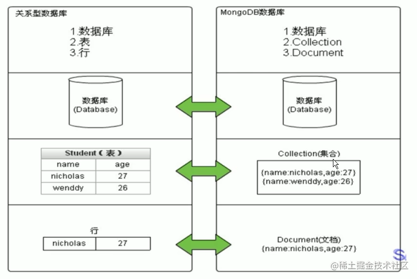


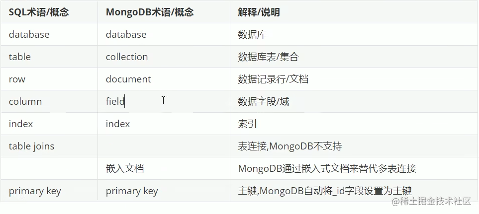
**"最像关系型数据库的 NoSQL 数据库"**. MongoDB 中的记录是一个文档, 是一个 key-value pair. 字段的数据类型是字符型, 值除了使用基本的一些类型以外, 还包括其它文档, 普通数组以及文档数组


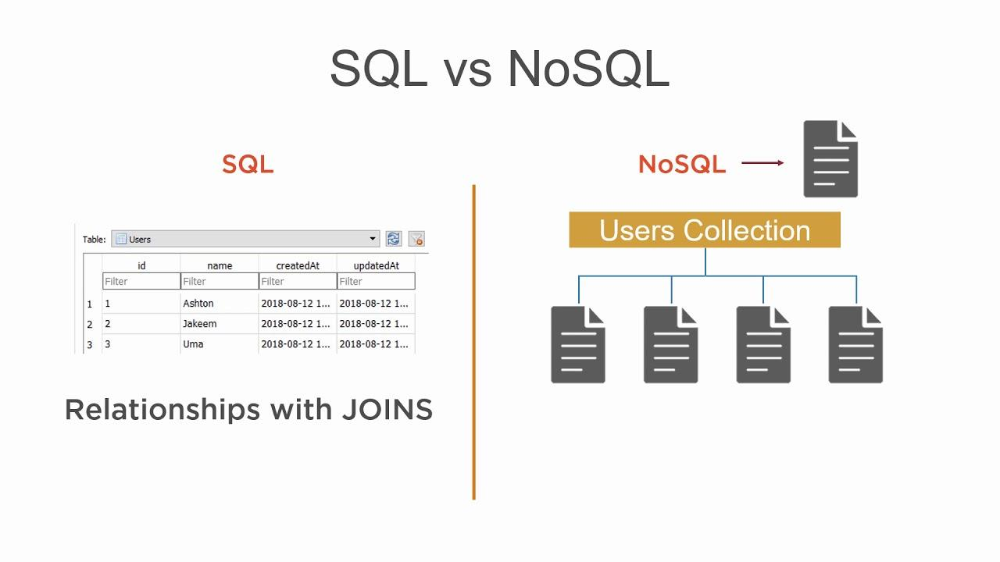


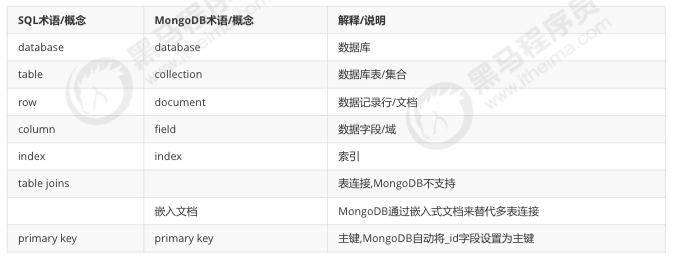


MongoDB 数据模型是面向<u>文档</u>的, 所谓文档就是一种类似于 JSON 的结构（比json更加强大）, 简单理解 MongoDB 这个数据库中存在的是各种各样的 JSON（BSON）存贮在磁盘上面。


- 数据库 (database)
  - 数据库是一个仓库, 存储集合 (collection)
- 集合 (collection)
  - 类似于数组, 在集合中存放文档
- 文档 (document)
  - 文档型数据库的最小单位, 通常情况, 我们存储和操作的内容都是文档


在 MongoDB 中, 数据库和集合都不需要手动创建, 当我们创建文档时, 如果文档所在的集合或者数据库不存在, **则会自动创建数据库或者集合**


### 数据库 (databases) 管理语法

| 操作                                            | 语法                             |
| ----------------------------------------------- | -------------------------------- |
| 查看所有数据库                                  | `show dbs;` 或 `show databases;` |
| 查看当前数据库                                  | `db;`                            |
| 切换到某数据库 (**若数据库不存在则创建数据库**) | `use <db_name>;`                 |
| 删除当前数据库                                  | `db.dropDatabase();`             |


### 集合 (collection) 管理语法

| 操作         | 语法                                        |
| ------------ | ------------------------------------------- |
| 查看所有集合 | `show collections;`                         |
| 创建集合     | `db.createCollection("<collection_name>");` |
| 删除集合     | `db.<collection_name>.drop()`               |


### 1.3. 数据模型

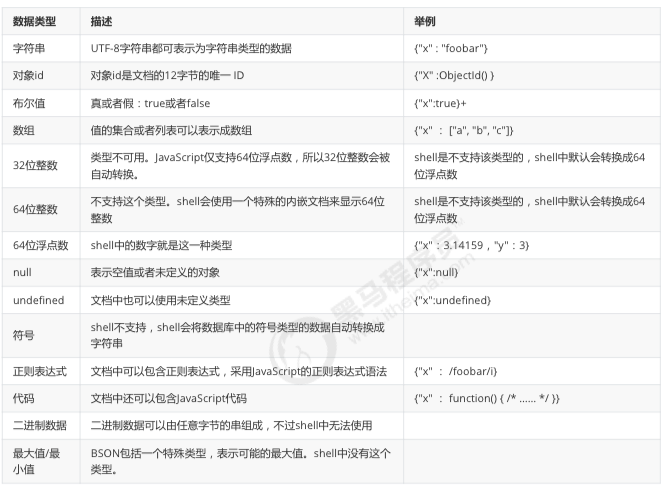


### 1.4 MongoDB 的特点

#### 1.4.1 高性能

MongoDB 提供高性能的数据持久化

- 嵌入式数据模型的支持<u>减少了数据库系统上的 I/O 活动</u>
- 索引支持更快的查询, 并且可以包含来自嵌入式文档和数组的键 (文本索引解决搜索的需求, TTL 索引解决历史数据自动过期的需求, 地理位置索引可以用于构件各种 O2O 应用)
- mmapv1, wiredtiger, mongorocks (rocksdb) in-memory 等多引擎支持满足各种场景需求
- Gridfs 解决文件存储需求


#### 1.4.2 高可用

MongoDB 的复制工具称作**副本集** (replica set) 可以提供自动<u>故障转移和数据冗余</u>


#### 1.4.3 高扩展

水平扩展是其核心功能一部分

分片将数据分布在一组集群的机器上 (海量数据存储, 服务能力水平扩展)

MongoDB 支持基于**片键**创建数据区域, 在一个平衡的集群当中, MongoDB 将一个区域所覆盖的读写**只定向**到该区域的那些片


#### 1.4.4 其他

MongoDB支持丰富的查询语言, 支持读和写操作(CRUD), 比如数据聚合, 文本搜索和地理空间查询等. 无模式（动态模式）, 灵活的文档模型


#### mongo shell


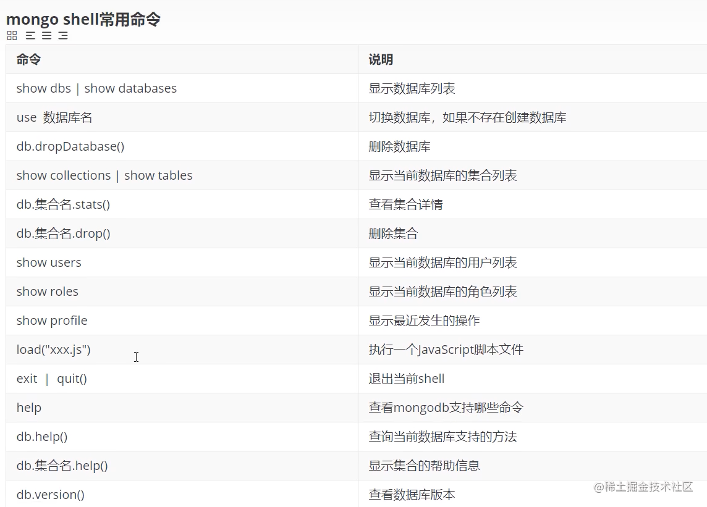


## 2. 基本常用命令


### 2.1 数据库操作

#### 1 查看数据库

`show databses/dbs` 
`db`   查看当前使用的这个数据库

#### 2 选择数据库

use database[数据库名称] 选择不存在的数据库会隐式创建该数据库

>  当使用 `use articledb` 的时候. `articledb` 其实存放在内存之中, 当 `articledb` 中存在一个 `collection` 之后, `mongo` 才会将这个数据库持久化到硬盘之中。

**这个是内存数据库最常见也是非常重要的手段，参考leveldb的底层实现，参考另一篇数据存贮文章中有详细的介绍。**

系统默认的数据库是`test`。


#### 3 删除数据库

先选择到要删除的数据库 `db.dropDatabase()`

#### 4 查看集合

`show collections`

#### 5 创建集合

- 显示创建： `db.createCollection('c1', options)`
- 隐式创建： 插入 `insert`文档的时候自动创建。


#### 6 删除集合

`db.集合名.drop()`

#### 7 ID的组成：

0 1 2 3 4 5 6 7 8 9 10 11

0-3:时间戳 4-6：机器mac码 7-8:PID 9-11:计数器

也可以自定义ID，只需要给插入的JSON数据增加_id键即可覆盖（强烈不推荐）

#### 8 安全认证


- **admin**: 权限控制, 这是 `root` 数据库, 如果将一个用户添加到这个数据库, 这个用户自动继承所有数据库的权限, 一些特定的服务器端命令也只能从这个数据库运行, 比如列出所有的数据库或者关闭服务器。

- **local**: 数据永远不会被复制, 可以用来存储限于本地的单台服务器的集合 (部署集群, 分片等)

- **config**: Mongo 用于分片设置时, `config` 数据库在内部使用, 用来保存分片的相关信息


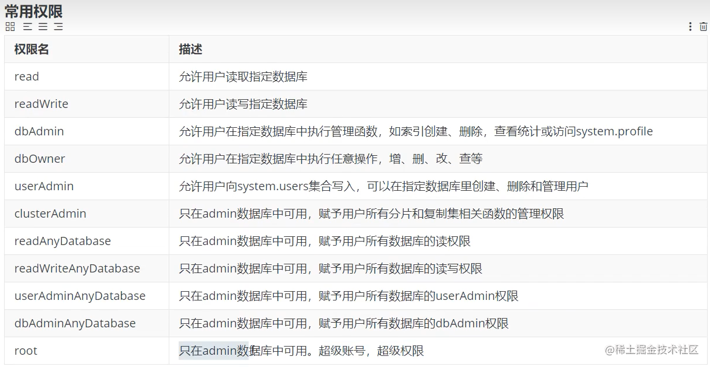

鉴权部分练习案例：创建了管理员jack和普通用户xiaosan

```
// 创建管理员用户
use admin;
db.createrUser({user: "jack", pwd: "123456", roles: ['root']})

// 默认情况，mongodb 不会启动鉴权，需要以鉴权的模式启动mongodb:
db.shutdownServer();
exit;

// 鉴权模式启动
mongod --config /opt/homebrew/etc/mongod.conf --fork --auth

// 登录管理员
mongosh -u=qiuyanlong -p=1234561 --authenticationDatabase=admin

// 创建应用数据库用户
use yach;
db.yach.insert({name:"aa"});
# 注意没有写集合名称是因为默认在当前集合下，所以没写
db.createUser({user: "xiaosan", pwd: "123456", roles: ["dbOwner"]});

// 完全等价于 === db.createUser({user: "anikin", pwd: 123456,roles:[{role:"dbOwner",db: "yach"}]})

// 切换登录
exit;

// 普通用户
mongosh -u=xiaosan -p=1234561 --authenticationDatabase=yach
```

### 2.2 文档基本 CRUD


> 官方文档: https://docs.mongodb.com/manual/crud/


#### 2.2.1 创建 Create

> Create or insert operations add new [documents](https://docs.mongodb.com/manual/core/document/#bson-document-format) to a [collection](https://docs.mongodb.com/manual/core/databases-and-collections/#collections). If the collection does **not** currently exist, insert operations will create the collection automatically.


- 使用 `db.<collection_name>.insertOne()` 向集合中添加*一个文档*, 参数一个 json 格式的文档
- 使用 `db.<collection_name>.insertMany()` 向集合中添加*多个文档*, 参数为 json 文档数组
- `insert` 存在则抛错误
- `save` 不管是否存在，少用为好。


```javascript
// 基础语法
db.collection.insert({
  <document or array of documents>,
  writeConcern: <document>, // 可选：与事务有关，1：至少要写入一个节点 0：不关心是否成功。集群的大部分节点成功，一致性要求不高
  ordered: <boolean> // 可选 是否排序
})


// 向集合中添加一个文档
db.collection.insertOne(
   { item: "canvas", qty: 100, tags: ["cotton"], size: { h: 28, w: 35.5, uom: "cm" } }
)
// 向集合中添加多个文档
db.collection.insertMany([
   { item: "journal", qty: 25, tags: ["blank", "red"], size: { h: 14, w: 21, uom: "cm" } },
   { item: "mat", qty: 85, tags: ["gray"], size: { h: 27.9, w: 35.5, uom: "cm" } },
   { item: "mousepad", qty: 25, tags: ["gel", "blue"], size: { h: 19, w: 22.85, uom: "cm" } }
])
```


注：当我们向 `collection` 中插入 `document` 文档时, 如果没有给文档指定 `_id` 属性, 那么数据库会为文档自动添加 `_id` field, 并且值类型是 `ObjectId(blablabla)`, 就是文档的唯一标识, 类似于 relational database 里的 `primary key`


> - mongo 中的数字, 默认情况下是 double 类型, 如果要存整型, 必须使用函数 `NumberInt(整型数字)`, 否则取出来就有问题了
> - 插入当前日期可以使用 `new Date()`


如果某条数据插入失败, 将会终止插入, 但已经插入成功的数据**不会回滚掉**. 因为批量插入由于数据较多容易出现失败, 因此, 可以使用 `try catch` 进行异常捕捉处理, 测试的时候可以不处理.如：


```javascript
try {
  db.comment.insertMany([
    {"_id":"1","articleid":"100001","content":"我们不应该把清晨浪费在手机上, 健康很重要, 一杯温水幸福你我 他.","userid":"1002","nickname":"相忘于江湖","createdatetime":new Date("2019-0805T22:08:15.522Z"),"likenum":NumberInt(1000),"state":"1"},
    {"_id":"2","articleid":"100001","content":"我夏天空腹喝凉开水, 冬天喝温开水","userid":"1005","nickname":"伊人憔 悴","createdatetime":new Date("2019-08-05T23:58:51.485Z"),"likenum":NumberInt(888),"state":"1"},
    {"_id":"3","articleid":"100001","content":"我一直喝凉开水, 冬天夏天都喝.","userid":"1004","nickname":"杰克船 长","createdatetime":new Date("2019-08-06T01:05:06.321Z"),"likenum":NumberInt(666),"state":"1"},
    {"_id":"4","articleid":"100001","content":"专家说不能空腹吃饭, 影响健康.","userid":"1003","nickname":"凯 撒","createdatetime":new Date("2019-08-06T08:18:35.288Z"),"likenum":NumberInt(2000),"state":"1"},
    {"_id":"5","articleid":"100001","content":"研究表明, 刚烧开的水千万不能喝, 因为烫 嘴.","userid":"1003","nickname":"凯撒","createdatetime":new Date("2019-0806T11:01:02.521Z"),"likenum":NumberInt(3000),"state":"1"}

]);

} catch (e) {
  print (e);
}
```


#### 2.2.2 查询 


- 使用 `db.collection.find(query,,projection)` 方法对集合进行查询, 接受一个 json 格式的查询条件. 返回的是一个**数组**。 projection 指定返回的键。
- `db.<collection_name>.findOne()` 查询集合中符合条件的<u>第一个</u>文档, 返回的是一个**对象**


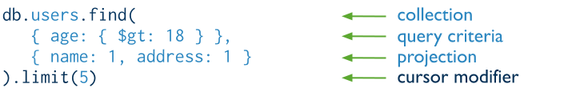

#### 1: 条件查询：

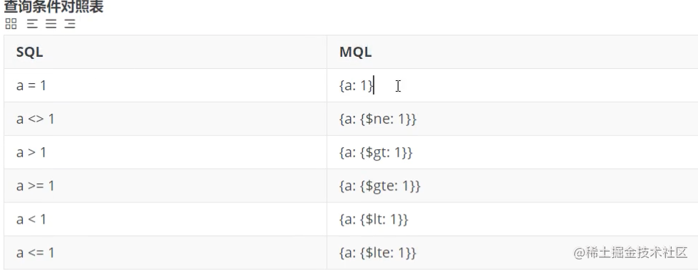


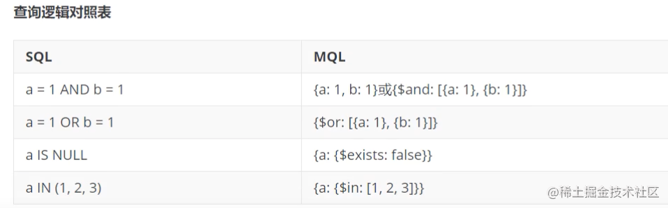

可以使用 `$in` 操作符表示*范围查询*

```javascript
 db.comment.find({state: "1"},{state:1,nickname:1}); // 过滤字段
 
 db.comment.find({likenum:{$gt:1000, $lt:3000}})
 
 db.inventory.find( { status: { $in: [ "A", "D" ] } } )
 
 // 由小到大的排列
 db.comment.find({},{likenum:1}).sort({likenum:1})
 
 // AND
 db.inventory.find( { status: "A", qty: { $lt: 30 } } )
 
 // OR
 db.inventory.find( { $or: [ { status: "A" }, { qty: { $lt: 30 } } ] } )
 
 // AND- OR
 db.inventory.find( {
     status: "A",
     $or: [ { qty: { $lt: 30 } }, { item: /^p/ } ]
} )
```

#### 2: 分页查询

```
db.comment.find({},{likenum:1}).sort({likenum:1}).skip(2).limit(2)
```

#### 3: 正则查询

在 terminal 中查看结果可能不是很方便, 所以我们可以用 `pretty()` 来帮助阅读

```javascript
db.inventory.find().pretty()
```

匹配内容
```javascript
db.posts.find({
  comments: {
    $elemMatch: {
      user: 'Harry Potter'
    }
  }
}).pretty()

// 正则表达式
db.<collection_name>.find({ content : /once/ })
```


创建索引

```javascript
db.posts.createIndex({
  { title : 'text' }
})

// 文本搜索
// will return document with title "Post One"
// if there is no more posts created
db.posts.find({
  $text : {
    $search : "\"Post O\""
  }
}).pretty()
```


#### 2.2.3 更新 Update

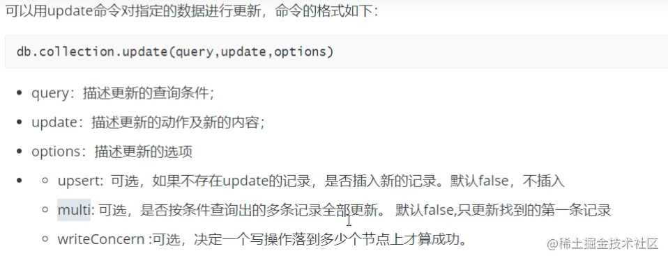
默认update修改多个只会改第一个。需要配合option参数，匹配不到默认会插入。

- 使用 `db.collection.updateOne(<filter>, <update>, <options>)` 更新一个
- 使用 `db.collection.updateMany(<filter>, <update>, <options>)` 更新多文档
- 使用 `db.collection.replaceOne(<filter>, <update>, <options>)` 替换

 `update`和更新操作符正相关。

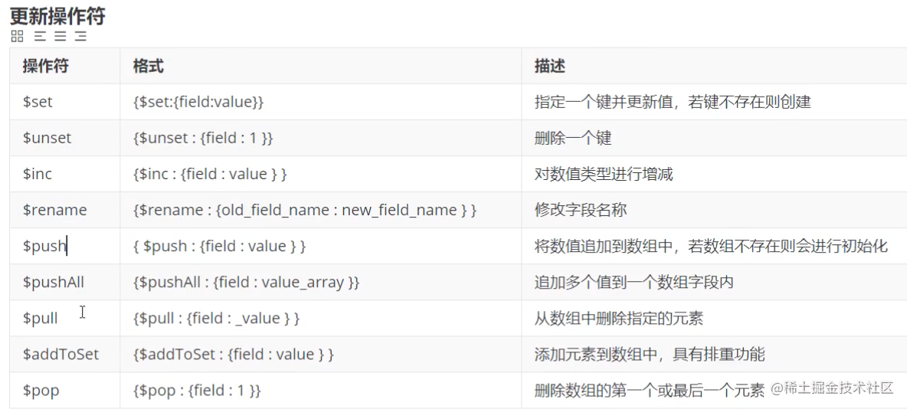


其中最常用的修改操作符即为`$set`和`$unset`,分别表示**赋值**和**取消赋值**.

```javascript
db.inventory.updateOne(
    { item: "paper" },
    {
        $set: { "size.uom": "cm", status: "P" },
        $currentDate: { lastModified: true }
    }
)

db.inventory.updateMany(
    { qty: { $lt: 50 } },
    {
        $set: { "size.uom": "in", status: "P" },
        $currentDate: { lastModified: true }
    }
)
```

`findAndModify`: **兼容了查询和修改指定文档的功能，只能更新单个文档**。
```
db.comment.findAndModify({query:{_id:"5"},update:{$inc:{likenum:1}}});
{
  _id: '5',
  articleid: '100001',
  content: '研究表明, 刚烧开的水千万不能喝, 因为烫 嘴.',
  userid: '1003',
  nickname: '凯撒',
  createdatetime: ISODate("1970-01-01T00:00:00.000Z"),
  likenum: 3001,
  state: '1',
  updayeTime: ISODate("2022-09-19T12:38:38.887Z")
}
```


> - uses the [`$set`](https://docs.mongodb.com/manual/reference/operator/update/set/#up._S_set) operator to update the value of the `size.uom` field to `"cm"` and the value of the `status` field to `"P"`,
> - uses the [`$currentDate`](https://docs.mongodb.com/manual/reference/operator/update/currentDate/#up._S_currentDate) operator to update the value of the `lastModified` field to the current date. If `lastModified` field does not exist, [`$currentDate`](https://docs.mongodb.com/manual/reference/operator/update/currentDate/#up._S_currentDate) will create the field. See [`$currentDate`](https://docs.mongodb.com/manual/reference/operator/update/currentDate/#up._S_currentDate) for details.


`db.<collection_name>.replaceOne()` 方法替换除 `_id` 属性外的**所有属性**, 其`<update>`参数应为一个**全新的文档**.

```
db.inventory.replaceOne(
    { item: "paper" },
    { item: "paper", instock: [ { warehouse: "A", qty: 60 }, { warehouse: "B", qty: 40 } ] }
)
```


**批量修改**


```javascript
// 默认会修改第一条
db.document.update({ userid: "30", { $set {username: "guest"} } })

// 修改所有符合条件的数据
db.document.update( { userid: "30", { $set {username: "guest"} } }, {multi: true} )
```


**列值增长的修改**


如果我们想实现对某列值在原有值的基础上进行增加或减少, 可以使用 `$inc` 运算符来实现

```javascript
db.document.update({ _id: "3", {$inc: {likeNum: NumberInt(1)}} })
```


##### 修改操作符


| Name                                                         | Description                                                  |
| :----------------------------------------------------------- | :----------------------------------------------------------- |
| [`$currentDate`](https://docs.mongodb.com/manual/reference/operator/update/currentDate/#up._S_currentDate) | Sets the value of a field to current date, either as a Date or a Timestamp. |
| [`$inc`](https://docs.mongodb.com/manual/reference/operator/update/inc/#up._S_inc) | Increments the value of the field by the specified amount.   |
| [`$min`](https://docs.mongodb.com/manual/reference/operator/update/min/#up._S_min) | Only updates the field if the specified value is less than the existing field value. |
| [`$max`](https://docs.mongodb.com/manual/reference/operator/update/max/#up._S_max) | Only updates the field if the specified value is greater than the existing field value. |
| [`$mul`](https://docs.mongodb.com/manual/reference/operator/update/mul/#up._S_mul) | Multiplies the value of the field by the specified amount.   |
| [`$rename`](https://docs.mongodb.com/manual/reference/operator/update/rename/#up._S_rename) | Renames a field.                                             |
| [`$set`](https://docs.mongodb.com/manual/reference/operator/update/set/#up._S_set) | Sets the value of a field in a document.                     |
| [`$setOnInsert`](https://docs.mongodb.com/manual/reference/operator/update/setOnInsert/#up._S_setOnInsert) | Sets the value of a field if an update results in an insert of a document. Has no effect on update operations that modify existing documents. |
| [`$unset`](https://docs.mongodb.com/manual/reference/operator/update/unset/#up._S_unset) | Removes the specified field from a document.                 |


#### 2.2.4 删除 Delete


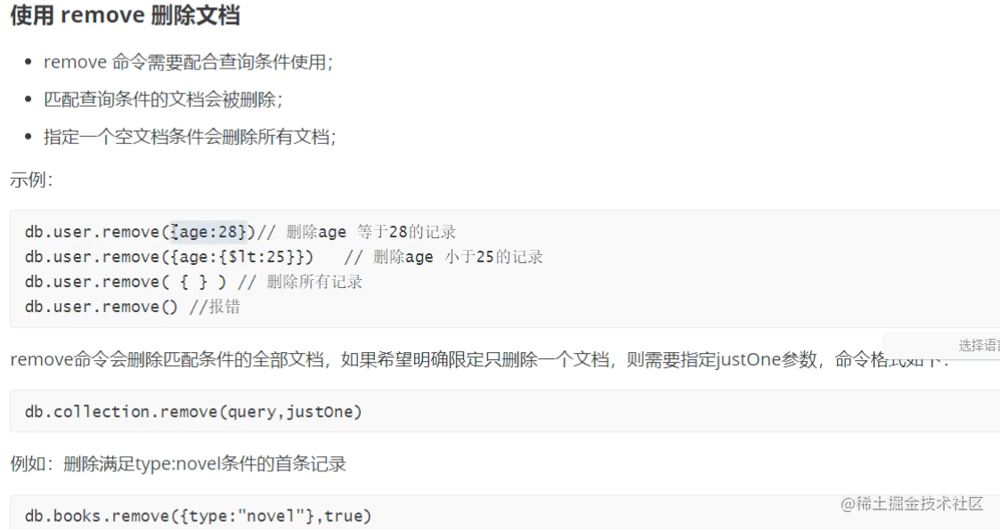

- `remove` 需要配合查询，小心使用。
- 使用 `db.collection.deleteMany()` 方法删除<u>所有</u>匹配的文档.
- 使用 `db.collection.deleteOne()` 方法删除<u>单个</u>匹配的文档,推荐使用这个。
- `db.collection.drop()`
- `db.dropDatabase()`


```javascript
db.inventory.deleteMany( { qty : { $lt : 50 } } )
```
实际生产一般都是软删除。

### 2.3 文档排序和投影 (sort & projection)


#### 2.3.1 排序 Sort


在查询文档内容的时候, 默认是按照 `_id` 进行排序

我们可以用 `$sort` 更改文档排序规则

```
{ $sort: { <field1>: <sort order>, <field2>: <sort order> ... } }
```

For the field or fields to sort by, set the sort order to `1` or `-1` to specify an *ascending* or *descending* sort respectively, as in the following example:

```javascript
db.users.aggregate(
   [
     { $sort : { age : -1, posts: 1 } }
     // ascending on posts and descending on age
   ]
)
```


##### `$sort` Operator and Memory

##### `$sort` + `$limit` Memory Optimization

When a [`$sort`](https://docs.mongodb.com/manual/reference/operator/aggregation/sort/index.html#pipe._S_sort) precedes a [`$limit`](https://docs.mongodb.com/manual/reference/operator/aggregation/limit/#pipe._S_limit) and there are no intervening stages that modify the number of documents, the optimizer can coalesce the [`$limit`](https://docs.mongodb.com/manual/reference/operator/aggregation/limit/#pipe._S_limit) into the [`$sort`](https://docs.mongodb.com/manual/reference/operator/aggregation/sort/index.html#pipe._S_sort). This allows the [`$sort`](https://docs.mongodb.com/manual/reference/operator/aggregation/sort/index.html#pipe._S_sort) operation to **only maintain the top `n` results as it progresses**, where `n` is the specified limit, and ensures that MongoDB only needs to store `n` items in memory. This optimization still applies when `allowDiskUse` is `true` and the `n` items exceed the [aggregation memory limit](https://docs.mongodb.com/manual/core/aggregation-pipeline-limits/#agg-memory-restrictions).

Optimizations are subject to change between releases.

> 有点类似于用 heap 做 topK 这种问题, 只维护 k 个大小的 heap, 会加速 process


举个栗子:

```javascript
db.posts.find().sort({ title : -1 }).limit(2).pretty()
```


#### 2.3.2 投影 Projection


有些情况, 我们对文档进行查询并不是需要所有的字段, 比如只需要 id 或者 用户名, 我们可以对文档进行“投影”

- `1` - display
- `0` - dont display

```shell
> db.users.find( {}, {username: 1} )

> db.users.find( {}, {age: 1, _id: 0} )
```


### 2.4 forEach()

```shell
> db.posts.find().forEach(fucntion(doc) { print('Blog Post: ' + doc.title) })
```


## 3. 文档间的对应关系

- 一对一 (One To One)
- 一对多 (One To Many)
- 多对多 (Many To Many)


举个例子, 比如“用户-订单”这个一对多的关系中, 我们想查询某一个用户的所有或者某个订单, 我们可以

```javascript
var user_id = db.users.findOne( {username: "username_here"} )._id
db.orders.find( {user_id: user_id} )
```


## 4. MongoDB 的索引

### 4.1 概述


索引支持在 MongoDB 中高效地执行查询.如果没有索引, MongoDB 必须执行全集合扫描, 即扫描集合中的每个文档, 以选择与查询语句 匹配的文档.这种扫描全集合的查询效率是非常低的, 特别在处理大量的数据时, 查询可以要花费几十秒甚至几分钟, 这对网站的性能是非常致命的. 


如果查询存在适当的索引, MongoDB 可以使用该索引限制必须检查的文档数. 


索引是特殊的数据结构, 它以易于遍历的形式存储集合数据集的一小部分.索引存储特定字段或一组字段的值, 按字段值排序.索引项的排 序支持有效的相等匹配和基于范围的查询操作.此外, MongoDB 还可以使用索引中的排序返回排序结果.


MongoDB 使用的是 B Tree, MySQL 使用的是 B+ Tree


```javascript
// create index
db.<collection_name>.createIndex({ userid : 1, username : -1 })

// retrieve indexes
db.<collection_name>.getIndexes()

// remove indexes
db.<collection_name>.dropIndex(index)

// there are 2 ways to remove indexes:
// 1. removed based on the index name
// 2. removed based on the fields

db.<collection_name>.dropIndex( "userid_1_username_-1" )
db.<collection_name>.dropIndex({ userid : 1, username : -1 })

// remove all the indexes, will only remove non_id indexes
db.<collection_name>.dropIndexes()
```


### 4.2 索引的类型


#### 4.2.1 单字段索引


MongoDB 支持在文档的单个字段上创建用户定义的**升序/降序索引**, 称为**单字段索引** Single Field Index

对于单个字段索引和排序操作, 索引键的排序顺序（即升序或降序）并不重要, 因为 MongoDB 可以在任何方向上遍历索引.


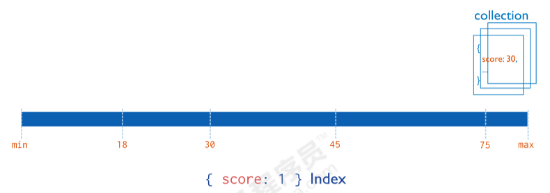

#### 4.2.2 复合索引

MongoDB 还支持多个字段的用户定义索引, 即复合索引 Compound Index

复合索引中列出的字段顺序具有重要意义.例如, 如果复合索引由 `{ userid: 1, score: -1 }` 组成, 则索引首先按 `userid` 正序排序, 然后 在每个 `userid` 的值内, 再在按 `score` 倒序排序.

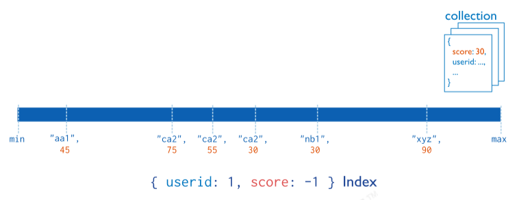


#### 4.2.3 其他索引

- 地理空间索引 Geospatial Index
- 文本索引 Text Indexes
- 哈希索引 Hashed Indexes

##### 地理空间索引（Geospatial Index）

为了支持对地理空间坐标数据的有效查询, MongoDB 提供了两种特殊的索引: 返回结果时使用平面几何的二维索引和返回结果时使用球面几何的二维球面索引. 

##### 文本索引（Text Indexes）

MongoDB 提供了一种文本索引类型, 支持在集合中搜索字符串内容.这些文本索引不存储特定于语言的停止词（例如 "the", "a", "or"）,  而将集合中的词作为词干, 只存储根词. 

##### 哈希索引（Hashed Indexes）

为了支持基于散列的分片, MongoDB 提供了散列索引类型, 它对字段值的散列进行索引.这些索引在其范围内的值分布更加随机, 但只支持相等匹配, 不支持基于范围的查询.


### 4.3 索引的管理操作


#### 4.3.1 索引的查看


语法

```
db.collection.getIndexes()
```


默认 `_id` 索引： MongoDB 在创建集合的过程中, 在 `_id` 字段上创建一个唯一的索引, 默认名字为 `_id` , 该索引可防止客户端插入两个具有相同值的文 档, 不能在 `_id` 字段上删除此索引. 


注意：该索引是**唯一索引**, 因此值不能重复, 即 `_id` 值不能重复的.

在分片集群中, 通常使用 `_id` 作为**片键**.


#### 4.3.2 索引的创建


语法

```
db.collection.createIndex(keys, options)
```


参数


options（更多选项）列表


注意在 3.0.0 版本前创建索引方法为 `db.collection.ensureIndex()` , 之后的版本使用了 `db.collection.createIndex()` 方法,  `ensureIndex()` 还能用, 但只是 `createIndex()` 的别名.


举个🌰

```sh
$  db.comment.createIndex({userid:1})
{
  "createdCollectionAutomatically" : false,
  "numIndexesBefore" : 1,
  "numIndexesAfter" : 2,
  "ok" : 1
}

$ db.comment.createIndex({userid:1,nickname:-1})
...

```


#### 4.3.3 索引的删除


语法

```sh
# 删除某一个索引
$ db.collection.dropIndex(index)

# 删除全部索引
$ db.collection.dropIndexes()
```


提示:

`_id` 的字段的索引是无法删除的, 只能删除非 `_id` 字段的索引


示例

```sh
# 删除 comment 集合中 userid 字段上的升序索引
$ db.comment.dropIndex({userid:1})
```


### 4.4 索引使用


#### 4.4.1 执行计划


分析查询性能 (Analyze Query Performance) 通常使用执行计划 (解释计划 - Explain Plan) 来查看查询的情况

```shell
$ db.<collection_name>.find( query, options ).explain(options)
```


比如: 查看根据 `user_id` 查询数据的情况


**未添加索引之前**

`"stage" : "COLLSCAN"`, 表示全集合扫描


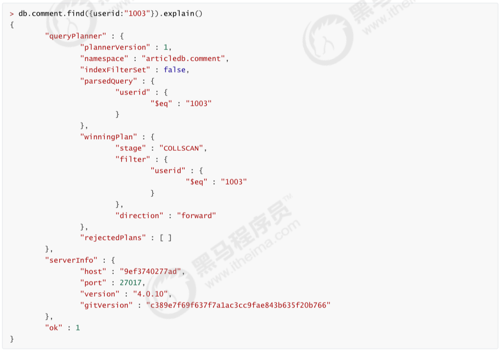


**添加索引之后**

`"stage" : "IXSCAN"`, 基于索引的扫描


#### 4.4.2 涵盖的查询


当查询条件和查询的投影仅包含索引字段是, MongoDB 直接从索引返回结果, 而不扫描任何文档或将文档带入内存, 这些覆盖的查询十分有效

> https://docs.mongodb.com/manual/core/query-optimization/#covered-query


## 5. 在 Nodejs 中使用 MongoDB - mongoose

mongoose 是一个对象文档模型（ODM）库

> https://mongoosejs.com/

- 可以为文档创建一个模式结构（Schema）
- 可以对模型中的对象/文档进行验证
- 数据可以通过类型转换转换为<u>对象</u>模型
- 可以使用中间件应用业务逻辑


### 5.1 mongoose 提供的新对象类型

- Schema
  - 定义约束了数据库中的文档结构
  - 个人感觉类似于 SQL 中建表时事先规定表结构
- Model
  - 集合中的所有文档的表示, 相当于 MongoDB 数据库中的 collection
- Document
  - 表示集合中的具体文档, 相当于集合中的一个具体的文档


### 5.2 简单使用 Mongoose

> https://mongoosejs.com/docs/guide.html


使用 mongoose 返回的是一个 `mogoose Query object`, mongoose 执行 query 语句后的结果会被传进 callback 函数 `callback(error, result)` 


> A mongoose query can be executed in one of two ways. First, if you pass in a `callback` function, Mongoose will execute the query asynchronously and pass the results to the `callback`.
>
> A query also has a `.then()` function, and thus can be used as a promise.


```javascript
const q = MyModel.updateMany({}, { isDeleted: true }, function() {
  console.log("Update 1");
}));

q.then(() => console.log("Update 2"));
q.then(() => console.log("Update 3"));
```

上面这一段代码会执行三次 `updateMany()` 操作, 第一次是因为 callback, 之后的两次是因为 `.then()` (因为 `.then()` 也会调用 `updatemany()`)


**连接数据库并且创建 Model 类**

```javascript
const mongoose = require('mongoose');
// test is the name of database, will be created automatically
mongoose.connect('mongodb://localhost:27017/test', {useNewUrlParser: true});

const Cat = mongoose.model('Cat', { name: String });

const kitty = new Cat({ name: 'Zildjian' });
kitty.save().then(() => console.log('meow'));
```

**监听 MongoDB 数据库的连接状态**

在 mongoose 对象中, 有一个属性叫做 `connection`, 该对象就表示数据库连接.通过监视该对象的状态, 可以来监听数据库的连接和端口

```javascript
mongoose.connection.once("open", function() {
  console.log("connection opened.")
});

mongoose.connection.once("close", function() {
  console.log("connection closed.")
});
```


### 5.3 Mongoose 的 CRUD

首先定义一个 `Schema`

```javascript
const mongoose = require('mongoose');
const Schema = mongoose.Schema;

const blogSchema = new Schema({
    title:  String, // String is shorthand for {type: String}
    author: String,
    body:   String,
    comments: [{ body: String, date: Date }],
    date: { type: Date, default: Date.now },
    hidden: Boolean,
    meta: {
        votes: Number,
        favs:  Number
    }
});
```


然后在 `blogSchema` 基础上创建 `Model`

```javascript
const Blog = mongoose.model('Blog', blogSchema);
// ready to go!

module.exports = Blog;
```

当调用上面这一行代码时, MongoDB 会做如下操作

1. 是否存在一个数据库叫做 `Blog` 啊? 没的话那就创建一个
2. 每次用到 Blog 库的时候都要注意内部数据要按照 `blogSchema` 来规定


向数据库中插入文档数据

```javascript
Blog.create({
  title: "title"
  ...
}, function (err){
  if (!err) {
    console.log("successful")
  }
});
```


简单的查询一下下

```javascript
// named john and at least 18 yo
MyModel.find({ name: 'john', age: { $gte: 18 }});
```


mongoose 支持的用法有:

- [`Model.deleteMany()`](https://mongoosejs.com/docs/api.html#model_Model.deleteMany)
- [`Model.deleteOne()`](https://mongoosejs.com/docs/api.html#model_Model.deleteOne)
- [`Model.find()`](https://mongoosejs.com/docs/api.html#model_Model.find)
- [`Model.findById()`](https://mongoosejs.com/docs/api.html#model_Model.findById)
- [`Model.findByIdAndDelete()`](https://mongoosejs.com/docs/api.html#model_Model.findByIdAndDelete)
- [`Model.findByIdAndRemove()`](https://mongoosejs.com/docs/api.html#model_Model.findByIdAndRemove)
- [`Model.findByIdAndUpdate()`](https://mongoosejs.com/docs/api.html#model_Model.findByIdAndUpdate)
- [`Model.findOne()`](https://mongoosejs.com/docs/api.html#model_Model.findOne)
- [`Model.findOneAndDelete()`](https://mongoosejs.com/docs/api.html#model_Model.findOneAndDelete)
- [`Model.findOneAndRemove()`](https://mongoosejs.com/docs/api.html#model_Model.findOneAndRemove)
- [`Model.findOneAndReplace()`](https://mongoosejs.com/docs/api.html#model_Model.findOneAndReplace)
- [`Model.findOneAndUpdate()`](https://mongoosejs.com/docs/api.html#model_Model.findOneAndUpdate)
- [`Model.replaceOne()`](https://mongoosejs.com/docs/api.html#model_Model.replaceOne)
- [`Model.updateMany()`](https://mongoosejs.com/docs/api.html#model_Model.updateMany)
- [`Model.updateOne()`](https://mongoosejs.com/docs/api.html#model_Model.updateOne)

## 6. 使用 Mocha 编写测试 "Test Driven Development"

Mocha 是一个 js 测试的包, 编写测试有两个关键字 `describe` 和 `it`

- `describe` 是一个"统领块", 所有的 test functions 都会在它"名下"
- `it` 表示每一个 test function


`create_test.js`

```javascript
const assert = require('assert')
// assume we have a User model defined in src/user.js
const User = require('../src/user')

// after installing Mocha, we have global access
// to describe and it keywords
describe('Creating records', () => {
  it('saves a user', () => {
    const joe = new User({ name: "Joe" });
    joe.save();
    assert()
  });
});
```


## 7. 聚合操作

#### 1: 单一作用集合


> DeprecationWarning: **Collection.count() is deprecated. Use countDocuments or estimatedDocumentCount** 在我使用的6.x上，**count**这个api已经废弃了。
> 


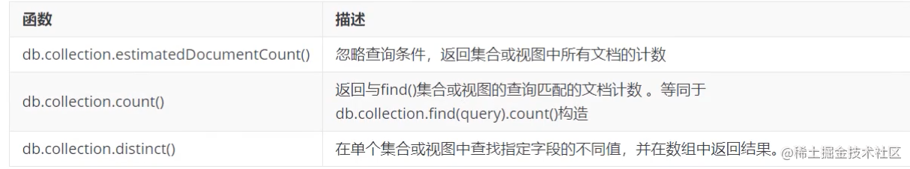
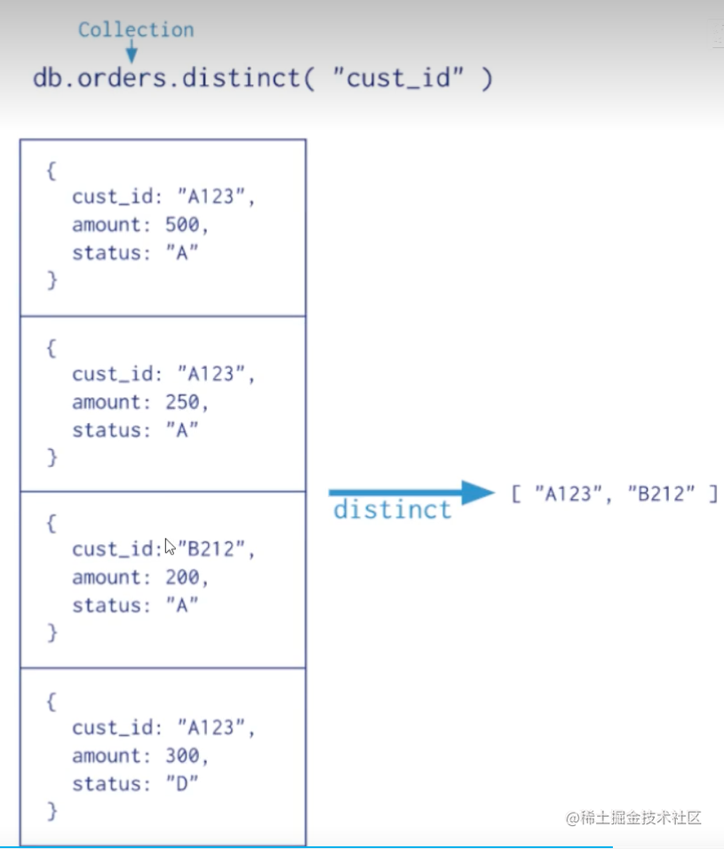

```
db.comment.countDocuments(); // 6
db.comment.countDocuments({likenum:{$gt:1000}}); // 2
db.comment.distinct("nickname",{likenum:{$gt:1000}}); // [ '凯 撒', '凯撒' ]
```

#### 2：聚合管道
前面的查询结果作为下一个操作的一个输入，自身作为一个输出，最后就会拿到这个结果集合。

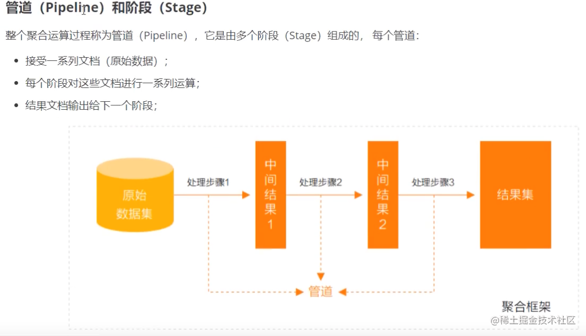


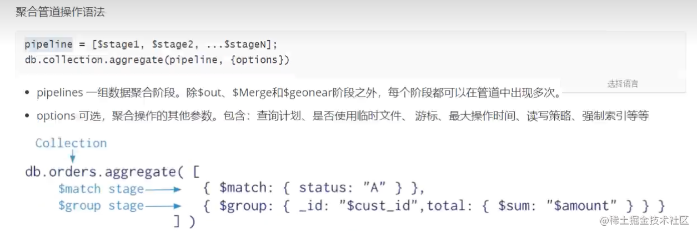


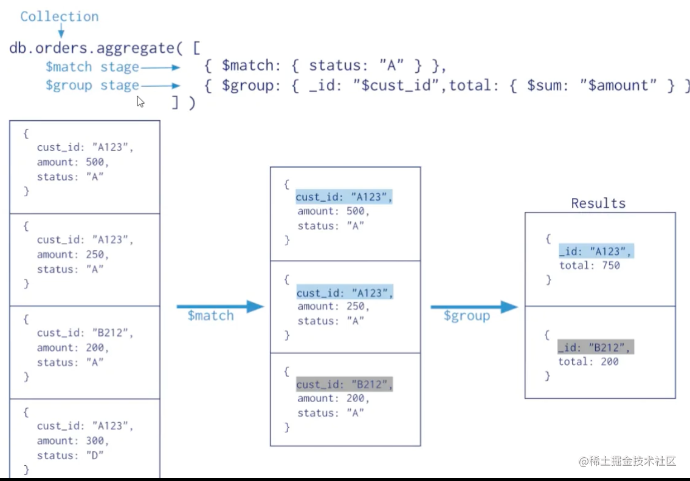


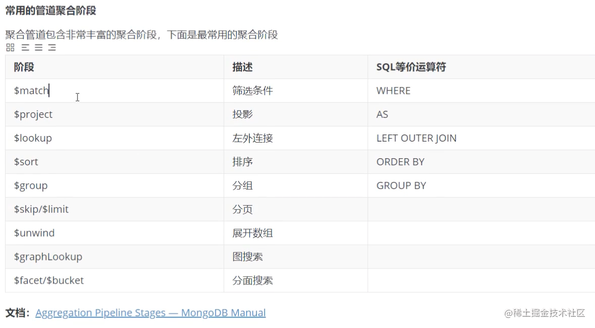

**$project** 投影就是别名的意思，输出的时候按照这个自定义的别名。

管道操作非常的强大，几乎所有的查询都可以使用管道操作来处理。

数据准备：book.js
```js
ar tags =["nosq1","mongodb","document","developer","popular"];
var types =["technology","sociality","travel","novel","literature"];
var books=[];
for(var i=0;i<50;i++){
    var typeIdx=Math.floor(Math.random()*types.length);
    var tagIdx=Math.floor(Math.random()*tags.length);
    var tagIdx2=Math.floor(Math.random() * tags.length);
    var favCount=Math.floor(Math.random()*100);
    var username="xx00"+Math.floor(Math.random()*10);
    var age=20+Math.floor(Math.random*15);
    var book = {
        title:"book-"+i,
        type:types[typeIdx],
        tag:[tags[tagIdx],tags[tagIdx2]],
        favcount:favCount,
        author:{name:username,age}
    };
    books.push(book)
}
db.book.insertMany(books);
```
加载这个文件：
```js
load("book.js"); // true 表示成功了
show table; // 就可以查询这个了
```


## References

- https://mongoosejs.com/docs/guides.html
- https://docs.mongodb.com/
- https://www.bilibili.com/video/av59604756
- https://www.bilibili.com/video/BV1bJ411x7mq
- https://www.youtube.com/watch?v=-56x56UppqQ
- https://www.bilibili.com/video/BV1QF411W7u3?p=22&spm_id_from=pageDriver&vd_source=747a8ff9c723e281e4b23bbc83a47dfd
