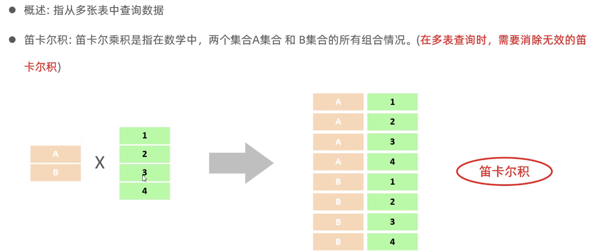

# mysql 基础篇

## 1: 安装
[参考](./install.md)

## 2: 概述


SQL的基本分类


## 登录和退出MySQL服务器

```shell
# 登录MySQL
$ mysql -u root -p12345612

# 退出MySQL数据库服务器
exit;
```

## 基本语法


### 1 DDL（数据定义语言）

#### 1: 数据库操作

```shell
# 查询所有数据库：
SHOW DATABASES;

# 查询当前数据库：
SELECT DATABASE();

# 创建数据库：
CREATE DATABASE [ IF NOT EXISTS ] 数据库名 [ DEFAULT CHARSET 字符集] [COLLATE 排序规则 ];

# 删除数据库：
DROP DATABASE [ IF EXISTS ] 数据库名;

# 使用数据库：
USE 数据库名;
```

#### 2: 表操作

- 查询当前数据库所有表：`SHOW TABLES`;
- 查询表结构：`DESC 表名`;
- 查询指定表的建表语句：`SHOW CREATE TABLE 表名`
- 创建表：
  
```sql
CREATE TABLE 表名(
    字段1 字段1类型 [COMMENT 字段1注释],
    字段2 字段2类型 [COMMENT 字段2注释],
    字段3 字段3类型 [COMMENT 字段3注释],
    ...
    字段n 字段n类型 [COMMENT 字段n注释]
)[ COMMENT 表注释 ];
```
举例：

```sql

-- 创建数据表
CREATE TABLE pet (
    name VARCHAR(20),
    owner VARCHAR(20),
    species VARCHAR(20),
    sex CHAR(1),
    birth DATE,
    death DATE
);

-- 查看数据表结构
 DESC pet;

-- 插入数据
INSERT INTO pet VALUES ('puffball', 'Diane', 'hamster', 'f', '1990-03-30', NULL);

-- 修改数据
UPDATE pet SET name = 'squirrel' where owner = 'Diane';

-- 删除数据
DELETE FROM pet where name = 'squirrel';

-- 删除表
DROP TABLE myorder;
```

- 添加字段：`ALTER TABLE 表名 ADD 字段名 类型(长度) [COMMENT 注释] [约束]`;
例

```sql
`ALTER TABLE emp ADD nickname varchar(20) COMMENT '昵称'`;
```
  
- 修改数据类型：`ALTER TABLE 表名 MODIFY 字段名 新数据类型(长度)`;

- 修改字段名和字段类型：`ALTER TABLE 表名 CHANGE 旧字段名 新字段名 类型(长度) [COMMENT 注释] [约束]`;
例：将`emp`表的`nickname`字段修改为`username`，类型为`varchar(30)`语句应该是

```sql
`ALTER TABLE emp CHANGE nickname username varchar(30) COMMENT '昵称'`
```

- 删除字段：`ALTER TABLE 表名 DROP 字段名`;
- 修改表名：`ALTER TABLE 表名 RENAME TO 新表名`
- 删除表：`DROP TABLE [IF EXISTS] 表名`;
- 删除表，并重新创建该表：`TRUNCATE TABLE 表名`;


#### 3：数据结构


CHAR 性能稍微好点，因为是定长的。可变的是是varchar ，不可变的例如性别： char(1),存贮二进制的一般用的不多，一般是采用文件服务器来存储。


#### 4：decimal 类型说明
```sql
column_name  DECIMAL(P,D);
-- P是表示有效数字数的精度。 P默认范围为1〜65。
-- D是表示小数点后的位数。 D默认的范围是0~30。MySQL要求D小于或等于(<=)P。

amount DECIMAL(6,2);
-- 在此示例中，amount列最多可以存储6位数字，小数位数为2位; 因此，amount列的范围是从-9999.99到9999.99。


eg： 新建一张表test2：最大的两位数是正负99
+-------+--------------+------+-----+---------+-------+
| Field | Type         | Null | Key | Default | Extra |
+-------+--------------+------+-----+---------+-------+
| id    | int          | NO   | PRI | NULL    |       |
| num   | decimal(4,2) | YES  |     | NULL    |       |
+-------+--------------+------+-----+---------+-------+

INSERT INTO test2(num) VALUES(12.1251);  -- 12.13
INSERT INTO test2(num) VALUES(12.12516312312312312);  --12.13
mysql> INSERT INTO test2(num) VALUES(-89.991);
Query OK, 1 row affected, 1 warning (0.01 sec)   --89.99

```

#### 5：可视化工具

- Sqlyog
- Nacicat
- DataGrip(推荐)

### DML（数据操作语言）

#### 添加数据

- 指定字段：`INSERT INTO 表名 (字段名1, 字段名2, ...) VALUES (值1, 值2, ...)`;
- 全部字段：`INSERT INTO 表名 VALUES (值1, 值2, ...);`
- 批量添加数据：
  - `INSERT INTO 表名 (字段名1, 字段名2, ...) VALUES (值1, 值2, ...), (值1, 值2, ...), (值1, 值2, ...);`
  - `INSERT INTO 表名 VALUES (值1, 值2, ...), (值1, 值2, ...), (值1, 值2, ...);`

练习数据

```sql
create table emp
(
    id        tinyint unsigned auto_increment primary key,
    worko     int             ,
    name      varchar(20)     ,
    sex       char            ,
    age       tinyint unsigned,
    idcard    varchar(18)      comment '身份证',
    entrydate varchar(10)      comment '开学时间',
    province  varchar(10)      comment '生源地'
)
 comment '员工表';

 -- 插入数据

INSERT INTO emp (worko, name, sex, age, idcard, entrydate,province)
VALUES  (1001,"pp","女",13,'123345678901234567','2020-03-02','北京'),
        (1002,"ANIKIN","男",3,'123345678901234533','2027-01-02','上海'),
        (1003,"jj","男",23,'123345678901234534','2021-01-05','天津'),
        (1004,"cc","女",35,'123345678901234590','2026-01-02','北京'),
        (1005,"jock","男",83,'123345678901234522','2020-02-02','上海'),
        (1006,"dudu","女",3,'123345678901234555','2025-01-02','福建'),
        (1007,"rose","男",43,'123345678901234567','2020-01-02','天津'),
        (1008,"bob","女",53,'123345678901234577','2029-01-02','甘肃');
```


#### 更新和删除数据

- 修改数据：`UPDATE 表名 SET 字段名1 = 值1, 字段名2 = 值2, ... [ WHERE 条件 ];`
- 删除数据：`DELETE FROM 表名 [ WHERE 条件 ];`

`delete`没有条件就是删除整张表，但是不能删除某一个字段的值，可以使用`update`。

### DQL（数据查询语言）
```SQL
SELECT
    字段列表
FROM
    表名字段
WHERE
    条件列表
GROUP BY
    分组字段列表
HAVING
    分组后的条件列表
ORDER BY
    排序字段列表
LIMIT
    分页参数
```

`DQL`主要包含以下部分:


#### 1 基础查询

- 查询多个字段：
    - `SELECT 字段1, 字段2, 字段3, ... FROM 表名;`
    - `SELECT * FROM 表名;`
- 设置别名:
  - `SELECT 字段1 [ AS 别名1 ], 字段2 [ AS 别名2 ], 字段3 [ AS 别名3 ], ... FROM 表名;`
  - `SELECT 字段1 [ 别名1 ], 字段2 [ 别名2 ], 字段3 [ 别名3 ], ... FROM 表名;`
  - 
- 去除重复记录：`SELECT DISTINCT 字段列表 FROM 表名;`

#### 2 条件查询

语法：
`SELECT 字段列表 FROM 表名 WHERE 条件列表;`

条件：

| 比较运算符          | 功能                                        |
| ------------------- | ------------------------------------------- |
| >                   | 大于                                        |
| >=                  | 大于等于                                    |
| <                   | 小于                                        |
| <=                  | 小于等于                                    |
| =                   | 等于                                        |
| <> 或 !=            | 不等于                                      |
| BETWEEN ... AND ... | 在某个范围内（含最小、最大值）              |
| IN(...)             | 在in之后的列表中的值，多选一                |
| LIKE 占位符         | 模糊匹配（\_匹配单个字符，%匹配任意个字符） |
| IS NULL             | 是NULL                                      |

| 逻辑运算符         | 功能                         |
| ------------------ | ---------------------------- |
| AND 或 &&          | 并且（多个条件同时成立）     |
| OR 或 &#124;&#124; | 或者（多个条件任意一个成立） |
| NOT 或 !           | 非，不是                     |

例子：
```sql
-- 年龄等于30
select * from employee where age = 30;
-- 年龄小于30
select * from employee where age < 30;
-- 小于等于
select * from employee where age <= 30;
-- 没有身份证
select * from employee where idcard is null or idcard = '';
-- 有身份证
select * from employee where idcard;
select * from employee where idcard is not null;
-- 不等于
select * from employee where age != 30;
-- 年龄在20到30之间
select * from employee where age between 20 and 30;
select * from employee where age >= 20 and age <= 30;
-- 下面语句不报错，但查不到任何信息
select * from employee where age between 30 and 20;
-- 性别为女且年龄小于30
select * from employee where age < 30 and gender = '女';
-- 年龄等于25或30或35
select * from employee where age = 25 or age = 30 or age = 35;
select * from employee where age in (25, 30, 35);

-- 模糊匹配
-- 姓名为两个字
select * from employee where name like '__';
-- 身份证最后为X
select * from employee where idcard like '%X';
```
#### 3：聚合查询（聚合函数）

常见聚合函数：

| 函数  | 功能     |
| ----- | -------- |
| count | 统计数量 |
| max   | 最大值   |
| min   | 最小值   |
| avg   | 平均值   |
| sum   | 求和     |

注意： null不参与聚合函数
语法：
`SELECT 聚合函数(字段列表) FROM 表名;`
例：
```sql
-- 查询所有员工的数量
SELECT COUNT('*') FROM emp;

SELECT count(id) from employee where workaddress = "广东省";

-- 北京员工的年龄之和
SELECT sum(age) FROM emp WHERE province = '北京';
```

#### 4. 分组查询

语法：
`SELECT 字段列表 FROM 表名 [ WHERE 条件 ] GROUP BY 分组字段名 [ HAVING 分组后的过滤条件 ];`

> where 和 having 的区别：

- 执行时机不同：where是分组之前进行过滤，不满足where条件不参与分组；having是分组后对结果进行过滤。
- 判断条件不同：where不能对聚合函数进行判断，而having可以。

例子：

```sql
-- 根据性别分组，统计男性和女性数量（只显示分组数量，不显示哪个是男哪个是女）
select count(*) from employee group by gender;

-- 根据性别分组，统计男性和女性数量
select gender, count(*) from employee group by gender;

-- 根据性别分组，统计男性和女性的平均年龄
select gender, avg(age) from employee group by gender;


-- 每个地方，年龄小于30的，人数有多少,996是福报。
SELECT emp.province, COUNT(*) FROM emp WHERE age < 30 GROUP BY emp.province


-- 每个地方，年龄小于45的，人数有多少 两种写法修一样
SELECT emp.province, COUNT(*) FROM emp WHERE age < 50 GROUP BY emp.province having count(*) >=2;

-- 使用res 重新定义
SELECT province, COUNT(*) res FROM emp WHERE age < 50 GROUP BY emp.province having res >=2;
```

> 注意事项

- 执行顺序：where > 聚合函数 > having
- 分组之后，查询的字段一般为聚合函数和分组字段，查询其他字段无任何意义
  
#### 5. 排序查询

语法：
`SELECT 字段列表 FROM 表名 ORDER BY 字段1 排序方式1, 字段2 排序方式2;`

排序方式：ASC: 升序（默认）DESC: 降序

例子：

```sql
-- 先按照第一个字段排序，然后按照第二个字段排序
-- ASC 升序默认的  DESC 降序
SELECT * FROM emp ORDER BY age DESC ;
SELECT * FROM emp ORDER BY entrydate DESC ;
-- 年龄相同 按照入职时间降序
SELECT * FROM emp ORDER BY age,entrydate DESC  ;
```

> 如果是多字段排序，当第一个字段值相同时，才会根据第二个字段进行排序

#### 6. 分页查询

语法：
`SELECT 字段列表 FROM 表名 LIMIT 起始索引, 查询记录数;`

例子：

```sql
-- 分页查询
-- 查询第一页 每一页展示2；
SELECT * FROM emp LIMIT 3;

-- 第二页 每一页展示3条记录 （2 - 1）* 3
SELECT  * FROM emp LIMIT 3,3;

-- （3-1）*3 = 6
SELECT  * FROM emp LIMIT 6,3;
```
#### 7. 执行顺序
左边是编写顺序，右边是执行顺序


验证执行顺序

```sql
-- 执行顺序 注意区分编写顺序
SELECT name,age FROM emp WHERE age > 15 ORDER BY age ASC;

-- 验证执行顺序 先执行的是from 起一个别名，看看存在不
SELECT e.name,e.age FROM emp e WHERE e.age > 15 ORDER BY e.age ASC;

--  select 在order by之前执行
SELECT e.name AS ename,e.age AS eage FROM emp e WHERE e.age > 15 ORDER BY eage ASC;
```
#### 8. 总结


综合练习：

```sql
-- 查询年龄在 女 20,21 22 23 员工信息
SELECT * FROM emp WHERE  sex='女' AND age IN(20,21,22,23);

-- 男 年龄在20-40岁 姓名为2个字的员工
-- 带括号好看一些
SELECT * FROM emp WHERE sex = '男' AND age BETWEEN 20 AND 40 AND name LIKE '__';

SELECT * FROM emp WHERE sex = '男' AND （age BETWEEN 20 AND 40） AND name LIKE '__';

-- 年龄小于60 男女人数
SELECT sex, COUNT(sex) FROM emp WHERE age < 60 GROUP BY sex;

-- 小于35岁员工年龄和姓名  查询结果升序排序 年龄相同按照降序排序
SELECT name, age,entrydate FROM emp WHERE age <= 35 ORDER BY age,entrydate DESC ;

-- 男 20-40含 前5个员工信息 结果按照年龄升序   按照入职时间升序排序
-- limit 一般是在最后写，
SELECT * FROM emp WHERE age BETWEEN 20 AND 100 ORDER BY age, entrydate ASC LIMIT 4;
```

##### 注意事项

- 起始索引从0开始，起始索引 = （查询页码 - 1） * 每页显示记录数
- 分页查询是数据库的方言，不同数据库有不同实现，MySQL是LIMIT
- 如果查询的是第一页数据，起始索引可以省略，直接简写 LIMIT 10


### DCL

#### 1: 管理用户

查询用户：

```sql
USE mysql;
SELECT * FROM user;
```
执行的操作：

```sql
创建用户:
`CREATE USER '用户名'@'主机名' IDENTIFIED BY '密码';`

修改用户密码：
`ALTER USER '用户名'@'主机名' IDENTIFIED WITH mysql_native_password BY '新密码';`

删除用户：
`DROP USER '用户名'@'主机名';`
```

例子：

```sql
-- 创建用户test，只能在当前主机localhost访问
create user 'test'@'localhost' identified by '123456';

-- 创建用户test，能在任意主机访问
create user 'test'@'%' identified by '123456';
create user 'test' identified by '123456';

-- 修改密码
alter user 'test'@'localhost' identified with mysql_native_password by '1234';

-- 删除用户
drop user 'test'@'localhost';
```

> 注意事项: 主机名可以使用 % 通配

#### 2: 权限控制

常用权限：

| 权限                | 说明               |
| ------------------- | ------------------ |
| ALL, ALL PRIVILEGES | 所有权限           |
| SELECT              | 查询数据           |
| INSERT              | 插入数据           |
| UPDATE              | 修改数据           |
| DELETE              | 删除数据           |
| ALTER               | 修改表             |
| DROP                | 删除数据库/表/视图 |
| CREATE              | 创建数据库/表      |

更多权限请看[权限一览表](#权限一览表 "权限一览表")

查询权限：
`SHOW GRANTS FOR '用户名'@'主机名';`

授予权限：
`GRANT 权限列表 ON 数据库名.表名 TO '用户名'@'主机名';`

撤销权限：
`REVOKE 权限列表 ON 数据库名.表名 FROM '用户名'@'主机名';`

> 注意事项
- 多个权限用逗号分隔。
- 授权时，数据库名和表名可以用 * 进行通配，代表所有。


## 函数

函数是指一段可以直接被另一段程序调用的程序或者代码，主要分为以下几类：

- 字符串函数
- 数值函数
- 日期函数
- 流程函数

### 字符串函数

常用函数：

| 函数  | 功能  |
| ------------ | ------------ |
| CONCAT(s1, s2, ..., sn)  | 字符串拼接，将s1, s2, ..., sn拼接成一个字符串  |
| LOWER(str)  | 将字符串全部转为小写  |
| UPPER(str)  | 将字符串全部转为大写  |
| LPAD(str, n, pad)  | 左填充，用字符串pad对str的左边进行填充，达到n个字符串长度  |
| RPAD(str, n, pad)  | 右填充，用字符串pad对str的右边进行填充，达到n个字符串长度  |
| TRIM(str)  | 去掉字符串头部和尾部的空格  |
| SUBSTRING(str, start, len)  | 返回从字符串str从start位置起的len个长度的字符串  |
| REPLACE(column, source, replace)  | 替换字符串  |


使用示例：

```sql
-- 拼接
SELECT CONCAT('Hello', 'World');
-- 小写
SELECT LOWER('Hello');
-- 大写
SELECT UPPER('Hello');
-- 左填充
SELECT LPAD('01', 5, '-');
-- 右填充 01---
SELECT RPAD('01', 5, '-');
-- 去除空格
SELECT TRIM(' Hello World ');
-- 切片（起始索引为1） hello
SELECT SUBSTRING('Hello World', 1, 5);

-- 由于页面变更 员工工号统一为5位数字，不足5位数字的前面进行补0
UPDATE emp SET worko = RPAD(worko,6,0);
```

### 数值函数

常见函数：

| 函数  | 功能  |
| ------------ | ------------ |
| CEIL(x)  | 向上取整  |
| FLOOR(x)  | 向下取整  |
| MOD(x, y)  | 返回x/y的模  |
| RAND() | 返回0~1内的随机数 |
| ROUND(x, y) | 求参数x的四舍五入值，保留y位小数 |


```sql
-- 生成6位随机的验证码
SELECT LPAD(ROUND(RAND() * 1000000,0),6,0);
```


### 日期函数

常用函数：

| 函数  | 功能  |
| ------------ | ------------ |
| CURDATE()  | 返回当前日期  |
| CURTIME()  | 返回当前时间  |
| NOW()  | 返回当前日期和时间  |
| YEAR(date)  | 获取指定date的年份  |
| MONTH(date)  | 获取指定date的月份  |
| DAY(date)  | 获取指定date的日期  |
| DATE_ADD(date, INTERVAL expr type)  | 返回一个日期/时间值加上一个时间间隔expr后的时间值  |
| DATEDIFF(date1, date2)  | 返回起始时间date1和结束时间date2之间的天数  |

例子：

```sql
-- DATE_ADD
SELECT DATE_ADD(NOW(), INTERVAL 70 YEAR);

-- 2022-10-02 03:19:54
SELECT NOW();

-- 03:19:54
SELECT CURTIME();

-- 2022-10-02
SELECT CURDATE();

-- 查询员工的入职天数，并且按照入职天数倒序排列
SELECT name,entrydate, DATEDIFF(curdate(),entrydate) AS "ed" FROM emp ORDER BY ed DESC;
```

### 流程函数

常用函数：

| 函数  | 功能  |
| ------------ | ------------ |
| IF(value, t, f)  | 如果value为true，则返回t，否则返回f  |
| IFNULL(value1, value2)  | 如果value1不为空，返回value1，否则返回value2  |
| CASE WHEN [ val1 ] THEN [ res1 ] ... ELSE [ default ] END  | 如果val1为true，返回res1，... 否则返回default默认值  |
| CASE [ expr ] WHEN [ val1 ] THEN [ res1 ] ... ELSE [ default ] END  | 如果expr的值等于val1，返回res1，... 否则返回default默认值  |

例子：

```sql

select
	name,
	(case when age > 30 then '中年' else '青年' end)
from employee;


-- 经过测试发现以下两种写法等价
SELECT
    name,
    (CASE province WHEN '北京' THEN '一线城市' WHEN '上海' THEN '一线城市' ELSE '二线城市' END) as 'city'
FROM emp;

SELECT
    name,
    (CASE province WHEN province in('北京','上海') THEN  '一线城市' ELSE '二线城市' END) as 'city'
FROM emp;


SELECT
    name,
    IF(province in('北京','上海'),'一线城市','二线城市')
FROM emp;
```


## 约束

| 约束  | 描述  | 关键字  |
| ------------ | ------------ | ------------ |
| 非空约束  | 限制该字段的数据不能为null  | NOT NULL  |
| 唯一约束  | 保证该字段的所有数据都是唯一、不重复的  | UNIQUE  |
| 主键约束  | 主键是一行数据的唯一标识，要求非空且唯一  | PRIMARY KEY  |
| 默认约束  | 保存数据时，如果未指定该字段的值，则采用默认值  | DEFAULT  |
| 检查约束（8.0.1版本后）  | 保证字段值满足某一个条件  | CHECK  |
| 外键约束  | 用来让两张图的数据之间建立连接，保证数据的一致性和完整性  | FOREIGN KEY  |

约束是作用于表中字段上的，可以再创建表/修改表的时候添加约束。
### 主键约束

**什么是主键？**

在`mysql`中，主键全称“主键约束”，是一个**列(也就是插入的字段，key值称之为列)** 或多列的组合，其值能唯一地标识表中的每一行，通过它可强制表的实体完整性；主键的作用是确定该数据的唯一性，主要是用于和其他表的外键关联，以及本记录的修改与删除。


1、主要的作用是确定该数据的唯一性。比如说ID=1,NAME=张三。我们要在数据库中，找到这条数据可以使用`select * from` 表 `where id=1` 这样就可以把张三查找出来了。而这个张三，也可以出现同名，所有用`ID`来做主键。

2、`insert into` 是插入操作。当`ID`设置为了主键，再插入一个相同的主键值，就为报错误，并不会更新，你想要个更新就必须执行`UPDATE`。

- `PRIMAPY` 就是主键的意思，表示定义的该列值在表中是唯一的意思，不可以有重复。
- `AUTO_INCREMENT` 可以理解为自动递增的意思，每增加一条记录，值会自动加1。

综合案例：
```sql
CREATE TABLE user(
    id INT PRIMARY KEY AUTO_INCREMENT,
    name VARCHAR(20) NOT NULL UNIQUE ,
    age TINYINT UNSIGNED CHECK ( age >0 AND age < 120 ),
    status CHAR(1) DEFAULT '1',
    gender CHAR(1)
);
```

**联合主键：** 就是用多个字段一起作为一张表的主键。mysql 主键参考 https://www.cnblogs.com/ccstu/p/12159895.html

```mysql
-- 主键约束
-- 使某个字段不重复且不得为空，确保表内所有数据的唯一性。
CREATE TABLE user (
    id INT PRIMARY KEY,
    name VARCHAR(20)
);

-- 联合主键
-- 联合主键中的每个字段都不能为空，并且加起来不能和已设置的联合主键重复。
CREATE TABLE user (
    id INT,
    name VARCHAR(20),
    password VARCHAR(20),
    PRIMARY KEY(id, name)
);

eg:
insert into user2 values(1,'张三','123');  　　
insert into user2 values(1,'张三','123');  
// 错误提示：Duplicate entry '1-张三' for key 'PRIMARY'，这个联合主键就是id+name 当作主键


-- 自增约束
-- 自增约束的主键由系统自动递增分配。
CREATE TABLE user (
    id INT PRIMARY KEY AUTO_INCREMENT,
    name VARCHAR(20)
);

// eg: insert into user3(name) values('张三'); 

-- 添加主键约束
-- 如果忘记设置主键，还可以通过SQL语句设置（两种方式）：
ALTER TABLE user ADD PRIMARY KEY(id);
ALTER TABLE user MODIFY id INT PRIMARY KEY;

-- 删除主键
ALTER TABLE user drop PRIMARY KEY;
```

### 唯一约束

作用是：约束该字段的值是唯一的，不能重复。

```mysql
-- 建表时创建唯一主键
CREATE TABLE user (
    id INT,
    name VARCHAR(20),
    UNIQUE(name) 
);

CREATE TABLE user2 (
    id INT,
    name VARCHAR(20),
    sex: VARCHAR(2),
    UNIQUE(id,name,dex)  // 多个 类似联合主键一样进行约束
);

-- 添加唯一主键
-- 如果建表时没有设置唯一建，还可以通过SQL语句设置（两种方式）：
ALTER TABLE user ADD UNIQUE(name);
ALTER TABLE user MODIFY name VARCHAR(20) UNIQUE;

-- 删除唯一主键
ALTER TABLE user DROP INDEX name;
```

### 非空约束

```mysql
-- 建表时添加非空约束
-- 约束某个字段不能为空
CREATE TABLE user (
    id INT,
    name VARCHAR(20) NOT NULL
);

-- 移除非空约束
ALTER TABLE user MODIFY name VARCHAR(20);
```

### 默认约束

```mysql
-- 建表时添加默认约束
-- 约束某个字段的默认值
CREATE TABLE user2 (
    id INT,
    name VARCHAR(20),
    age INT DEFAULT 10
);

-- 移除非空约束
ALTER TABLE user MODIFY age INT;

alter table user3 modify info varchar(10) default 'beijing';
```

### 外键约束

> 添加语法如下，注意，很多公司命令禁止🈲使用外键约束，因为外键约束有很多问题。


```SQL
CREATE TABLE 表名(
	字段名 字段类型,
	...
	[CONSTRAINT] [外键名称] FOREIGN KEY(外键字段名) REFERENCES 主表(主表列名)
);
ALTER TABLE 表名 ADD CONSTRAINT 外键名称 FOREIGN KEY (外键字段名) REFERENCES 主表(主表列名);

-- 例子
alter table emp add constraint fk_emp_dept_id foreign key(dept_id) references dept(id);
```


```sql
-- 班级
CREATE TABLE classes (
    id INT PRIMARY KEY,
    name VARCHAR(20)
);

-- 学生表
CREATE TABLE students (
    id INT PRIMARY KEY,
    name VARCHAR(20),
    -- 这里的 class_id 要和 classes 中的 id 字段相关联
    class_id INT,
    -- 表示 class_id 的值必须来自于 classes 中的 id 字段值
    CONSTRAINT class_no FOREIGN KEY(class_id) REFERENCES classes(id)
);
```
删除外键：
`ALTER TABLE 表名 DROP FOREIGN KEY 外键名;`


外键删除/更新行为控制

| 行为  | 说明  |
| ------------ | ------------ |
| NO ACTION  | 当在父表中删除/更新对应记录时，首先检查该记录是否有对应外键，如果有则不允许删除/更新（与RESTRICT一致）  |
| RESTRICT  | 当在父表中删除/更新对应记录时，首先检查该记录是否有对应外键，如果有则不允许删除/更新（与NO ACTION一致）  |
| CASCADE  | 当在父表中删除/更新对应记录时，首先检查该记录是否有对应外键，如果有则也删除/更新外键在子表中的记录  |
| SET NULL  | 当在父表中删除/更新对应记录时，首先检查该记录是否有对应外键，如果有则设置子表中该外键值为null（要求该外键允许为null）  |
| SET DEFAULT  | 父表有变更时，子表将外键设为一个默认值（Innodb不支持）  |

更改删除/更新行为：
`ALTER TABLE 表名 ADD CONSTRAINT 外键名称 FOREIGN KEY (外键字段) REFERENCES 主表名(主表字段名) ON UPDATE 行为 ON DELETE 行为;`

## 多表查询

### 多表关系

什么事多表查询


主要分为以下几类：

#### 一对多

案例：部门与员工。

关系：一个部门对应多个员工，一个员工对应一个部门。

实现：在多的一方建立外键，指向一的一方的主键。

#### 多对多


#### 一对一


### 查询

合并查询（笛卡尔积，会展示所有组合结果）：
`select * from employee, dept;`

> 笛卡尔积：两个集合A集合和B集合的所有组合情况（在多表查询时，需要消除无效的笛卡尔积）

消除无效笛卡尔积：
`select * from employee, dept where employee.dept = dept.id;`

### 内连接查询

内连接查询的是两张表交集的部分

隐式内连接：
`SELECT 字段列表 FROM 表1, 表2 WHERE 条件 ...;`

显式内连接：
`SELECT 字段列表 FROM 表1 [ INNER ] JOIN 表2 ON 连接条件 ...;`

显式性能比隐式高

例子：

```SQL
-- 查询员工姓名，及关联的部门的名称
-- 隐式
select e.name, d.name from employee as e, dept as d where e.dept = d.id;
-- 显式
select e.name, d.name from employee as e inner join dept as d on e.dept = d.id;
```

### 外连接查询

左外连接：查询左表所有数据，以及两张表交集部分数据
`SELECT 字段列表 FROM 表1 LEFT [ OUTER ] JOIN 表2 ON 条件 ...;`
相当于查询表1的所有数据，包含表1和表2交集部分数据

右外连接：查询右表所有数据，以及两张表交集部分数据
`SELECT 字段列表 FROM 表1 RIGHT [ OUTER ] JOIN 表2 ON 条件 ...;`

例子：

```sql
-- 左
select e.*, d.name from employee as e left outer join dept as d on e.dept = d.id;

select d.name, e.* from dept d left outer join emp e on e.dept = d.id;  -- 这条语句与下面的语句效果一样

-- 右
select d.name, e.* from employee as e right outer join dept as d on e.dept = d.id;

```

左连接可以查询到没有dept的employee，右连接可以查询到没有employee的dept


## 数据库的三大设计范式
### 1NF

只要字段值还可以继续拆分，就不满足第一范式。
范式设计得越详细，对某些实际操作可能会更好，但并非都有好处，需要对项目的实际情况进行设定。


### 2NF

在满足第一范式的前提下，其他列都必须完全依赖于主键列。如果出现不完全依赖，只可能发生在联合主键的情况下：

```mysql
-- 订单表
CREATE TABLE myorder (
    product_id INT,
    customer_id INT,
    product_name VARCHAR(20),
    customer_name VARCHAR(20),
    PRIMARY KEY (product_id, customer_id)
);
```

实际上，在这张订单表中，`product_name` 只依赖于 `product_id` ，`customer_name` 只依赖于 `customer_id` 。也就是说，`product_name` 和 `customer_id` 是没用关系的，`customer_name` 和 `product_id` 也是没有关系的。

这就不满足第二范式：其他列都必须完全依赖于主键列！

```mysql
CREATE TABLE myorder (
    order_id INT PRIMARY KEY,
    product_id INT,
    customer_id INT
);

CREATE TABLE product (
    id INT PRIMARY KEY,
    name VARCHAR(20)
);

CREATE TABLE customer (
    id INT PRIMARY KEY,
    name VARCHAR(20)
);
```

拆分之后，`myorder` 表中的 `product_id` 和 `customer_id` 完全依赖于 `order_id` 主键，而 `product` 和 `customer` 表中的其他字段又完全依赖于主键。满足了第二范式的设计！

### 3NF

在满足第二范式的前提下，除了主键列之外，其他列之间不能有传递依赖关系。

```mysql
CREATE TABLE myorder (
    order_id INT PRIMARY KEY,
    product_id INT,
    customer_id INT,
    customer_phone VARCHAR(15)
);
```

表中的 `customer_phone` 有可能依赖于 `order_id` 、 `customer_id` 两列，也就不满足了第三范式的设计：其他列之间不能有传递依赖关系。

```mysql
CREATE TABLE myorder (
    order_id INT PRIMARY KEY,
    product_id INT,
    customer_id INT
);

CREATE TABLE customer (
    id INT PRIMARY KEY,
    name VARCHAR(20),
    phone VARCHAR(15)
);
```

修改后就不存在其他列之间的传递依赖关系，其他列都只依赖于主键列，满足了第三范式的设计！

## 查询练习

### 准备数据

```mysql
-- 创建数据库
CREATE DATABASE select_test;
-- 切换数据库
USE select_test;

-- 创建学生表
CREATE TABLE student (
    no VARCHAR(20) PRIMARY KEY,
    name VARCHAR(20) NOT NULL,
    sex VARCHAR(10) NOT NULL,
    birthday DATE, -- 生日
    class VARCHAR(20) -- 所在班级
);

-- 创建教师表
CREATE TABLE teacher (
    no VARCHAR(20) PRIMARY KEY,
    name VARCHAR(20) NOT NULL,
    sex VARCHAR(10) NOT NULL,
    birthday DATE,
    profession VARCHAR(20) NOT NULL, -- 职称
    department VARCHAR(20) NOT NULL -- 部门
);

-- 创建课程表
CREATE TABLE course (
    no VARCHAR(20) PRIMARY KEY,
    name VARCHAR(20) NOT NULL,
    t_no VARCHAR(20) NOT NULL, -- 教师编号
    -- 表示该 tno 来自于 teacher 表中的 no 字段值
    FOREIGN KEY(t_no) REFERENCES teacher(no) 
);

-- 成绩表
CREATE TABLE score (
    s_no VARCHAR(20) NOT NULL, -- 学生编号
    c_no VARCHAR(20) NOT NULL, -- 课程号
    degree DECIMAL,	-- 成绩
    -- 表示该 s_no, c_no 分别来自于 student, course 表中的 no 字段值
    FOREIGN KEY(s_no) REFERENCES student(no),	
    FOREIGN KEY(c_no) REFERENCES course(no),
    -- 设置 s_no, c_no 为联合主键
    PRIMARY KEY(s_no, c_no)
);

-- 查看所有表
SHOW TABLES;

-- 添加学生表数据
INSERT INTO student VALUES('101', '曾华', '男', '1977-09-01', '95033');
INSERT INTO student VALUES('102', '匡明', '男', '1975-10-02', '95031');
INSERT INTO student VALUES('103', '王丽', '女', '1976-01-23', '95033');
INSERT INTO student VALUES('104', '李军', '男', '1976-02-20', '95033');
INSERT INTO student VALUES('105', '王芳', '女', '1975-02-10', '95031');
INSERT INTO student VALUES('106', '陆军', '男', '1974-06-03', '95031');
INSERT INTO student VALUES('107', '王尼玛', '男', '1976-02-20', '95033');
INSERT INTO student VALUES('108', '张全蛋', '男', '1975-02-10', '95031');
INSERT INTO student VALUES('109', '赵铁柱', '男', '1974-06-03', '95031');

-- 添加教师表数据
INSERT INTO teacher VALUES('804', '李诚', '男', '1958-12-02', '副教授', '计算机系');
INSERT INTO teacher VALUES('856', '张旭', '男', '1969-03-12', '讲师', '电子工程系');
INSERT INTO teacher VALUES('825', '王萍', '女', '1972-05-05', '助教', '计算机系');
INSERT INTO teacher VALUES('831', '刘冰', '女', '1977-08-14', '助教', '电子工程系');

-- 添加课程表数据
INSERT INTO course VALUES('3-105', '计算机导论', '825');
INSERT INTO course VALUES('3-245', '操作系统', '804');
INSERT INTO course VALUES('6-166', '数字电路', '856');
INSERT INTO course VALUES('9-888', '高等数学', '831');

-- 添加添加成绩表数据
INSERT INTO score VALUES('103', '3-105', '92');
INSERT INTO score VALUES('103', '3-245', '86');
INSERT INTO score VALUES('103', '6-166', '85');
INSERT INTO score VALUES('105', '3-105', '88');
INSERT INTO score VALUES('105', '3-245', '75');
INSERT INTO score VALUES('105', '6-166', '79');
INSERT INTO score VALUES('109', '3-105', '76');
INSERT INTO score VALUES('109', '3-245', '68');
INSERT INTO score VALUES('109', '6-166', '81');

-- 查看表结构
SELECT * FROM course;
SELECT * FROM score;
SELECT * FROM student;
SELECT * FROM teacher;
```

### 1 到 10

```mysql
-- 查询 student 表的所有行
SELECT * FROM student;

-- 查询 student 表中的 name、sex 和 class 字段的所有行
SELECT name, sex, class FROM student;

-- 查询 teacher 表中不重复的 department 列
-- department: 去重查询
-- distinct :adj 明显的，不同的
SELECT DISTINCT department FROM teacher;

-- 查询 score 表中成绩在60-80之间的所有行（区间查询和运算符查询）
-- BETWEEN xx AND xx: 查询区间, AND 表示 "并且"
SELECT * FROM score WHERE degree BETWEEN 60 AND 80;
SELECT * FROM score WHERE degree > 60 AND degree < 80;

-- 查询 score 表中成绩为 85, 86 或 88 的行
-- IN: 查询规定中的多个值
SELECT * FROM score WHERE degree IN (85, 86, 88);

-- 查询 student 表中 '95031' 班或性别为 '女' 的所有行
-- or: 表示或者关系
SELECT * FROM student WHERE class = '95031' or sex = '女';

-- 以 class 降序的方式查询 student 表的所有行
-- DESC: 降序，从高到低
-- ASC（默认）: 升序，从低到高
SELECT * FROM student ORDER BY class DESC;
SELECT * FROM student ORDER BY class ASC;

-- 以 c_no 升序、degree 降序查询 score 表的所有行
SELECT * FROM score ORDER BY c_no ASC, degree DESC;

-- 查询 "95031" 班的学生人数
-- COUNT: 统计
SELECT COUNT(*) FROM student WHERE class = '95031';

-- 查询 score 表中的最高分的学生学号和课程编号（子查询或排序查询）。
-- (SELECT MAX(degree) FROM score): 子查询，算出最高分
SELECT s_no, c_no FROM score WHERE degree = (SELECT MAX(degree) FROM score);

--  排序查询
-- limit:  r, n: 表示从第r行开始，查询 n 条数据
-- 如果存在多个最高分，使用排序的方式可能会丢弃掉一条记录了
SELECT s_no, c_no, degree FROM score ORDER BY degree DESC LIMIT 0, 1;
```

### 分组计算平均成绩

**查询每门课的平均成绩。**

```mysql
-- AVG: 平均值
SELECT AVG(degree) FROM score WHERE c_no = '3-105';
SELECT AVG(degree) FROM score WHERE c_no = '3-245';
SELECT AVG(degree) FROM score WHERE c_no = '6-166';

-- GROUP BY: 分组查询
-- 先试用group by将数据分组按照c_no，然后开始计算平均值逻辑。
SELECT c_no, AVG(degree) FROM score GROUP BY c_no;
```

### 分组条件与模糊查询

**like:**  **但是有时候我们需要获取 某个字段含有 "COM" 字符的所有记录，这时我们就需要在 `WHERE` 子句中使用 SQL LIKE 子句。**

```
'%a'     //以a结尾的数据
'a%'     //以a开头的数据
'%a%'    //含有a的数据
'_a_'    //三位且中间字母是a的
'_a'     //两位且结尾字母是a的
'a_'     //两位且开头字母是a的
```

```

--- 以java 开头
SELECT * FROM position WHERE name LIKE 'java%';

-- 含有java的行
SELECT * FROM position WHERE name LIKE '%java%';

```

**查询 `score` 表中至少有 2 名学生选修，并以 3 开头的课程的平均分数。**

```mysql
SELECT * FROM score;
-- c_no 课程编号
+------+-------+--------+
| s_no | c_no  | degree |
+------+-------+--------+
| 103  | 3-105 |     92 |
| 103  | 3-245 |     86 |
| 103  | 6-166 |     85 |
| 105  | 3-105 |     88 |
| 105  | 3-245 |     75 |
| 105  | 6-166 |     79 |
| 109  | 3-105 |     76 |
| 109  | 3-245 |     68 |
| 109  | 6-166 |     81 |
+------+-------+--------+
```

分析表发现，至少有 2 名学生选修的课程是 `3-105` 、`3-245` 、`6-166` ，以 3 开头的课程是 `3-105` 、`3-245` 。也就是说，我们要查询所有 `3-105` 和 `3-245` 的 `degree` 平均分。

```mysql
-- 首先把 c_no, AVG(degree) 通过分组查询出来
SELECT c_no, AVG(degree) FROM score GROUP BY c_no
+-------+-------------+
| c_no  | AVG(degree) |
+-------+-------------+
| 3-105 |     85.3333 |
| 3-245 |     76.3333 |
| 6-166 |     81.6667 |
+-------+-------------+

-- 再查询出至少有 2 名学生选修的课程
-- HAVING: 表示持有
HAVING COUNT(c_no) >= 2

-- 并且是以 3 开头的课程
-- LIKE 表示模糊查询，"%" 是一个通配符，匹配 "3" 后面的任意字符。
AND c_no LIKE '3%';

-- 把前面的SQL语句拼接起来，
-- 后面加上一个 COUNT(*)，表示将每个分组的个数也查询出来。
SELECT c_no, AVG(degree), COUNT(*) FROM score GROUP BY c_no
HAVING COUNT(c_no) >= 2 AND c_no LIKE '3%';
+-------+-------------+----------+
| c_no  | AVG(degree) | COUNT(*) |
+-------+-------------+----------+
| 3-105 |     85.3333 |        3 |
| 3-245 |     76.3333 |        3 |
+-------+-------------+----------+
```

### 多表查询 - 1

**查询所有学生的 `name`，以及该学生在 `score` 表中对应的 `c_no` 和 `degree` 。**

```mysql
SELECT no, name FROM student;
+-----+-----------+
| no  | name      |
+-----+-----------+
| 101 | 曾华      |
| 102 | 匡明      |
| 103 | 王丽      |
| 104 | 李军      |
| 105 | 王芳      |
| 106 | 陆军      |
| 107 | 王尼玛    |
| 108 | 张全蛋    |
| 109 | 赵铁柱    |
+-----+-----------+

SELECT s_no, c_no, degree FROM score;
+------+-------+--------+
| s_no | c_no  | degree |
+------+-------+--------+
| 103  | 3-105 |     92 |
| 103  | 3-245 |     86 |
| 103  | 6-166 |     85 |
| 105  | 3-105 |     88 |
| 105  | 3-245 |     75 |
| 105  | 6-166 |     79 |
| 109  | 3-105 |     76 |
| 109  | 3-245 |     68 |
| 109  | 6-166 |     81 |
+------+-------+--------+
```

通过分析可以发现，只要把 `score` 表中的 `s_no` 字段值替换成 `student` 表中对应的 `name` 字段值就可以了，如何做呢？

```mysql
-- FROM...: 表示从 student, score 表中查询
-- WHERE 的条件表示为，只有在 student.no 和 score.s_no 相等时才显示出来。
SELECT name, c_no, degree FROM student, score 
WHERE student.no = score.s_no;
+-----------+-------+--------+
| name      | c_no  | degree |
+-----------+-------+--------+
| 王丽      | 3-105 |     92 |
| 王丽      | 3-245 |     86 |
| 王丽      | 6-166 |     85 |
| 王芳      | 3-105 |     88 |
| 王芳      | 3-245 |     75 |
| 王芳      | 6-166 |     79 |
| 赵铁柱    | 3-105 |     76 |
| 赵铁柱    | 3-245 |     68 |
| 赵铁柱    | 6-166 |     81 |
+-----------+-------+--------+
```

### 多表查询 - 2

**查询所有学生的 `no` 、课程名称 ( `course` 表中的 `name` ) 和成绩 ( `score` 表中的 `degree` ) 列。**

只有 `score` 关联学生的 `no` ，因此只要查询 `score` 表，就能找出所有和学生相关的 `no` 和 `degree` ：

```mysql
SELECT s_no, c_no, degree FROM score;
+------+-------+--------+
| s_no | c_no  | degree |
+------+-------+--------+
| 103  | 3-105 |     92 |
| 103  | 3-245 |     86 |
| 103  | 6-166 |     85 |
| 105  | 3-105 |     88 |
| 105  | 3-245 |     75 |
| 105  | 6-166 |     79 |
| 109  | 3-105 |     76 |
| 109  | 3-245 |     68 |
| 109  | 6-166 |     81 |
+------+-------+--------+
```

然后查询 `course` 表：

```mysql
+-------+-----------------+
| no    | name            |
+-------+-----------------+
| 3-105 | 计算机导论      |
| 3-245 | 操作系统        |
| 6-166 | 数字电路        |
| 9-888 | 高等数学        |
+-------+-----------------+
```

只要把 `score` 表中的 `c_no` 替换成 `course` 表中对应的 `name` 字段值就可以了。

```mysql
-- 增加一个查询字段 name，分别从 score、course 这两个表中查询。
-- as 表示取一个该字段的别名。
SELECT s_no, name as c_name, degree FROM score, course
WHERE score.c_no = course.no;
+------+-----------------+--------+
| s_no | c_name          | degree |
+------+-----------------+--------+
| 103  | 计算机导论      |     92 |
| 105  | 计算机导论      |     88 |
| 109  | 计算机导论      |     76 |
| 103  | 操作系统        |     86 |
| 105  | 操作系统        |     75 |
| 109  | 操作系统        |     68 |
| 103  | 数字电路        |     85 |
| 105  | 数字电路        |     79 |
| 109  | 数字电路        |     81 |
+------+-----------------+--------+
```

### 三表关联查询

**查询所有学生的 `name` 、课程名 ( `course` 表中的 `name` ) 和 `degree` 。**

只有 `score` 表中关联学生的学号和课堂号，我们只要围绕着 `score` 这张表查询就好了。

```mysql
SELECT * FROM score;
+------+-------+--------+
| s_no | c_no  | degree |
+------+-------+--------+
| 103  | 3-105 |     92 |
| 103  | 3-245 |     86 |
| 103  | 6-166 |     85 |
| 105  | 3-105 |     88 |
| 105  | 3-245 |     75 |
| 105  | 6-166 |     79 |
| 109  | 3-105 |     76 |
| 109  | 3-245 |     68 |
| 109  | 6-166 |     81 |
+------+-------+--------+
```

只要把 `s_no` 和 `c_no` 替换成 `student` 和 `srouse` 表中对应的 `name` 字段值就好了。

首先把 `s_no` 替换成 `student` 表中的 `name` 字段：

```mysql
SELECT name, c_no, degree FROM student, score WHERE student.no = score.s_no;
+-----------+-------+--------+
| name      | c_no  | degree |
+-----------+-------+--------+
| 王丽      | 3-105 |     92 |
| 王丽      | 3-245 |     86 |
| 王丽      | 6-166 |     85 |
| 王芳      | 3-105 |     88 |
| 王芳      | 3-245 |     75 |
| 王芳      | 6-166 |     79 |
| 赵铁柱    | 3-105 |     76 |
| 赵铁柱    | 3-245 |     68 |
| 赵铁柱    | 6-166 |     81 |
+-----------+-------+--------+
```

再把 `c_no` 替换成 `course` 表中的 `name` 字段：

```mysql
-- 课程表
SELECT no, name FROM course;
+-------+-----------------+
| no    | name            |
+-------+-----------------+
| 3-105 | 计算机导论      |
| 3-245 | 操作系统        |
| 6-166 | 数字电路        |
| 9-888 | 高等数学        |
+-------+-----------------+

-- 由于字段名存在重复，使用 "表名.字段名 as 别名" 代替。
SELECT student.name as s_name, course.name as c_name, degree 
FROM student, score, course
WHERE student.NO = score.s_no
AND score.c_no = course.no;
```

### 子查询加分组求平均分

**查询 `95031` 班学生每门课程的平均成绩。**

在 `score` 表中根据 `student`  表的学生编号筛选出学生的课堂号和成绩：

```mysql
-- IN (..): 将筛选出的学生号当做 s_no 的条件查询
SELECT s_no, c_no, degree FROM score
WHERE s_no IN (SELECT no FROM student WHERE class = '95031');
+------+-------+--------+
| s_no | c_no  | degree |
+------+-------+--------+
| 105  | 3-105 |     88 |
| 105  | 3-245 |     75 |
| 105  | 6-166 |     79 |
| 109  | 3-105 |     76 |
| 109  | 3-245 |     68 |
| 109  | 6-166 |     81 |
+------+-------+--------+
```

这时只要将 `c_no` 分组一下就能得出 `95031` 班学生每门课的平均成绩：

```mysql
SELECT c_no, AVG(degree) FROM score
WHERE s_no IN (SELECT no FROM student WHERE class = '95031')
GROUP BY c_no;
+-------+-------------+
| c_no  | AVG(degree) |
+-------+-------------+
| 3-105 |     82.0000 |
| 3-245 |     71.5000 |
| 6-166 |     80.0000 |
+-------+-------------+
```

### 子查询 - 1

**查询在 `3-105` 课程中，所有成绩高于 `109` 号同学的记录。**

首先筛选出课堂号为 `3-105` ，在找出所有成绩高于 `109` 号同学的的行。

```mysql
SELECT * FROM score 
WHERE c_no = '3-105'
AND degree > (SELECT degree FROM score WHERE s_no = '109' AND c_no = '3-105');
```

### 子查询 - 2

**查询所有成绩高于 `109` 号同学的 `3-105` 课程成绩记录。**

```mysql
-- 不限制课程号，只要成绩大于109号同学的3-105课程成绩就可以。
SELECT * FROM score
WHERE degree > (SELECT degree FROM score WHERE s_no = '109' AND c_no = '3-105');
```

### YEAR 函数与带 IN 关键字查询

**查询所有和 `101` 、`108` 号学生同年出生的 `no` 、`name` 、`birthday` 列。**

```mysql
-- YEAR(..): 取出日期中的年份
SELECT no, name, birthday FROM student
WHERE YEAR(birthday) IN (SELECT YEAR(birthday) FROM student WHERE no IN (101, 108));
```

### 多层嵌套子查询

**查询 `'张旭'` 教师任课的学生成绩表。**

首先找到教师编号：

```mysql
SELECT NO FROM teacher WHERE NAME = '张旭'
```

通过 `sourse` 表找到该教师课程号：

```mysql
SELECT NO FROM course WHERE t_no = ( SELECT NO FROM teacher WHERE NAME = '张旭' );
```

通过筛选出的课程号查询成绩表：

```mysql
SELECT * FROM score WHERE c_no = (
    SELECT no FROM course WHERE t_no = ( 
        SELECT no FROM teacher WHERE NAME = '张旭' 
    )
);
```

### 多表查询

**查询某选修课程多于5个同学的教师姓名。**

首先在 `teacher` 表中，根据 `no` 字段来判断该教师的同一门课程是否有至少5名学员选修：

```mysql
-- 查询 teacher 表
SELECT no, name FROM teacher;
+-----+--------+
| no  | name   |
+-----+--------+
| 804 | 李诚   |
| 825 | 王萍   |
| 831 | 刘冰   |
| 856 | 张旭   |
+-----+--------+

SELECT name FROM teacher WHERE no IN (
    -- 在这里找到对应的条件
);
```

查看和教师编号有有关的表的信息：

```mysql
SELECT * FROM course;
-- t_no: 教师编号
+-------+-----------------+------+
| no    | name            | t_no |
+-------+-----------------+------+
| 3-105 | 计算机导论      | 825  |
| 3-245 | 操作系统        | 804  |
| 6-166 | 数字电路        | 856  |
| 9-888 | 高等数学        | 831  |
+-------+-----------------+------+
```

我们已经找到和教师编号有关的字段就在 `course` 表中，但是还无法知道哪门课程至少有5名学生选修，所以还需要根据 `score` 表来查询：

```mysql
-- 在此之前向 score 插入一些数据，以便丰富查询条件。
INSERT INTO score VALUES ('101', '3-105', '90');
INSERT INTO score VALUES ('102', '3-105', '91');
INSERT INTO score VALUES ('104', '3-105', '89');

-- 查询 score 表
SELECT * FROM score;
+------+-------+--------+
| s_no | c_no  | degree |
+------+-------+--------+
| 101  | 3-105 |     90 |
| 102  | 3-105 |     91 |
| 103  | 3-105 |     92 |
| 103  | 3-245 |     86 |
| 103  | 6-166 |     85 |
| 104  | 3-105 |     89 |
| 105  | 3-105 |     88 |
| 105  | 3-245 |     75 |
| 105  | 6-166 |     79 |
| 109  | 3-105 |     76 |
| 109  | 3-245 |     68 |
| 109  | 6-166 |     81 |
+------+-------+--------+

-- 在 score 表中将 c_no 作为分组，并且限制 c_no 持有至少 5 条数据。
SELECT c_no FROM score GROUP BY c_no HAVING COUNT(*) > 5;
+-------+
| c_no  |
+-------+
| 3-105 |
+-------+
```

根据筛选出来的课程号，找出在某课程中，拥有至少5名学员的教师编号：

```mysql
SELECT t_no FROM course WHERE no IN (
    SELECT c_no FROM score GROUP BY c_no HAVING COUNT(*) > 5
);
+------+
| t_no |
+------+
| 825  |
+------+
```

在 `teacher` 表中，根据筛选出来的教师编号找到教师姓名：

```mysql
SELECT name FROM teacher WHERE no IN (
    -- 最终条件
    SELECT t_no FROM course WHERE no IN (
        SELECT c_no FROM score GROUP BY c_no HAVING COUNT(*) > 5
    )
);
```

### 子查询 - 3

**查询 “计算机系” 课程的成绩表。**

思路是，先找出 `course` 表中所有 `计算机系` 课程的编号，然后根据这个编号查询 `score` 表。

```mysql
-- 通过 teacher 表查询所有 `计算机系` 的教师编号
SELECT no, name, department FROM teacher WHERE department = '计算机系'
+-----+--------+--------------+
| no  | name   | department   |
+-----+--------+--------------+
| 804 | 李诚   | 计算机系     |
| 825 | 王萍   | 计算机系     |
+-----+--------+--------------+

-- 通过 course 表查询该教师的课程编号
SELECT no FROM course WHERE t_no IN (
    SELECT no FROM teacher WHERE department = '计算机系'
);
+-------+
| no    |
+-------+
| 3-245 |
| 3-105 |
+-------+

-- 根据筛选出来的课程号查询成绩表
SELECT * FROM score WHERE c_no IN (
    SELECT no FROM course WHERE t_no IN (
        SELECT no FROM teacher WHERE department = '计算机系'
    )
);
+------+-------+--------+
| s_no | c_no  | degree |
+------+-------+--------+
| 103  | 3-245 |     86 |
| 105  | 3-245 |     75 |
| 109  | 3-245 |     68 |
| 101  | 3-105 |     90 |
| 102  | 3-105 |     91 |
| 103  | 3-105 |     92 |
| 104  | 3-105 |     89 |
| 105  | 3-105 |     88 |
| 109  | 3-105 |     76 |
+------+-------+--------+
```

### UNION 和 NOTIN 的使用

**查询 `计算机系` 与 `电子工程系` 中的不同职称的教师。**

```mysql
-- NOT: 代表逻辑非
SELECT * FROM teacher WHERE department = '计算机系' AND profession NOT IN (
    SELECT profession FROM teacher WHERE department = '电子工程系'
)
-- 合并两个集
UNION
SELECT * FROM teacher WHERE department = '电子工程系' AND profession NOT IN (
    SELECT profession FROM teacher WHERE department = '计算机系'
);
```

### ANY 表示至少一个 - DESC ( 降序 )

**查询课程 `3-105` 且成绩 <u>至少</u> 高于 `3-245` 的 `score` 表。**

```mysql
SELECT * FROM score WHERE c_no = '3-105';
+------+-------+--------+
| s_no | c_no  | degree |
+------+-------+--------+
| 101  | 3-105 |     90 |
| 102  | 3-105 |     91 |
| 103  | 3-105 |     92 |
| 104  | 3-105 |     89 |
| 105  | 3-105 |     88 |
| 109  | 3-105 |     76 |
+------+-------+--------+

SELECT * FROM score WHERE c_no = '3-245';
+------+-------+--------+
| s_no | c_no  | degree |
+------+-------+--------+
| 103  | 3-245 |     86 |
| 105  | 3-245 |     75 |
| 109  | 3-245 |     68 |
+------+-------+--------+

-- ANY: 符合SQL语句中的任意条件。
-- 也就是说，在 3-105 成绩中，只要有一个大于从 3-245 筛选出来的任意行就符合条件，
-- 最后根据降序查询结果。
SELECT * FROM score WHERE c_no = '3-105' AND degree > ANY(
    SELECT degree FROM score WHERE c_no = '3-245'
) ORDER BY degree DESC;
+------+-------+--------+
| s_no | c_no  | degree |
+------+-------+--------+
| 103  | 3-105 |     92 |
| 102  | 3-105 |     91 |
| 101  | 3-105 |     90 |
| 104  | 3-105 |     89 |
| 105  | 3-105 |     88 |
| 109  | 3-105 |     76 |
+------+-------+--------+
```

### 表示所有的 ALL

**查询课程 `3-105` 且成绩高于 `3-245` 的 `score` 表。**

```mysql
-- 只需对上一道题稍作修改。
-- ALL: 符合SQL语句中的所有条件。
-- 也就是说，在 3-105 每一行成绩中，都要大于从 3-245 筛选出来全部行才算符合条件。
SELECT * FROM score WHERE c_no = '3-105' AND degree > ALL(
    SELECT degree FROM score WHERE c_no = '3-245'
);
+------+-------+--------+
| s_no | c_no  | degree |
+------+-------+--------+
| 101  | 3-105 |     90 |
| 102  | 3-105 |     91 |
| 103  | 3-105 |     92 |
| 104  | 3-105 |     89 |
| 105  | 3-105 |     88 |
+------+-------+--------+
```

### 复制表的数据作为条件查询

**查询某课程成绩比该课程平均成绩低的 `score` 表。**

```mysql
-- 查询平均分
SELECT c_no, AVG(degree) FROM score GROUP BY c_no;
+-------+-------------+
| c_no  | AVG(degree) |
+-------+-------------+
| 3-105 |     87.6667 |
| 3-245 |     76.3333 |
| 6-166 |     81.6667 |
+-------+-------------+

-- 查询 score 表
SELECT degree FROM score;
+--------+
| degree |
+--------+
|     90 |
|     91 |
|     92 |
|     86 |
|     85 |
|     89 |
|     88 |
|     75 |
|     79 |
|     76 |
|     68 |
|     81 |
+--------+

-- 将表 b 作用于表 a 中查询数据
-- score a (b): 将表声明为 a (b)，
-- 如此就能用 a.c_no = b.c_no 作为条件执行查询了。
SELECT * FROM score a WHERE degree < (
    (SELECT AVG(degree) FROM score b WHERE a.c_no = b.c_no)
);
+------+-------+--------+
| s_no | c_no  | degree |
+------+-------+--------+
| 105  | 3-245 |     75 |
| 105  | 6-166 |     79 |
| 109  | 3-105 |     76 |
| 109  | 3-245 |     68 |
| 109  | 6-166 |     81 |
+------+-------+--------+
```

### 子查询 - 4

**查询所有任课 ( 在 `course` 表里有课程 ) 教师的 `name` 和 `department`** 。

```mysql
SELECT name, department FROM teacher WHERE no IN (SELECT t_no FROM course);
+--------+-----------------+
| name   | department      |
+--------+-----------------+
| 李诚   | 计算机系        |
| 王萍   | 计算机系        |
| 刘冰   | 电子工程系      |
| 张旭   | 电子工程系      |
+--------+-----------------+
```

### 条件加组筛选

**查询 `student` 表中至少有 2 名男生的 `class` 。**

```mysql
-- 查看学生表信息
SELECT * FROM student;
+-----+-----------+-----+------------+-------+
| no  | name      | sex | birthday   | class |
+-----+-----------+-----+------------+-------+
| 101 | 曾华      | 男  | 1977-09-01 | 95033 |
| 102 | 匡明      | 男  | 1975-10-02 | 95031 |
| 103 | 王丽      | 女  | 1976-01-23 | 95033 |
| 104 | 李军      | 男  | 1976-02-20 | 95033 |
| 105 | 王芳      | 女  | 1975-02-10 | 95031 |
| 106 | 陆军      | 男  | 1974-06-03 | 95031 |
| 107 | 王尼玛    | 男  | 1976-02-20 | 95033 |
| 108 | 张全蛋    | 男  | 1975-02-10 | 95031 |
| 109 | 赵铁柱    | 男  | 1974-06-03 | 95031 |
| 110 | 张飞      | 男  | 1974-06-03 | 95038 |
+-----+-----------+-----+------------+-------+

-- 只查询性别为男，然后按 class 分组，并限制 class 行大于 1。
SELECT class FROM student WHERE sex = '男' GROUP BY class HAVING COUNT(*) > 1;
+-------+
| class |
+-------+
| 95033 |
| 95031 |
+-------+
```

### NOTLIKE 模糊查询取反

**查询 `student` 表中不姓 "王" 的同学记录。**

```mysql
-- NOT: 取反
-- LIKE: 模糊查询
mysql> SELECT * FROM student WHERE name NOT LIKE '王%';
+-----+-----------+-----+------------+-------+
| no  | name      | sex | birthday   | class |
+-----+-----------+-----+------------+-------+
| 101 | 曾华      | 男  | 1977-09-01 | 95033 |
| 102 | 匡明      | 男  | 1975-10-02 | 95031 |
| 104 | 李军      | 男  | 1976-02-20 | 95033 |
| 106 | 陆军      | 男  | 1974-06-03 | 95031 |
| 108 | 张全蛋    | 男  | 1975-02-10 | 95031 |
| 109 | 赵铁柱    | 男  | 1974-06-03 | 95031 |
| 110 | 张飞      | 男  | 1974-06-03 | 95038 |
+-----+-----------+-----+------------+-------+
```

### YEAR 与 NOW 函数

**查询 `student` 表中每个学生的姓名和年龄。**

```mysql
-- 使用函数 YEAR(NOW()) 计算出当前年份，减去出生年份后得出年龄。
SELECT name, YEAR(NOW()) - YEAR(birthday) as age FROM student;
+-----------+------+
| name      | age  |
+-----------+------+
| 曾华      |   42 |
| 匡明      |   44 |
| 王丽      |   43 |
| 李军      |   43 |
| 王芳      |   44 |
| 陆军      |   45 |
| 王尼玛    |   43 |
| 张全蛋    |   44 |
| 赵铁柱    |   45 |
| 张飞      |   45 |
+-----------+------+
```

### MAX 与 MIN 函数

**查询 `student` 表中最大和最小的 `birthday` 值。**

```mysql
SELECT MAX(birthday), MIN(birthday) FROM student;
+---------------+---------------+
| MAX(birthday) | MIN(birthday) |
+---------------+---------------+
| 1977-09-01    | 1974-06-03    |
+---------------+---------------+
```

### 多段排序

**以 `class` 和 `birthday` 从大到小的顺序查询 `student` 表。**

```mysql
SELECT * FROM student ORDER BY class DESC, birthday;
+-----+-----------+-----+------------+-------+
| no  | name      | sex | birthday   | class |
+-----+-----------+-----+------------+-------+
| 110 | 张飞      | 男  | 1974-06-03 | 95038 |
| 103 | 王丽      | 女  | 1976-01-23 | 95033 |
| 104 | 李军      | 男  | 1976-02-20 | 95033 |
| 107 | 王尼玛    | 男  | 1976-02-20 | 95033 |
| 101 | 曾华      | 男  | 1977-09-01 | 95033 |
| 106 | 陆军      | 男  | 1974-06-03 | 95031 |
| 109 | 赵铁柱    | 男  | 1974-06-03 | 95031 |
| 105 | 王芳      | 女  | 1975-02-10 | 95031 |
| 108 | 张全蛋    | 男  | 1975-02-10 | 95031 |
| 102 | 匡明      | 男  | 1975-10-02 | 95031 |
+-----+-----------+-----+------------+-------+
```

### 子查询 - 5

**查询 "男" 教师及其所上的课程。**

```mysql
SELECT * FROM course WHERE t_no in (SELECT no FROM teacher WHERE sex = '男');
+-------+--------------+------+
| no    | name         | t_no |
+-------+--------------+------+
| 3-245 | 操作系统     | 804  |
| 6-166 | 数字电路     | 856  |
+-------+--------------+------+
```

### MAX 函数与子查询

**查询最高分同学的 `score` 表。**

```mysql
-- 找出最高成绩（该查询只能有一个结果）
SELECT MAX(degree) FROM score;

-- 根据上面的条件筛选出所有最高成绩表，
-- 该查询可能有多个结果，假设 degree 值多次符合条件。
SELECT * FROM score WHERE degree = (SELECT MAX(degree) FROM score);
+------+-------+--------+
| s_no | c_no  | degree |
+------+-------+--------+
| 103  | 3-105 |     92 |
+------+-------+--------+
```

### 子查询 - 6

**查询和 "李军" 同性别的所有同学 `name` 。**

```mysql
-- 首先将李军的性别作为条件取出来
SELECT sex FROM student WHERE name = '李军';
+-----+
| sex |
+-----+
| 男  |
+-----+

-- 根据性别查询 name 和 sex
SELECT name, sex FROM student WHERE sex = (
    SELECT sex FROM student WHERE name = '李军'
);
+-----------+-----+
| name      | sex |
+-----------+-----+
| 曾华      | 男  |
| 匡明      | 男  |
| 李军      | 男  |
| 陆军      | 男  |
| 王尼玛    | 男  |
| 张全蛋    | 男  |
| 赵铁柱    | 男  |
| 张飞      | 男  |
+-----------+-----+
```

### 子查询 - 7

**查询和 "李军" 同性别且同班的同学 `name` 。**

```mysql
SELECT name, sex, class FROM student WHERE sex = (
    SELECT sex FROM student WHERE name = '李军'
) AND class = (
    SELECT class FROM student WHERE name = '李军'
);
+-----------+-----+-------+
| name      | sex | class |
+-----------+-----+-------+
| 曾华      | 男  | 95033 |
| 李军      | 男  | 95033 |
| 王尼玛    | 男  | 95033 |
+-----------+-----+-------+
```

### 子查询 - 8

**查询所有选修 "计算机导论" 课程的 "男" 同学成绩表。**

需要的 "计算机导论" 和性别为 "男" 的编号可以在 `course` 和 `student` 表中找到。

```mysql
SELECT * FROM score WHERE c_no = (
    SELECT no FROM course WHERE name = '计算机导论'
) AND s_no IN (
    SELECT no FROM student WHERE sex = '男'
);
+------+-------+--------+
| s_no | c_no  | degree |
+------+-------+--------+
| 101  | 3-105 |     90 |
| 102  | 3-105 |     91 |
| 104  | 3-105 |     89 |
| 109  | 3-105 |     76 |
+------+-------+--------+
```

### 按等级查询

建立一个 `grade` 表代表学生的成绩等级，并插入数据：

```mysql
CREATE TABLE grade (
    low INT(3),
    upp INT(3),
    grade char(1)
);

INSERT INTO grade VALUES (90, 100, 'A');
INSERT INTO grade VALUES (80, 89, 'B');
INSERT INTO grade VALUES (70, 79, 'C');
INSERT INTO grade VALUES (60, 69, 'D');
INSERT INTO grade VALUES (0, 59, 'E');

SELECT * FROM grade;
+------+------+-------+
| low  | upp  | grade |
+------+------+-------+
|   90 |  100 | A     |
|   80 |   89 | B     |
|   70 |   79 | C     |
|   60 |   69 | D     |
|    0 |   59 | E     |
+------+------+-------+
```

**查询所有学生的 `s_no` 、`c_no` 和 `grade` 列。**

思路是，使用区间 ( `BETWEEN` ) 查询，判断学生的成绩 ( `degree` )  在 `grade` 表的 `low` 和 `upp` 之间。

```mysql
SELECT s_no, c_no, grade FROM score, grade 
WHERE degree BETWEEN low AND upp;
+------+-------+-------+
| s_no | c_no  | grade |
+------+-------+-------+
| 101  | 3-105 | A     |
| 102  | 3-105 | A     |
| 103  | 3-105 | A     |
| 103  | 3-245 | B     |
| 103  | 6-166 | B     |
| 104  | 3-105 | B     |
| 105  | 3-105 | B     |
| 105  | 3-245 | C     |
| 105  | 6-166 | C     |
| 109  | 3-105 | C     |
| 109  | 3-245 | D     |
| 109  | 6-166 | B     |
+------+-------+-------+
```

### 连接查询

准备用于测试连接查询的数据：

```mysql
CREATE DATABASE testJoin;

CREATE TABLE person (
    id INT,
    name VARCHAR(20),
    cardId INT
);

CREATE TABLE card (
    id INT,
    name VARCHAR(20)
);

INSERT INTO card VALUES (1, '饭卡'), (2, '建行卡'), (3, '农行卡'), (4, '工商卡'), (5, '邮政卡');
SELECT * FROM card;
+------+-----------+
| id   | name      |
+------+-----------+
|    1 | 饭卡      |
|    2 | 建行卡    |
|    3 | 农行卡    |
|    4 | 工商卡    |
|    5 | 邮政卡    |
+------+-----------+

INSERT INTO person VALUES (1, '张三', 1), (2, '李四', 3), (3, '王五', 6);
SELECT * FROM person;
+------+--------+--------+
| id   | name   | cardId |
+------+--------+--------+
|    1 | 张三   |      1 |
|    2 | 李四   |      3 |
|    3 | 王五   |      6 |
+------+--------+--------+
```

分析两张表发现，`person` 表并没有为 `cardId` 字段设置一个在 `card` 表中对应的 `id` 外键。如果设置了的话，`person` 中 `cardId` 字段值为 `6` 的行就插不进去，因为该 `cardId` 值在 `card` 表中并没有。

#### 内连接

要查询这两张表中有关系的数据，可以使用 `INNER JOIN` ( 内连接 ) 将它们连接在一起。

```mysql
-- INNER JOIN: 表示为内连接，将两张表拼接在一起。
-- on: 表示要执行某个条件。
SELECT * FROM person INNER JOIN card on person.cardId = card.id;
+------+--------+--------+------+-----------+
| id   | name   | cardId | id   | name      |
+------+--------+--------+------+-----------+
|    1 | 张三   |      1 |    1 | 饭卡      |
|    2 | 李四   |      3 |    3 | 农行卡    |
+------+--------+--------+------+-----------+

-- 将 INNER 关键字省略掉，结果也是一样的。
-- SELECT * FROM person JOIN card on person.cardId = card.id;
```

> 注意：`card` 的整张表被连接到了右边。

#### 左外连接

完整显示左边的表 ( `person` ) ，右边的表如果符合条件就显示，不符合则补 `NULL` 。

```mysql
-- LEFT JOIN 也叫做 LEFT OUTER JOIN，用这两种方式的查询结果是一样的。
SELECT * FROM person LEFT JOIN card on person.cardId = card.id;
+------+--------+--------+------+-----------+
| id   | name   | cardId | id   | name      |
+------+--------+--------+------+-----------+
|    1 | 张三   |      1 |    1 | 饭卡      |
|    2 | 李四   |      3 |    3 | 农行卡    |
|    3 | 王五   |      6 | NULL | NULL      |
+------+--------+--------+------+-----------+
```

#### 右外链接

完整显示右边的表 ( `card` ) ，左边的表如果符合条件就显示，不符合则补 `NULL` 。

```mysql
SELECT * FROM person RIGHT JOIN card on person.cardId = card.id;
+------+--------+--------+------+-----------+
| id   | name   | cardId | id   | name      |
+------+--------+--------+------+-----------+
|    1 | 张三   |      1 |    1 | 饭卡      |
|    2 | 李四   |      3 |    3 | 农行卡    |
| NULL | NULL   |   NULL |    2 | 建行卡    |
| NULL | NULL   |   NULL |    4 | 工商卡    |
| NULL | NULL   |   NULL |    5 | 邮政卡    |
+------+--------+--------+------+-----------+
```

#### 全外链接

完整显示两张表的全部数据。

```mysql
-- MySQL 不支持这种语法的全外连接
-- SELECT * FROM person FULL JOIN card on person.cardId = card.id;
-- 出现错误：
-- ERROR 1054 (42S22): Unknown column 'person.cardId' in 'on clause'

-- MySQL全连接语法，使用 UNION 将两张表合并在一起。
SELECT * FROM person LEFT JOIN card on person.cardId = card.id
UNION
SELECT * FROM person RIGHT JOIN card on person.cardId = card.id;
+------+--------+--------+------+-----------+
| id   | name   | cardId | id   | name      |
+------+--------+--------+------+-----------+
|    1 | 张三   |      1 |    1 | 饭卡      |
|    2 | 李四   |      3 |    3 | 农行卡    |
|    3 | 王五   |      6 | NULL | NULL      |
| NULL | NULL   |   NULL |    2 | 建行卡    |
| NULL | NULL   |   NULL |    4 | 工商卡    |
| NULL | NULL   |   NULL |    5 | 邮政卡    |
+------+--------+--------+------+-----------+
```

## 事务

在 MySQL 中，事务其实是一个最小的不可分割的工作单元。事务能够**保证一个业务的完整性**。

比如我们的银行转账：

```mysql
-- a -> -100
UPDATE user set money = money - 100 WHERE name = 'a';

-- b -> +100
UPDATE user set money = money + 100 WHERE name = 'b';
```

在实际项目中，假设只有一条 SQL 语句执行成功，而另外一条执行失败了，就会出现数据前后不一致。

因此，在执行多条有关联 SQL 语句时，**事务**可能会要求这些 SQL 语句要么同时执行成功，要么就都执行失败。

### 如何控制事务 - COMMIT / ROLLBACK

在 MySQL 中，事务的**自动提交**状态默认是开启的。

```mysql
-- 查询事务的自动提交状态
SELECT @@AUTOCOMMIT;
+--------------+
| @@AUTOCOMMIT |
+--------------+
|            1 |
+--------------+
```

**自动提交的作用**：当我们执行一条 SQL 语句的时候，其产生的效果就会立即体现出来，且不能**回滚**。

什么是回滚？举个例子：

```mysql
CREATE DATABASE bank;

USE bank;

CREATE TABLE user (
    id INT PRIMARY KEY,
    name VARCHAR(20),
    money INT
);

INSERT INTO user VALUES (1, 'a', 1000);

SELECT * FROM user;
+----+------+-------+
| id | name | money |
+----+------+-------+
|  1 | a    |  1000 |
+----+------+-------+
```

可以看到，在执行插入语句后数据立刻生效，原因是 MySQL 中的事务自动将它**提交**到了数据库中。那么所谓**回滚**的意思就是，撤销执行过的所有 SQL 语句，使其回滚到**最后一次提交**数据时的状态。

在 MySQL 中使用 `ROLLBACK` 执行回滚：

```mysql
-- 回滚到最后一次提交
ROLLBACK;

SELECT * FROM user;
+----+------+-------+
| id | name | money |
+----+------+-------+
|  1 | a    |  1000 |
+----+------+-------+
```

由于所有执行过的 SQL 语句都已经被提交过了，所以数据并没有发生回滚。那如何让数据可以发生回滚？

```mysql
-- 关闭自动提交
SET AUTOCOMMIT = 0;

-- 查询自动提交状态
SELECT @@AUTOCOMMIT;
+--------------+
| @@AUTOCOMMIT |
+--------------+
|            0 |
+--------------+
```

将自动提交关闭后，测试数据回滚：

```mysql
INSERT INTO user VALUES (2, 'b', 1000);

-- 关闭 AUTOCOMMIT 后，数据的变化是在一张虚拟的临时数据表中展示，
-- 发生变化的数据并没有真正插入到数据表中。
SELECT * FROM user;
+----+------+-------+
| id | name | money |
+----+------+-------+
|  1 | a    |  1000 |
|  2 | b    |  1000 |
+----+------+-------+

-- 数据表中的真实数据其实还是：
+----+------+-------+
| id | name | money |
+----+------+-------+
|  1 | a    |  1000 |
+----+------+-------+

-- 由于数据还没有真正提交，可以使用回滚
ROLLBACK;

-- 再次查询
SELECT * FROM user;
+----+------+-------+
| id | name | money |
+----+------+-------+
|  1 | a    |  1000 |
+----+------+-------+
```

那如何将虚拟的数据真正提交到数据库中？使用 `COMMIT` : 

```mysql
INSERT INTO user VALUES (2, 'b', 1000);
-- 手动提交数据（持久性），
-- 将数据真正提交到数据库中，执行后不能再回滚提交过的数据。
COMMIT;

-- 提交后测试回滚
ROLLBACK;

-- 再次查询（回滚无效了）
SELECT * FROM user;
+----+------+-------+
| id | name | money |
+----+------+-------+
|  1 | a    |  1000 |
|  2 | b    |  1000 |
+----+------+-------+
```

> **总结**
>
> 1. **自动提交**
>
>    - 查看自动提交状态：`SELECT @@AUTOCOMMIT` ；
>
>    - 设置自动提交状态：`SET AUTOCOMMIT = 0` 。
>
> 2. **手动提交**
>
>    `@@AUTOCOMMIT = 0` 时，使用 `COMMIT` 命令提交事务。
>
> 3. **事务回滚**
>
>    `@@AUTOCOMMIT = 0` 时，使用 `ROLLBACK` 命令回滚事务。

**事务的实际应用**，让我们再回到银行转账项目：

```mysql
-- 转账
UPDATE user set money = money - 100 WHERE name = 'a';

-- 到账
UPDATE user set money = money + 100 WHERE name = 'b';

SELECT * FROM user;
+----+------+-------+
| id | name | money |
+----+------+-------+
|  1 | a    |   900 |
|  2 | b    |  1100 |
+----+------+-------+
```

这时假设在转账时发生了意外，就可以使用 `ROLLBACK` 回滚到最后一次提交的状态：

```mysql
-- 假设转账发生了意外，需要回滚。
ROLLBACK;

SELECT * FROM user;
+----+------+-------+
| id | name | money |
+----+------+-------+
|  1 | a    |  1000 |
|  2 | b    |  1000 |
+----+------+-------+
```

这时我们又回到了发生意外之前的状态，也就是说，事务给我们提供了一个可以反悔的机会。假设数据没有发生意外，这时可以手动将数据真正提交到数据表中：`COMMIT` 。

### 手动开启事务 - BEGIN / START TRANSACTION

事务的默认提交被开启 ( `@@AUTOCOMMIT = 1` ) 后，此时就不能使用事务回滚了。但是我们还可以手动开启一个事务处理事件，使其可以发生回滚：

```mysql
-- 使用 BEGIN 或者 START TRANSACTION 手动开启一个事务
-- START TRANSACTION;
BEGIN;
UPDATE user set money = money - 100 WHERE name = 'a';
UPDATE user set money = money + 100 WHERE name = 'b';

-- 由于手动开启的事务没有开启自动提交，
-- 此时发生变化的数据仍然是被保存在一张临时表中。
SELECT * FROM user;
+----+------+-------+
| id | name | money |
+----+------+-------+
|  1 | a    |   900 |
|  2 | b    |  1100 |
+----+------+-------+

-- 测试回滚
ROLLBACK;

SELECT * FROM user;
+----+------+-------+
| id | name | money |
+----+------+-------+
|  1 | a    |  1000 |
|  2 | b    |  1000 |
+----+------+-------+
```

仍然使用 `COMMIT` 提交数据，提交后无法再发生本次事务的回滚。

```mysql
BEGIN;
UPDATE user set money = money - 100 WHERE name = 'a';
UPDATE user set money = money + 100 WHERE name = 'b';

SELECT * FROM user;
+----+------+-------+
| id | name | money |
+----+------+-------+
|  1 | a    |   900 |
|  2 | b    |  1100 |
+----+------+-------+

-- 提交数据
COMMIT;

-- 测试回滚（无效，因为表的数据已经被提交）
ROLLBACK;
```

### 事务的 ACID 特征与使用

**事务的四大特征：**

- **A 原子性**：事务是最小的单位，不可以再分割；
- **C 一致性**：要求同一事务中的 SQL 语句，必须保证同时成功或者失败；
- **I 隔离性**：事务1 和 事务2 之间是具有隔离性的；
- **D 持久性**：事务一旦结束 ( `COMMIT` ) ，就不可以再返回了 ( `ROLLBACK` ) 。

### 事务的隔离性

**事务的隔离性可分为四种 ( 性能从低到高 )** ：

1. **READ UNCOMMITTED ( 读取未提交 )**

   如果有多个事务，那么任意事务都可以看见其他事务的**未提交数据**。

2. **READ COMMITTED ( 读取已提交 )**

   只能读取到其他事务**已经提交的数据**。

3. **REPEATABLE READ ( 可被重复读 )**

   如果有多个连接都开启了事务，那么事务之间不能共享数据记录，否则只能共享已提交的记录。

4. **SERIALIZABLE ( 串行化 )**

   所有的事务都会按照**固定顺序执行**，执行完一个事务后再继续执行下一个事务的**写入操作**。

查看当前数据库的默认隔离级别：

```mysql
-- MySQL 8.x, GLOBAL 表示系统级别，不加表示会话级别。
SELECT @@GLOBAL.TRANSACTION_ISOLATION;
SELECT @@TRANSACTION_ISOLATION;
+--------------------------------+
| @@GLOBAL.TRANSACTION_ISOLATION |
+--------------------------------+
| REPEATABLE-READ                | -- MySQL的默认隔离级别，可以重复读。
+--------------------------------+

-- MySQL 5.x
SELECT @@GLOBAL.TX_ISOLATION;
SELECT @@TX_ISOLATION;
```

修改隔离级别：

```mysql
-- 设置系统隔离级别，LEVEL 后面表示要设置的隔离级别 (READ UNCOMMITTED)。
SET GLOBAL TRANSACTION ISOLATION LEVEL READ UNCOMMITTED;

-- 查询系统隔离级别，发现已经被修改。
SELECT @@GLOBAL.TRANSACTION_ISOLATION;
+--------------------------------+
| @@GLOBAL.TRANSACTION_ISOLATION |
+--------------------------------+
| READ-UNCOMMITTED               |
+--------------------------------+
```

#### 脏读

测试 **READ UNCOMMITTED ( 读取未提交 )** 的隔离性：

```mysql
INSERT INTO user VALUES (3, '小明', 1000);
INSERT INTO user VALUES (4, '淘宝店', 1000);

SELECT * FROM user;
+----+-----------+-------+
| id | name      | money |
+----+-----------+-------+
|  1 | a         |   900 |
|  2 | b         |  1100 |
|  3 | 小明      |  1000 |
|  4 | 淘宝店    |  1000 |
+----+-----------+-------+

-- 开启一个事务操作数据
-- 假设小明在淘宝店买了一双800块钱的鞋子：
START TRANSACTION;
UPDATE user SET money = money - 800 WHERE name = '小明';
UPDATE user SET money = money + 800 WHERE name = '淘宝店';

-- 然后淘宝店在另一方查询结果，发现钱已到账。
SELECT * FROM user;
+----+-----------+-------+
| id | name      | money |
+----+-----------+-------+
|  1 | a         |   900 |
|  2 | b         |  1100 |
|  3 | 小明      |   200 |
|  4 | 淘宝店    |  1800 |
+----+-----------+-------+
```

由于小明的转账是在新开启的事务上进行操作的，而该操作的结果是可以被其他事务（另一方的淘宝店）看见的，因此淘宝店的查询结果是正确的，淘宝店确认到账。但就在这时，如果小明在它所处的事务上又执行了 `ROLLBACK` 命令，会发生什么？

```mysql
-- 小明所处的事务
ROLLBACK;

-- 此时无论对方是谁，如果再去查询结果就会发现：
SELECT * FROM user;
+----+-----------+-------+
| id | name      | money |
+----+-----------+-------+
|  1 | a         |   900 |
|  2 | b         |  1100 |
|  3 | 小明      |  1000 |
|  4 | 淘宝店    |  1000 |
+----+-----------+-------+
```

这就是所谓的**脏读**，一个事务读取到另外一个事务还未提交的数据。这在实际开发中是不允许出现的。

#### 读取已提交

把隔离级别设置为 **READ COMMITTED** ：

```mysql
SET GLOBAL TRANSACTION ISOLATION LEVEL READ COMMITTED;
SELECT @@GLOBAL.TRANSACTION_ISOLATION;
+--------------------------------+
| @@GLOBAL.TRANSACTION_ISOLATION |
+--------------------------------+
| READ-COMMITTED                 |
+--------------------------------+
```

这样，再有新的事务连接进来时，它们就只能查询到已经提交过的事务数据了。但是对于当前事务来说，它们看到的还是未提交的数据，例如：

```mysql
-- 正在操作数据事务（当前事务）
START TRANSACTION;
UPDATE user SET money = money - 800 WHERE name = '小明';
UPDATE user SET money = money + 800 WHERE name = '淘宝店';

-- 虽然隔离级别被设置为了 READ COMMITTED，但在当前事务中，
-- 它看到的仍然是数据表中临时改变数据，而不是真正提交过的数据。
SELECT * FROM user;
+----+-----------+-------+
| id | name      | money |
+----+-----------+-------+
|  1 | a         |   900 |
|  2 | b         |  1100 |
|  3 | 小明      |   200 |
|  4 | 淘宝店    |  1800 |
+----+-----------+-------+


-- 假设此时在远程开启了一个新事务，连接到数据库。
$ mysql -u root -p12345612

-- 此时远程连接查询到的数据只能是已经提交过的
SELECT * FROM user;
+----+-----------+-------+
| id | name      | money |
+----+-----------+-------+
|  1 | a         |   900 |
|  2 | b         |  1100 |
|  3 | 小明      |  1000 |
|  4 | 淘宝店    |  1000 |
+----+-----------+-------+
```

但是这样还有问题，那就是假设一个事务在操作数据时，其他事务干扰了这个事务的数据。例如：

```mysql
-- 小张在查询数据的时候发现：
SELECT * FROM user;
+----+-----------+-------+
| id | name      | money |
+----+-----------+-------+
|  1 | a         |   900 |
|  2 | b         |  1100 |
|  3 | 小明      |   200 |
|  4 | 淘宝店    |  1800 |
+----+-----------+-------+

-- 在小张求表的 money 平均值之前，小王做了一个操作：
START TRANSACTION;
INSERT INTO user VALUES (5, 'c', 100);
COMMIT;

-- 此时表的真实数据是：
SELECT * FROM user;
+----+-----------+-------+
| id | name      | money |
+----+-----------+-------+
|  1 | a         |   900 |
|  2 | b         |  1100 |
|  3 | 小明      |  1000 |
|  4 | 淘宝店    |  1000 |
|  5 | c         |   100 |
+----+-----------+-------+

-- 这时小张再求平均值的时候，就会出现计算不相符合的情况：
SELECT AVG(money) FROM user;
+------------+
| AVG(money) |
+------------+
|  820.0000  |
+------------+
```

虽然 **READ COMMITTED** 让我们只能读取到其他事务已经提交的数据，但还是会出现问题，就是**在读取同一个表的数据时，可能会发生前后不一致的情况。**这被称为**不可重复读现象 ( READ COMMITTED )** 。

#### 幻读

将隔离级别设置为 **REPEATABLE READ ( 可被重复读取 )** :

```mysql
SET GLOBAL TRANSACTION ISOLATION LEVEL REPEATABLE READ;
SELECT @@GLOBAL.TRANSACTION_ISOLATION;
+--------------------------------+
| @@GLOBAL.TRANSACTION_ISOLATION |
+--------------------------------+
| REPEATABLE-READ                |
+--------------------------------+
```

测试 **REPEATABLE READ** ，假设在两个不同的连接上分别执行 `START TRANSACTION` :

```sql
-- 小张 - 成都
START TRANSACTION;
INSERT INTO user VALUES (6, 'd', 1000);

-- 小王 - 北京
START TRANSACTION;

-- 小张 - 成都
COMMIT;
```

当前事务开启后，没提交之前，查询不到，提交后可以被查询到。但是，在提交之前其他事务被开启了，那么在这条事务线上，就不会查询到当前有操作事务的连接。相当于开辟出一条单独的线程。

无论小张是否执行过 `COMMIT` ，在小王这边，都不会查询到小张的事务记录，而是只会查询到自己所处事务的记录：

```sql
SELECT * FROM user;
+----+-----------+-------+
| id | name      | money |
+----+-----------+-------+
|  1 | a         |   900 |
|  2 | b         |  1100 |
|  3 | 小明      |  1000 |
|  4 | 淘宝店    |  1000 |
|  5 | c         |   100 |
+----+-----------+-------+
```

这是**因为小王在此之前开启了一个新的事务 ( `START TRANSACTION` ) **，那么**在他的这条新事务的线上，跟其他事务是没有联系的**，也就是说，此时如果其他事务正在操作数据，它是不知道的。

然而事实是，在真实的数据表中，小张已经插入了一条数据。但是小王此时并不知道，也插入了同一条数据，会发生什么呢？

```sql
INSERT INTO user VALUES (6, 'd', 1000);
-- ERROR 1062 (23000): Duplicate entry '6' for key 'PRIMARY'
```

报错了，操作被告知已存在主键为 `6` 的字段。这种现象也被称为**幻读，一个事务提交的数据，不能被其他事务读取到**。

#### 串行化

顾名思义，就是所有事务的**写入操作**全都是串行化的。什么意思？把隔离级别修改成 **SERIALIZABLE** :

```mysql
SET GLOBAL TRANSACTION ISOLATION LEVEL SERIALIZABLE;
SELECT @@GLOBAL.TRANSACTION_ISOLATION;
+--------------------------------+
| @@GLOBAL.TRANSACTION_ISOLATION |
+--------------------------------+
| SERIALIZABLE                   |
+--------------------------------+
```

还是拿小张和小王来举例：

```mysql
-- 小张 - 成都
START TRANSACTION;

-- 小王 - 北京
START TRANSACTION;

-- 开启事务之前先查询表，准备操作数据。
SELECT * FROM user;
+----+-----------+-------+
| id | name      | money |
+----+-----------+-------+
|  1 | a         |   900 |
|  2 | b         |  1100 |
|  3 | 小明      |  1000 |
|  4 | 淘宝店    |  1000 |
|  5 | c         |   100 |
|  6 | d         |  1000 |
+----+-----------+-------+

-- 发现没有 7 号王小花，于是插入一条数据：
INSERT INTO user VALUES (7, '王小花', 1000);
```

此时会发生什么呢？由于现在的隔离级别是 **SERIALIZABLE ( 串行化 )** ，串行化的意思就是：假设把所有的事务都放在一个串行的队列中，那么所有的事务都会按照**固定顺序执行**，执行完一个事务后再继续执行下一个事务的**写入操作** ( **这意味着队列中同时只能执行一个事务的写入操作** ) 。

根据这个解释，小王在插入数据时，会出现等待状态，直到小张执行 `COMMIT` 结束它所处的事务，或者出现等待超时。