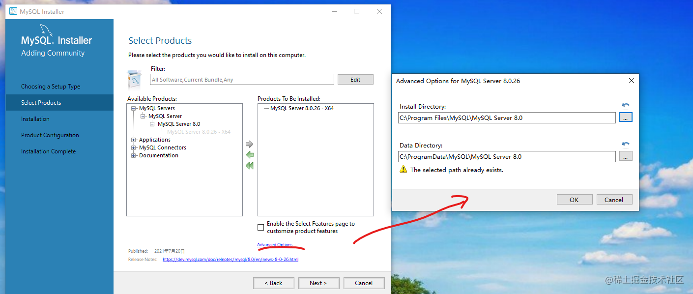
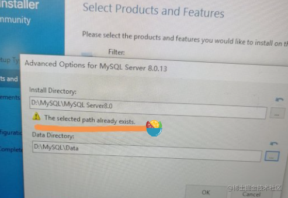

# 安装相关

官网： https://www.mysql.com/downloads/

## window

参考，但是一定记得修改路径，视频里面没有进行明确的说明。
https://www.bilibili.com/video/BV1GW411g7pF?from=search&seid=2994530132227188311&spm_id_from=333.337.0.0



如果提示路径冲突，就先把本地的目录删除掉，安装程序会自动的创建目录索引。



navicat 连接数据库报错：https://blog.csdn.net/ron03129596/article/details/83069873


# mac 安装和修改密码
参考  https://zhuanlan.zhihu.com/p/27960044


```shell
docker run -p 3307:3306 --name mysql_01  -v /Users/qiududu/mysqlData/log:/var/log/mysql  -v /Users/qiududu/mysqlData:/var/lib/mysql  -e MYSQL_ROOT_PASSWORD=root  -d mysql:latest
```


