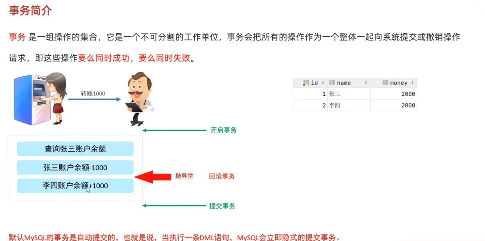
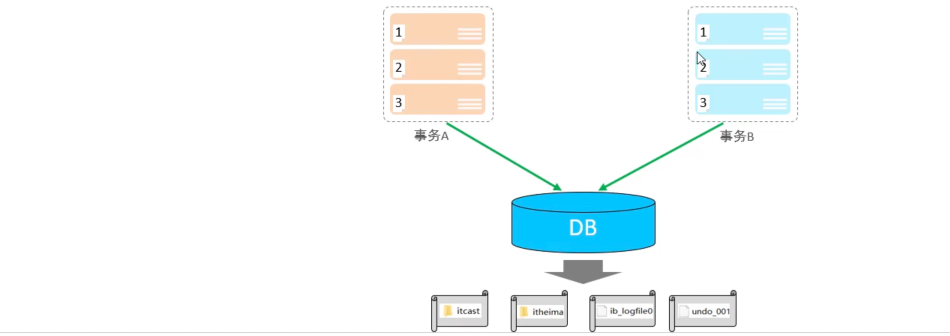

每一条sql语句都是一个事务，每一条sql执行都是一个事务，默认是自动提交的。

查询系统默认的事务状态
```sql
SELECT @@autocommit;  -- 1表示是默认的自动提交
SET @@autocommit = 0; -- 设置为手动提交 执行任何的dml语句的时候都需要commit
```


控制事务分为两类，一个是自动控制和手动控制。


## 事务控制
```sql
CREATE TABLE account(
    id INT AUTO_INCREMENT PRIMARY KEY COMMENT '主键',
    name VARCHAR(20) comment '姓名',
    money INT COMMENT '金额'
) COMMENT '账户表';

INSERT INTO  account VALUES (null,'dudu',2000), (null,'anikin',900);
```
#### 方式1：

```sql
SET @@autocommit = 0; 

-- 转账操作
-- 1： 先查询dudu余额
SELECT  * FROM account WHERE name = 'dudu';

-- 2：将dudu账户余额减去1000
UPDATE account SET money = money - 1000 WHERE name = 'dudu';

-- 这里很容易出现问题
程序抛出异常 ...

-- 3: 将 anikin 的余额加上1000
UPDATE account SET money = money + 1000 WHERE name = 'anikin';

-- 提交事务
commit;

-- 回滚事务
rollback;
```
#### 方式2：

开启事务：`START TRANSACTION 或 BEGIN TRANSACTION;`

提交事务：`COMMIT;`

回滚事务：`ROLLBACK;`


```sql
-- 方式2： 不修改事务的提交方式 start transacion 或者begin
START GROUP_REPLICATION;

-- 1： 先查询dudu余额
SELECT  * FROM account WHERE name = 'dudu';

-- 2：将dudu账户余额减去1000
UPDATE account SET money = money - 1000 WHERE name = 'dudu';

-- 这里很容易出现问题
程序抛出异常 ...

-- 3: 将 anikin 的余额加上1000
UPDATE account SET money = money + 1000 WHERE name = 'anikin';

-- 提交事务
commit;

-- 回滚事务
rollback;
```

## 事务的四大特性 (ACID)

- 原子性(**A**tomicity)：事务是不可分割的最小操作但愿，要么全部成功，要么全部失败
- 一致性(**C**onsistency)：事务完成时，必须使所有数据都保持一致状态。
- 隔离性(**I**solation)：数据库系统提供的隔离机制，保证事务在不受外部并发操作影响的独立环境下运行。两个事务操作同一个库，是在不同 的环境下，是独立的，互不影响的。
- 持久性(**D**urability)：事务一旦提交或回滚，它对数据库中的数据的改变就是永久的，持久化到本地文件。




## 并发事务

| 问题  | 描述  |
| ------------ | ------------ |
| 脏读  | 一个事务读到另一个事务还没提交的数据  |
| 不可重复读  | 一个事务先后读取同一条记录，但两次读取的数据不同  |
| 幻读  | 一个事务按照条件查询数据时，没有对应的数据行，但是再插入数据时，又发现这行数据已经存在  |


并发事务隔离级别：

| 隔离级别  | 脏读  | 不可重复读  | 幻读  |
| ------------ | ------------ | ------------ | ------------ |
| Read uncommitted  | √  | √  | √  |
| Read committed  | ×  | √  | √  |
| Repeatable Read(默认)  | ×  | ×  | √  |
| Serializable  | ×  | ×  | ×  |

- √表示在当前隔离级别下该问题会出现
- Serializable 性能最低；Read uncommitted 性能最高，数据安全性最差

查看事务隔离级别：
`SELECT @@TRANSACTION_ISOLATION;`
设置事务隔离级别：
`SET [ SESSION | GLOBAL ] TRANSACTION ISOLATION LEVEL {READ UNCOMMITTED | READ COMMITTED | REPEATABLE READ | SERIALIZABLE };`
SESSION 是会话级别，表示只针对当前会话有效，GLOBAL 表示对所有会话有效


