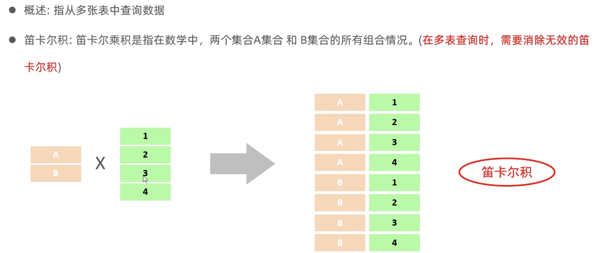
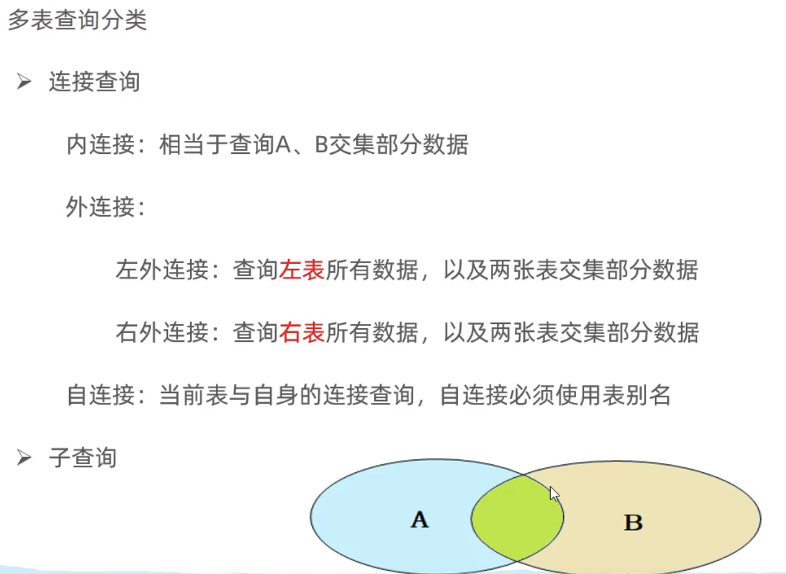
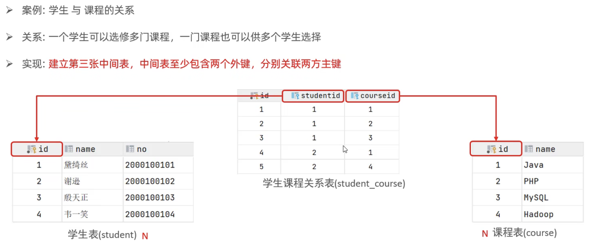
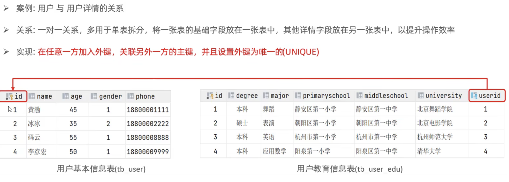

> 由于多表查询比较复杂，这里单独提取出来整理

# 多表查询

### 多表关系

什么是多表查询



分类：
<div align="center">    
 
</div>

#### 一对多

案例：部门与员工。

关系：一个部门对应多个员工，一个员工对应一个部门。

实现：在多的一方建立外键，指向一的一方的主键。

#### 多对多



#### 一对一


### 查询

合并查询（笛卡尔积，会展示所有组合结果）：
`select * from employee, dept;`

> 笛卡尔积：两个集合A集合和B集合的所有组合情况（在多表查询时，需要消除无效的笛卡尔积）

消除无效笛卡尔积：
`select * from employee, dept where employee.dept = dept.id;`

### 内连接查询

内连接查询的是两张表交集的部分

隐式内连接：
`SELECT 字段列表 FROM 表1, 表2 WHERE 条件 ...;`

显式内连接：
`SELECT 字段列表 FROM 表1 [ INNER ] JOIN 表2 ON 连接条件 ...;`

显式性能比隐式高

例子：

```SQL
-- 查询员工姓名，及关联的部门的名称
-- 隐式
select e.name, d.name from employee as e, dept as d where e.dept = d.id;
-- 显式
select e.name, d.name from employee as e inner join dept as d on e.dept = d.id;
```

### 外连接查询

左外连接：查询左表所有数据，以及两张表交集部分数据
`SELECT 字段列表 FROM 表1 LEFT [ OUTER ] JOIN 表2 ON 条件 ...;`
相当于查询表1的所有数据，包含表1和表2交集部分数据

右外连接：查询右表所有数据，以及两张表交集部分数据
`SELECT 字段列表 FROM 表1 RIGHT [ OUTER ] JOIN 表2 ON 条件 ...;`

例子：

```sql
-- 左
select e.*, d.name from employee as e left outer join dept as d on e.dept = d.id;

select d.name, e.* from dept d left outer join emp e on e.dept = d.id;  -- 这条语句与下面的语句效果一样

-- 右
select d.name, e.* from employee as e right outer join dept as d on e.dept = d.id;

```

左连接可以查询到没有dept的employee，右连接可以查询到没有employee的dept