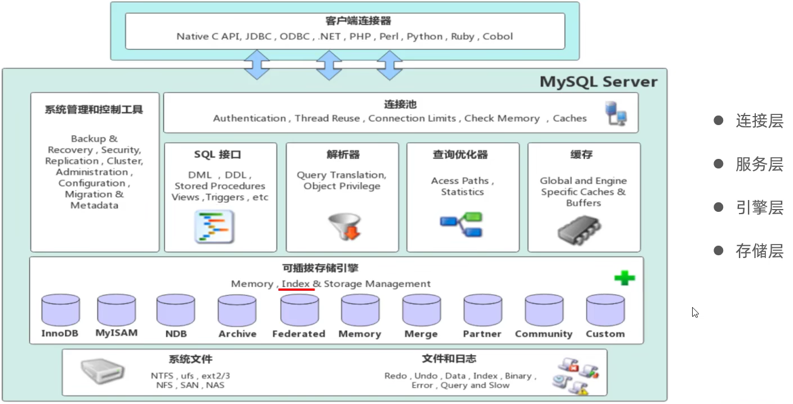
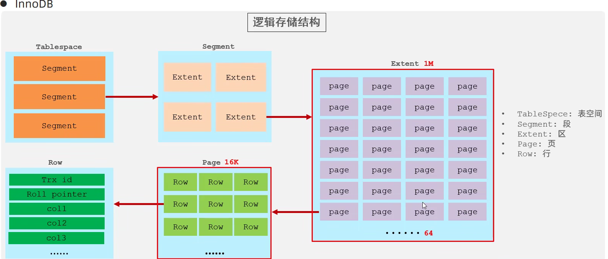
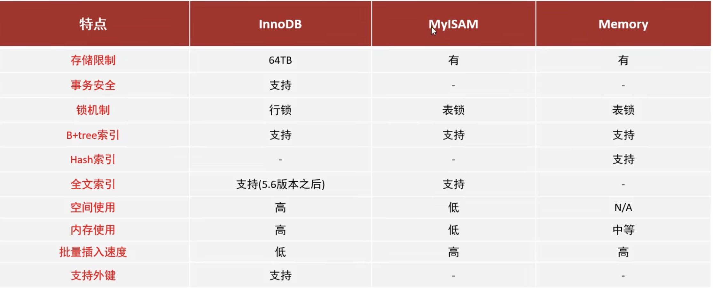

# 存储引擎

### mysql 体系介绍



> 不同引擎层索引的实现不一样

### 存储引擎层简介

> 引擎, 发动机，是核心。

**存储数据，建立索引，更新查询数据等技术的实现方式。存储引擎基于表，而不是基于库，所以存储引擎也可以被称之为表类型。**

v5.5 版本以后默认采用 `innerdb`。

```sql
-- 查询建表语句
SHOW CREATE TABLE account;
-- 建表时指定存储引擎
CREATE TABLE 表名(
    ...
) ENGINE=INNODB;
-- 查看当前数据库支持的存储引擎
show engines;
```

### 存储引擎特点


#### InnoDB
InnoDB 是一种兼顾高可靠性和高性能的通用存储引擎，在 MySQL 5.5 之后，InnoDB 是默认的 MySQL 引擎。

特点：

- DML 操作遵循 ACID 模型，支持**事务**
- **行级锁**，提高并发访问性能
- 支持**外键**约束，保证数据的完整性和正确性


磁盘文件：

`xxx.ibd`: `xxx`代表表名，`InnoDB` 引擎的每张表都会对应这样一个表空间文件，存储该表的表结构（frm、sdi）、数据和索引。

参数：`innodb_file_per_table`，8.0这个开关是打开的，决定多张表共享一个表空间还是每张表对应一个表空间。

查看 Mysql 变量：

```sql
show variables like 'innodb_file_per_table';

```

从idb文件提取表结构数据：（在cmd运行）`ibd2sdi xxx.ibd`



#### MyiSAM

yISAM 是 MySQL 早期的默认存储引擎。

特点：

- 不支持事务，不支持外键
- 支持表锁，不支持行锁
- 访问速度快

文件：
- xxx.sdi: 存储表结构信息
- xxx.MYD: 存储数据
- xxx.MYI: 存储索引


#### Memory
Memory 引擎的表数据是存储在内存中的，**受硬件问题、断电问题**的影响，只能将这些表作为临时表或缓存使用。

特点：
- 存放在内存中，速度快
- 支持hash索引（默认）

文件：
xxx.sdi: 存储表结构信息




### 存储引擎的选择

在选择存储引擎时，应该根据应用系统的特点选择合适的存储引擎。对于复杂的应用系统，还可以根据实际情况选择多种存储引擎进行组合。

- InnoDB: 如果应用对事物的完整性有比较高的要求，在并发条件下要求数据的一致性，数据操作除了插入和查询之外，还包含很多的更新、删除操作，则 InnoDB 是比较合适的选择

- MyISAM: 如果应用是以读操作和插入操作为主，只有很少的更新和删除操作，并且对事务的完整性、并发性要求不高，那这个存储引擎是非常合适的。适合日志等系统，偶尔丢失一两条也是没有问题的。被`mongodb`代替了。

- Memory: 将所有数据保存在内存中，**访问速度快**，通常用于临时表及缓存。Memory 的缺陷是**对表的大小有限制，太大的表无法缓存在内存中**，而且无法保障数据的安全性。 该部分被`redis`所代替了。
  
