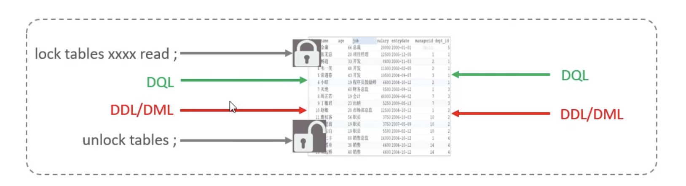

# 锁
计算机协调多个进程或者线程并发访问某一资源的机制。

数据也是以一种多用户共享的资源，如何保证访问的一致性，有效性是所有数据库必须解决的问题，锁冲突也是影响数据局并发访问的因素。很重要。

粒度分类：

- 全局锁：锁定数据库中的所有数据
- 表级锁：整张表
- 行级锁：锁定对应的行数据

### 全局锁
备份

**加了全局锁🔐以后的操作方式，可查（DML,DDL）不可写入（DQL）。**

### 表级锁
整张表，锁定粒度大，发生冲突概率最高，并发度低。

- 加锁：LOCK TABLES 表名 read/write
- 开锁：unlock tables /或者客户端断开连接

#### 表锁
##### 1 表共享读锁 read lock

只能读，不能写入，**会阻塞其他客户端的写入过程**。

当前客户端开始🔐以后，其他客户端更新操作等都会被阻塞，直到当前的客户端开锁才会释放。

##### 2 表共享写锁 write lock

**当前客户端可读可写，其他客户端写读都会被阻塞主。**

#### 元数据锁 meta data lock,MDL

一端自动开启元数据锁以后，另外客户端的更新都是排他锁，直到开启的客户端提交了当前的事务才会解锁。

#### 意向锁

加表锁的时候需要先判定有没有锁，行锁是否存在，一行行进行检查。性能很低，因此引入了意向锁。

检查意向锁和当前要加的锁是否兼容，否则一直会被阻塞主。知道被解锁。
