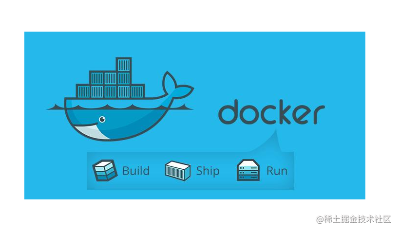
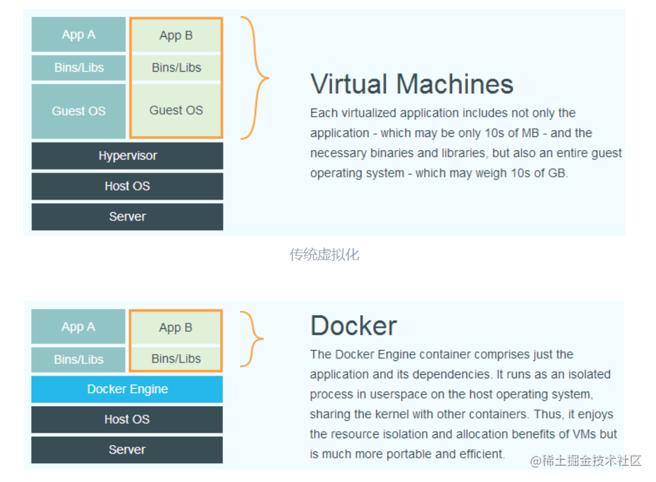
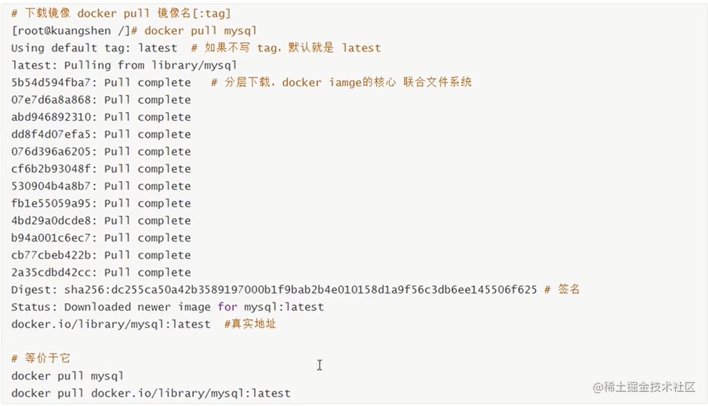
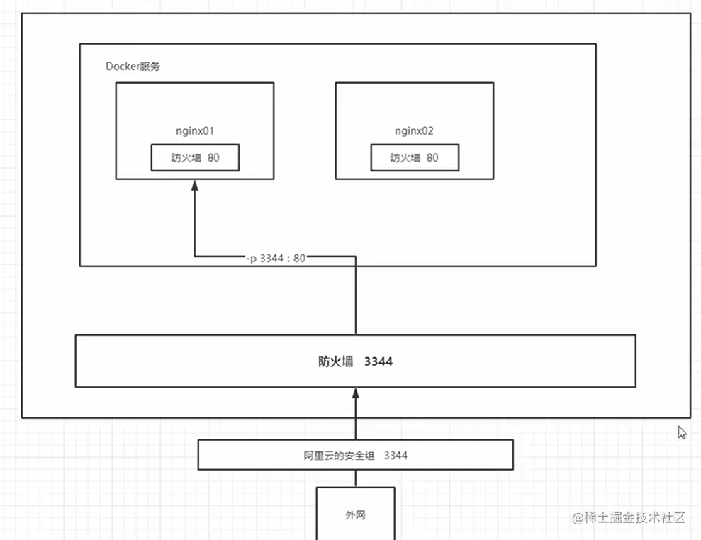

# docker 简介

 [docker官网](https://docs.docker.com/get-started/overview/)

`Docker`翻译为：码头工人-> 引深为：**容器**，容器泛指任何可以用于容纳其他物品的工具，可以部分或者完全的封闭，内部可以承载储存和运输物品。**由于隔离的进程独立于宿主和其它的隔离的进程，因此也称其为容器**。

`docker` 区别于传统虚拟技术（vm等），启动快，占用内存小，不需完全模拟一套操作系统，容器内部没有操作系统，有独立的文件系统，容器之间互相隔离。容器内的应用进程直接运行于宿主的内核，容器内没有自己的内核，而且也没有进行硬件虚拟，因此非常的轻量。




# 容器与宿主机的内核关系 —— 共享内核

> 内核，是一个操作系统的核心。是基于硬件的第一层软件扩充，提供操作系统的最基本的功能，是操作系统工作的基础，它负责管理系统的进程、内存、设备驱动程序、文件和网络系统，决定着系统的性能和稳定性。内核的分类可分为单内核和双内核以及微内核。严格地说，内核并不是计算机系统中必要的组成部分。

`docker` 镜像是一个 应用程序和它运行依赖环境 的封装。当镜像运行起来后，即是 `docker` 容器。运行时的容器本质是操作系统下的一个进程，这些进程共享同一个宿主机`OS`的内核。


### 为什么使用docker
- 更高效的利用系统资源
- 快速的启动时间
- 一致的运行环境，而不是「*这段代码在我机器上没问题啊」*
- 持续的交付和部署，`Dovops`中非常重要的一个环节
- 更加轻量的迁移和维护迭代。使用 `docker`以后我们的开发就像搭积木一样，项目打包为一个镜像，扩容迁移等都非常的方便的轻量。

- 对比传统虚拟机来说性能优越很多。`Docker` 使用的分层存储以及镜像的技术，使得应用重复部分的复用更为容易，也使得应用的维护更新更加简单，基于基础镜像进一步扩展镜像也变得非常简单。 

# 安装docker 

[官方安装文档](https://docs.docker.com/engine/install/centos/)

```shell
// 1： 升级yum
sudo yum updae

// 2: 卸载旧版本
sudo yum remove docker \
                  docker-client \
                  docker-client-latest \
                  docker-common \
                  docker-latest \
                  docker-latest-logrotate \
                  docker-logrotate \
                  docker-selinux \
                  docker-engine-selinux \
                  docker-engine


// 3: 安装依赖
 sudo yum install -y yum-utils

// 4: 设置阿里镜像
sudo yum-config-manager --add-repo http://mirrors.aliyun.com/docker-ce/linux/centos/docker-ce.repo


// 5: 安装docker   ce是社区版   ee是企业版
sudo yum install docker-ce docker-ce-cli containerd.io

// 6: 启动
sudo systemctl start docker

// 5：将切应用创建用户组

sudo groupadd docker #添加docker用户组
sudo gpasswd -a $USER docker #将登陆用户加入到docker用户组中
newgrp docker #更新用户组

// 6： 体验docker 

docker version 
docker info 查看信息
docker images

```
`/var/lib/docker` 是`docker`的默认工作路径。


# docker 具体使用


从上图可以分析出，`docker`是一个`cs`架构组成，``守护进程（docker daemon）``运行在主机上，通过`socket`来完成通信。`docker-server`接受`docker-client`的指令来


**镜像**，**容器**，**仓库**是整个`docker`的核心,首先先简单介绍下这个三个关键词的区别：

## 基本概念

### 1: 镜像（Image）

镜像是一种轻量级、可执行的独立软件包，用来打包软件运行环境和基本运行环境的开发软件，它包含运行某个软件所需要的所有内容，包括代码运行时，库环境变量和配置文件。


操作系统分为 **内核** 和 **用户空间**。对于 `Linux` 而言，内核启动后，会挂载 `root` 文件系统为其提供用户空间支持。

而 `Docker 镜像（Image）`，就相当于是一个 `root` 文件系统。
Docker 镜像 是一个特殊的文件系统，除了提供容器运行时所需的程序、库、资源、配置等文件外，还包含了一些为运行时准备的一些配置参数（如匿名卷、环境变量、用户等）。

**镜像不包含任何动态数据，其内容在构建之后也不会被改变。**

分层存储的特征还使得镜像的复用、定制变的更为容易。甚至可以用之前构建好的镜像作为基础层，然后进一步添加新的层，以定制自己所需的内容，构建新的镜像。


### 2: 容器（Container）

`镜像`和`容器`的关系，就像是面向对象程序设计中的类和实例 一样，镜像是静态的定义，容器是镜像运行时的实体。容器可以被**创建、启动、停止、删除、暂停**等。

容器的实质是进程，但与直接在宿主执行的进程不同，容器进程运行于属于自己的独立的 命名空间`Namespace`。因此容器可以拥有自己的 `root` 文件系统、自己的网络配置、自己的进程空间，甚至自己的用户 `ID` 空间。


容器内的进程是运行在一个隔离的环境里，使用起来，就好像是在一个独立于宿主的系统下操作一样。

容器不应该向其存储层内写入任何数据，容器存储层要保持无状态化。所有的文件写入操作，都应该使用 `数据卷（Volume）`、或者`绑定宿主目录`，在这些位置的读写会跳过容器存储层，直接对宿主（或网络存储）发生读写，其性能和稳定性更高。

**数据卷的生存周期独立于容器，容器消亡，数据卷不会消亡。因此，使用数据卷后，容器删除或者重新运行之后，数据却不会丢失**

### 3: 仓库（Repository）
镜像构建完成后，可以很容易的在当前宿主机上运行，但是，如果需要在其它服务器上使用这个镜像，我们就需要一个集中的存储、分发镜像的服务。 最常使用的 `Registry` 公开服务是官方的 `Docker Hub`。

[dockerhub](https://hub.docker.com/search?q=&type=image) 上有大量的高质量的镜像可以用，但是国内访问非常的慢，因此本地需要配置一个加速。找到这个目录`/etc/docker/daemon.json`，如果不存在则手动创建即可，默认的配置地址。

```
// login
docker login -u username
// input token
```


```js
{
  "registry-mirrors": ["https://zfzbet67.mirror.aliyuncs.com"]
}

// 配置完需要重启docker 
systemctl restart docker
```
## 基本命令


### 1： 镜像命令

```shell

 docker images --help  # 列出常见的镜像命令 -aq常见
 docker search mysql   # 去docker hub上面搜索镜像
 docker image ls       # 列出镜像
 docker rmi  -f imageId/名称  # 强制按照镜像id或者名称删除 

```


**镜像是多层存储结构**，因此在删除的时候也是从上层向基础层方向依次进行判断删除。镜像的多层结构让镜像复用变得非常容易，因此很有可能某个其它镜像正依赖于当前镜像的某一层。这种情况，依旧不会触发删除该层的行为。直到没有任何层依赖当前层时，才会真实的删除当前层。


### 2：容器基本命令


```shell
# 下载镜像
docker pull centos

# 查看所有的镜像
docker images

# 启动并进入容器
docker run -it centos /bin/bash 

# 退出
exit
Ctrl + p + q  #不结束容器退出

# 查看所有正在运行的容器
docker ps
 - a 查看当前和历史运行过的容器
 - q 显示容器编号
 
# 删除容器
# 如果是正在运行的必须加 -f
docker container rm [如果要强制就加-f] id === docker rm 容器id 

# 删除所有的容器 
docker rm -f $(docker ps -aq)  === docker container prune  # 删除所有的容器


# 启动和停止容器
docker start   容器id ===  docker container start 容器名称
docker stop    容器id ===  docker container stop 容器名称 
docker kill    容器id
docker restart 容器id

# 日志©
# 后台运行一个容器，并且执行这个脚本
docker run -d centos /bin/sh -c "while true; do echo qiuyanlong;sleep 3;done"
docker logs -ft --tail 20 1380949901ed # 查询这个容器的日志


# 查看容器进程命令
docker inspect 容器id  # 查看某个容器的所有详细信息
docker top     容器id  # 查看某个容器的进程信息


# 进入容器
# 一般容器都是在后台执行，因此我们需要进入容器
docker exec -it 容器id /bin/bash 
docker attach 容器id  # 进入正在执行的终端，不会新开一个终端


# 拷贝容器的文件到宿主环境
docker cp ff81c4468b66:/home/main.js  /home 
# 一般宿主到容器是采用挂载来处理,拷贝是一个手动的过程，一般容器使用卷的技术来实现
```

## 案例使用

### 1: 部署nginx应用



上图模拟了端口暴露的的原理。

```shell
# 搜索
docker search nginx

# 拉取镜像
docker pull nginx

# 将nginx 默认80指向外网3344 单独命名nginx_01
docker run -d nginx --name nginx_01 -p 3344:80 nginx 

# 验证是否可以访问
curl 192.168.0.1:4433 

# 进入nginx 容器
docker exec -it /bin/bash 

# whereis nginx
nginx: /usr/sbin/nginx /usr/lib/nginx /etc/nginx /usr/share/nginx

```
通过上面发现，每次修改`nginx`的每次修改配置都需要在内部修改，后面使用容器卷方式来挂在的话，就不需要在单独进入来处理。

### 2: 部署tomcat应用

```shell
# 搜索镜像
docker search tomcat 

docker pull tomcat 

docker images

# 端口指定和名称指定
docker run -d -p 8000:8080 --name tomcat_01 tomcat 

# 进入
docker exec -it c4b104964c2b /bin/bash 

whereis tomcat 

# 拷贝文件到webapps，默认这个文件为空
cp -r webapps.dist/* webapps

# 直接可以在外网ip:8000访问这个服务了
```


# Q&A
- 每次启动 执行docker 命令都会提示：Cannot connect to the Docker daemon at unix:///var/run/docker.sock. Is the docker daemon running?

执行以下命令即可：
主要原因是没有设置开启启动

```shell
systemctl daemon-reload
systemctl restart docker.service
```
或者直接
```
su root # 先切换到root用户, 再执行以下命令
systemctl enable docker # 开机自动启动docker

systemctl start docker # 启动docker
systemctl restart docker # 重启dokcer
```


# 参考文章

- https://yeasy.gitbook.io/docker_practice/install/centos


