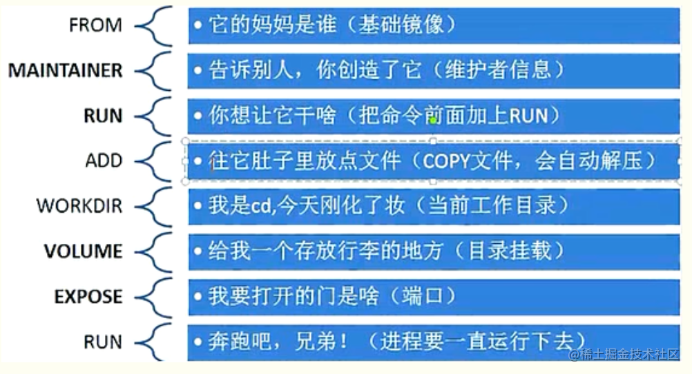
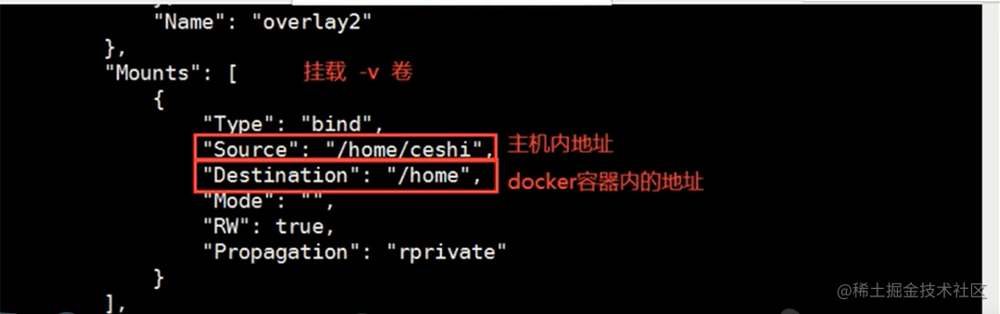

    

目录：

1. [commit 镜像](#commit-镜像)
2. [dockfile](#dockfile)
	
	2.1. [案例1：使用nginx 简单构建一个镜像](#案例1：使用nginx-简单构建一个镜像)	
	
	2.2. [案例2：构建centos上传docker-pub](#案例2：构建centos上传docker-pub)
	
3. [卷挂载使用](#卷挂载使用)
4. [具名挂载和匿名挂载](#具名挂载和匿名挂载)
5. [练习：挂在mysql 数据](#练习：挂在mysql-数据)


[docker 前端从入门到精通(上)](https://juejin.cn/post/6988513822818435080)中我们了解到了`docker`的基本常用命令，以及怎么使用`docker`，在下篇中着重讲解怎样使用进阶和高级使用。


# docker 可视化工具


`Portainer` 是一个可视化的容器镜像的图形管理工具，利用Portainer可以轻松构建，管理和维护Docker环境。 而且完全免费，基于容器化的安装方式，方便高效部署。

```js
# 搜索
docker search portainer |head -n 3

#拉取镜像
docker pull docker.io/portainer/portainer

# 执行镜像获的容器
docker run -d -p 8000:8000 -p 9000:9000 --name=portainer --restart=always -v /var/run/docker.sock:/var/run/docker.sock -v portainer_data:/data portainer/portainer

# 访问注册
http://localhost:9000/
```


# 容器和数据卷
目前理解到容器还有一个问题，就是如果整个容器被删除的话，所有的数据也会一起销毁掉，为了解决这个问题，可以使用数据卷把容器数据挂在的宿主机的磁盘上。

###  1. <a name='commit-镜像'></a>commit 镜像


总结：`Docker` **镜像都是只读的，当容器启动时，一个新的可写层被加到镜像的顶部。
这一层就是我们通常说的容器层，容器之下都是镜像层。**

`docker commit` 命令除了学习之外，还有一些特殊的应用场合，比如被入侵后保存现场等。

`docker commit` 命令，可以将容器的存储层保存下来成为镜像。换句话说，就是在原有镜像的基础上，再叠加上容器的存储层，并构成新的镜像。以后我们运行这个新镜像的时候，就会拥有原有容器最后的文件变化。


```js
docker commit  # 提交镜像 
docker commit -m="提交者信息" -a="作者"  容器id  镜像名称：[TAG]

# 根据上面的原理，我们在当前层提交了一层提交，完成整个镜像
[root@zhaosi ~]# docker commit -m="cp weblist dir" -a="zhangsan" c4b104964c2b zs_tomcat:1.0
sha256:d81257471ca4836acba4ca2a5c160e92c75f99c12aa8494e69b397a45711ed0a
[root@zhaosi ~]# docker images 

REPOSITORY            TAG       IMAGE ID       CREATED          SIZE
zs_tomcat             1.0       d81257471ca4   10 seconds ago   672MB
yachtomcat            1.0       3ca80e740f23   2 weeks ago      672MB
nginx                 latest    4cdc5dd7eaad   2 weeks ago      133MB
tomcat                latest    36ef696ea43d   3 weeks ago      667MB
mysql                 latest    5c62e459e087   4 weeks ago      556MB
portainer/portainer   latest    580c0e4e98b0   4 months ago     79.1MB
centos                latest    300e315adb2f   7 months ago     209MB
```


**【警告】** `docker commit` 意味着所有对镜像的操作都是黑箱操作，生成的镜像也被称为 黑箱镜像，换句话说，就是除了制作镜像的人知道执行过什么命令、怎么生成的镜像，别人根本无从得知。

###  2. <a name='dockfile'></a>dockfile

从刚才的 `docker commit` 的学习中，我们可以了解到，镜像的定制实际上就是定制每一层所添加的配置、文件。如果我们可以把每一层修改、安装、构建、操作的命令都写入一个脚本，用这个脚本来构建、定制镜像，那么之前提及的无法重复的问题、镜像构建透明性的问题、体积的问题就都会解决。这个脚本就是 `Dockerfile`。

`Dockerfile` 是一个文本文件，其内包含了一条条的 指令`(Instruction)`，每一条指令构建一层，因此每一条指令的内容，就是描述该层应当如何构建。

之前说过，`Dockerfile` 中每一个指令都会建立一层，`RUN`也不例外。每一个 `RUN` 的行为，就和刚才我们手工建立镜像的过程一样：新建立一层，在其上执行这些命令，执行结束后，`commit `这一层的修改，构成新的镜像。

####  2.1. <a name='案例1：使用nginx-简单构建一个镜像'></a>案例1：使用nginx 简单构建一个镜像

```js
touch mynginx && cd mynginx && touch Dockerfile

# vi写入以下爱内容
FROM nginx
RUN echo '<h1>Hello, Docker!</h1>' > /usr/share/nginx/html/index.html

# 在当前路径下，执行构建
# 也可以指定路径，不用移动到当前的路径
# docker build -f /path/to/a/Dockerfile
docker build -t nginx:v3 .


# 查看构建
docker images

REPOSITORY            TAG       IMAGE ID       CREATED         SIZE

nginx                 v4        1b03f171e7d4   7 minutes ago   133MB
zs_tomcat             1.0       d81257471ca4   4 hours ago     672MB
yachtomcat            1.0       3ca80e740f23   2 weeks ago     672MB
nginx                 latest    4cdc5dd7eaad   2 weeks ago     133MB
tomcat                latest    36ef696ea43d   3 weeks ago     667MB
mysql                 latest    5c62e459e087   4 weeks ago     556MB
portainer/portainer   latest    580c0e4e98b0   4 months ago    79.1MB
centos                latest    300e315adb2f   7 months ago    209MB
```

####  2.2. <a name='案例2：构建centos上传docker-pub'></a>案例2：构建centos上传docker-pub

实现两个功能：可以使用 `vim` 和 `ifconfig` 两个功能，完整实现`dockerfile`并且发布到`docker-pub`。

```js
# 1 建立文件
mkdir -p mycentos && cd mycentos && touch mycentosDockfile-centos

# 2 编辑 vi mycentosDockfile-centos
FROM centos
MAINTAINER zhangsan<qiuyanlong2016@gmail.com>


ENV MYPATH /usr/local
WORKDIR $MYPATH

RUN yum -y install vim 
RUN yum -y install net-tools

EXPOSE 8080

CMD echo $MYPATH
CMD echo "================end================="
CMD /bin/bash

# 3: 构建 zhangsan 是docker-pub账号
docker build -f ./mycentosDockfile-centos -t zhangsan/dircentos:1.0 .

# 4：如果3步忘记添加在即的账号作为spacename 则需要单独打一个tag 
docker tag  dircentos:1.0  zhangsan/dircentos:1.0

# 5: 登陆
docker login -u zhangsan

# 6: push
docker push zhangsan/dircentos:1.0
```

一般`dockfile`包含**基础镜像信息**、**维护者信息**、**镜像操作指令**和**容器启动时执行指令**。

`docker` 以从上到下的顺序运行`Dockerfile`的指令。为了指定基本映像，第一条指令必须是`FROM`。一个声明以＃字符开头则被视为注释。可以在`Docker`文件中使用`RUN`，`CMD`，`FROM`，`EXPOSE`，`ENV`等指令。





###  3. <a name='卷挂载使用'></a>卷挂载使用
```js
 docker run -it -v 主机目录:容器目录 
 
 # 把容器的data挂在到宿主的home下面
 docker run -it -v /home/data:/home centos /bin/bash 
 
 #查看这个容器的所有详细信息
 docker inspect 容器的ID
```




###  4. <a name='具名挂载和匿名挂载'></a>具名挂载和匿名挂载 
`-v` 容器内路径 不写宿主机器的路径就是**匿名挂载**

```js
# 匿名挂载
docker run -d -p  --name nginx_01 -v /etc/nginx nginx 

# 查看挂在卷列表
docker volume ls

local     0bd0439abb6511c914de41975ca4f9d2e07eaab969d92981277092d4673bd6d7
local     0fe72108880078fa40e4060e8695a56e1518402069a6c0f559092ad9b5aadbb7
local     8f4456ba8f2288e680fdc466b4b35853ee134700e8d21d79911e91163a6e3c60
local     08f05b86ac17558c8b32b36ff7ac01907e115e4c6e9c0bba0d5c91b1dc5d2cc3

# 查看某个容器卷挂载具体情况
docker volume inspect 容器id

# 具名挂载
docker run -d -P  --name nginx_01 -v  test-nginx : /etc/nginx nginx 

# 再次查看
docker volume ls

local     0bd0439abb6511c914de41975ca4f9d2e07eaab969d92981277092d4673bd6d7
local     0fe72108880078fa40e4060e8695a56e1518402069a6c0f559092ad9b5aadbb7
local     8f4456ba8f2288e680fdc466b4b35853ee134700e8d21d79911e91163a6e3c60
local     08f05b86ac17558c8b32b36ff7ac01907e115e4c6e9c0bba0d5c91b1dc5d2cc3
local     test-nginx
```

###  5. <a name='练习：挂在mysql-数据'></a>练习：挂在mysql 数据

```js
# -p 端口映射
# -v 卷挂在
# -e 环境配置
# --name 容器名称

docker run -d 
-p 3301:3306\ 
-v /home/mysql/conf:/etc/mysql/conf.d\ 
-v /home/mysql/data:/var/lib/mysql\ 
-e MYSQL_ROOT_PASSWORD=123456\ 
--name mysql_01 mysql

```


> 网络相关的 `docker componse` 和 `docker swam`集群等相关见[docker] 前端从入门到精通（下）。

# 参考文章

- [Portainer 点击 connect 报错：Failure Cannot connect to the Docker daemon at unix:///var/run/docker.sock.](https://www.cnblogs.com/the-undeveloped-procedural-ape/articles/14203848.html)

- https://yeasy.gitbook.io/docker_practice/
