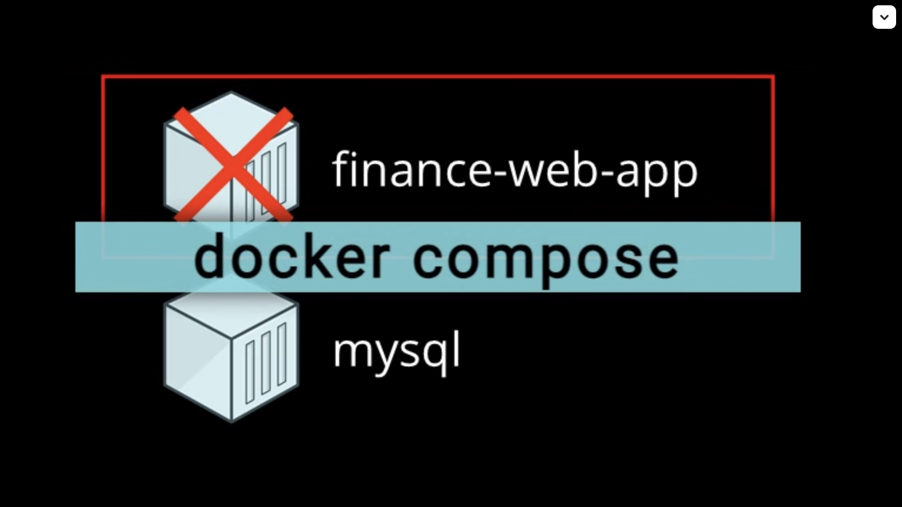
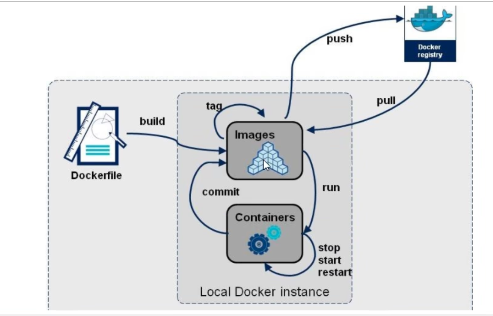
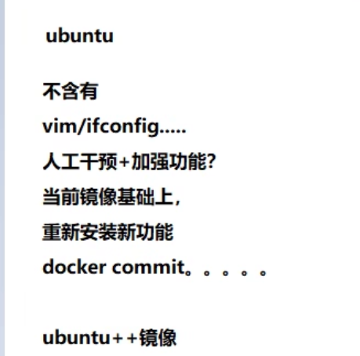
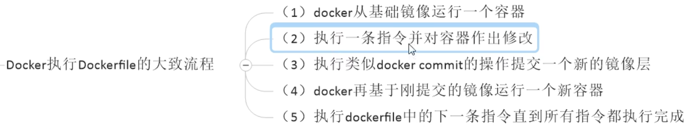
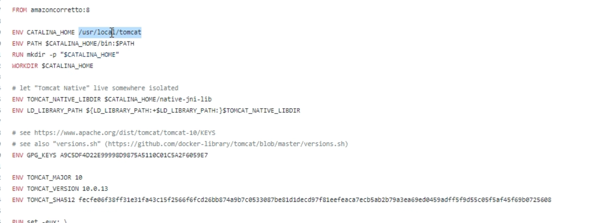
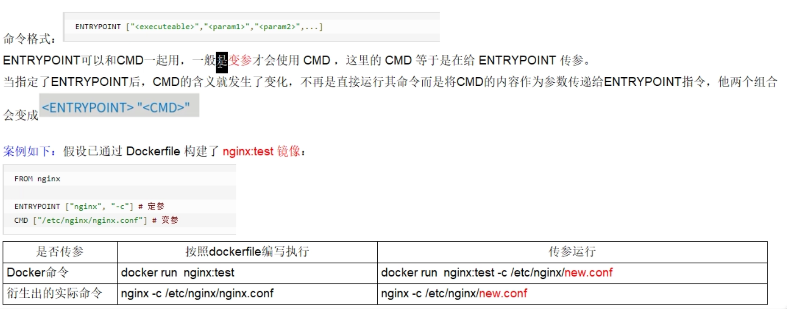
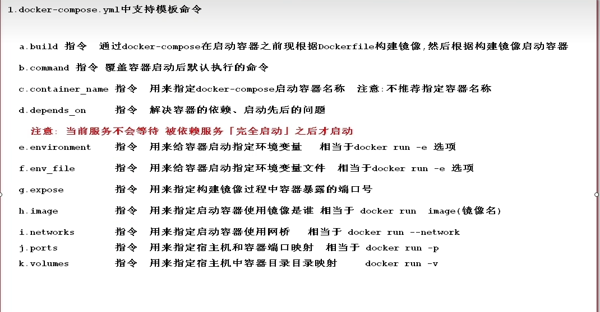

# docker compose

`Docker Compose` 是 `Docker` 官方编排（Orchestration）项目之一，负责快速的部署分布式应用。桌面版本docker自带这个功能。

eg: 我们一般遵循数据和应用分离的原则，因此如下图，`finance-web-app` 宕机以后，不会影响`mysql`。




`Compose` 恰好满足了这样的需求。它允许用户通过一个单独的 `docker-compose.yml` 模板文件（YAML 格式）来定义一组相关联的应用容器为一个项目（project）。

Compose 中有两个重要的概念：

- 服务 (`service`)：一个应用的容器，实际上可以包括若干运行相同镜像的容器实例。
- 项目 (`project`)：由一组关联的应用容器组成的一个完整业务单元，在 `docker-compose.yml` 文件中定义。

可见，一个项目可以由多个服务（容器）关联而成，Compose 面向项目进行管理。

核心： **配置文件中定义一个项目存在哪些服务s**。编排的前提是必须有镜像

# 场景

最常见的项目是 web 网站，该项目应该包含 web 应用和缓存。

# Dockfile 的一些补充

这个文件是： 镜像构建的脚本文件


也可以是`docker commit`： 构建镜像的，但是这个方式比较死板，随时变化需要多次`commit`, 因此对于不变的东西使用`commit` 进行构建。常改常变的东西使用 `Dockfile`。



 - 自上而下执行
 - 每条指令都会创建一个新的**镜像层**，并对镜像进行提交。有缓存在。

 ### 指定流程
 

 ### run 
 在构建的时候运行

 ### workdir
 创建容器以后，进入容器运行的工作目录，落脚点。
 ```Dockfile
   docker exec -it xxx /bin/bash
   pwd # 显示的就是指定的目录地址 
 ```


### env
环境变量，这个环境变量可以在后续的任何`RUN` 指令中使用。也可以在其他指令中使用、

```yml
ENV: MY_PATH  /usr/mytest
WORKDIR $MY_PATH
```


上面是`tomcat`服务器的配置文件。


### add

将宿主机目录下的文件拷贝进镜像，且会自动处理`URL`和解压`tar`压缩包

非常类似： `docker cp 容器id: 容器内路径 目的主机路径`

=== `COPY` + 解压合体，


### CMD
作用： 指定容器启动后要干的事情

和`run`类似,可以有多个`CMD`指令,但是只有最后一个生效，cmd会被docker run 之后的参数替换

和`run`区别：
 - `CMD` 是在`docker run`时运行
 - `RUN` 是在`docker build`时运行


### entrypoint
也是用来指定一个容器运行时要运行的命令

类似cmd,但该命令不会被docker run 后面的命令覆盖，



# 常见命令


[核心模板命令](https://yeasy.gitbook.io/docker_practice/compose/compose_file#build)
[重点参考注释](./web_im/docker-compose.yml)


```yml
# 启动项目的所有服务，必须保证运行命令的目录存在docke-compose.yml文件
docker compose up 


# docker compose 自己去根据Dockfile去构建镜像，然后再根据构建的镜像启动容器
# 而不是我们先手动写Dockfile文件然后build。
# build 和 image不能同时存在，会造成docker-compose 无法识别到底是应该使用个镜像


# 后台启动 yaml 定义的所有容器
docker-compose up -d
# 仅启动 mysql 这个service，会启动其依赖的 service
docker-compose up mysql 指定启动的server名称，
# 停止容器并移除自动创建的网桥
docker-compose down 
# 重启所有 service 后面可以指定上某个具体的 service
docker-compose restart

# 暂停 和 恢复
docker-compose pause
docker-compose unpause

# 进入 redis 这个 service 使用 exit 退出
docker-compose exec redis bash

# 列出当前 yaml 中定义的容器的信息
docker-compose ps

# 删除当前 yaml 中定义的容器，需要先 stop，后面可以指定上某个具体的 service
docker-compose rm

# 查看各个 service 容器内运行的进程情况
docker-compose top

# 查看日志默认查看 yaml 所有的，可以跟上具体 service
# -f 可以保持跟踪，新的日志会马上显示在屏幕上
docker-compose logs


```
