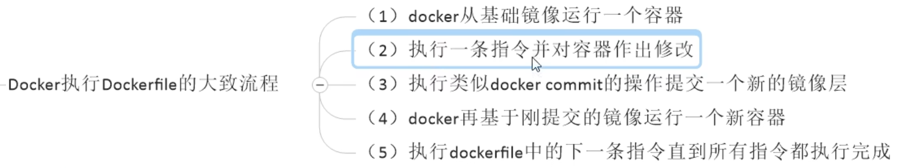
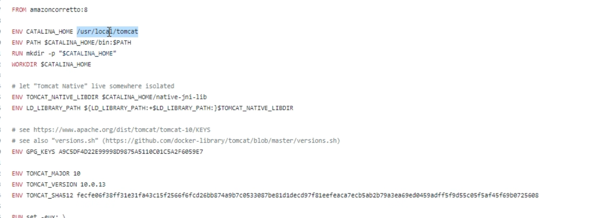

# Dockerfile 镜像编排文件
 
 - 自上而下执行
 - 每条指令都会创建一个新的**镜像层**，并对镜像进行提交。有缓存在。
  
### 所有命令  

- From XXX（基于什么镜像）
- WORKDIR /app 指定shell语句运行在那个路径下,也就是当前目录是将来的工作目录

- COPY 将宿主机的文件拷贝到某路径下，**一般打包的时候先把本地的文件拷贝到容器里面的 上已经指定的工作目录下**。
- RUN [打包中]镜像打包的时候执行的shell脚本 默认在工作目录  构建
- CMD [运行时]指定镜像启动运行的脚本，只有容器真正运行的时候才会运行的脚本，执行后容器的生命周期即结束，且一般为阻塞式语句，如tail语句）
- USER  用户名:用户组 默认是root

- EXPOSE---暴露镜像的指定端口
- VOLUME---指定映射文件
- ENV---指定doker的环境变量，运行时一直生效
- ARG---构建参数，运行时无效，可以构建时候临时修改变量
- LABEL---指定元数据，便于找到docker 没有实际的意义
- ONBUILD---当前镜像构建的时候不会执行，基于当前镜像的镜像去构建的容器执行的时候会出发
- STOPSIGNAL---指定容器使用什么信号，一般指定信号名


### copy 和 add 区别

二者都可以拷贝到镜像中，推荐一般拷贝推荐`copy`
但是`add` 拷贝地址可以是远程url，自带解压能力


### 详细命令


 #### workdir
 创建容器以后，进入容器运行的工作目录，落脚点。
 ```Dockfile
   docker exec -it xxx /bin/bash
   pwd # 显示的就是指定的目录地址 
 ```


#### env
环境变量，这个环境变量可以在后续的任何`RUN` 指令中使用。也可以在其他指令中使用、

```yml
ENV: MY_PATH  /usr/mytest
WORKDIR $MY_PATH
```


上面是`tomcat`服务器的配置文件。


#### add

将宿主机目录下的文件拷贝进镜像，且会自动处理`URL`和解压`tar`压缩包

非常类似： `docker cp 容器id: 容器内路径 目的主机路径`

=== `COPY` + 解压合体，


#### CMD
作用： 指定容器启动后要干的事情

和`run`类似,可以有多个`CMD`指令,但是只有最后一个生效，cmd会被docker run 之后的参数替换

和`run`区别：
 - `CMD` 是在`docker run`时运行
 - `RUN` 是在`docker build`时运行


#### entrypoint
也是用来指定一个容器运行时要运行的命令

类似cmd,但该命令不会被docker run 后面的命令覆盖，


#### ARG
内部变量 只有构建的时候才有效   可以传递参数  是一个构建时可以修改的参数，也就是内部变量，env是运行时候都可以获取到的变量。

唯一亮点是：

```
# 可以参数传递
docker build -t test --build-arg name=foo
```