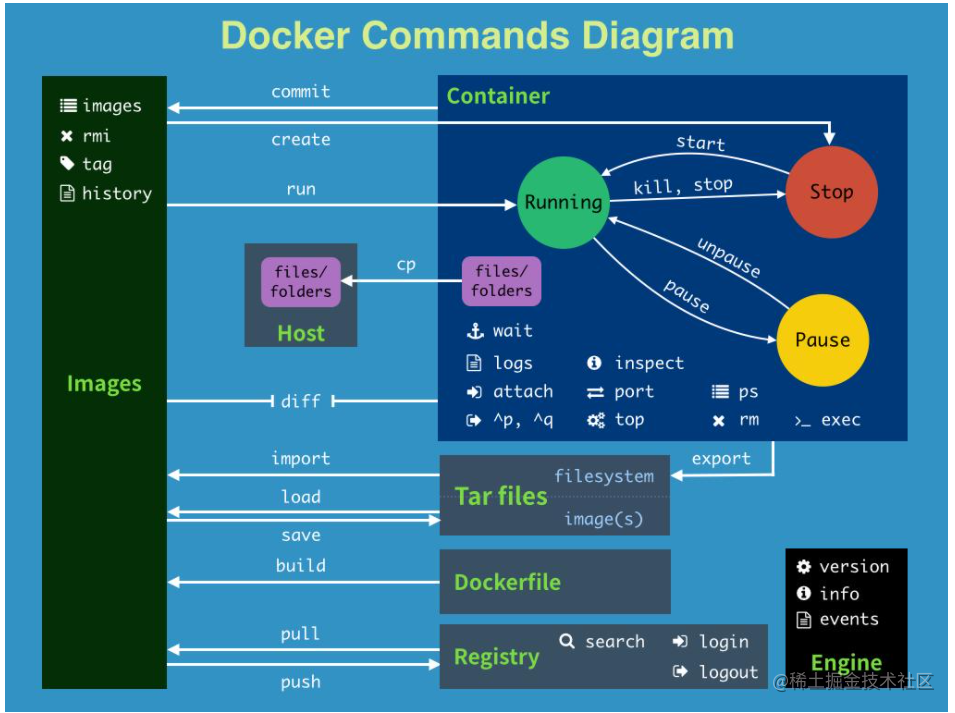
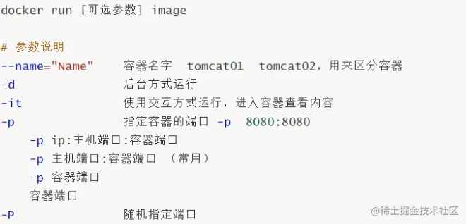
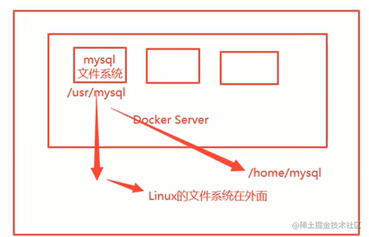

<!-- vscode-markdown-toc -->
  * 1. [容器与宿主机的内核关系 —— 共享内核](#容器与宿主机的内核关系-——-共享内核)
  * 2. [为什么使用docker](#为什么使用docker)
  * 3. [安装docker](#安装docker)
  * 4. [docker 具体使用](#docker-具体使用)
  * 5. [镜像（Image）](#镜像（image）)
  * 6. [容器（Container）](#容器（container）)
  * 7. [仓库（Repository）](#仓库（repository）)
  * 8. [1： 镜像命令](#1：-镜像命令)
  * 9. [2：容器基本命令](#2：容器基本命令)
* 1. [docker 可视化工具](#docker-可视化工具)
* 2. [镜像的构建](#镜像的构建)
  * 2.1. [ commit 镜像](#-commit-镜像)
  * 2.2. [ dockfile](#-dockfile)
    * 2.2.1. [ 构建centos上传docker-pub](#-构建centos上传docker-pub)
* 3. [容器和数据卷](#容器和数据卷)
  * 3.1. [卷挂载使用](#卷挂载使用)
  * 3.2. [4. 具名挂载和匿名挂载](#4.-具名挂载和匿名挂载)
* 4. [Q&A](#q&a)
* 5. [参考文章](#参考文章)

<!-- vscode-markdown-toc-config
	numbering=true
	autoSave=true
	/vscode-markdown-toc-config -->
<!-- /vscode-markdown-toc -->---
theme: juejin
---


# docker 简介

 [docker官网](https://docs.docker.com/get-started/overview/)

`Docker`翻译为：码头工人-> 引深为：**容器**，容器泛指任何可以用于容纳其他物品的工具，可以部分或者完全的封闭，内部可以承载储存和运输物品。**由于隔离的进程独立于宿主和其它的隔离的进程，因此也称其为容器**。

`docker` 区别于传统虚拟技术（vm等），启动快，占用内存小，不需完全模拟一套操作系统，容器内部没有操作系统，有独立的文件系统，容器之间互相隔离。容器内的应用进程直接运行于宿主的内核，容器内没有自己的内核，而且也没有进行硬件虚拟，因此非常的轻量。


###  1. <a name='容器与宿主机的内核关系-——-共享内核'></a>容器与宿主机的内核关系 —— 共享内核

> 内核，是一个操作系统的核心。是基于硬件的第一层软件扩充，提供操作系统的最基本的功能，是操作系统工作的基础，它负责管理系统的进程、内存、设备驱动程序、文件和网络系统，决定着系统的性能和稳定性。内核的分类可分为单内核和双内核以及微内核。严格地说，内核并不是计算机系统中必要的组成部分。

`docker` 镜像是一个 应用程序和它运行依赖环境 的封装。当镜像运行起来后，即是 `docker` 容器。运行时的容器本质是操作系统下的一个进程，这些进程共享同一个宿主机`OS`的内核。


###  2. <a name='为什么使用docker'></a>为什么使用docker
- 更高效的利用系统资源
- 快速的启动时间
- 一致的运行环境，而不是「*这段代码在我机器上没问题啊」*
- 持续的交付和部署，`Dovops`中非常重要的一个环节
- 更加轻量的迁移和维护迭代。使用 `docker`以后我们的开发就像搭积木一样，项目打包为一个镜像，扩容迁移等都非常的方便的轻量。

- 对比传统虚拟机来说性能优越很多。`Docker` 使用的分层存储以及镜像的技术，使得应用重复部分的复用更为容易，也使得应用的维护更新更加简单，基于基础镜像进一步扩展镜像也变得非常简单。 

###  3. <a name='安装docker'></a>安装docker 

[官方安装文档](https://docs.docker.com/engine/install/centos/)

```shell
// 1： 升级yum
sudo yum updae

// 2: 卸载旧版本
sudo yum remove docker \
                  docker-client \
                  docker-client-latest \
                  docker-common \
                  docker-latest \
                  docker-latest-logrotate \
                  docker-logrotate \
                  docker-selinux \
                  docker-engine-selinux \
                  docker-engine


// 3: 安装依赖
 sudo yum install -y yum-utils

// 4: 设置阿里镜像
sudo yum-config-manager --add-repo http://mirrors.aliyun.com/docker-ce/linux/centos/docker-ce.repo


// 5: 安装docker   ce是社区版   ee是企业版
sudo yum install docker-ce docker-ce-cli containerd.io

// 6: 启动
sudo systemctl start docker

// 5：将切应用创建用户组

sudo groupadd docker #添加docker用户组
sudo gpasswd -a $USER docker #将登陆用户加入到docker用户组中
newgrp docker #更新用户组

// 6： 体验docker 

docker version 
docker info 查看信息
docker images

```
`/var/lib/docker` 是`docker`的默认工作路径。


###  4. <a name='docker-具体使用'></a>docker 具体使用


从上图可以分析出，`docker`是一个`cs`架构组成，``守护进程（docker daemon）``运行在主机上，通过`socket`来完成通信。`docker-server`接受`docker-client`的指令来


**镜像**，**容器**，**仓库**是整个`docker`的核心,首先先简单介绍下这个三个关键词的区别：

# 基本概念

###  5. <a name='镜像（image）'></a>镜像（Image）

镜像是一种轻量级、可执行的独立软件包，用来打包软件运行环境和基本运行环境的开发软件，它包含运行某个软件所需要的所有内容，包括代码运行时，库环境变量和配置文件。


操作系统分为 **内核** 和 **用户空间**。对于 `Linux` 而言，内核启动后，会挂载 `root` 文件系统为其提供用户空间支持。

而 `Docker 镜像（Image）`，就相当于是一个 `root` 文件系统。
Docker 镜像 是一个特殊的文件系统，除了提供容器运行时所需的程序、库、资源、配置等文件外，还包含了一些为运行时准备的一些配置参数（如匿名卷、环境变量、用户等）。

**镜像不包含任何动态数据，其内容在构建之后也不会被改变。**

分层存储的特征还使得镜像的复用、定制变的更为容易。甚至可以用之前构建好的镜像作为基础层，然后进一步添加新的层，以定制自己所需的内容，构建新的镜像。


###  6. <a name='容器（container）'></a>容器（Container）

`镜像`和`容器`的关系，就像是面向对象程序设计中的类和实例 一样，镜像是静态的定义，容器是镜像运行时的实体。容器可以被**创建、启动、停止、删除、暂停**等。

容器的实质是进程，但与直接在宿主执行的进程不同，容器进程运行于属于自己的独立的 命名空间`Namespace`。因此容器可以拥有自己的 `root` 文件系统、自己的网络配置、自己的进程空间，甚至自己的用户 `ID` 空间。


容器内的进程是运行在一个隔离的环境里，使用起来，就好像是在一个独立于宿主的系统下操作一样。

容器不应该向其存储层内写入任何数据，容器存储层要保持无状态化。所有的文件写入操作，都应该使用 `数据卷（Volume）`、或者`绑定宿主目录`，在这些位置的读写会跳过容器存储层，直接对宿主（或网络存储）发生读写，其性能和稳定性更高。

**数据卷的生存周期独立于容器，容器消亡，数据卷不会消亡。因此，使用数据卷后，容器删除或者重新运行之后，数据却不会丢失**

###  7. <a name='仓库（repository）'></a>仓库（Repository）
镜像构建完成后，可以很容易的在当前宿主机上运行，但是，如果需要在其它服务器上使用这个镜像，我们就需要一个集中的存储、分发镜像的服务。 最常使用的 `Registry` 公开服务是官方的 `Docker Hub`。

[dockerhub](https://hub.docker.com/search?q=&type=image) 上有大量的高质量的镜像可以用，但是国内访问非常的慢，因此本地需要配置一个加速。找到这个目录`/etc/docker/daemon.json`，如果不存在则手动创建即可，默认的配置地址。

```
// login
docker login -u username
// input token
```


```js
{
  "registry-mirrors": ["https://zfzbet67.mirror.aliyuncs.com"]
}

// 配置完需要重启docker 
systemctl restart docker
```
# 基本命令



###  8. <a name='1：-镜像命令'></a>1： 镜像命令

```shell

 docker images --help  # 列出常见的镜像命令 -aq常见
 docker search mysql   # 去docker hub上面搜索镜像
 docker image ls       # 列出镜像
 docker rmi  -f imageId/名称  # 强制按照镜像id或者名称删除 

```


**镜像是多层存储结构**，因此在删除的时候也是从上层向基础层方向依次进行判断删除。镜像的多层结构让镜像复用变得非常容易，因此很有可能某个其它镜像正依赖于当前镜像的某一层。这种情况，依旧不会触发删除该层的行为。直到没有任何层依赖当前层时，才会真实的删除当前层。


###  9. <a name='2：容器基本命令'></a>2：容器基本命令



```shell
# 下载镜像
docker pull centos

# 查看所有的镜像
docker images

# 启动并进入容器
docker run -it centos /bin/bash 

# 退出
exit
Ctrl + p + q  #不结束容器退出

# 查看所有正在运行的容器
docker ps
 - a 查看当前和历史运行过的容器
 - q 显示容器编号
 
# 删除容器
# 如果是正在运行的必须加 -f
docker container rm [如果要强制就加-f] id === docker rm 容器id 

# 删除所有的容器 
docker rm -f $(docker ps -aq)  === docker container prune  # 删除所有的容器


# 启动和停止容器
docker start   容器id ===  docker container start 容器名称
docker stop    容器id ===  docker container stop 容器名称 
docker kill    容器id
docker restart 容器id

# 日志©
# 后台运行一个容器，并且执行这个脚本
docker run -d centos /bin/sh -c "while true; do echo qiuyanlong;sleep 3;done"
docker logs -ft --tail 20 1380949901ed # 查询这个容器的日志


# 查看容器进程命令
docker inspect 容器id  # 查看某个容器的所有详细信息
docker top     容器id  # 查看某个容器的进程信息


# 进入容器
# 一般容器都是在后台执行，因此我们需要进入容器
docker exec -it 容器id /bin/bash 
docker attach 容器id  # 进入正在执行的终端，不会新开一个终端


# 拷贝容器的文件到宿主环境
docker cp ff81c4468b66:/home/main.js  /home 
# 一般宿主到容器是采用挂载来处理,拷贝是一个手动的过程，一般容器使用卷的技术来实现

# docker run
docker run === docker container run 
# -it：开启交互式的命令
# --rm：容器退出时删除容器的记录信息
# --name：指定容器的名称
# -d：后台方式运行容器
```

##  1. <a name='docker-可视化工具'></a>docker 可视化工具


`Portainer` 是一个可视化的容器镜像的图形管理工具，利用Portainer可以轻松构建，管理和维护Docker环境。 而且完全免费，基于容器化的安装方式，方便高效部署。

```js
# 搜索
docker search portainer |head -n 3

#拉取镜像
docker pull docker.io/portainer/portainer

# 执行镜像获的容器
docker run -d -p 8000:8000 -p 9000:9000 --name=portainer --restart=always -v /var/run/docker.sock:/var/run/docker.sock -v portainer_data:/data portainer/portainer

# 访问注册
http://localhost:9000/
```


##  2. <a name='镜像的构建'></a>镜像的构建

###  2.1. <a name='-commit-镜像'></a> commit 镜像


总结：`Docker` **镜像都是只读的，当容器启动时，一个新的可写层被加到镜像的顶部。
这一层就是我们通常说的容器层，容器之下都是镜像层。**

`docker commit` 命令除了学习之外，还有一些特殊的应用场合，比如被入侵后保存现场等。

`docker commit` 命令，可以将容器的存储层保存下来成为镜像。换句话说，就是在原有镜像的基础上，再叠加上容器的存储层，并构成新的镜像。以后我们运行这个新镜像的时候，就会拥有原有容器最后的文件变化。


```js
docker commit  # 提交镜像 
docker commit -m="提交者信息" -a="作者"  容器id  镜像名称：[TAG]

# 根据上面的原理，我们在当前层提交了一层提交，完成整个镜像
[root@zhaosi ~]# docker commit -m="cp weblist dir" -a="zhangsan" c4b104964c2b zs_tomcat:1.0
sha256:d81257471ca4836acba4ca2a5c160e92c75f99c12aa8494e69b397a45711ed0a
[root@zhaosi ~]# docker images 

REPOSITORY            TAG       IMAGE ID       CREATED          SIZE
zs_tomcat             1.0       d81257471ca4   10 seconds ago   672MB
yachtomcat            1.0       3ca80e740f23   2 weeks ago      672MB
nginx                 latest    4cdc5dd7eaad   2 weeks ago      133MB
tomcat                latest    36ef696ea43d   3 weeks ago      667MB
mysql                 latest    5c62e459e087   4 weeks ago      556MB
portainer/portainer   latest    580c0e4e98b0   4 months ago     79.1MB
centos                latest    300e315adb2f   7 months ago     209MB
```




**【警告】** `docker commit` 意味着所有对镜像的操作都是黑箱操作，生成的镜像也被称为 黑箱镜像，换句话说，就是除了制作镜像的人知道执行过什么命令、怎么生成的镜像，别人根本无从得知。

###  2.2. <a name='-dockfile'></a> dockfile

从刚才的 `docker commit` 的学习中，我们可以了解到，镜像的定制实际上就是定制每一层所添加的配置、文件。如果我们可以把每一层修改、安装、构建、操作的命令都写入一个脚本，用这个脚本来构建、定制镜像，那么之前提及的无法重复的问题、镜像构建透明性的问题、体积的问题就都会解决。这个脚本就是 `Dockerfile`。

`Dockerfile` 是一个文本文件，其内包含了一条条的 指令`(Instruction)`，每一条指令构建一层，因此每一条指令的内容，就是描述该层应当如何构建。

之前说过，`Dockerfile` 中每一个指令都会建立一层，`RUN`也不例外。每一个 `RUN` 的行为，就和刚才我们手工建立镜像的过程一样：新建立一层，在其上执行这些命令，执行结束后，`commit `这一层的修改，构成新的镜像。


####  2.2.1. <a name='-构建centos上传docker-pub'></a> 构建centos上传docker-pub

实现两个功能：可以使用 `vim` 和 `ifconfig` 两个功能，完整实现`dockerfile`并且发布到`docker-pub`。

```js
# 1 建立文件
mkdir -p mycentos && cd mycentos && touch mycentosDockfile-centos

# 2 编辑 vi mycentosDockfile-centos
FROM centos
MAINTAINER zhangsan<qiuyanlong2016@gmail.com>


ENV MYPATH /usr/local
WORKDIR $MYPATH

RUN yum -y install vim 
RUN yum -y install net-tools

EXPOSE 8080

CMD echo $MYPATH
CMD echo "================end================="
CMD /bin/bash

# 3: 构建 zhangsan 是docker-pub账号
docker build -f ./mycentosDockfile-centos -t zhangsan/dircentos:1.0 .

# 4：如果3步忘记添加在即的账号作为spacename 则需要单独打一个tag 
docker tag  dircentos:1.0  zhangsan/dircentos:1.0

# 5: 登陆
docker login -u zhangsan

# 6: push
docker push zhangsan/dircentos:1.0
```

一般`dockfile`包含**基础镜像信息**、**维护者信息**、**镜像操作指令**和**容器启动时执行指令**。

`docker` 以从上到下的顺序运行`Dockerfile`的指令。为了指定基本映像，第一条指令必须是`FROM`。一个声明以＃字符开头则被视为注释。可以在`Docker`文件中使用`RUN`，`CMD`，`FROM`，`EXPOSE`，`ENV`等指令。


##  3. <a name='容器和数据卷'></a>容器和数据卷
目前理解到容器还有一个问题，就是如果整个容器被删除的话，所有的数据也会一起销毁掉，为了解决这个问题，可以使用数据卷把容器数据挂在的宿主机的磁盘上。

###  3.1. <a name='卷挂载使用'></a>卷挂载使用
```js
 docker run -it -v 主机目录:容器目录 
 
 # 把容器的data挂在到宿主的home下面
 docker run -it -v /home/data:/home centos /bin/bash 
 
 #查看这个容器的所有详细信息
 docker inspect 容器的ID
```


###  3.2. <a name='4.-具名挂载和匿名挂载'></a>4. 具名挂载和匿名挂载 

`-v` 容器内路径 不写宿主机器的路径就是**匿名挂载**

```js
# 匿名挂载
docker run -d -p  --name nginx_01 -v /etc/nginx nginx 

# 查看挂在卷列表
docker volume ls

# 创建挂载
docker volume create aa

local     0bd0439abb6511c914de41975ca4f9d2e07eaab969d92981277092d4673bd6d7
local     0fe72108880078fa40e4060e8695a56e1518402069a6c0f559092ad9b5aadbb7
local     8f4456ba8f2288e680fdc466b4b35853ee134700e8d21d79911e91163a6e3c60
local     08f05b86ac17558c8b32b36ff7ac01907e115e4c6e9c0bba0d5c91b1dc5d2cc3

# 查看某个容器卷挂载具体情况
docker volume inspect 容器id

# 具名挂载
docker run -d -P  --name nginx_01 -v  test-nginx : /etc/nginx nginx 

# 再次查看
docker volume ls

local     0bd0439abb6511c914de41975ca4f9d2e07eaab969d92981277092d4673bd6d7
local     0fe72108880078fa40e4060e8695a56e1518402069a6c0f559092ad9b5aadbb7
local     8f4456ba8f2288e680fdc466b4b35853ee134700e8d21d79911e91163a6e3c60
local     08f05b86ac17558c8b32b36ff7ac01907e115e4c6e9c0bba0d5c91b1dc5d2cc3
local     test-nginx
```


```js
# -p 端口映射
# -v 卷挂在
# -e 环境配置
# --name 容器名称

docker run -d 
-p 3301:3306\ 
-v /home/mysql/conf:/etc/mysql/conf.d\ 
-v /home/mysql/data:/var/lib/mysql\ 
-e MYSQL_ROOT_PASSWORD=123456\ 
--name mysql_01 mysql

```

##  4. <a name='q&a'></a>Q&A
- 每次启动 执行docker 命令都会提示：Cannot connect to the Docker daemon at unix:///var/run/docker.sock. Is the docker daemon running?

执行以下命令即可：
主要原因是没有设置开启启动

```shell
systemctl daemon-reload
systemctl restart docker.service
```
或者直接
```
su root # 先切换到root用户, 再执行以下命令
systemctl enable docker # 开机自动启动docker

systemctl start docker # 启动docker
systemctl restart docker # 重启dokcer
```

##  5. <a name='参考文章'></a>参考文章

- https://yeasy.gitbook.io/docker_practice/install/centos
- [Portainer 点击 connect 报错：Failure Cannot connect to the Docker daemon at unix:///var/run/docker.sock.](https://www.cnblogs.com/the-undeveloped-procedural-ape/articles/14203848.html)
- https://yeasy.gitbook.io/docker_practice/


