# k8s 快速了解


### k8s和docker 区别

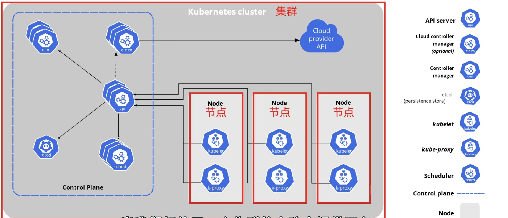

k8s和docker 不是同一个层面的东西，如果appliction 数据库容器都是运行在同一台计算机中，随着应用规模的增大，一台计算机无法满足需求，因此需要集群来提供服务。这个时候k8s就大显身手了。


### docker 
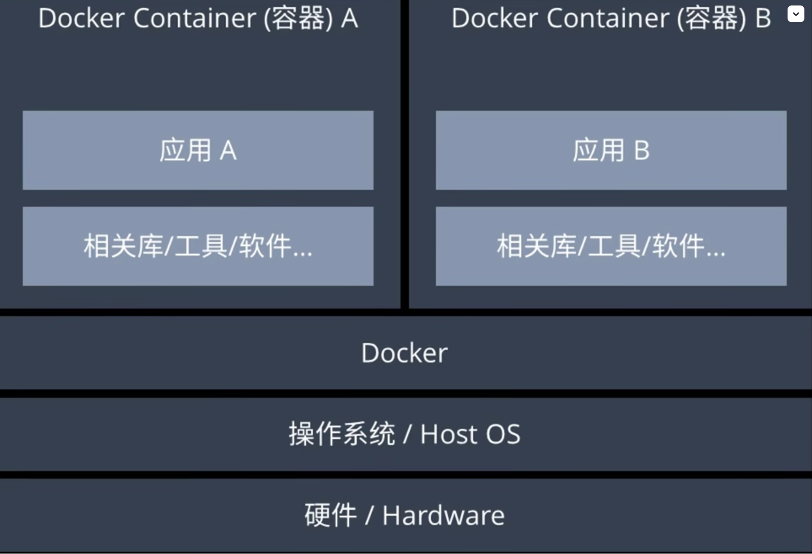

部署 compose:  `docker compose up -d`。 但是大型应用来说，自动进行灾难恢复和故障转移。

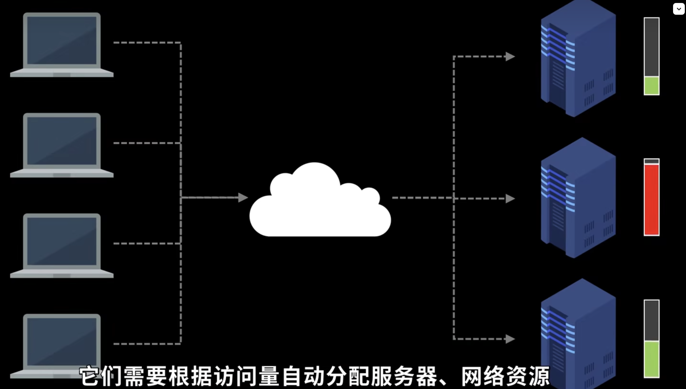
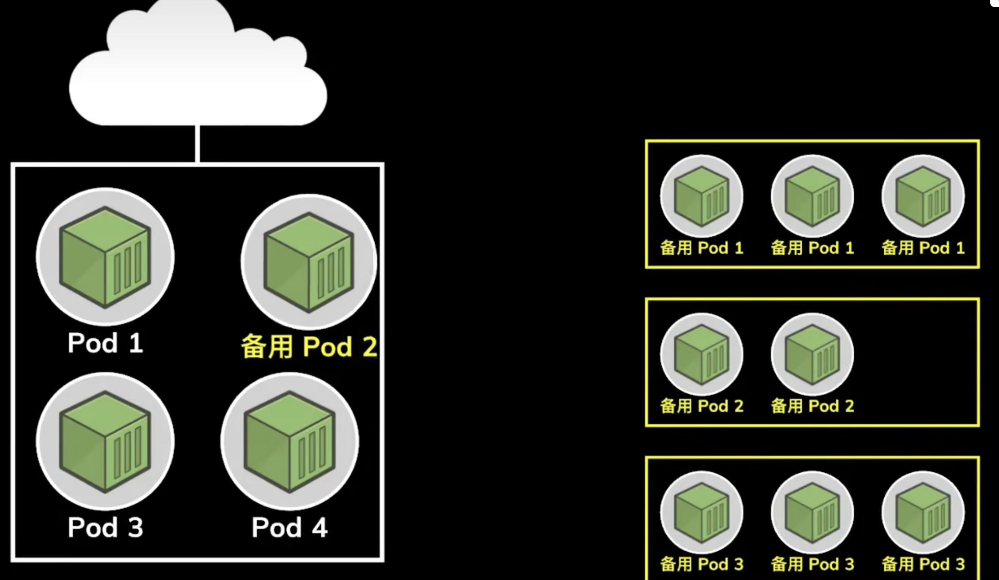

连同控制面板一起被叫做一个clustr 集群。集群代表了所有的k8s所管理的全部主机节点。如下图
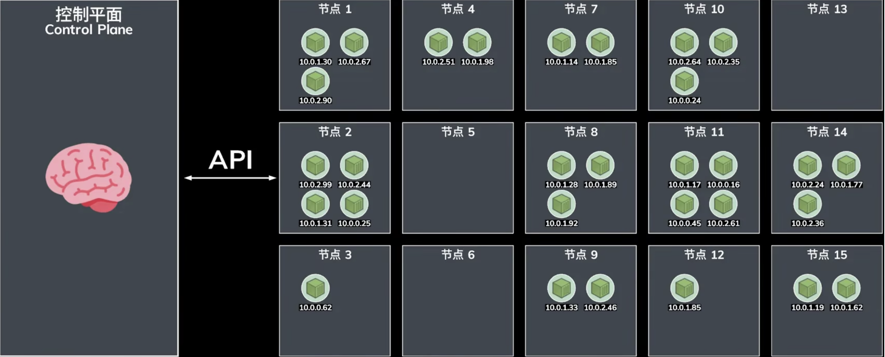


`k8s`主要是编排节点，但是每个节点都是由若干个`pod`构成。

`pod`是`k8s`中可以部署的最小执行单元。是一个或者多个容器的集合，其中运行了应用的某一部分，比如数据库，web服务器等，这么多个的`pod`需要相互协调才能做到负载均衡或者故障转移。这个就需要一个中心计算机管理，这个中心计算机就叫做`control plane 控制平面`，它使用专有的`api`和各个节点进行通信，检测节点。 比如`k8s`发现某个`pod`挂掉了，就会立刻启动预先在后台准备好的，随时待命的备用容器来替换它。这些容器叫做`Replica set 副本集合`。


### 配置 k8s

一个是自己租用服务器搭建环境，稍微复杂一点，另一种做法是使用预先配置好的云服务提供商。如下图
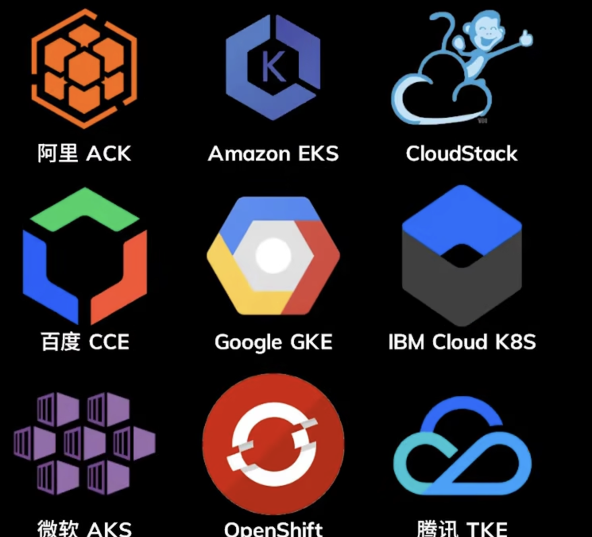

学习和测试，可以使用`minikube`在本地模拟一个`k8s`集群。


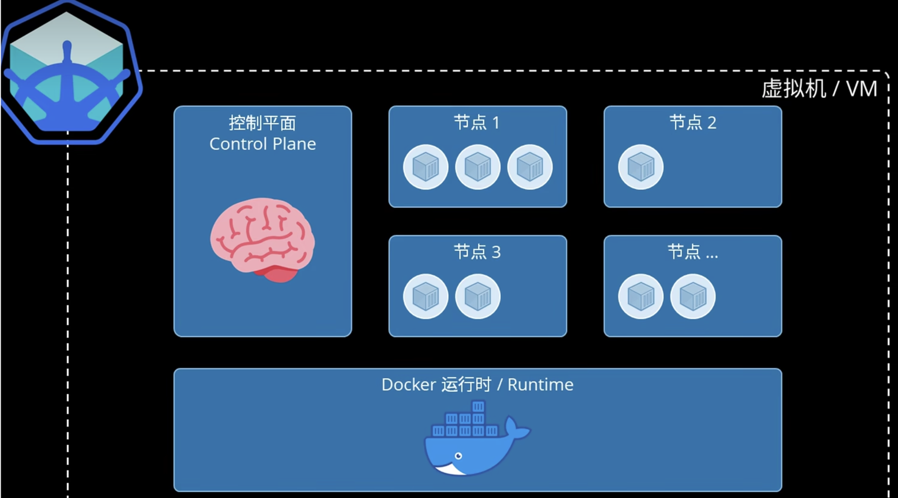

有了集群以后，进行部署应用，建立一个`deployment.yaml`文件，由哪些pod组成，运行的容器和网路配置。 和`dockfile`非常的类似

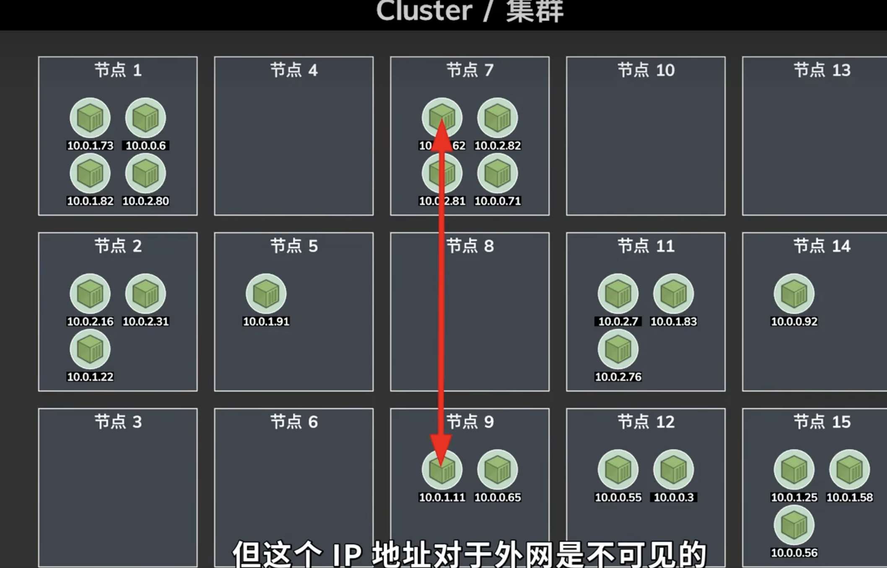

内部是可以随意通信的，但是这个`ip`外网是不可见的。如果需要通过外网进行访问`k8s`，需要使用到`Services`， 先说一个最基本的服务，`nodepot`。


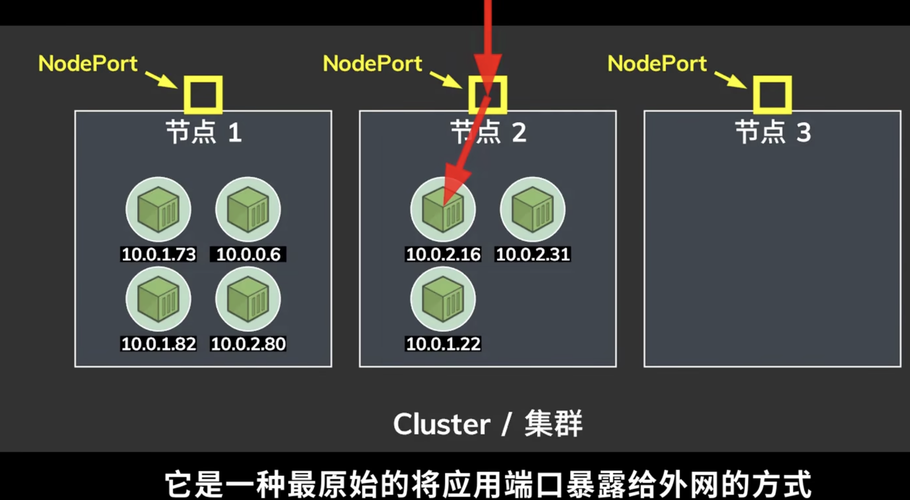


建立在`nodepot`之上，`k8s`还提供了`LoadBalancer`或者更加复杂的`Ingress`来实现负载均衡。


### 部署

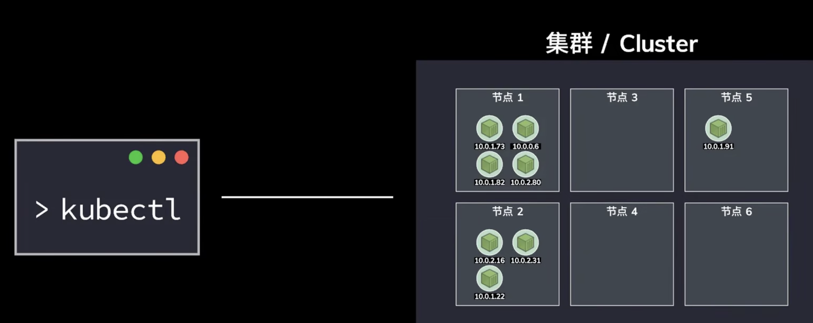


`kubectl` 是一个跨平台工具, 所有的`docker` 桌面版自带了这个命令，以及`k8s`。

```js
kubectl apply -f deployment.yaml  # 部署应用
kubectl get pods # 查看所有的pods
kubectl get services # 查看所有的服务
```


### 访问被部署的应用

如果是`minikube` 模拟的集群，因此需要单独开一个服务进行访问。

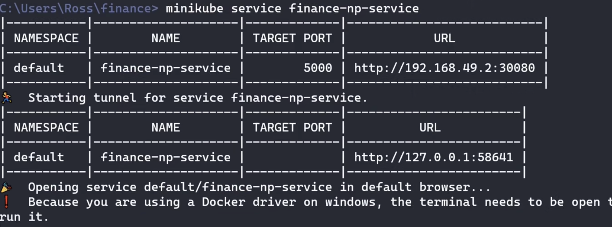

### 更新应用

修改配置文件，

```shell
kubectl apply -f deployment.yaml
```

`k8s`会在后台无缝的更新我们的应用。确保新版本运行起来以后再去销毁旧的版本。因此用户不会遇到服务停机的问题。

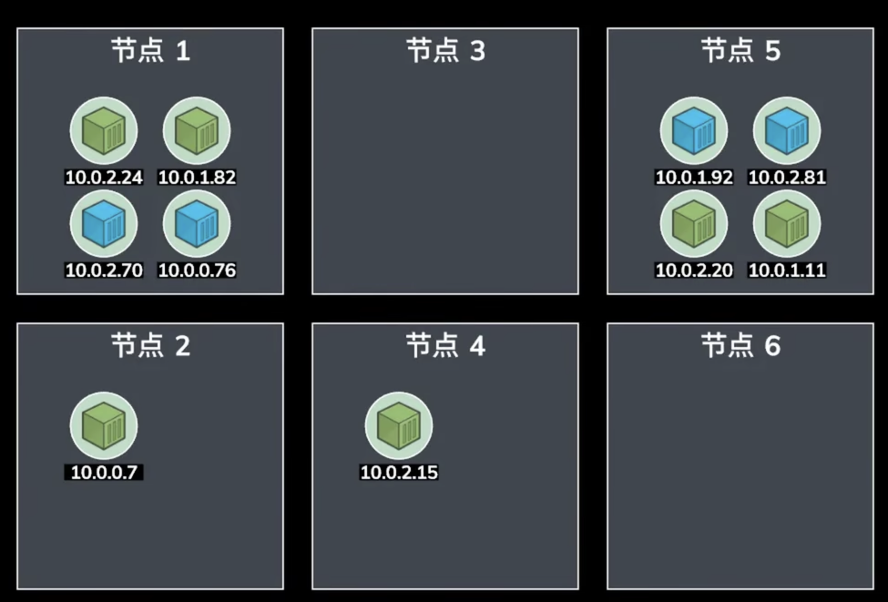


### 删除应用

```shell
kubectl delete -f deployment.yaml
```