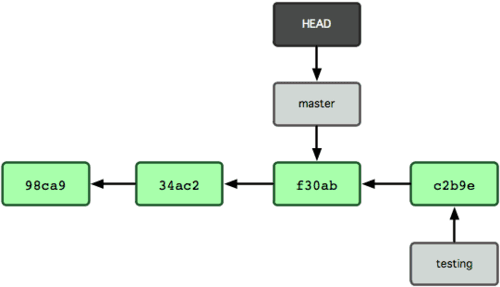
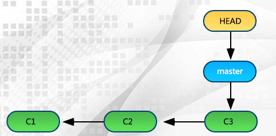

## git 相关知识


### 一. 查看基本配置信息

```
 git config –list  // 要检查已有的配置信息，可以使用
 git config --global user.name "John Doe"  // 也可以具体项目不适用global选项
 git config --global user.email johndoe@example.com

```

# ssh 相关
```
    cat ~/.ssh/id_rsa.pub  // 查看是否存在
    pbcopy < ~/.ssh/id_rsa.pub  // 复制
    ssh-keygen -t rsa -C "your.email@example.com" -b 4096  // 不存在就生成新的
    ssh-add ~/.ssh/id_rsa  // 告诉缓存
```


#  HEAD 是什么

> HEAD是一个指向你正在工作中的本地分支的*指针*，可以将 HEAD 想象为当前分支的别名。本质上仅仅是个指向 commit 对象的可变指针。

```shell
git log --oneline 
6d729cc (HEAD -> master, dev) c3
359e796 c2
3a10d19 c1
```
由上图可以看到`HEAD`指向`master`分支，`master`分支指向`sha-1`值为`93dd8e`（缩写）的`commit`提交。


`.git`目录中有一个为`HEAD`的文件，它记录着`HEAD`的内容，查看其中内容代码如下：

```shell
cat git ./.git/HEAD
>>ref: refs/heads/master
cat ./.git/refs/heads/master
>>6d729cc37c5fb2884524e45ec7df13fe005292ae
```
如果切换分支以后，就可以看到`HEAD`指向了新的分支上面。

> `Git 1.8.5`版本之后，`HEAD`有一个缩写形式`@`，`git reset @^`。


## git commit --amend
- 1.修改最后一次`commit`提交信息：最后一次提交有失误，应该是"c3"而不是"c"，修改如下：
```
git log --oneline
6d729cc (HEAD -> master, dev) c
359e796 c2
3a10d19 c1
git commit --amend -m'c3'
```
通过上述代码，可以将最后一次提交的描述信息修改为"c3"。

- 2: 修改最后一次提交，保持最后一个`commit`的信息。
```
git add test.text
git commit --amend --no-edit 
git commit --amend -m 'xxx' // 如果需要修改commit信息，采用该命令可以修改
```
这样就可以在最后一次提交中追加一个新的文件。--no-edit表示最后一次提交信息"c3"没必要修改，保持原样即可。

一般在使用该命令如果修改的上次相同的文件（也就是意味着`git pull`会产生合并信息），需要保持直线应该会配套`git rebase`，如果没有则直接`git push`。

## git diff 
- `git diff` // 开发和暂存的对比
- `git diff --stat`  // 统计哪些文件发生了改变
- `git diff --numstat` // 增加或者删除的行数数量非常的大,可以通过该命令查看
- `git diff HEAD`  // 显示工作版本(Working tree)和HEAD的差别
- `git diff abranch` // 查看当前分支和某分支的对比
 
# git rebase 
[彻底搞懂rebase](http://jartto.wang/2018/12/11/git-rebase/#) 
[rebase使用的注意事项](https://www.jianshu.com/p/4079284dd970)

## git grep
- `git grep test` // 检索当前分支内容中含有`test`的文件  `-n`是哪一行  `-c`统计出现了几次
- `git grep --name-only 222`  // 只显示文件名 

### 二. 版本库(repository)初始化
   
   ```shell
     mkdir mytest && cd mytest
     git init
     ls -ah  // 查看隐藏文件

     touch a.txt b.txt c.txt
     git add a.txt
     git add b.txt c.txt
     git commit -m "add 3 files."

     git push --set-upstream origin dev  // 推送本地dev分支到远程
   ```
> linux中`>`删除原来的文件重新写入，每次会生成一个新的文件内容（文件的日期也会自动更新）
> <br/>`>>`表示追加内容（会另起一行，文件的日期也会自动更新）。

```
 history > history.log      （history.log 文件 会自动生成）
 cat history.log 


 // curl
 curl http://www.codebelief.com > index.html

// 文件写入
 echo "当前日期是 `date`" >> hosts.log
```

 将history命令执行的结果保存到history.log文件中,我们可以看到我们`shell`界面操作过的所有命令到写入到了`history.log`文件中。


### 三. 查看版本库变动信息 。
```
  echo 'hello world'>>a.txt
  git status
  git diff a.txt  // 或者git diff HEAD 或者直接git diff
```
`git diff`此命令比较的是**工作目录**中当前文件和**暂存区域快照**之间的差异，也就是修改之后还没有暂存起来的变化内容。

`git diff --staged` 是看已经**暂存起来的文件**和**上次提交时的快照**之间的差异。

> 前置知识补充：

工作区修改  add到  -> 暂存区  然后,commit到 ->  版本库

HEAD 当前版本

HEAD^ 上一个版本

HEAD^^ 上上一个版本 。。。


### 三. 版本回退

  3.1 上面`a.txt` `b.txt`都发生了多次的修改

```
 git reset --hard HEAD^  // 把当前版本回退到上一个版本

 git reflog  // 查看历史提交命令，拿到版本号，方便返回到版本回退之前的版本中。

 git reset --hard 1094a
 git show --stat 查看某提提交的具体信息
 git checkout .  //放弃当前目录下的修改
 git checkout -- c.txt  // 放弃c.txt的文件的更改
 git checkout a.txt b.txt // 放弃这两个文件的更改
 git checkout <filename>  //放弃单个文件的修改

```
>3.2 注意三种模式
> 
 (1)： `reset --hard`：重置stage区和工作目录:也就是说暂存区的和工作区的在`commit`以后的内容会全部被清除掉。

 (2):  `soft` – 不会丢弃修改，而是将修改放到暂存区，后续继续修改，或者丢弃暂存区的修改就可以随意了。就仅仅将头指针恢复，已经add的缓存以及工作空间的所有东西都不变。 `git reset --soft HEAD~1` ：将最近一次提交` HEAD~1` 从本地仓库回退到暂存区.本人经过多次测试发现其实使用 commitid比较好。

 (3):`mixed` – 默认选项。缓存区和你指定的提交同步，但工作目录不受影响

3.3 撤销修改强大的`git checkout`

```
git checkout -- readme.txt //把readme.txt文件在工作区的修改全部撤销，就分两种情况，一种是已经提交了，一种是没有。

（1）: 暂存区时，想丢弃修改，分两步，第一步用命令git reset HEAD <file>
（2）：提交到了版本库，git reset --hard HEAD^
```
3.4 删除命令

```
rm hi.txt
git rm hi.txt
git commit -m'删除hi.txt文件'
```


### 三. 远程仓库

本地创建  `git init` 上传到`github` 需要的条件：

1:  git创建仓库的时候只填写name  选择public即可，不要生成不必要的其他的文件.

2: `git remote add origin git@github.com:michaelliao/learngit.git ` 如果有失败 可以 `git remote —h` 查看删除重新绑定一下url

3: 然后  git push -u origin master 由于第一次推送 要加上u


### 四. 分支管理


```
Git鼓励大量使用分支：
git branch -a // git branch -a //查看本地和远程的所有分支
git branch -r / /查看远程所有分支
git branch -vv // 查看本地分支远程的映射
git branch -d -r <branchname>    //删除远程分支，删除后还需推送到服务器
git branch -m <oldbranch> <newbranch>   //重命名本地分支
查看分支：git branch
创建分支：git branch <name>
切换分支：git checkout <name>
创建+切换分支：git checkout -b <name>
合并某分支到当前分支：git merge <name>
删除分支：git branch -d <name>
-D 没有合并的分支是删除不掉的 需要强行删除
git log --graph --pretty=oneline --abbrev-commit 查看分支情况
```

4.1 分支管理中`stash`
```
git stash
git stash list
git show stash@{0} # see the last stash
git stash pop      # 从git栈中获取到最近一次stash进去的内容，恢复工作区的内容。。获取之后，会删除栈中对应的stash。由于可能会stash多次，git使用栈管理，我们可以使用git stash list查看所有的stash
===git stash pop@{0} 有误这个句子测试
git stash apply stash@{1}
git stash drop stash@{5}
慎用！！！git stash clear
```

## 其他命令总结
```
git remote -v  // 查看本地添加了哪些远程地址
git remote add origin https://gitee.com/xx/x.git  // 推送到服务器时首先要添加远程地址的
git remote remove origin  // 删除本地指定的远程地址

```

## 常见错误
1:`![rejected] master -> master (non-fast-forward)  git push -f`


2: 美化输出`git lg`：`git config --global alias.lg "log --color --graph --pretty=format:'%Cred%h%Creset -%C(yellow)%d%Creset %s %Cgreen(%cr) %C(bold blue)<%an>%Creset' --abbrev-commit --"`

3: `git checkout -b dev origin/dev`  检出远程分支映射到本地分支同名

注意：如果`git pull`提示`no tracking information`，则说明本地分支和远程分支的链接关系没有创建，用命令`git branch --set-upstream-to <branch-name> origin/<branch-name>`。

eg:  pull 会失败 是因为没有指定本地分支与远程分支的关联：
      `git branch --set-upstream-to=origin/dev dev `

4: 简写
```
git config --global alias.co checkout    // git co
git config --global alias.ci commit        // git ci
git config --global alias.br branch       // git br
```
