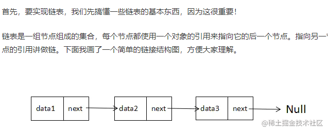
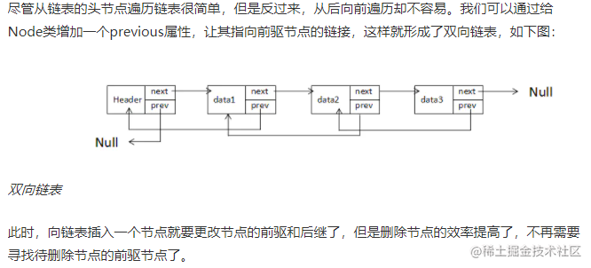
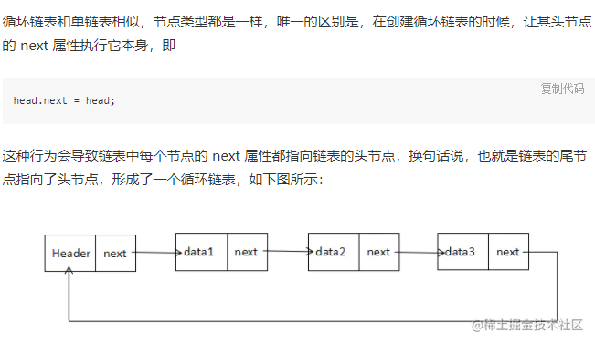

/**
 *  [Header,next] - [data,next] -> [data,next] -> null;
 */

简单是先单项链表的基本功能。

```js
function ListNode(x) {
  this.val = x;
  this.next = null;
}

function LList() {
  this.head = new ListNode("head"); // 也可以为null
  this.insert = insert;
  this.find = find;
  this.findLast = findLast;
  this.display = display;
  this.remove = remove;
  this.preNode = preNode;
}

// insert
function insert(oldnode, newVal) {
  let otarget = this.find(oldnode);

  // 兼容处理，如果不传入在哪里插入，就默认直接插入到结尾
  let newNode = new ListNode(newVal || oldnode);

  if (otarget) {
    newNode.next = otarget.next;
    otarget.next = newNode;
  }
  else{
     // 不存在，直接在尾部进行插入
    let getlast = this.findLast();
    getlast.next = newNode;
  }
}

// findLast
function findLast(){
  let curtent = this.head;
  while (curtent) {
    curtent = curtent.next;
    if(!curtent.next) return curtent;
  }
}

// find
function find(targetNode) {
  let curtent = this.head;
  while (curtent) {
    if (curtent.val == targetNode) return curtent;
    curtent = curtent.next;

  }
  return curtent;
}


// display
function display(){
   let curent = this.head;
   let res = [];
   while(curent.next){
     res.push(curent.next.val);
     curent = curent.next;
   }
   console.log('=======display======',res);
}

// remove
// 1: 先查询当前的节点的
// 2: 不查询当前的几点值，直接那上一个节点进行操作
function remove(rval){
  //  let exist = this.find(rval);
  //  if(exist){
  //    let preNode = this.preNode(rval);
  //    preNode.next = exist.next;
  //  }

   let preNode = this.preNode(rval);
   if( preNode.next ){
       preNode.next = preNode.next.next;
   }
}


// get pre Node
function preNode(tnode){
  let current = this.head;
  while(current.next){
     if(current.next.val == tnode) return current;
     current = current.next;
  }
  return current;
}

var n = new LList();
n.insert("head", 1);
n.insert(1, 2);
n.insert(2, 3);
n.insert(4);
n.insert(5);

n.display();
console.log(n);


//2
n.remove(4);
n.remove(3);
n.remove(2);


n.display();
console.log(n);
```

### 3.2 双向链表



涉及其他方法同单项链表
```JS
function insert(val, pnode) {
  let newNode = new Node(val);

  if (pnode) {
    let current = this.find(pnode);
    newNode.next = current.next;
    newNode.previous = current;
    current.next = newNode;
  } else {
    let lastnode = this.findLast();
    lastnode.next = newNode;
    newNode.previous = lastnode;
  }
}

// 双向链表的删除效率更高，也更加的简单，找到要删除的节点
// 修改获取 previous，修改next
function remove(rdata) {
  let current = this.find(rdata);
  console.log("remove", current);
  if (current.next) {
    let pnode = current.previous;
    pnode.next = current.next;
    current.next.previous = pnode;
  } else {
    // 是链表的最后一个
    // 书上面没有这一步，补全
    current.previous.next = null;
  }

  current.next = null;
  current.previous = null;
}
```

### 3.3 循环链表

