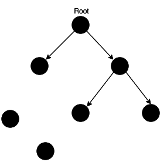
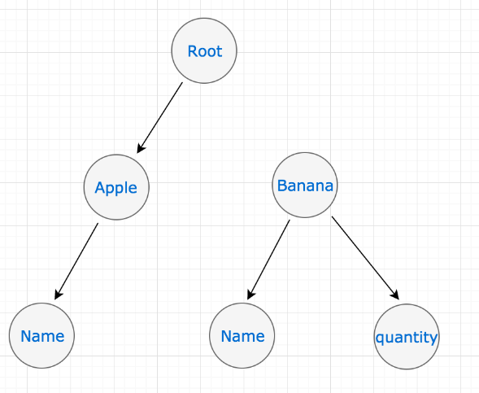
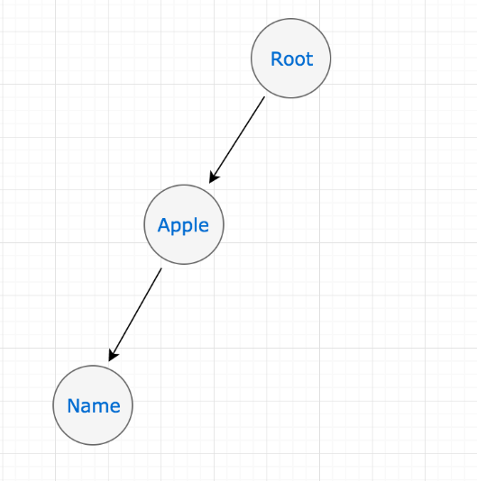

<!-- vscode-markdown-toc -->
* 1. [js的垃圾回收机制(Garbage Collection)](#js的垃圾回收机制(garbage-collection))
  * 1.1. [Mark-Sweep 标记清除](#mark-sweep-标记清除)
  * 1.2. [引用计数 Reference Counting](#引用计数-reference-counting)
  * 1.3. [闭包：状态保存](#闭包：状态保存)

<!-- vscode-markdown-toc-config
	numbering=true
	autoSave=true
	/vscode-markdown-toc-config -->
<!-- /vscode-markdown-toc -->

# 闭包(closure)和垃圾回收(GC)

[node相关的内存清除](../../node/node%20%26%26%20v8/index.md)

##  1. <a name='js的垃圾回收机制(garbage-collection)'></a>js的垃圾回收机制(Garbage Collection)

如果引用或引用链可以从根访问任何其他值，则认为该值是可访问的，这些值不需要被清理.


左下角的两个值没有没引用到，这两个值就是需要被清理的，`JavaScript` 引擎中有一个后台进程称为垃圾回收器，它监视所有对象，并删除那些不可访问的对象。

垃圾回收是引擎层面实现的，主要了解V8：标记清除，引用计数。

###  1.1. <a name='mark-sweep-标记清除'></a>Mark-Sweep 标记清除

分为 `标记` 和 `清除` 两个阶段.

引擎在执行 `GC`（使用标记清除算法）时，需要从出发点去遍历内存中所有的对象去打标记，而这个出发点有很多，我们称之为一组 `根` 对象，而所谓的根对象，其实在浏览器环境中包括又不止于 全局`Window`对象、文档`DOM`树

mark-sweep 分为两个阶段：
- 标记阶段：从根集合出发，将所有活动对象及其子对象打上标记
- 清除阶段：遍历堆，将非活动对象（未打上标记）的连接到空闲链表上

make
<div align="center">    
 
</div>

swip

<div align="center">    
 
</div>


###  1.2. <a name='引用计数-reference-counting'></a>引用计数 Reference Counting

引用计数（Reference Counting），这其实是早先的一种垃圾回收算法，它把 对象是否不再需要 简化定义为 对象有没有其他对象引用到它，如果没有引用指向该对象（零引用），对象将被垃圾回收机制回收，目前很少使用这种算法了，因为它的问题很多

```js
let a = new Object() 	// 此对象的引用计数为 1（a引用）
let b = a 		// 此对象的引用计数是 2（a,b引用）
a = null  		// 此对象的引用计数为 1（b引用）
b = null 	 	// 此对象的引用计数为 0（无引用）
...			// GC 回收此对象
```
引用计数的缺点想必大家也都很明朗了，首先它需要一个计数器，而此计数器需要占很大的位置，因为我们也不知道被引用数量的上限，还有就是无法解决循环引用无法回收的问题，这也是最严重。因此目前基本都不采用这类方法。


> v8 对垃圾回收的优化在node垃圾回收中有提到。

###  1.3. <a name='闭包：状态保存'></a>闭包：状态保存
函数执行时会形成一个私有作用域，通常情况下当函数执行完成，栈内存会自动释放（垃圾回收）

但是如果函数执行完成，当前私有作用域(栈内存)中的某一部分内容被内存以外的其它东西(变量/元素的事件)占用了，那么当前的栈内存就不会释放掉，也就形成了不销毁的私有作用域(里面的私有变量也不会销毁)

例如：

```
function createIncrementor(start) {
  return function () {
    return start++;
  };
}

var inc = createIncrementor(5);

inc() // 5
inc() // 6
inc() // 7

```
通过闭包，start的状态被保留了，闭包（上例的inc）用到了外层变量（start），导致外层函数（createIncrementor）不能从内存释放。

只要闭包没有被垃圾回收机制清除，外层函数提供的运行环境也不会被清除，它的内部变量就始终保存着当前值，供闭包读取，所以闭包inc使得函数createIncrementor的内部环境，一直存在
