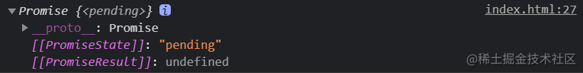
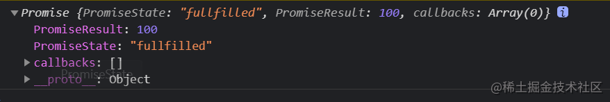
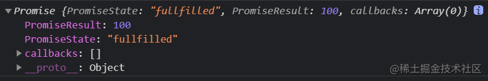
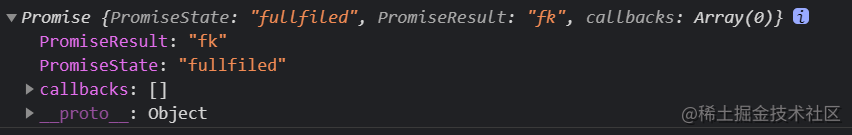

使用 `promise`许久，但是对于  `Promise/A+` 规范和深入了解还是比较少，抽空花点时间整理下，以便老年健忘症。因为我见过很多所谓的资深开发专家写的代码中，`promise` 使用有瑕疵。


## 1：提出几个问题
#### 1： 指定多个回调能否全部执行？

```js
    var p = new Promise(function(resolve,reject){
        resolve(100)
    })
    
     p.then(function(res){
         console.log('11', res);
     })

     p.then(function(res){
         console.log('22', res);
     })
```
可以全部执行，打印结果都是 100。

#### 2：改变promise状态与指定回调谁先执行，谁后执行？

```js
    // 场景1: 是先改变promise的状态呢还是先执行then
    var p = new Promise(function(resolve,reject){
        resolve(100)
    })
    
     p.then(function(res){
         console.log(res);
     })
     
     // 场景2
    var p = new Promise(function(resolve,reject){
        setTimeout(()=>{
           resolve(100)
        },2000)
    })
    
     p.then(function(res){
         console.log(res);
     })
    
```

- 场景1： 同步调用先改状态 `resolve` 再指定回掉函数`then`。
- 场景2： 如果`reolve` 是异步,则`then`先指定回掉函数，再改变状态。  
     
#### 3：then方法返回结果由什么决定？

```js
    var p = new Promise(function(resolve,reject){
        resolve(100)
    })

    // res的状态由什么决定？
    var res = p.then(function(res){
        // 1: 抛出异常，res状态就是一个失败  状态是 fullfiled 结果是：error
        // throw 'error';

        // 2: 返回结果不是一个promise类,则状态变为成功，结果是100 状态是 fullfulled
        // return 100
        
        // 3: 返回结果是一个promise的话，这个promise就决定了res的状态: 结果是200 状态是fullfulled   
        return new Promose((resolve,reject)=>{
            resolve(2000)
        })
    })
    
```
**结论：`then` 返回的是`promise `状态由当前指定回掉函数的返回值来决定，这一点非常重要。**

#### 4：链式回掉打印结果？

```js
    var p = new Promise(function(resolve,reject){
        setTimeout(()=>{
            resolve(100);
        },2000)
    });

    p.then((result)=>{
        return new Promise((resolve,reject)=>{
            resolve(200)
        })
    })
    .then((res)=>{
        console.log(res) // 200
    })
    .then((res)=>{
        console.log(res); // undefined
    })
```
最后一个当前的指定的回掉函数是`undefined`是因为为其指定的回掉函数本身是没有返回值的。

#### 5： 如何组织一个链式调用继续执行呢？

```js
var p = new Promise(function(resolve,reject){
   setTimeout(()=>{
        resolve(100)
   },2000)
})

p.then(function(res){
   console.log('打印1', res);
   return new Promise(()=>{}) 
})
.then(function(res){
   console.log('打印2', res);
})
```
指定一个 `pedding` 状态`promise`，可以阻止继续链式调用，如果不增加这个，那么执行结果是 `100 和 undefined`。


**好了，劝返分割线，如果上面的几个问题都很清晰，以下内容就是浪费时间了哈。
**

---------------------------------------------------------------------------

## 2： 手写 promise 前的准备

 特点：**状态不可逆转，支持链式调用**
    


从上图可以看出`Promise`实例对象属性:

   1： [PromiseState]： 异步任务的三个状态
   - `pedding` 
   - `resolved / fulfilled` 
   - ` rejected / fullfiled `
     
  2：[PromiseResult]: 保存异步任务失败的结果
      
**改变promise状态仅且只有三种方法： `resolve`, `reject`和 抛出异常。**

## 3：开始手写
#### 3.1 resolve 和 reject 基本类搭建

`executor`是一个`promise`被实例化以后立即就会执行的一个函数，因此先搭出基本框架。
为了简单点直接使用`es6`的语法,大同小异。

```js
class Promise {
  constructor(executor) {
  
    // promise的状态
    this.PromiseState = "pedding";
    
    // promise的结果
    this.PromiseResult = undefined;
    
    // 回掉函数的容器 后续用到
    this.callbacks = []; 

    // 抛出异常改变promise的状态
    try {
      executor(this.resolve.bind(this), this.reject.bind(this));
    } catch (e) {
      this.reject(e);
    }
  }
  
  // 1：修改状态: 不可逆，执行从 pedding-> 成功/失败 
  // 2：设置结果值
  resolve(value) {
    if (this.PromiseState === "pedding") {
      this.PromiseState = "fullfilled";
      this.PromiseResult = value;
    }
  }
  
  reject(error) {
    if (this.PromiseState === "pedding") {
      this.PromiseState = "fullfiled";
      this.PromiseResult = error;
    }
  }
  
}  
```

上面封装了三种修改`promise`状态封装，包括报出异常出发 `reject`。

验证一下，发现没问题，三个场景都能覆盖到

```js
 var p = new Promise(function(resolve,reject){

      resolve(100)；
      
      // reject('233')
      
      // throw 'errr'.
 })
```



#### 3.2 then 方法的封装和异步promise
这个部分解决三个问题：
- 异步`promise`
- `then`方法封装和多次调用：
   上面理论问题部分也说过，异步是先执行`then`注册回掉函数，再改变状态的。利用这个特性，所以我们添加一个队列来控制多次注册的回调函数。
- 和原生的保持执行顺序一致，添加成`微任务`。

`reject` 代码几乎和 `resolve` 一样，就不在重复。

```js
  then(onFullfilled, onFullFiled) {
    //1,2 if 对应的是同步
    if (this.PromiseState === "fullfilled") {
      onFullfilled(this.PromiseResult);
    } else if (this.PromiseState === "fullfiled") {
      onFullFiled(this.PromiseResult);
    }

    // 因为构造函数里面如果是异步，是会先执行到这里的
    if (this.PromiseState === "pedding") {
      // 保存回到函数
      this.callbacks.push({ onFullfilled, onFullFiled });
    }
  }
  
  // 1：修改状态
  // 2：设置结果值
  // 异步：改变状态以后才开始执行回掉函数 queueMicrotask
   resolve(value) {
      if (this.PromiseState === "pedding") {
        this.PromiseState = "fullfilled";
        this.PromiseResult = value;
      }

      if (this.callbacks.length) {
         queueMicrotask(()=>{
           this.callbacks.forEach((resolvefn) => {
             resolvefn.onFullfilled(value);
           });
         })
      }
  }
```
`queueMicrotask`是注册一个微任务，是目前浏览器端为数不多可以直接注册微任务的函数。也可以使用其他方法，可能有人说这个api不兼容等，当然我们重写肯定希望所有能力一模一样，但是实际生产中不可能拿这个封装`Promise`来调。

验证：

```js
     
     // 链式调用没问题 异步注册没问题
    var p = new Promise(function(resolve,reject){
       setTimeout(()=>{
         resolve(1000)
       },2000)
    })

    p.then(function(res){
        console.log(res);
    });

    p.then(function(res){
        console.log(res);
    });
    
    
    //  执行顺讯和原生一样，也是微任务也没问题
    setTimeout(()=>{
        console.log('定时器')
    })
    var p = new Promise(function(resolve,reject){
        console.log(22)        
        resolve(1000)
    })

    p.then(function(res){
        console.log(res);
    });
    
    console.log(1)

    p.then(function(res){
        console.log(res);
    });
    
```




## 面试劝返分割线
如果是为了面试看这个文章，这里就可以返回了，只要你能在面试中点出这些关键点，一般手写`promise`是认为没问题的，后续会实现其他的`api`和更多一些细节的东西。


#### 3.3 then的返回值是一个promise

##### 3.3.1 then 函数再同步情况下增加返回值

为什么这么写，请参考上面问题部分理论。三种场景进行验证：

```js
 then(onFullfilled, onFullFiled) {
    return new Promise((resolve, reject) => {
      // 1,2 if 对应的是同步
      if (this.PromiseState === "fullfilled") {
        try {
          var result = onFullfilled(this.PromiseResult);
          if (result instanceof Promise) {
            result.then(
              (s) => {
                resolve(s);
              },
              (e) => {
                reject(e);
              }
            );
          } else {
            resolve(result);
          }
        } catch (e) {
          reject(e);
        }
      } else if (this.PromiseState === "fullfiled") {
        onFullFiled(this.PromiseResult);
      }

      // 因为构造函数里面如果是异步，是会先执行到这里的
      if (this.PromiseState === "pedding") {
        // 保存回到函数
        this.callbacks.push({ onFullfilled, onFullFiled });
      }
    });
  }
```
验证：

```js
var p = new Promise(function(resolve,reject){
    resolve(1000)
})

var res = p.then(function(data){
    // console.log(data);
    // throw 'error'
    return new Promise((resolve,reject)=>{
         reject('fk')
    })
    return 100;
});

console.log(res)
```
三种返回值场景验证通过。




##### 3.2.2 then 函数是异步的情况

```js
then(onFullfilled, onFullFiled) {
    return new Promise((resolve, reject) => {
      // 1,2 if 对应的是同步
      if (this.PromiseState === "fullfilled") {
         
         .... 同上面
         
      // 因为构造函数里面如果是异步，是会先执行到这里的
      if (this.PromiseState === "pedding") {
        // 保存回到函数
        this.callbacks.push({
          // 只要resolve状态一发生改变，这个回调函数就会自动执行，上面foreach
          onFullfilled: (res) => {
            try {
              var result = onFullfilled(res);  // res == this.PromiseResult
              if (result instanceof Promise) {
                result.then(
                  (s) => {
                    resolve(s);
                  },
                  (e) => {
                    reject(e);
                  }
                );
              } else {
                resolve(result);
              }
            } catch (e) {
              reject(e);
            }
          },
          onFullFiled,
        });
      }
    });
  }
```

变化的部分是 `this.callbacks.push`把从直接传递改成校验返回值，因为`then`的回调需要和上面同步写法一样，校验三种场景，验证上面三种场景，验证通过。

##### 3.3 封装
上面两部分代码完全其实是再做一件事情，简单封装一下：


```js
 /***
   * 返回结果是一个promise, 根据执行函数的结果来修改返回的promise状态，这一点非常重要。没有就是undefined
   */
  then(onFullfilled, onFullFiled) {
    return new Mypromise((resolve, reject) => {
      function callbacks(handleType) {
        try {
          let res = handleType(this.PromiseResult); // 获取then回掉函数的执行结果
          if (res instanceof Promise) {
            // 如果是promise 类型 肯定有then方法
            res.then(
              (suc) => {
                resolve(suc);
              },
              (e) => {
                reject(e);
              }
            );
          } else {
            // 结果对象状态为成功
            resolve(res);
          }
        } catch (e) {
          // 接受 throw 等抛出来异常错误，修改状态
          reject(e);
        }
      }

      //1,2 if 对应的是同步
      if (this.PromiseState === "fullfilled") {
        // fullfilled  resolved
        setTimeout(() => {
          callbacks.call(this, onFullfilled);
        });
      } else if (this.PromiseState === "fullfiled") {
        // fullfiled rejected
        setTimeout(() => {
          callbacks.call(this, onFullFiled);
        });
      }
      // 对应的是异步
      else if (this.PromiseState === "pedding") {
        this.callbacks.push({
          onFullfilled: () => {
            // resolve 执行完了这里肯定会执行  执行成功的回调函数
            callbacks.call(this, onFullfilled);
          },
          onFullFiled: () => {
            callbacks.call(this, onFullFiled);
          },
        });
      }
    });
  }
```


##### 3.4 catch 和值传递以及异常穿透捕获

```js
 catch(onRejected) {
    return this.then(undefined, onRejected);
 }

 then(onFullfilled, onFullFiled) {
 // 多个then 调用的时候，值传递，前面的then 可以不写监听函数，后面的也可以捕获到，默认一个监听函数
    if (typeof onFullfilled !== "function") {
      onFullfilled = (result) => result;
    }

    // catch then 不写第二个监听函数的时候，默认一个函数来通过
    if (typeof onFullFiled !== "function") {
      onFullFiled = (e) => {
        throw e;
      };
    }
    ....
 }   
```

##### 3.5 all 方法

```js
// 返回的也是promise 都成功则成功  有失败则所有失败 一定是按照顺寻进行返回的
  static all(prolist) {
    return new this((resolve, reject) => {
      let count = 0;
      let res = [];

      // 整个for 循环是一个异步的，但是异步的有队列进行保证，因此返回值还是会按照顺寻进行返回的
      for (let i = 0; i < prolist.length; i++) {
        const element = prolist[i];
        element.then(
          (v) => {
            // 得知每个prolist 状态是成功的，
            count++;
            res[i] = v;
            if (count == prolist.length) resolve(res);
          },
          (e) => {
            reject(e);
          }
        );
      }
    });
  }
```
##### 3.6 静态reolve 和 reject 

```js
 // 静态方法resolve 一定要记住 返回的就是promise
  static resolve(data) {
    // static 里面的this 指向的是类
    return new this((resolve, reject) => {
      if (data instanceof Promise) {
        data.then(
          (suc) => {
            resolve(suc);
          },
          (e) => {
            reject(e);
          }
        );
      } else {
        resolve(data);
      }
    });
  }

  static reject(data) {
    // static 里面的this 指向的是类
    return new this((resolve, reject) => {
      if (data instanceof Promise) {
        data.then(
          (suc) => {
            resolve(suc);
          },
          (e) => {
            reject(e);
          }
        );
      } else {
        reject(data);
      }
    });
  }
```

##### 3.7 race

```js

  // 那个最快就返回那个
  static race(prolist) {
    return new this((resolve, reject) => {
      for (let i = 0; i < prolist.length; i++) {
        const element = prolist[i];
        element.then(
          (v) => {
            resolve(v);
          },
          (e) => {
            reject(e);
          }
        );
      }
    });
  }
```


## 4：结语

`promise`的设计还是很值得学习和研究的，不单单是为了面试，如果是在面试能写出上面的所有代码，肯定是值得尊敬和学习的。


