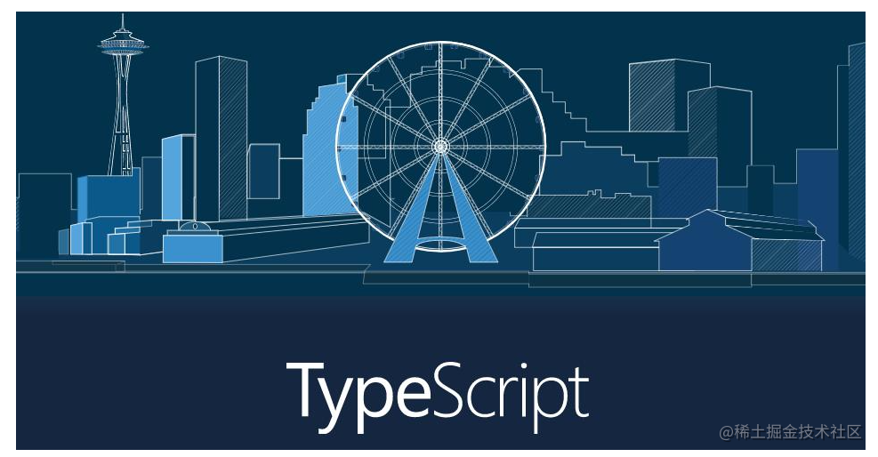

<!-- vscode-markdown-toc -->
* 1. [安装](#安装)
* 2. [核心功能](#核心功能)
  * 2.1. [ 数据类型](#-数据类型)
  * 2.2. [函数](#函数)
  * 2.3. [类](#类)
  * 2.4. [接口](#接口)
  * 2.5. [泛型](#泛型)
  * 2.6. [案例：实现一个mysql和mondb等业务层的封装](#案例：实现一个mysql和mondb等业务层的封装)
  * 2.7. [命名空间](#命名空间)
  * 2.8. [装饰器](#装饰器)
    * 2.8.1. [装饰器工厂](#装饰器工厂)
    * 2.8.2. [方法装饰器](#方法装饰器)
    * 2.8.3. [属性和参数装饰器](#属性和参数装饰器)
    * 2.8.4. [元数据](#元数据)
  * 2.9. [symbol](#symbol)

<!-- vscode-markdown-toc-config
	numbering=true
	autoSave=true
	/vscode-markdown-toc-config -->
<!-- /vscode-markdown-toc -->


记录和学习下`ts`的基本使用，单纯看文档比较枯燥，**主张复杂的东西简单学，简单的东西深入学。**

##  1. <a name='安装'></a>安装

```js
npm install -g typescript
yarn global add typescrpt

mkdir tsproject && cd tsproject && touch index.ts >> echo "console.log(1)"

// 手动编译这个文件
tsc index.ts

// 初始化ts项目配置文件
tsc --init

// 修改 tsconfig.json
 "outDir": "./src", 

// 或vscode 终端 > 运行任务 > ts > tsconfig.json
tsc -w 
```

`ts` 的核心功能就是四个字：**类型约束**。

##  2. <a name='核心功能'></a>核心功能
###  2.1. <a name='-数据类型'></a> 数据类型

原始数据类型包括：**布尔值、数值、字符串、null、undefined** 以及 `ES6` 中的新类型 `Symbol` 和 `ES10` 中的新类型 `BigInt`。

```ts
// 布尔
var flag: Boolean = true;

// number
var num1: Number = 100;
var num2: Number = 12.3;

// string
var str1: String = "anikin";

let myFavoriteNumber = 'seven';
myFavoriteNumber = 7;  // 会报错，类型推论，等价于let myFavoriteNumber: string = 'seven';

// array
var arr1: number[] = [1, 2, 3, 4];
var arr2: Array<number> = [1, 2, 3, 4]; // 泛型
var arr3: [string, number] = ["anikin", 100]; // 元组类型

// enum 枚举类型：将变量的值一一列举出来，变量的取值只限于这些范围
enum Flag {
  default, // 默认值是index或者是上一个值+1  0
  success = 1,
  error = -1,
  last, // 0
}
var f1: Flag = Flag.success;
// console.log(Flag.default, Flag.last);

enum Days {Sun, Mon, Tue, Wed, Thu, Fri, Sat};
// Days['Sun'] = 0;

// any 用处
var box:any = document.getElementById("app");
box.style.color = "red";

// undefined || null
var usrinfo: undefined;
var num3: number | undefined; // 联合类型
num3 = 100;

// 类型断言：类型断言好比其它语言里的类型转换，但是不进行特殊的数据检查和解构。 
// 它没有运行时的影响，只是在编译阶段起作用。 ts 会假设你，已经进行了必须的检查。
let getName: string = "anikin";
let getStringLength: number = (getName as string).length; // 比较常见的写法
let getStringLength2: number = (<string>getName).length;

```

###  2.2. <a name='函数'></a>函数

```ts
// 函数声明（Function Declaration）
function show(): void {} // 无返回值
function conso(name: String, age: number): string {
  return `${name}===${age}`;
}

// 函数表达式（Function Expression）
const myAdd2 = (x: number, y: number) => x + y;

// 匿名
var getInfo = function (): void {};

// 可选参数 age 是可选参数
// 可选必须放到最后面
// name 是默认参数, 默认参数也是可选参数，如果不是最后一位的还需传参
function conso2(name: String = "zhangsan", age?: number): string {
  return `${name}===${age}`;
}


// 实现函数求和  ...rest:number[] 展开的数组
// 剩余参数 init = 1
function add(initValue: number, ...rest: number[]): number {
  var res = initValue;
  for (let index = 0; index < rest.length; index++) {
    res += rest[index];
  }
  return res;
}
//  add(1,2,3,4,5) 

// 重载允许一个函数接受不同数量或类型的参数时，作出不同的处理。
function reverse(x: number): number;
function reverse(x: string): string;
function reverse(x: number | string): number | string | void {
    if (typeof x === 'number') {
        return Number(x.toString().split('').reverse().join(''));
    } else if (typeof x === 'string') {
        return x.split('').reverse().join('');
    }
}

// 泛型重载
// 重载签名实现这个函数的重载
function getLen<T extends String>(str:T): number;
function getLen<T>(str:T[]): number;
function getLen<T>(str:T[]):number{
    return str.length;
}
console.log(getLen("aaaa"));
console.log(getLen([1,2,3]));
```
###  2.3. <a name='类'></a>类

修饰符：
- `public` 修饰的属性或方法是公有的，可以在任何地方被访问到，属性和方法默认。
- `private` 修饰的属性或方法是私有的，不能在声明它的类的外部访问。
- `protected` 修饰的属性或方法是受保护的，它和 `private` 类似，区别是它在子类中也是允许被访问的

```ts
class Person {
  // 默认是public
  public name: string;
  static ajaxName: string = "ajaxNameSpace"; // 静态属性

  constructor(n: string) {
    this.name = n;
  }

  // 静态方法可以访问静态属性
  static ajax() {
    return Person.ajaxName;
  }

  run(): void {
    console.log(this.name);
  }

  // 多态： 父级定义接口但是不去实现，而是由集成它的类去实现这个功能
  // 每一个子类都有不同的表现
  size(): number {
    return 100;
  }
}

class Child extends Person {
  private age: number = 100;
  readonly school = '北大附小'; // 只读属性
  // super 相当于调用父的构造函数
  // 初始化父类
  constructor(n: string) {
    super(n);
  }

  protected work(): string {
    return "work";
  }

  run(): void {
    console.log("child run" + this.work());
  }
}

var c1 = new Child("zhangsan");

// ts 层面无法访问，但是最终都是转义成为es5的话都是可以运行的,记住：ts只是类型约束
// console.log(c1.work());
// console.log(c1.age);


// 抽象类一般是用来定义标准的
abstract class National {
  // 抽象方法只能出现在抽象类里面，抽象类只能被继承实现，无法直接实例化
  abstract language(): any;
}

class China extends National {
  public lan: string = "汉语";
  language() {
    return this.lan;
  }
}

var ch = new China();

```

构造签名和使用泛型创建对象： 

```ts
// ts 中的构造签名
interface Point{
    x: number;
    y: number;
}

interface PointConstructor{
    new(x: number, y: number): Point;
}

class PointClass implements Point {
    readonly x: number;
    readonly y: number;
    constructor(x: number, y: number){
        this.x = x;
        this.y = y;
    } 
}

function newPoint(pointConstructor: PointConstructor,x: number,y: number):Point{
    return new pointConstructor(x,y);
}
const point:Point = newPoint(PointClass, 1,2)
```

或者使用泛型实现：
```ts
class FirstClass {
    id: number | undefined;
  }
  
  class SecondClass {
    name: string | undefined;
  }
  
class GenericCreator<T> {
    create<T>(c: {new ():T}):T{
        return new c();
    }
}

const g1 = new GenericCreator<FirstClass>();
const f1:FirstClass = g1.create(FirstClass);
```

###  2.4. <a name='接口'></a>接口

**接口**：行为和动作的规范，对批量的方法进行约束。

**和抽象类的区别：**

- 抽象类里面可以有方法的实现，但是接口完全都是抽象的，不存在方法的实现；
- 子类只能继承一个抽象类，而接口可以被多个实现；
- 抽象方法可以是`public`，`protected`，但是接口只能是`public`，默认的；
- 抽象类可以有构造器，而接口不能有构造器

`ts`里面有两类自定义的数据类型：一类是**接口**，另外一个是**类型别名**。

**类型别名** 是可以给一个类型起一个新的名字，通常是符合类型等。

```ts

// 设置了 Methods 这个类型，主要用来限制变量的取值范围
type Methods = "GET" | "POST" | "PUT" | "DELETE";
let methods: Methods;  

// 设置了需要mytype 这一种类型
type mytype = string | number | boolean;
var str:mytype = 100;


// 设置了一个复合接口类型
interface User2 {
  name: string;
}
type Students = {
  age: number;
};

type allStudent = User2 | Students; // 联合类型
var a1: allStudent = { name: 'zhangsan' };
var a2: allStudent = { age: 12 }
var a3: allStudent = { name:'zhaosi', age: 12};
```

**接口案例：**

```ts
// 属性接口 约束json
interface FullName {
  firstName: string;
  secondName: string;
  age?: number;  // 可选属性
}

interface ajaxConfig {
  url: string;
  dataType: string;
  type: string;
  data?: string;
}

// 约束函数类型  返回的类型也是 string
interface encrypt {
  (key: string, value: number): string;
}

// 类的类型接口  跟抽象类很像
interface Animal {
  name: string;
  eat(n: string): void;
}

// 接口的继承实现
interface Cattype extends Animal {
  color: string;
  say(): string;
}

// 
interface Light {
    lightOn(): void;
    lightOff(): void;
}


// 接口扩展：接口可以继承接口，很好理解，耦合多个接口到实现一个聚合接口
interface Alarm {
    alert(): void;
}

interface LightableAlarm extends Alarm {
    lightOn(): void;
    lightOff(): void;
}

// 不使用接口的函数
function printLabel(labelInfo: { labels: string }): void {
  console.log(labelInfo);
}

// 使用接口的函数
function printLabel2(name: FullName): void {
  console.log("=====printLabel2", name);
}


function ajax(config: ajaxConfig) {
  var xhr = new XMLHttpRequest();
  xhr.open(config.type, config.url);
  xhr.send(config.data);
  xhr.onload = function (res) {
    console.log(res);
  };
}


// 函数类型的接口
// 基于encrypt这个接口，实现加密的函数类型接口
var md5: encrypt = function (key: string, value: number): string {
  return window.btoa(key) + value;
};


// 类实现2个接口
class Dog implements Animal,Light {
  public name: string = "little kitty";
  eat(food: string): void {
    console.log(this.name + "eat=", food);
  }
   lightOn() {
      console.log('Car light on');
   }
   lightOff() {
      console.log('Car light off');
   }
}

```


###  2.5. <a name='泛型'></a>泛型

**泛型（Generics）** 是指在定义函数、接口或类的时候，不预先指定具体的类型，而在使用的时候再指定类型的一种特性。

**解决类 接口 方法的复用性 以及对不特定数据类型的支持。**

```ts
// 1: 泛型函数

// 同时返回string 和 number 类型 支持多种类型的函数，传入什么类型 返回什么类型
// <T> 表示泛型
// 泛型和any 相比：有类型校验

function getData<T>(value: T): T {
  return value;
}
// getData<number>(100);


function getLength<T>(arr: T[]): T[] {
  console.log(arr.length); // must be exist;
  return arr;
}
// getLength<number>([1, 2]);

// 1: 泛型类

// 实例化的时候传入的这个类型来决定的
class MinClass<T> {
  list: T[] = [];
  add(value: T): void {
    this.list.push(value);
  }
  min(): T {
    return this.list.sort()[0];
  }
}

// var m1 = new MinClass<number>();
// m1.add(10);
// m1.add(20);
// m1.add(2);
// m1.add(21);
// m1.add(1);
// m1.add(9);
// console.log(m1.min());

// 3: 泛型接口
interface ConfigData {
  // (value: string, key: number): string;
  <T>(value: T): T;
}
var gd: ConfigData = function <T>(value: T): T {
  return value;
};

interface GenericIdentityFn<T> {
  (arg: T): T;
}
var myIdentity: GenericIdentityFn<number> = function <T>(arg: T): T {
  return arg;
};

/**
 * 实现案例： 把类当做参数约束类型，这样我们就能清楚的知道使用的具体是哪个泛型类型
 */

// 定义一个用户类：实现和数据库字段做一个映射
class User {
  username: string | undefined;
  passwd: string | undefined;
  constructor(u: string, p: string) {
    this.username = u;
    this.passwd = p;
  }
}

// 文章类
class Arcticle {
  title: string | undefined;
  desc: string | undefined;
  status?: number = 0;
  constructor(t: string, d: string, s: number = 0) {
    this.title = t;
    this.desc = d;
    this.status = s;
  }
}

// 数据库实现封装类
class MysqlDb<T> {
  // 把类当做参数传递
  add(data: T): boolean {
    console.log(data);
    return true;
  }
}

var u = new User("zhangsan", "231231");
var arc = new Arcticle("吃饭", "吃饭的描述");

// var db = new MysqlDb<User>();
var db = new MysqlDb<Arcticle>();

db.add(arc);
```
###  2.6. <a name='案例：实现一个mysql和mondb等业务层的封装'></a>案例：实现一个mysql和mondb等业务层的封装

```ts
/**
 * 封装一个mysql 和 mongdb 统一的封装
 */
const store: any = {};

// curd 接口
interface DBI<T> {
  add(data: T): boolean;
  update(d1: T, d2: number): boolean;
  delete(d: number): boolean;
  get(id: number): any[];
}

// 要实现泛型接口 这类也必须是泛型
class Mysql<T> implements DBI<T> {
  add(data: any): boolean {
    console.log(data);
    let len = Object.keys(store);
    let id = len.length + 1;
    store[id] = data;
    return true;
  }
  update(d1: any, d2: number): boolean {
   return true;
  }
  delete(d: number): boolean {
    return true;
  }
  get(id: number): any[] {
    return store[id];
  }
}

// 定义一个用户类和数据库做映射
class Users {
  username: string | undefined;
  passwd: number | undefined;
  constructor(u: string, p: number) {
    this.username = u;
    this.passwd = p;
  }
}

var p1 = new Users("zhangsan", 123123123);
var p2 = new Users("zhaosi", 11111);

var db2 = new Mysql<Users>();
db2.add(p1);

```
###  2.7. <a name='命名空间'></a>命名空间

**命名空间一个最明确的目的就是解决重名问题。**

`/// <reference path = "SomeFileName.ts" />`  的方式`3.x`之后推荐`es`模块化导出和引入。

`com.ts`:

```ts
//  命名空间 当成一个模块
export namespace A {
  interface Animal {
    name: string;
    eat(): void;
  }

  export class Dog2 implements Animal {
    name: string;
    constructor(n: string) {
      this.name = n;
    }

    eat() {
      console.log("==========dog eat=====");
    }
  }

  export class Cat implements Animal {
    name: string;
    constructor(n: string) {
      this.name = n;
    }

    eat() {
      console.log("==========cat eat=====");
    }
  }
}
```

`index.ts`:

```ts
import { A } from "./com";
var cc = new A.Cat("bb");
```

###  2.8. <a name='装饰器'></a>装饰器

随着 `TypeScript`和`ES6`里引入了类，在一些场景下我们需要额外的特性来支持标注或修改类及其成员。 装饰器`（Decorators）`为我们在类的声明及成员上通过元编程语法添加标注提供了一种方式。

若要启用实验性的装饰器特性，你必须在命令行或`tsconfig.json`里启用`experimentalDecorators`编译器选项。

**装饰器是一种特殊类型的声明，它能够被附加到类声明，方法， 访问符，属性或参数上。**，分为 **普通装饰器**和**装饰器工厂（可传参）**。

注意理解 **装饰器和继承的区别**。具有叠加功能

语法糖本省：类/方法装饰是装饰器方法把类/方法当做参数传递进去。

项目中一般装饰器是在单独的一个文件夹中定义
```ts
const MoveDecorator:ClassDecorator = (target:Function) =>{
    // 类装饰器 target 就是class 自身
    target.prototype.getPosition = (): {x: number,y: number} =>{
        return {
            x:100,
            y:200
        }
    }
}
// @MoveDecorator
class Tank{
    public getPosition(){};
}
// 两类写法是等效的，只不过语法糖是自动的进行了注入当前的类
MoveDecorator(Tank)
```

####  2.8.1. <a name='装饰器工厂'></a>装饰器工厂

可以通过参数来区分不同的装饰器，进行业务的混合写入
```ts
const InfoDecoratorFactory = (type: string):ClassDecorator =>{
    return (target:Function) =>{
        target.prototype.info = ():void =>{
            console.log("info data output!",type);
        }
    }
}

@InfoDecoratorFactory('animal')
class Animal{
    public info (){}
}
```
####  2.8.2. <a name='方法装饰器'></a>方法装饰器

定义：
```ts
function aDecorator(target: Object, propertyKey: string, descriptor: PropertyDescriptor){}
```
- target: Either the constructor function of the class for a static method, or the prototype of the class for an instance method.[普通] 类的实例 | [静态] 是类定义 
- propertyKey: The name of the method.
- descriptor: The Property Descriptor for the method.

具体实现：[演示案例实现](./src/decorator/classdec.ts)


####  2.8.3. <a name='属性和参数装饰器'></a>属性和参数装饰器
[使用参数装饰器完成表单验证](./src/decorator/attrdec.ts)


####  2.8.4. <a name='元数据'></a>元数据
为数据设置属性，元数据是单独为某个数据在设置附加属性，一般使用在类装饰器参数装饰上
Decorators add the ability to augment a class and its members as the class is defined, through a declarative syntax.
需要单独安装 `reflect-metadata` 

```ts
const data = {
  name: "anikin"
}
Reflect.defineMetadata('set-data',{url:'baidu.com'}, data,'name')
console.log(Reflect.getMetadata('set-data', data, 'name'))
```

[使用参数装饰器完成表单验证](./src/decorator/prac.ts)


###  2.9. <a name='symbol'></a>symbol 

```ts
let names = Symbol("name");
// names === Symbol("name") false


// for是全局的共享空间
let age = Symbol.for("age");
//  Symbol.for("age") ===  Symbol.for("age") true

// 设置私有变量
let obj = {
  [names]: "anikin",
  [age]: 100,
  realnamne: "qiuyanlong",
};

let uid = Symbol.for("12233");
console.log(Symbol.keyFor(uid)); // 12233

// JSON.stringify 的时候不能转换symbol 不包含symbol这个属性
console.log(JSON.stringify(obj)); // {"realnamne":"qiuyanlong"}

// 获取对象的中的symbol的key 不包含普通key
let sm = Object.getOwnPropertySymbols(obj);
sm.forEach((item) => {
  console.log(obj[item]);
});

// 包含普通的key
console.log(Reflect.ownKeys(obj));

// 使用symbol定义常量以后就会相当方便
const TYPE_AUDIO = Symbol();
const TYPE_VIDEO = Symbol();
const TYPE_IMAHGE = Symbol();

```

### 声明文件
- ts 等npm包，使用参数declaration来自动生成描述文件
- js等不兼容类型或者引用添加描述声明文件 [参考这个库实现](./lib/index.js)
  
  ```ts
    npx link ../lib // 就可以调用
  ```
> 发现一个很有意思的现象，npx link 软连接只要再次安装文件，也就是npm install xx 这个文件夹node_modules发生变化就会失效，需要单独的再次安装。

[其他内容可以参考](https://blog.csdn.net/weixin_43487782/article/details/118878900)


