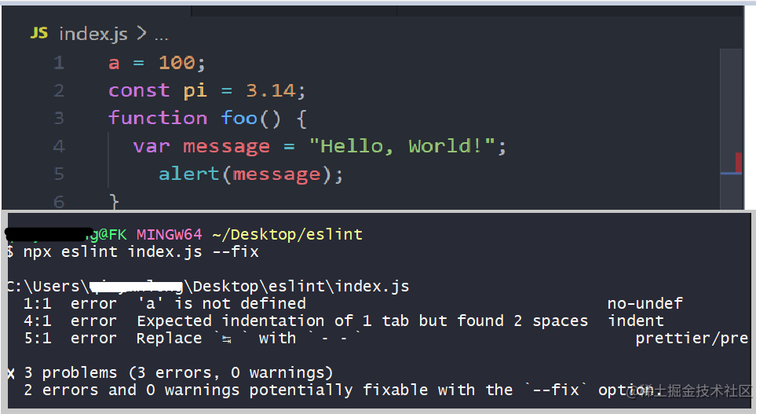

前端项目开发中，常见的本地规范化也是非常重要的，简单了解和搭建一套可以完全使用的规范化标准，这个严格意义来说是`Devops`的始发站。

本地部分使用 `npx`执行二进制，这个`npm>7.x`，可以`npm i npm -g`升级一下。

本文目的也是快速上手搭建一套适合自己的项目开发标准，适合扩展和封装，尝试使用一文完成前端本地代码开发的全部的讲解。


## 快速连接

- [ESlint与Prettier配置指南](https://juejin.cn/post/7050127881371910152)
- [Set up ESLint, Prettier and Husky in a React project | a step by step guide](https://dev.to/ivadyhabimana/setup-eslint-prettier-and-husky-in-a-node-project-a-step-by-step-guide-946)
- [新版本husky 完全配置](https://juejin.cn/post/6982192362583752741) 文中的 `commitlint.config.cjs`在node环境下后缀`cjs`即可

## 1: husky
**功能作用**：可以简单增加`git hooks`，非常有利于项目持续集成和代码检测。


```nodejs
npm install -D husky
```
在 `packgae.json`中添加`prepare`脚本,会在每次`npm install`之后执行`prepare`,
该命令会创建`.husky/`目录并指定该目录为`git hooks`所在的目录。

```js
 {
  "scripts": {
    "prepare": "husky install"
  }
}
```
添加一个 `pre-hooks`, 该钩子就会在你执行 `git commit` 的触发, 如果在这里阶段我们做一些 `lint检查`、`单元测试`、`代码美化`等操作比较符合持续集成的理念。

```js
 npx husky add .husky/pre-commit "npm run test"
```
可以在本地`.husky`里面查看到`pre-commit`命令。

再新增一个 `commit-hoos`:

```js
 npx husky add .husky/commit-msg 'npx --no-install commitlint --edit "$1"' 
```

`commitlint` 是负责校验 `commit`提交规范的，下面会涉及到。

另外，在项目的`.git/hooks`目录中，有一些 `.sample` 结尾的钩子示例脚本，如果想启用对应的钩子，只需手动删除后缀，即可。（删除某一个 `hook` 的后缀 `.sample` 即可启用该 `hook` 脚本，默认是不启用的。）

`husky`属于已经上层封装，因此兼容和使用更加方便。具体使用一般会配合下面几个工具来进行。

# 2: lint-staged

### lint 
`Lint` 就是对代码做静态分析,并且试图找出问题的分析工具，一般各类语言都有支持。意义是减少低级的代码错误和排查成本，节约时间资源，毕竟开发中，时间和排期是非常重要的。

`github`上列举出来的前端常见的工具[lint 常用列表](https://github.com/collections/clean-code-linters)。下面介绍的 `eslint` 和 `pretter`都是`lint` 常见的一些工具。

**时机的选择应该有个时间点： 本地开发过程中 `ide` 和提交代码 `git hooks` 两个阶段来做。** 


### lint-staged

`lint-staged` 一个仅仅拦截校验` Git` 代码**暂存区**文件(是指被`git add` 最新添加的文件的区域)的工具，专门检测每一次新提交的代码的静态检查，上高速前的一个收费站。

**安装**

```js
npm install -D lint-staged
yarn add --dev lint-staged
```

常用参数解析：

```js
 npx lint-staged --help
 Options:
      -V, --version                      输出版本号
      --allow-empty                      当任务撤消所有分阶段的更改时允许空提交（默认值：false）
      -c, --config [path]                配置文件的路径
      -d, --debug                        打印其他调试信息（默认值：false）
      -p, --concurrent <parallel tasks>  要同时运行的任务数，或者为false则要连续运行任务（默认值：true）
      -q, --quiet                        自己的控制台输出（默认值：false）
      -r, --relative                     将相对文件路径传递给任务（默认值：false）
      -x, --shell                        跳过任务解析以更好地支持shell（默认值：false）
      -h, --help                         输出用法信息
```


然后在 `package.json`中新增配置：

```js
 "husky": {
    "hooks": {
      //提交前hooks 提交前执行lint-staged的可执行文件
      "pre-commit": "npx lint-staged",
      
      // 校验commit 书写规范，下文具体讲解
      "commit-msg": "commitlint -e $1" 
    }
  },
  "lint-staged": {
    "./src/*.{js,jsx}": [
      "eslint src --fix",   
      "npx prettier --write",  // 直接美化原文件
      "git add "
    ]
  },
```

# 3：eslint

> 是一个开源的 `JavaScript` 的 `linting` 工具，使用 `espree` 将 `JavaScript` 代码解析成抽象语法树 `(AST)`，然后通过`AST` 来分析我们代码，从而给予我们两种提示：

- **代码质量问题**：使用方式有可能有问题(problematic patterns)
- **代码风格问题**：风格不符合一定规则 (doesn’t adhere to certain style guidelines)。


**`ESLint`忽略指定文件夹或文件**：

`.eslintignore`文件，将不想应用`eslin`t规则检测的文件或文件夹加在里面就可以了，例如
```
build
config/*.js
test/a.js
static/dist

```


 快速体验案例：
 
```js
   // 1: 项目创建
   mkdir eslintApp && cd eslintApp && touch index.js & npm i eslint -D & touch .eslintrc.js
   
   // 2； .eslintrc.js
   {
    "rules": {
      "indent": 2,
      "no-unused-vars": 2,
      "no-alert": 2
    }, 
    "env": {
       "browser": true
     }
   }
   
   // 3:  index.js > 如下图
   
   // -fix 该选项指示 ESLint 试图修复尽可能多的问题, 输出的是未能修复的
   // 4: npx eslint index.js --fix
```



可以看到，具体的错误信息和提交失败信息。整个 `eslint`核心是配置文件，下面贴出我本地所有的配置文件和说明信息。


```js
module.exports = {
  root: true, // ESLint 一旦发现配置文件中有 "root": true，它就会停止在父级目录中寻找。

  // Js 运行在不同的环境, 会有不同的全局变量, 例如在 Node 环境中会存在 global 变量, 当运行在 browser 中会存在 window 变量。
  // ESlint 会根据当前的运行环境来识别代码中的全局变量, 如果执行环境与全局变量不符合时, 将会报错
  // 设置eslint所处的环境，避免检查一些全局变量，环境可以选多个,比如你去掉node,就会报一些变量undefined的错
  env: {
    browser: true,
    node: true,
    es6: true, // es6 语法环境
  }, 

  // 默认ESlint使用Espree作为解析器，但是一旦我们使用babel的话，
  // 我们需要用babel-eslint，使得eslint和babel更好的配合。
  parser: "@babel/eslint-parser",
  
  // ESlint 的解析器选项可以在配置文件中使用 parserOptions 属性设置。可用的选项有：
  parserOptions: {

    // 默认支持es35,es6以上新语法如果支持就需要配置
    // 支持 ES6 语法并不意味着同时支持新的 ES6 全局变量或类型(比如 Set 等新类型), 
    // 还需要 {"env": {"es6": true}} (当开启了这个配置后会自动开启对 ES6 语法的支持)
    ecmaVersion: 6, 
    sourceType: "module",
    requireConfigFile: false,

    // 表示你想使用的额外的语言特性:
    ecmaFeatures: {
      // 对 JSX 语法的支持不用于对 React 的支持。React 使用了一些特定的 ESLint 无法识别的 JSX 语法。
      // 如果你正在使用 React 并且想要 React 语义支持，使用 eslint-plugin-react。
      jsx: true,
      // globalReturn: false, 允许在全局作用域下使用 return 语句
      // impliedStrict :false, 启用全局 strict mode
      // experimentalObjectRestSpread : 启用实验性的 object rest/spread properties 支持

    },
  }, // 解析器的配置

  /**
   * ESlint 提供了众多可配置的 Rules, 一个一个配置是非常麻烦的。 ESlint 支持从已有的配置中继承启动的规则。
   * 参数是继承一些比较出名的eslint配置，开箱即用，这里用的eslint-config-standard，
   * 比较出名的还有eslint-config-airbnb，具体用法去npm搜索
   * 
   * 1: ESlint 提供了 eslint:recommended 配置， 它提供了一系列核心规则， 可以使用 extends 属性来继承这些规则。
   * 2: "plugin:node/recommended: 需要单独的插件来提供：eslint-plugin-node
   * 3; prettier 也需要单独的插件
   * 
   * 4： 其他标准： npm install -D eslint-plugin-standard
      {
          "extends": ["eslint:recommended", "standard"]
      }

    在 ESlint 中, 使用外部 npm 包的时候， 省略前面 exlint-plugin-
    如果需要覆盖 extends 中的配置, 可以在 rules 字段中进行覆盖 :

   */

  // 插件一定要在plugin 里面先调用，参考  prettier
  // react:      "extends": ["eslint:recommended", "plugin:react/recommended"]
  extends: ["eslint:recommended", "plugin:node/recommended", "prettier"],


  // 在 ESlint 附带有大量的规则， 可以使用上面提到的配置方式添加项目的 rules 规则。

  /**
   * 第一个参数错误等级：
   *  0 或者 off(关闭规则)、 
   *  1 或者 warn(开启规则, 使用警告级别的错误, 不会导致程序退出)、 
   *  2 或者 error(开启规则, 使用错误级别的错误, 会导致程序退出)
   * 
   *  第二个参数：
      在例子中分别配置了 indent 为默认4个空格、2个空格、tab缩进。
   * 
   */
  rules: {

    // 使用 2 个空格。 错误等级为 2
    // "indent": [2, 2]

    // 使用 tab 缩进。 错误等级为 2
   "indent": [2, "tab"],

    "node/no-unsupported-features/es-syntax": 0,
    "node/no-extraneous-import": 0,
    "node/no-unsupported-features/node-builtins": 0, 
    "node/no-extraneous-require": 0, 
    "node/no-deprecated-api": 0, 
    "node/no-missing-import": 0, 
    "node/no-unpublished-import": 0, 
    "node/no-missing-require": 0, 
    "node/no-unpublished-require": 0,

    "react/prop-types": 0,
    "react/display-name": 0,
    "react/no-children-prop": 0,
    "react/jsx-no-target-blank": 0,
    "react/no-string-refs": 0, 
    "react/no-direct-mutation-state": 0,
    "react/no-find-dom-node": 0, 
    "react/jsx-no-duplicate-props": 0, 

    // quotes: [1, "single"],
    complexity: 0,
    eqeqeq: 0,
    "max-len": 0,
    "no-case-declarations": 0,
    camelcase: 0,
    "no-empty-function": 0,
    "array-bracket-spacing": [2, "never"],
    "comma-spacing": [
      2,
      {
        before: false,
        after: true,
      },
    ],
    "computed-property-spacing": [2, "never"],
    "keyword-spacing": 2,
    "space-before-blocks": [2, "always"],
    "space-in-parens": [2, "never"],
    "space-infix-ops": 2,
    "space-unary-ops": [
      2,
      {
        words: true,
        nonwords: false,
      },
    ],
    "spaced-comment": [
      2,
      "always",
      {
        markers: [
          "global",
          "globals",
          "eslint",
          "eslint-disable",
          "*package",
          "!",
        ],
      },
    ],
    "no-useless-escape": 0, // 之后需要打开
    "no-undef": 2, // 之后需要打开
    "no-unused-vars": 0, // 之后需要打开
    "guard-for-in": 0, // 之后需要打开
    "no-empty": 0, // 之后需要打开
    "default-case": 0, // 之后需要打开
    "no-process-exit": 0, // 之后需要打开
    "no-prototype-builtins": 0, // 之后需要打开
    "no-control-regex": 0,
    "no-fallthrough": 0,
    "no-mixed-spaces-and-tabs": 0,
    "no-redeclare": 0,
    "no-inner-declarations": 0,
    "no-irregular-whitespace": 0,
    "prettier/prettier": [
      "error",
      {
        endOfLine: "auto",
      },
    ],
  }, // 这里只列举了几个示例，第一个参数是报错的级别，第二个是希望设置的值，有三个值off,warn,error(对应0,1,2)，具体的参数配置,详情看https://eslint.org/docs/rules/


  // 当访问源文件未定义的变量名时, no-undef 将会发出警告。 这是可以在 ESlint 配置文件中使用 globals 单独设置一个全局变量。
  // eslint检查跳过的一些全局变量，eg： lodash,jquery
  globals: {
    document: true,
    localStorage: true,
    window: true,
    __dirname: true,
    importScripts: true,
    testVar: true  // 不用在定义，就可以直接使用了 
  },

  /**
   * 插件是一个 npm 包，通常输出一个或多个命名的规则配置。 上面说到可以 extends 属性来继承规则， 
   * 我们可以使用 plugins 属性来引入 一个 npm 包, 然后使用 extends 属性来继承这个 npm 包的某个规则集。
   * 
   * eg: npm install eslint-plugin-react --save-dev
   */
  plugins: [
    // "react",
    // "html"
    "prettier",
  ],
};

```
**上面配置涉及到了以下依赖项目：**

```js
prettier

eslint-plugin-prettier
eslint-config-prettier  // 这个一定要安装是，extends使用的

eslint-plugin-node 
eslint-plugin-react 

@babel/eslint-parser

// 注释
eslint-plugin-html

eslint-plugin-standard
eslint-config-standard

```

`.eslintignore` 文件告诉 `ESLint`去忽略特定的文件和目录。使用`glob`模式匹配路径径应该忽略检测。
或 `package.json` 文件中配置 `eslintIgnore` 字段来指定忽略文件

```js
{
    "eslintIgnore": ["main.js"]
}
```


# 4：pretter

**作用：** 利用定义的代码书写标准，在特定的时机来美化代码书写，达到协同开发中书写规范的同步性，是开发流程规范必不可少的一个步骤。一般会配合 `eslint`来使用。

```js
npm i -D prettier
```

快速上手使用：

```js
 // index.js
var a = 100;var b = 200;function t(){return 100};

// npx prettier -w index.js
// npx prettier --write package.json
```
上面使用命令行的形式使用默认的格式来格式化了下`index.js` 和 `package.json`这两个文件。

配置文件： `.prettierrc `,有三类 `.js` ,`.json` ,`.yaml`，下面是我项目中的配置。

```js
    module.exports = {
      extends: ['airbnb', 'prettier', 'prettier/react'],
      printWidth: 200, // 超过最大值换行
      htmlWhitespaceSensitivity: 'ignore',
      semi: true, // 结尾不用分号
      disableLanguages: ['vue'], // 不格式化vue文件，vue文件的格式化单独设置
      trailingComma: 'none', // 是否使用尾逗号，有三个可选值"<none|es5|all>", 即JSON对象的最后一个属性后面，不需要逗号
      tabWidth: 4,
    }
```
在上面的 `lint-staged`和`eslint`配置我们会发现都使用了`prettier`,在项目中一般也是直接配合使用的。


# 5: commitlint 和 git-cz

背景： 多人协作团队中统一的提交分隔非常有利于管理和代码查看，清晰的`commit`可以完全更加语意话。
上文中`husky`部分我们增加了一个`hooks:commitlint`，这里深入介绍下具体的使用。

### 步骤 1

```js
  npm install -g @commitlint/cli @commitlint/config-conventional
```
全局安装方便本地的 `commitlint.config.js`会依赖到。

### 步骤 2

`git-cz`[仓库地址](https://github.com/streamich/git-cz) 是一个集成化的工具，使用起来更加的简单和方便。

```
npm install -g commitizen git-cz 
npx commitizen init git-cz --save-dev --save-exact
```

### 步骤 3
本地必须新增`commitlint.config.js`文件，该文件主要负责定义输入是否符合的标准，在`hooks`阶段会触发。

```js
module.exports = {
  extends: ["@commitlint/config-conventional"],
  rules: {
    "type-enum": [
      2,
      "always",
      [
        "feat",
        "fix",
        "docs",
        "style",
        "refactor",
        "perf",
        "test",
        "build",
        "ci",
        "chore",
        "revert",
      ],
    ],
    "subject-full-stop": [0, "never"],
    "subject-case": [0, "never"],
  },
};

```

### 步骤 4
代码提交完的时候，就可以执行```git cz``` 执行`commit`。

### 补充知识
`Conventional Commits` **约定式提交规范**:

`Git` 提交说明可分为三个部分：`Header[ type+ scope + subject ]`、`Body`和`Footer`。

常用的 `type` 类型

- `build`	编译相关的修改，例如发布版本、对项目构建或者依赖的改动
- `chore`	其他修改, 比如改变构建流程、或者增加依赖库、工具等
- `ci`	持续集成修改
- `docs`	文档修改
- `feat`	新特性、新功能
- `fix`	修改bug
- `perf`	优化相关，比如提升性能、体验
- `refactor`	代码重构
- `revert`	回滚到上一个版本
- `style`	代码格式修改, 注意不是 css 修改
- `test`	测试用例修改


`scope`说明`commit`影响的范围，可以省略。
`subject` 是`commit`的简短描述,可以省略。

**Body**
`commit`的详细描述，说明代码提交的详细说明。

**Footer**
如果代码的提交是不兼容变更或关闭缺陷，则`Footer`必需，否则可以省略。


**最佳实践：**
- 一个 `commit` 只做一件事情，而不是做到一半的工作。
- 提交前要经过测试。
- 严格按照 `commit` 上面定义的提交规范来。


# 6: 扩展

### 1：捕获eslint
一般继承开发的，CD/CI过程中我们当然不希望所有的事情都是插件在外部完成，希望程序内部也是可以捕获到的。

```js
const shell = require("shelljs");
const path = require("path");
const indexDir = path.resolve(__dirname, "index.js");
const eslintBin = path.resolve(__dirname, "node_modules/.bin/eslint");

const prettierBin = path.resolve(__dirname, "node_modules/.bin/prettier");

// eslint
const res = shell.exec(`${eslintBin} ${indexDir} --fix`);

if (!res.code) {
  // 没有错误自动prettier 
  const preRes = shell.exec(`${prettierBin} -wc index.js`);
} else {
  console.log("opps,errors!");
}

console.log("===", res);
```


