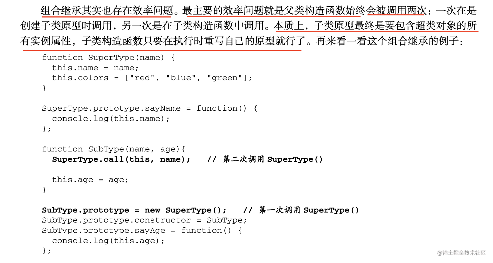
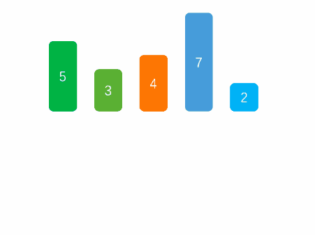
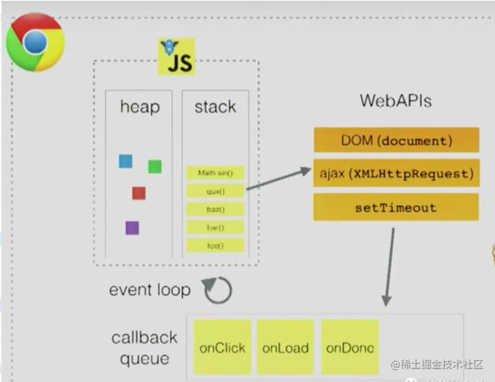
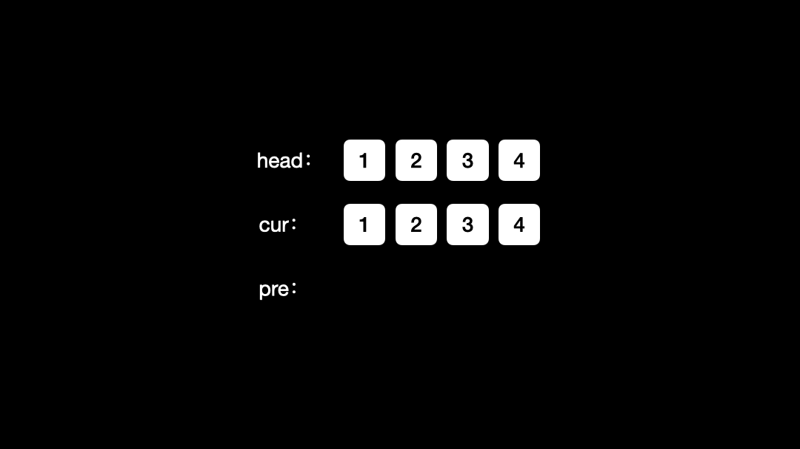

> 申明：本文仅限自己面试总结和学习使用！完全不具有参考性


# 1: 手写

测试使用的`jest`框架做简单的单元测试。

### 1: 惰性函数

**1，2，3，4** 是常见的 **函数式** 和**高阶编程**常用到的方法。这些以思想为主，但凡是函数式编程的语言中都可以使用这些思想。


```js
function getCssHandle(element, attr) {
  // -webkit
  if ('getComputedStyle' in window) {
    return window.getComputedStyle(element)[attr];
  }
  // -ie
  return element.currentStyle[attr];
} 

getCssHandle(document.body, 'margin');
getCssHandle(document.body, 'padding');
```
两次的函数单独调用，都会再次进入判断条件，检测执行，可以使用惰性函数,只有第一次的时候进行判断，之后覆盖之前的函数申明。

```js
function getLazyClass(element,attr){
    if("getComputedStyle" in window) {
        getLazyClass = function(element,attr){
            return window.getComputedStyle(element)[attr];
        }
    }
    else {
        getLazyClass = function(element,attr){
            return element.getComputedStyle[attr];
        }
    }
    return getLazyClass(element,attr);
}
```

### 2: 函数柯理化
定义： **是把接受多个参数的函数变换成接受一个单一参数（最初函数的第一个参数）的函数，并且返回接受余下的参数而且返回结果的新函数的技术**。

不得不提一下偏函数，偏函数是 [JS 函数柯里化](http://c.biancheng.net/view/5744.html)运算的一种特定应用场景。简单描述，就是把一个函数的某些参数先固化，也就是设置默认值，返回一个新的函数，在新函数中继续接收剩余参数，这样调用这个新函数会更简单。

简而言之：**局部应用是指固定一个函数的一些参数，然后产生另一个更小元的函数。**


```js

// 判断target的类型 isType("object", {}); //true
// 包含了两个参数，比较繁琐
function isType(type, target) {
    return Object.prototype.toString.call(target) === '[object ' + type + ']';
}

// 偏函数实现
var isType2 = function (type) {
    return function (obj) {
        return Object.prototype.toString.call(obj) == '[object ' + type + ']';
    }
}

var isString = isType2("String"); //专一功能检测函数，检测字符串
var isFunction = isType2("Function"); //专一功能检测函数，检测字符串

// 业务代码
console.log(isString("12")); //true
console.log(isFunction(function () {})); //true
console.log(isFunction({})); //false
```
另外一个case 说明了柯理化应用的场景：

```js
// 正常正则验证字符串 reg.test(txt)
function check(reg, txt) {
    return reg.test(txt)
}
check(/\d+/g, 'test')       //false
check(/[a-z]+/g, 'test')    //true


// 偏函数方式：更加明确了业务场景
function curryingCheck(reg) {
    return function(txt) {
        return reg.test(txt)
    }
}

var hasNumber = curryingCheck(/\d+/g)
var hasLetter = curryingCheck(/[a-z]+/g)

hasNumber('test1')      // true
hasNumber('testtest')   // false
hasLetter('21212')      // false
```

柯理化实现方式如下：
```js
function curring(fn, data=[]) {
   let arglen = fn.length; // 入参的个数
   return function (arg) {
       data.push(arg);
       if(data.length < arglen) {
           return curring(fn, [...data]);
       }
       else {
          return fn.apply(null, data);
       }
   }
}


// TDD测试代码
function add(a,b,c){
    return a + b +c;
}
let cur = curring(add);
test("curring", ()=>{
    expect(recurs(1)(2)(3)).toBe(6);
})

```

### 3: bind
需要考虑到柯理化传递参数得情况，这里没有考虑到函数做为构造函数的场景。

```js
Function.prototype.bind = function (context) {
    const arg = Array.prototype.slice.call(arguments,1);
    const self = this;
    return function(){
        let innerArg = Array.prototype.slice.call(arguments);
        return self.apply(context, innerArg.concat(arg))
    }
}


```

### 4: 组合函数

在函数式编程当中有一个很重要的概念就是函数组合， 实际上就是把处理数据的函数像管道一样连接起来， 然后让数据穿过管道得到最终的结果。函数调用的扁平化，即把层级嵌套的那种函数调用(一个函数的运行结果当作实参传给下一个函数的这种操作)扁平化。

`compose` 也是 **函数式** 和**高阶编程**常用到的方法。

主要是利用了数组的高阶函数 `reduce` 特性，很容易写出下面的代码。

```js
function compose(...arglist) {
   return function(initData){
      return arglist.reduce((pre,cur)=>{
         let isinit = typeof pre === 'function' ? pre(initData) : pre; 
         return cur(isinit);
      })
   }
}
```
但是可以进一步优化，利用`reduce`返回的时一个函数，就可以减少一步函数。
```js
function compose(...arglist) {
  return arglist.reduce((pre,cur)=>(initData)=>{
  
     // 需要单独考虑到参数为空和只有一个的场景 
     // if(arglist.length === 0) return initData; 
     // if(arglist.length === 1) return arglist[0](...initData);
 
     let isinit = typeof pre === 'function' ? pre(initData) : pre; 
     return cur(isinit);
  })
}
```
单测代码：

```js
function fn1(x){
    return x+1;
}

function fn2(x){
    return x+2;
}

function fn3(x){
    return x+3;
}

const handle = compose(fn1,fn2,fn3);
test('compose value',()=>{
    expect(handle(2)).toBe(8);
});
```

### 5: setTimeout 模拟setInterval

《js高级程序设计中》不建议生产环境下使用`setInterval`，因为一个任务结束和下一个任务开始之前时间是无法确保的，有些循环定时任务可能因此会被跳过。因此实际生产中可以模拟这个定时。

```
function setinter(timeout,fn){
    let timer = null;
    function inter() {
        timer = setTimeout(inter,timeout);
        fn.call(null,cancel);
    }  

    function cancel(){
        clearTimeout(timer);
    }
    inter();
}


// 测试代码
let index = 0;
setinter(1000,function(cancelfn){
    index ++;
    if(index === 10) cancelfn();
})
```

### 6: 数组去重
这个方法非常的多，还是主要体验思想，最常见的是使用数组本身的高阶函数来实现，遍历排查。
```js
// 1: filter 方法来过滤实现
function repeat(arr) {
  return arr.filter((item,index,arr)=>arr.indexOf(item) === index);
}

// 2：Set 方法特性
function unique(arr) {
   return Array.from(new Set(arr))
}
// for 循环
```

### 7: 数组扁平化

实现1： 递归实现，思路是 [1,2,[3]] // 从前面出队，碰到是数组的类型的就是再次递归。 
```js 
function flatter(arr,initData=[]) {
    let res = [...initData];
    let len = arr.length;
    while(len >0){
        let current = arr.shift();
        if(Array.isArray(current)) {
            return flatter(current, res);
        }
        else {
            res.push(current);
        }
        len --;
    }
    return res;
}
```

实现2：利用数组的高阶方法来实现,这个迭代递归没有第一个看起来直接和易懂。

```js
function flatter(arr){
    return arr.reduce((pre,cur)=>{
        if(Array.isArray(cur)) { 
            return [...pre, ...flatter(cur)];
        }   
        else {
            return [...pre, cur]
        }
    },[])
}
```

方案3：迭代利用`...扩展特性`或者`apply`的变异特性，迭代检测整个数组中。

```js
function flatter(arr) {
    if (!arr.length) return;
    while (arr.some((item) => Array.isArray(item))) {
       // arr = Array.prototype.concat.apply([],arr); 
       arr = [].concat(...arr);
    }
    return arr;
  }
```

### 8: 深浅拷贝

##### 浅拷贝(shallow copy)区域：
- `Object.assign`
- `[].slice`  返回一个浅拷贝的副本
- `[].concat` 返回一个浅拷贝的副本

##### 深拷贝区域

丐帮版实现，因为它是不可以拷贝 `undefined` ， `function`， `RegExp` 等等类型的。
```js
function  deepClone2(obj) {
    return JSON.parse(JSON.stringify(obj));
}
```

迭代递归版，增加对`正则`和`null`的单独处理。

```js
function deepClone(obj) {
    let newObj = Array.isArray(obj) ? [] : {};
    for (const key in obj) {
        if (Object.hasOwnProperty.call(obj, key)) {
            const element = obj[key];
            if(typeof element === 'object') {
                if (element === null) {
                    newObj[key] = null;
                }
                else if(element instanceof RegExp){
                    newObj[key] = element;
                }
                else {
                    newObj[key] = deepClone(element); 
                }
            }
            else {
                newObj[key] = element;
            }
        }
    }
    return newObj;
}
```
熟悉各种拷贝不足的的场景，单独使用，可以更加快速开发。

### 9： 手动实现instanceof
 `instanceof` 用于判断左侧值是否是右侧值的实例，所以左侧必须是一个对象，而右侧是一个类。
 具体原理是 `instanceof` 会查找原型链，知道 `null` 之前如果还不是这个对象的实例则会返回 `false`，否则返回 `true`。
 
```js
/**
 * 
 * @param {*} obj 
 * @param {*} target 
 * @returns boolean
 */

function HackInstanceOf(obj, target) {
  
  // 右侧必须是构造函数
  if (typeof target !== "function")
    throw new Error("right-hand must be function!");

  // 左侧是一个对象  
  if (!obj || (typeof obj !== "object" && typeof obj !== "function"))
    return false;

  // 核心代码  
  let pro = Object.getPrototypeOf(obj);
  while (pro) {
    if (pro == target.prototype) return true;
    pro = Object.getPrototypeOf(pro);
  }

  return false;
}


// 测试代码：
function C(){}
function D(){}
var o = new C();
// o instanceof C;
console.log(HackInstanceOf(o, C));
```

### 10：手动实现函数new构造函数

**构造函数和普通函数唯一的区别就是调用的方式不同。** ，在`js`中任何函数只要使用`new`进行调用就是构造函数，反之就是普通函数。一定要从本质上认知，不要被语法困惑。
```js
function Parents(name,age,wh){
   this.name = name;
   this.age = age;
   this.wh = wh;
}
Parents.prototype.getname = ()=> this.name;

// 普通函数方式调用
Parent("anikin",12,"Doctor");
window.getname();
```


(1) 创建一个新对象；

(2) 将构造函数的作用域赋给新对象（因此 this 就指向了这个新对象）

(3) 执行构造函数中的代码（为这个新对象添加属性

(4) 绑定原型；

(4) 返回新对象。

```js
function myNewInstance(oClass){
    let o = new Object();
    // 设置原型链
    Object.setPrototypeOf(o,oClass.prototype);

    // 获取构造函数的参数
    let getArg = Array.prototype.slice.call(arguments,1);

    // 如果构造函数返回为非空对象就返回，否则返回新创建的对象
    const res = oClass.apply(o,getArg);

    return (res && typeof res === "object") ? res : o;
}

```

### 10：写出常见的继承和各自的优缺点

#### 1：原型继承
```js
function Parent (name) {
    this.name = name;
    this.colors = ['red', 'blue', 'green'];
}
Parent.prototype = {
    constructor: Parent,
    getName() {
        return this.name;
    }
}
function Child (name, age) {
    this.age = age;
}

Child.prototype = new Parent();


// 常见面试题目
var child1 = new Child('dudu', 3);
var child2 = new Child('anikin', 31);

child1.name = "xiao-dudu";
child1.colors.push("black");

// 缺点1：引用类型的属性被所有实例共享
console.log(child2.colors); // ['red', 'blue', 'green','black']
console.log(child2.name);   // anikin

// 缺点2：在创建 Child 的实例时，不能向Parent传参
```
#### 2：经典继承（借用构造函数继承）

优点是：
- 避免了引用类型的属性被所有实例共享
- 可以在 Child 中向 Parent 传参


```js
function Parent () {
    this.names = ['jack', 'son'];
}

function Child () {
    // 方法都在构造函数中定义，每次创建实例都会创建一遍方法。
    // 原型方法无法继承
    Parent.call(this);
}

var child1 = new Child();
child1.names.push('yayu');
console.log(child1.names); // ['jack', 'son'，’yayu‘]


var child2 = new Child();
console.log(child2.names); // yayu
```

#### 3：组合继承

实现比较简单，直接参考《js高级指南（第四版）》，表述的优缺点：




#### 3：寄生组合继承
寄生组合继承也是被推荐的一个类型，其中主要是省略掉第二个`new Parent`不是，核心思想是：**借桥过路** (自创名词请忽略)。
```

// 父
function Parents(name){
    this.color = [1,2];
    this.name = name;
}
Parents.prototype.getName = function(){
    return this.name;
}


//子
function Child(){
    Parent.call(this); // 参数可以处理省略
}

Child.prototype.constructor = Child;

let O = function(){};
O.prototype = Parents.prototype;

Child.prototype = new O();

var child1 = new Child();
```
同样参考书中，给出最后封装后的完美的寄生组合写法，面试中也是最为常问，如果这个玩的比较熟悉，现在的`面试官`良莠不齐，能问到这个点的还算不错的。

```js
// 只有这个一步写法，包括两个工具函数实现
prototype(Child, Parent);


// 创建 “桥” 
function bridgeInstance(o) {
    function F() {}
    F.prototype = o;
    return new F();
}

function prototype(child, parent) {
    // 获取桥
    var bridge = bridgeInstance(parent.prototype);
    // 桥的构造器指向目标类或者目标构造函数
    bridge.constructor = child;
    // 搭桥过路
    child.prototype = bridge;
}
```
### 11：并发队列实现
要求实现一个并发队列，并发最大是2，按照队列来实现。
```
class Taskrunner{
    constructor(){
        this.queue = [];
        this.runCounts = 0;
        this.limitCount = 2;
    }

    addTask(time,cvalue) {
        const promiseHandle = function  () {
            return new Promise(function(resolve,reject){
                 setTimeout(() => {
                    console.log(cvalue);
                    resolve();
                 }, time);
            })
        };
        this.queue.push(promiseHandle);
    }

    // 执行阶段
    taskStart(){
        for (let i = 0; i < this.limitCount; i++) {
            this.request();
        }
    }

    request(){
        if( !this.queue.length || this.runCounts >= this.limitCount) return;
        this.runCounts++;
        this.queue
            .shift()()
            .then(()=>{
            this.runCounts--;
            this.request();   
        })
    }
      
}

var t = new Taskrunner();
// 2314

t.addTask(1000,"1");
t.addTask(500,"2");
t.addTask(300,"3");
t.addTask(400,"4");

// 入队顺讯是：[1,2,3,4]  因此因此出队按照执行时间来打印

t.taskStart(); // 2 3 1 4
```
### 12: 节流和防抖

#### a: 防抖 (debounce)

类似于滚动条滚动事件监听后处理=一些业务，基于类似场景，首先提出第一种思路：**在第一次触发事件时，不立即执行函数，而是给出一个期限值比如200ms**，然后：

- 如果在200ms内没有再次触发滚动事件，那么就执行函数。
- 如果在200ms内再次触发滚动事件，那么当前的计时取消，重新开始计时。

**效果**：如果短时间内大量触发同一事件，只会执行一次函数。

**实现**：既然前面都提到了计时，那实现的关键就在于`setTimeout`这个函数，由于还需要一个变量来保存计时，考虑维护全局纯净，可以借助闭包来实现：

对于**短时间内连续触发**的事件（上面的滚动事件），**防抖的含义就是让某个时间期限（如上面的1000毫秒）内，事件处理函数只执行一次。**

**所谓防抖，就是指触发事件后在 n 秒内函数只能执行一次，如果在 n 秒内又触发了事件，则会重新计算函数执行时间。**

```js
// 是否需要理解执行没有考虑，可以添加一个标志位来判断
function debounce(func, wait) {
    let timeout;
    return function () {
        let context = this;
        let args = arguments;
        if (timeout) clearTimeout(timeout);
        timeout = setTimeout(() => {
            func.apply(context, args)
        }, wait);
    }
}

// 测试代码
function showTop  () {
    var scrollTop = document.body.scrollTop || document.documentElement.scrollTop;
　　console.log('滚动条位置：' + scrollTop);
}

// 为了方便观察效果我们取个大点的间断值，实际使用根据需要来配置
window.onscroll = debounce(showTop,1000); 
```

#### b: 节流(throttle)
如果在限定时间段内，不断触发滚动事件（比如某个用户闲着无聊，按住滚动不断的拖来拖去），只要不停止触发，理论上就永远不会输出当前距离顶部的距离。

**所谓节流，就是指连续触发事件但是在 n 秒中只执行一次函数。** 节流会稀释函数的执行频率。

**效果**：如果短时间内大量触发同一事件，那么**在函数执行一次之后，该函数在指定的时间期限内不再工作**，直至过了这段时间才重新生效。

**实现** : 对于节流，一般有两种方式可以实现，分别是时间戳版和定时器版。这里借助`setTimeout`来做一个简单的实现，加上一个状态位`valid`来表示当前函数是否处于工作状态：

```js
// 时间版本的
function throttle(fn,timeOut){
    let previous = 0;
    return function(){
        let now = Date.now();
        let context = this;
        let args = arguments;
        if(now - previous < timeOut) return 
        fn.apply(context, args);
        previous = Date.now();

    }
}

// 定时器版本
function throttle(fn,wait){
    let timeout;
    return function(){
        if(timeout) return;
        timeout = setTimeout(() => {
            fn.apply(this,arguments);
            timeout = null;
        }, wait);
    }
}
```
### 13: LazyMan

解法1：主要思路是：优先收集所有任务到队列里面，然后异步启动队列，队列里面的每一个函数都自带执行下一个任务的函数。但是整体写法和实现比较乱，除非对整个实现比较清晰。

```js
/** 
    LazyMan('Hank');输出:
    Hi! This is Hank!

    LazyMan('Hank').sleep(10).eat('dinner');输出:
    Hi! This is Hank!
    //等待10秒..
    Wake up after 10s!
    Eat dinner~

    LazyMan('Hank').eat('dinner').eat('supper');输出:
    Hi This is Hank!
    Eat dinner~
    Eat supper~

    LazyMan('Hank').sleepFirst(5).eat('supper');输出:
    //等待5秒
    Wake up after 5
    Hi This is Hank!
    Eat supper~

    以此类推。 
**/
class LazyManHandle{
    constructor(name){
        this.freeq = [];
        let fn = ()=>{
            console.log(`Hi! This is ${name}!`);
            this.next();
        }
        this.freeq.push(fn);
        
        // 启动函数，异步是因为必须等到到队列收集完成
        setTimeout(() => {
            this.next();
        },0);
    }

    next(){
        let fn = this.freeq.shift();
        typeof fn === 'function' && fn();
    }

    sleepFirst(timeout){
        const fn = ()=>{
            setTimeout(() => {
                console.log(`Wake up after ${timeout}s!`);
                this.next();
            }, timeout * 1000);
        }
        // 有限插入队列的开头
        this.freeq.unshift(fn);
        return this;
    }

    sleep(timeout){
        const fn = ()=> {
            setTimeout(()=>{
                console.log(`Wake up after ${timeout}s!`);
                this.next();
            }, timeout * 1000);
        };
        this.freeq.push(fn);
        return this;
    }

    eat(something){ 
        const fn = ()=>{
            console.log(`Eat ${something} ~!`);
            this.next();
        }
        this.freeq.push(fn);

        return this;
    }
}

function LazyMan(names){
    return new LazyManHandle(names);
}
```

解法2：
考虑到上面的写法比较冗余，在前端涉及到队列等自然躲不开`promise`。
```js
class LazyManHandle{
    constructor(name){
        this.freeq = [];
        this.freeq.push(this.proWrap(null, `Hi! This is ${name}!`));

        setTimeout(() => {
            this.excutQueue();
        },0);
    }

    excutQueue(){
        Promise.all(this.freeq).then((res)=>{
            console.log('==res', res);
        })
    }

    proWrap(timeout,ctext){
        return new Promise((resolve)=>{
            if(!ctext) {
                setTimeout(() => {
                    resolve(`Wake up after ${timeout}s!`);
                }, timeout * 1000); 
            }
            else {
                resolve(ctext);
            }
        })
    }

    sleepFirst(timeout){
        this.freeq.unshift(this.proWrap(timeout));
        return this;
    }

    sleep(timeout){
        this.freeq.push(this.proWrap(timeout));
        return this;
    }

    eat(something){ 
        this.freeq.push(this.proWrap(null, `Eat ${something} ~!`));
        return this;
    }
}

function LazyMan(names){
    return new LazyManHandle(names);
}
```

### 14: 排序

#### 1：冒泡排序

**冒泡排序**是一种简单的排序算法。它重复地走访过要排序的数列，一次比较两个元素，如果它们的顺序错误就把它们交换过来。走访数列的工作是重复地进行直到没有再需要交换，也就是说该数列已经排序完成。
这个算法的名字由来是因为越小的元素会经由交换慢慢“浮”到数列的顶端。

```js
function bubbleSort(arr) {
    let len = arr.length;
    for (var i = 0; i < len; i++) {
       // 以此遍历 
       for (var j = 0; j < len - i- 1; j++) {
            if(arr[j] > arr[j+1]) {
              [arr[j], arr[j + 1]] = [arr[j + 1], arr[j]];
            }
       }
    }
    return arr;
}
```
#### 2：选择排序

**选择排序**(Selection-sort)是一种简单直观的排序算法。
它的工作原理：首先在未排序序列中找到最小（大）元素，存放到排序序列的起始位置，然后，再从剩余未排序元素中继续寻找最小（大）元素，然后放到已排序序列的末尾。以此类推，直到所有元素均排序完毕。
```js
function selectSort(arr) {
    let len = arr.length;
    let minIndex;
    for (let i = 0; i < len - 1; i++) {
        // 默认最小
        minIndex = i;
        for (let j = i; j < len; j++) {
            if(arr[j] < arr[minIndex]){
                minIndex = j;
            }
        }
        if(minIndex !== i) {
            [arr[i],arr[minIndex]] = [arr[minIndex],arr[i]];
        }
    }
    return arr;
}
```

#### 4：插入排序



```js
function selectSort(arr) {
    for(var i=1;i<arr.length;i++){
        let key = arr[i];
        let j = i -1;
        while( j>=0 && arr[j] > key ){
            arr[j+1] = arr[j];
            j --;
        }
        arr[j+1] = key;
    }
    return arr;
}
```

#### 5：快速排序
```js
function quickSort(arr) {
    if(arr.length <=1) return arr;

    var pivotIndex = Math.floor(arr.length/2);
    var mid = arr.splice(pivotIndex,1)[0];

    var left = [];
    var right = [];
    
    for (let i = 0; i < arr.length; i++) {
        if(arr[i] < mid) {
            left.push(arr[i]);
        }else {
            right.push(arr[i]);
        }    
    }
    
    return quickSort(left).concat([mid],quickSort(right));
}
```
#### 6：二分法查找
```js
/**
 * 方法1：普通遍历法
 * @param {*} arr 已排好的数组
 * @param {*} key 想要查找的值
 * 超出边界即是找不到,返回undefined;
 */
function binary_search(arr, key) {
    let low = 0;
    let heigh = arr.length - 1;
    while( low <= heigh ){
        let mid = parseInt((heigh + low) / 2);
        if(arr[mid] === key) return mid;
        // 要寻找的这个值比中间这个值还要大
        if(key > arr[mid]) {
            low = mid +1;
        }
        else if(key < arr[mid]){
             heigh = mid - 1;
        }
    }
}
```

```
/**
 *  方法2: 递归
 * @param {*} arr 
 * @param {*} searchKey 搜索目标值
 * @param {*} low 低位
 * @param {*} heigh 高位值
 * @returns 
 */
function binary_search(arr,searchKey,low,heigh) {
    if(low > heigh) return -1;

    let mid = parseInt((low + heigh)/2);
    if(arr[mid] === searchKey) return mid;
    if(arr[mid] < searchKey) {
        return binary_search(arr,searchKey,mid + 1, heigh);
    }
    else if(arr[mid] > searchKey){
        return binary_search(arr,searchKey,low, mid - 1);
    } 
}
```

### 15: 版本号排序
```js
var version = ['0.1.1', '2.3.3', '0.302.1', '4.2', '4.3.5', '4.3.4.5'];
version.sort(function(a,b){
    let arr1 = a.split(".");
    let arr2 = b.split(".");
    let i=0;

    while(true){
        const s1 = arr1[i];
        const s2 = arr2[i];
        i++;
        if (s1 === undefined || s2 === undefined) {
            return arr2.length - arr1.length;
        }

        if(s1 === s2) continue;
        return s1 - s2;
    }
})

console.log(version);

```
### 16: js 缓存类型LRU
用一些规则来管理缓存的使用，而`LRU（Least Recently Used） Cache`就是其中之一，直接翻译就是“**最不经常使用的数据，重要性是最低的，应该优先删除**”。

`LRU`算法观点是，**最近被访问的数据那么它将来访问的概率就大，缓存满的时候，优先淘汰最无人问津者**。

两种实现方式：一类是常规map构建来实现，二是使用链表来实现。

- 如果需要的键值已存在于内存之中，直接更新数据并移动到末尾;*(删除后再添加)*
- 如果当前未达到缓存数量上限，直接写入新数据；
- 如果当前已经达到缓存数量上限，要先删除最不经常使用的数据，再写入数据；


**查询一次也算活跃数据，更新到最后。
设置一次，如果存在就先删除在更新，才会保证是最新的。**

#### 1：map实现
```js
/**
 * Map 对象保存键值对，并且能够记住键的原始插入顺序。任何值(对象或者原始值) 都可以作为一个键或一个值。
 */
class LRUCache {
  constructor(capacity) {
    this.map = new Map();
    this.capacity = capacity;
  }

  // 如果存在，则把访问过的数据移动到末端
  get(key) {
    const map = this.map;
    if (!map.has(key)) return -1;

    const rdata = map.get(key);
    map.delete(key);
    map.set(key, rdata);
    return rdata;
  }

  put(key, val) {
    const map = this.map;
    const size = this.capacity;
    if (map.has(key)) map.delete(key);

    map.set(key, val);

    // 把头删除
    if (map.size > size) {
      map.delete(map.keys().next().value);
    }
  }
}
```
### 17：promise 系列
#### 1：手写promise
```js
/***
 * 1: 改变promise 状态的三个因素： resolve reject error  且状态只能改变一次，如果不错误捕获的话，后面代码直接让错误阻塞
 * 2: 同步执行函数 先赋值，在
 */

class Mypromise{
    constructor(executor){
        this.PromiseState = 'pedding';
        this.PromiseResult = undefined;
        this.callbacks = [];

        // 同步调用执行器
       try{
           executor(this.resolve.bind(this), this.reject.bind(this));
       }
       catch(e){
           this.reject(e);
       }
    }

    // 该函数一旦执行，整个promise的状态立马发生不可逆改变 并且设置结果值
    resolve(value){
        if (this.PromiseState === 'pedding'){
            this.PromiseState = 'fullfilled';
            this.PromiseResult = value;
            
            if(this.callbacks.length){
                // 为了和原生promise 保持一致，适用异步来实现
                 setTimeout(()=>{
                     this.callbacks.forEach(resolvefn => {
                         resolvefn.onFullfilled(value);
                     });
                 })
            }
        }
    }
    
    reject(error){
        if (this.PromiseState === 'pedding') {
            this.PromiseState = 'fullfiled';
            this.PromiseResult = error;

            if (this.callbacks.length) {
                setTimeout(()=>{
                    this.callbacks.forEach(resolvefn => {
                        resolvefn.onFullFiled(error);
                    });
                })
            }
        }
    }


    // 静态方法resolve 一定要记住 返回的就是promise
    static resolve(data){
       // static 里面的this 指向的是类 
       return new this((resolve,reject)=>{
            if(data instanceof Promise){
                data.then((suc) => {
                    resolve(suc);
                }, e => {
                    reject(e);
                })
            }else{
                 resolve(data);
            }
       })
    }


    static reject(data) {
        // static 里面的this 指向的是类 
        return new this((resolve, reject) => {
            if (data instanceof Promise) {
                data.then((suc) => {
                    resolve(suc);
                }, e => {
                    reject(e);
                })
            } else {
                reject(data);
            }
        })
    }


    // 返回的也是promise 都成功则成功  有失败则所有失败 一定是按照顺寻进行返回的
    static all(prolist){
        return new this((resolve, reject) => {
            let count = 0;
            let res = [];

            // 整个for 循环是一个异步的，但是异步的有队列进行保证，因此返回值还是会按照顺寻进行返回的
            for (let i = 0; i < prolist.length; i++) {
                const element = prolist[i];
                element.then((v) => {
                    // 得知每个prolist 状态是成功的，
                    count++;
                    res[i] = v;
                    if (count == prolist.length) resolve(res);
                }, (e) => {
                    reject(e);
                })
            }
        })
    }

    // 那个最快就返回那个
    static race(prolist) {
        return new this((resolve, reject) => {
            for (let i = 0; i < prolist.length; i++) {
                const element = prolist[i];
                element.then((v) => {
                   resolve(v);
                }, (e) => {
                    reject(e);
                })
            }
        })
    }


    /***
     * 返回结果是一个promise, 根据执行函数的结果来修改返回的promise状态，这一点非常重要。没有就是undefined
     */
    then(onFullfilled,onFullFiled){
        return new Mypromise((resolve,reject)=>{
             function callbacks(handleType){
                 try {
                     let res = handleType(this.PromiseResult);  // 获取then回掉函数的执行结果
                     if (res instanceof Promise) {
                         // 如果是promise 类型 肯定有then方法
                         res.then((suc) => {
                             resolve(suc);
                         }, e => {
                             reject(e);
                         })
                     } else {
                         // 结果对象状态为成功
                         resolve(res);
                     }
                 } catch (e) {
                     // 接受 throw 等抛出来异常错误，修改状态
                     reject(e);
                 }
             }

            //1,2 if 对应的是同步
            if (this.PromiseState === 'fullfilled'){ // fullfilled  resolved
                setTimeout(()=>{
                    callbacks.call(this, onFullfilled);
                });
            }
            else if (this.PromiseState === 'fullfiled'){ // fullfiled rejected
                setTimeout(()=>{
                    callbacks.call(this, onFullFiled);
                });
            }
            // 对应的是异步
            else if (this.PromiseState === 'pedding'){
                this.callbacks.push({
                    onFullfilled:()=>{
                        // resolve 执行完了这里肯定会执行
                        callbacks.call(this, onFullfilled);

                    }, 
                    onFullFiled:()=>{
                        callbacks.call(this, onFullFiled);

                    }
                });
            }
        });
    }
}


// 测试异步

// var p = new Mypromise((resolve,reject)=>{
//    console.log(111)
//    reject('success');
// });

// p.then((res)=>{
//     console.log(222)
// },(reason)=>{
//     console.log(444)
// });

// console.log(333)


// 测试 race  all 方法
// var p1 = Mypromise.resolve(100);
// var p2 = Mypromise.resolve(200);
// var p3 = new Mypromise((resolve,reject)=>{
//     setTimeout(()=>{
//        resolve(300)
//     },5000)
// });
// var p4 = new Mypromise((resolve, reject) => {
//     setTimeout(() => {
//         resolve(400)
//     }, 1000)
// });

// var res = Mypromise.race([p1,p2,p3,p4]).then(data=>{
//     console.log('data',data)
// },(e)=>{
//     console.log('===========',e);
// })

// console.log('res',res)


// Promise.resolve
// var res = Mypromise.reject('ereeee');
// console.log(res);
// var res = Mypromise.resolve(new Promise(res=>res(200)));
// console.log(res);


// var p = new Mypromise((resolve,reject)=>{
//     // setTimeout(()=>{
//     //    reject(199)
//     // },1000)
//     reject('errorrrrr')
// });

// var result = p.then((res)=>{
//     console.log(res)
//     // return 'sssssss';
//     //  return new Promise((resolve,reject)=>{
//     //      reject('oh no!');
//     // })
//    // throw 'aaaa'
// },(e)=>{
//     console.log(e)
// })

// console.log(result);


// then 执行案例和返回结果
// var p = new Mypromise((resolve,reject)=>{
//     // throw '111';
//     // setTimeout(()=>{
//     //     resolve(99)
//     // },2000)
//     resolve(100)
// });

// // 返回值测试案例
// var result = p.then((res)=>{
  
//      // console.log('res',res);
//      // return 'promise success';
//     //  return new Promise((resolve,reject)=>{
//     //      reject('oh no!');
//     //  })
//     // throw 'new error';
// },(e)=>{
//     console.log(e)
// })
// console.log('test=',result)


// 多次执行测试案例
// p.then((res)=>{
//     console.log(res)
// },(e)=>{
//     console.log(e)
// })

// p.then((res) => {
//     alert(res)
// }, (e) => {
//     alert(e)
// })
```
#### 2: 并发做异步请求，限制频率
eg: 有 8 张图片`url`，你需要并发去获取它，并且任何时刻同时请求的数量不超过`3`个。也就是说第`4`张图片一定是等前面那一批有一个请求完毕了才能开始，以此类推。

```js
var urls = [
  "https://www.kkkk1000.com/images/getImgData/getImgDatadata.jpg",
  "https://www.kkkk1000.com/images/getImgData/gray.gif",
  "https://www.kkkk1000.com/images/getImgData/Particle.gif",
  "https://www.kkkk1000.com/images/getImgData/arithmetic.png",
  "https://www.kkkk1000.com/images/getImgData/arithmetic2.gif",
  "https://www.kkkk1000.com/images/getImgData/getImgDataError.jpg",
  "https://www.kkkk1000.com/images/getImgData/arithmetic.gif",
  "https://www.kkkk1000.com/images/wxQrCode2.png",
];

// 添加定时器，模拟延时效果
function loadImg(url) {
  return new Promise((resolve, reject) => {
    setTimeout(() => {
      const img = new Image();
      img.onload = () => {
        console.log("一张图片加载完成", url);
        resolve(img);
      };
      img.onerror = reject;
      img.src = url;
      document.body.appendChild(img);
    }, 3000);
  });
}

function limitload(urls, limit) {
  let index = limit;
  let getnext = function () {
    index++;
    if (index < urls.length) {
      // 这里递归的调用控制所有的请求可以完成
      return loadImg(urls[index]).then(() => getnext());
    }
  };

  // 入口2个请求先开始，然后在每一个成功以后开始下一个，保证并发是2个
  Promise.resolve().then(function () {
    for (let i = 0; i < limit; i++) {
      loadImg(urls[i]).then(() => getnext());
    }
  });
}

limitload(urls, 2);
```

#### 3: 不使用 async/await，给你若干个 promise 对象，你怎么保证它是顺序执行的？
不能使用`Promise.all`等类似工具函数，因为是存在并发的，也就是某一时刻只能有一个`promise`执行。
```js
var makePromise = function (value, time) {
  return new Promise(function (resolve, reject) {
    setTimeout(function () {
      resolve(value);
    }, time);
  });
};

/**
 * 保证单个执行，不是并发来处理,只能在某一个完成以后在开始下一次
 */
function order(promises, lastdata = []) {
  let res = [...lastdata];
  if (promises.length) {
    let active = promises.shift();
    active.then(function (result) {
      res.push(result);
      order(promises, res);
    });
  } else {
    console.log("到这里了", res);
  }
}

order([makePromise("a", 3000), makePromise("b", 5000), makePromise("c", 2000)]);

```

#### 4: 实现一个可以取消的 `promise`

`promise` 其实缺陷就是无法得知执行到了哪儿，也无法取消，只能被动的等 resolve 或者 reject 执行或者抛错。所以思路就是外部包裹一层 Promise，并对外提供 abort 方法，这个 abort 方法可以用来 reject 内部的 Promise 对象。

方法1： 

```js
let promise = new Promise((resolve, reject) => {
  setTimeout(() => {
    resolve(123);
  }, 8000);
});

function wrap(promise) {
  let supoint = null;
  let failpoint = null;
  const newPromise = new Promise(function (resolve, reject) {
    supoint = resolve;
    failpoint = reject;
  });

  newPromise.abort = () => {
    failpoint({
      meg: "canceled by user",
      code: 0,
    });
  };

  promise.then(supoint, failpoint);
  return newPromise;
}

let newPromise = wrap(promise);

newPromise.then(
  (res) => console.log(res),
  function (e) {
    console.log("eee", e);
  }
);

newPromise.abort()
```
方法2： 使用`promise.race` 特性
```js
const promise = new Promise(function (res) {
  setTimeout(res, 5000, "hello world");
});

const abort = new Promise(function (_, _abort) {
  _abort({
    name: "abort",
    message: "the promise is aborted",
    aborted: true,
  });
}).catch((e) => {
  console.warn(e);
});

Promise.race([promise, abort])
  .then(console.log)
  .catch((e) => {
    console.log(e);
  });
```

#### 5: 执行顺序

 * Js引擎为了让`microtask`尽快的输出，做了一些优化
 * 连续的多个`then(3个)`如果没有`reject`或者`resolve`会交替执行then而不至于让一个堵太久完成用户无响应，
 * 不单单`v8`这样其他引擎也是这样，因为其实promuse内部状态已经结束了。
 * 这块在`v8`源码里有完整的体现
 
 ```js
 // 网易面试题
 var promise = new Promise(function (resolve, reject) {
  setTimeout(function () {
    resolve(1);
  }, 3000);
});

// 最后一个执行  2
promise
  .then(() => {
    // 返回一个新的promise
    return Promise.resolve(2);
  })
  .then((n) => {
    console.log("aaaa", n);
  });

// 第一个先执行 2  获取的是上一个then的返回值
promise
  .then(() => {
    return 2;
  })
  .then((n) => {
    console.log("bbbb", n);
  });

// 第二个执行 1 穿透，不是函数就获取上一个的值
promise.then(2).then((n) => {
  console.log("ccc", n);
});
 ```

### 18: 定时器 setTimeout

定时器不同的 `Runtime` 实现机制不一样。`setTimeout` 并不是 `ECMA` 的 `API`，而是 `Web API`，所以 `V8` 这类 `JavaScript` 引擎是不会帮你实现的，需要在 `Runtime` 中自行实现。 

`Chrome / Chromium` 有自己的一套；`Node.js` 是基于 `libuv` 的 `uv_timer*` 来的；`Deno` 也有。

**这里重点阐述`web chrome`浏览器环境`（runtime）`下的使用。**

> `setTimeout()`调用的代码运行在与所在函数完全分离的执行环境上。这会导致，这些代码中包含的 `this` 关键字在非严格模式会指向 `window` (或全局)对象，严格模式下为 undefined，这和所期望的`this`的值是不一样的。

**`setTimeout` 是异步执行的，堆栈中碰到`setTimeout`会交给浏览器内核处理，等待 `setTimeout` 达到触发条件（即设定的时间），再返回给执行队列。简而言之，就是计时的这个操作是在浏览器端进行的，在计时完成后，将settimeout中的操作放入事件队列中。**

因为谈及定时器就要涉及到主线程这个概念，就需要补充下线程和进程的内容：

- **进程是cpu资源分配的最小单位**（是能拥有资源和独立运行的最小单位）。
- **线程是cpu调度的最小单位**（线程是建立在进程的基础上的一次程序运行单位，一个进程中可以有多个线程）

由于浏览器是基于多进程的架构设计：
- 主进程
- 第三方插件进程：每种类型的插件对应一个进程，仅当使用该插件时才创建
- `GPU进程`：用于3D绘制等
- `渲染进程`：**浏览器内核**，负责页面渲染，脚本执行，事件处理等，每个tab页一个渲染进程。`V8`就在这里发挥作用。

**浏览器内核：** **是通过取得页面内容、整理信息（应用CSS）、计算和组合最终输出可视化的图像结果，通常也被称为渲染引擎**。从上面我们可以知道，`Chrome`浏览器为每个`tab`页面单独启用进程，因此每个tab网页都有由其独立的渲染引擎实例。**浏览器内核是多线程设计，每一个线程单独的来处理和主线程进行交互：**

- GUI渲染线程
  - 负责渲染页面，布局和绘制
  - 页面需要重绘和回流时，该线程就会执行
  - 与js引擎线程互斥，防止渲染结果不可预期
  - 由于`GUI`渲染线程与`JavaScript`执行线程是互斥的关系，当浏览器在执行`JavaScript`程序的时候，`GUI`渲染线程会被保存在一个队列中，直到`JS`程序执行完成，才会接着执行。因此如果`JS`执行的时间过长，这样就会造成页面的渲染不连贯，导致页面渲染加载阻塞的感觉。


- JS引擎线程(`JS内核`)
  - 负责处理解析和执行javascript脚本程序,例如: `V8`引擎
  - 只有一个JS引擎线程（单线程）
  - 与GUI渲染线程互斥，防止渲染结果不可预期


- 事件触发线程
  - 当事件满足触发条件时，将事件放入到JS引擎所在的执行队列中
  - 当一个事件被触发时该线程会把事件添加到待处理队列的队尾，等待JS引擎的处理。这些事件可以是当前执行的代码块如定时任务、也可来自浏览器内核的其他线程如鼠标点击、AJAX异步请求等，但由于JS的单线程关系所有这些事件都得排队等待JS引擎处理。


- 定时触发器线程
  - setInterval与setTimeout所在的线程
  - 定时任务并不是由JS引擎计时的，是由定时触发线程来计时的
  - 计时完毕后，通知事件触发线程
  - `JavaScript`引擎是单线程的, 如果处于阻塞线程状态就会影响记计时的准确, 因此通过单独线程来计时并触发定时是更为合理的方案。


- 异步http请求线程
  - 浏览器有一个单独的线程用于处理AJAX请求
  - 在`XMLHttpRequest`在连接后是通过浏览器新开一个线程请求， 将检测到状态变更时，如果设置有回调函数，异步线程就产生状态变更事件放到 JavaScript引擎的处理队列中等待处理。
  

当代码执行到`setTimeout`时，实际上是`JS引擎线程`通知`定时触发器线程`，间隔一个时间后，会触发一个回调事件， 而`定时触发器线程`在接收到这个消息后，会在等待的时间后，将回调事件放入到由`事件触发线程`所管理的`事件队列`中。

```js
setTimeout(() => {
    console.log('计时器')
}, 3000);

console.time();
for (let index = 0; index < 10000000; index++) {
    index.toString = '这是1' + index;
    // console.log()
}
console.timeEnd();
// default: 10030.498779296875ms
// 计时器
```
**JS线程和浏览器互不影响，浏览器只是在计时结束后将计时器中的逻辑推送到JS线程中**。

所以上面的代码执行流程是：`JS`执行到`setTimeout`时，将其交给**浏览器(也就是渲染进程中的定时器线程)** 去计时（哪怕时间是0），然后去执行主线程里面的同步的for循环，因为例子中的`for`循环执行需要`10s`左右，在`for`循环执行`3s`时，浏览器已经把之前的计时器计时完毕，然后推送到`JS的事件队列`里，当做下一个`task`任务执行，当前任务(`for`循环)不受影响，当循环结束后，`JS`线程空了，然后去事件队列中取微任务或者新的任务(`setTimeout`)，然后执行。


**改进上面的案例：**

```
setTimeout(() => {
    console.log('3秒计时器');
}, 3000);

console.time();
for(let index = 0; index < 10000000; index++) {
   index.toString = '这是' + index;
}
console.timeEnd();

setTimeout(() => {
    console.log('2秒计时器');
}, 2000);
```

结果是什么呢？可以思考一下，正确的的结果是:

```
// default: 5030.498779296875ms
// 3秒计时器(稍慢)
// 2秒计时器(2s后
```

**原理是：** 当`JS`运行到第一个计时器时，将其交给浏览器去计时，然后开始执行同步操作(`for循环`)，在循环进行`3秒`后(完成需要`10s`)，浏览器将第一个计时器计时完成，然后将其返回到事件队列中等待，等到for循环执行完，**然后执行被存到事件队列中的第一个计时器**。然后代码走到第二个计时器时，再交给浏览器去执行，现在js线程是空闲状态，等到浏览器计时结束后，浏览器将其推送到js线程中。

再次验证推测在函数内部定时器具有捕获上下文的能力，**js是单线程的，函数调用通过堆栈调用，设置setTimeout，会将执行函数体加入新的堆栈。** 因此在函数内部的使用定时器的时候堆栈应该是
```js
function main() {
  let a = 100;
  
  // 交给定时器线程处理
  // 使用当前的调用栈创建新的堆栈调用，但是很关键，main不会被退出，否则上下文就无法查找
  setTimeout(function () {
    a++;
    console.log("3秒计时器", a);
    console.trace("watch stack:");
  }, 1000);

  a = 0;
}

main();
```

### 19：Eventloop




和上面定时器一样，事件循环`eventLoop` 也是由`JS`的宿主环境（浏览器）来实现的，而不是`js`引擎来实现的。这个很关键。

事件循环可以简单的描述为以下四个步骤:

-  函数入栈，当`Stack`中执行到异步任务的时候，就将他丢给`WebAPIs`,接着执行同步任务,直到`Stack`为空；
-  此期间`WebAPIs`完成这个事件，把回调函数放入队列中等待执行（微任务放到微任务队列，宏任务放到宏任务队列）
-  执行栈为空时，`Event Loop`把微任务队列执行清空；
-  微任务队列清空后，进入宏任务队列，取队列的第一项任务放入Stack(栈）中执行，执行完成后，查看微任务队列是否有任务，有的话，清空微任务队列。重复4，继续从宏任务中取任务执行，执行完成之后，继续清空微任务，如此反复循环，直至清空所有的任务。


```js
console.log("script start!");

setTimeout(() => {
  console.log("setTimeout");
}, 0);

new Promise(function (resolve) {
  console.log("new promoise");
  resolve();
})
  .then(() => {
    console.log("promise then 1");
  })
  .then(() => {
    console.log("promise then 2");
  });

console.log("script end");
```

分析:
- 1: 宏任务的同步代码优先进入主线程，按照自上而下顺序执行完毕；输出同步代码的执行结果：
```
script start! 
new promoise
script end
```
- 2: 当主线程空闲时，执行该层的微任务
```
console.log("promise then 1");
console.log("promise then 2");
```
- 3: 首层事件循环结束，进入第二次事件循环（setTimeout包含的执行代码，只有一个同步代码）
```
setTimeout
```

主要的任务类型主要有：

`宏任务(macrotask)`：
    宿主环境提供的，比如浏览器ajax、setTimeout、setInterval、setTmmediate(只兼容ie)、script、requestAnimationFrame、messageChannel、UI渲染、一些浏览器api。

`微任务(microtask)`：
    语言本身提供的，比如promise.then、queueMicrotask(基于then)、mutationObserver(浏览器提供)、messageChannel 、mutationObersve。


### 20: 跨域

#### 1： jsonp

原理请求过来的脚本`callback`名称和本地自定义的重名，脚本过来相当于自动调用本地函数，具体数值用参数的形式传递了过来。

```js
function getdata(data) {
  window.__fn__ = data;
}

function jsonp(url, callbacks) {
  return new Promise(function (resolve, rejected) {
    let script = document.createElement("script");
    script.src = url + callbacks;
    document.head.appendChild(script);
    script.onload = function () {
      resolve(window.__fn__);
      document.head.removeChild(script);
    };

    script.onerror = function (e) {
      rejected(e);
    };
  });
}
```

# 2: 常见题库题目

#### 1：有效的括号 

地址： [题库的20号题目](https://leetcode-cn.com/problems/valid-parentheses/)

实现方案： 栈先入后出特点恰好与本题括号排序特点一致，即若遇到左括号入栈，遇到右括号时将对应栈顶左括号出栈，则遍历完所有括号后 `stack` 仍然为空。

```js
function isValid(s) {
    const stack = [];
    for (let i of s) {
        if (i === "(") stack.push(")");
        else if (i === "[") stack.push("]");
        else if (i === "{") stack.push("}");
        else if (i !== stack.pop()) return false;
    }
    return stack.length === 0;
}
// [[[ }]]
console.log(isValid("{}}{"));

```

#### 2：[无重复字符的最长子串](https://leetcode-cn.com/problems/longest-substring-without-repeating-characters/)

给定一个字符串 `s` ，请你找出其中不含有重复字符的 **最长子串** 的长度。

解答：**利用双指针加滑动窗口来实现和计算。**

```js
/**
 * @param {string} s
 * @return {number}
 */
var lengthOfLongestSubstring = function (s) {
  let map = new Map();
  let start = 0;
  let end = 0;
  let len = s.length;
  let maxLength = 0;

  while (end < len) {
    if (!map.has(s[end])) {
      map.set(s[end], 1);
      end++;
      maxLength = Math.max(map.size, maxLength);
    } else {
      map.delete(s[start++]);
    }
  }

  return maxLength;
};
//console.log( lengthOfLongestSubstring("pwlwkew"));
console.log(lengthOfLongestSubstring("abcabcbb"));
```

#### 3：将数组扁平变为树形结构

```js
let arr = [
  { id: 1, name: "部门1", pid: 0 },
  { id: 2, name: "部门2", pid: 1 },
  { id: 3, name: "部门3", pid: 1 },
  { id: 4, name: "部门4", pid: 3 },
  { id: 5, name: "部门5", pid: 4 },
];

// 扁平结果是：
const lastdata = [
  {
    id: 1,
    name: "部门1",
    pid: 0,
    children: [
      { id: 2, name: "部门2", pid: 1 },
      {
        id: 3,
        name: "部门3",
        pid: 1,
        children: [
          {
            id: 4,
            name: "部门4",
            pid: 3,
            children: [{ id: 5, name: "部门5", pid: 4 }],
          },
        ],
      },
    ],
  },
];
```
实现代码：
```js
function getTreeList(data) {
  let res = [];
  for (let val of data) {
    // res 被处理了，其实可以按照引用来处理最，为了防止循环引用的问题这里采用了数据拷贝
    res = findPos(val, res);
  }
  return res;
}

/**
 *
 * @param {*} newVal
 * @param {*} searchTree
 * 返回一个需要插入的位置的id
 */
function findPos(newVal, searchTree) {

   // 如果源数据为空，就插入新数据进去
  if (!searchTree.length) {
    searchTree.push(newVal);
    return searchTree;
  }
  
  // 拷贝一份数据用作返回
  let copyData = JSON.parse(JSON.stringify(searchTree));
  for (let i = 0; i < copyData.length; i++) {
    let active = copyData[i];
    let child = active.children;
    
    // 如果id一样就返回这个结果，这个也是递归的返回条件
    if (active.id === newVal.pid) {
      if (child) child.push(newVal);
      else copyData[i].children = [newVal];
      return copyData;
    } else if (child && child.length) {
      const redata = findPos(newVal, child);
      if (redata) {
        // 这个地方最关键，因为这个是整个递归的结果，很多人在这里没有处理对
        copyData[i].children = redata;
        return copyData;
      }
    }
  }
}

// console.log("结果是", getTreeList(arr));
```
#### 4: 反转单链表
原理：主要利用  **迭代和缓存**



```js
 function reverse(){
      let cur = this.head;
      let pre = null;
      while(cur){
          let temp = cur.next;
          cur.next = pre;
          pre = cur; 
          cur = temp;
      }

      return pre;
  }
```

#### 5: [链表中倒数第k个节点](https://leetcode-cn.com/problems/lian-biao-zhong-dao-shu-di-kge-jie-dian-lcof/)

题目描述见链接：
```js
给定一个链表: 1->2->3->4->5, 和 k = 2.
返回链表 4->5.
```
解法1：正序获取链表的长度
```js
var getKthFromEnd = function(head, k) {
    let len = 0;
    let cur = head;
    while(cur){
        len ++;
        cur = cur.next;
    }

    cur = head;
    for(let i=0; i<len - k; i++){
      cur = cur.next;
   }
   
   return cur;
};
```

解法2：先用一个快指针，前行 k 步，在用一个慢指针从头开始，同时往后移动直到快指针为 null，返回慢指针就是答案了。
```js
var getKthFromEnd = function(head, k) {
    let right = head;
    while(k--){
        right = right.next;
    }
    let cur = head;
    while(right){
        right = right.next;
        cur = cur.next;
    }
    return cur;
}
```

# 3：常见前端设计模式
# 4：框架相关


# 参考部分和后续
1：[偏函数] http://c.biancheng.net/view/5767.html

2：[详解柯里化] https://www.jianshu.com/p/2975c25e4d71

3：[节流和防抖] https://segmentfault.com/a/1190000018428170

4：[lazyman] https://talktocomputer.site/blogs/52/

5：[排序算法] https://juejin.cn/post/6844903444365443080

6：[前端进阶从多线程到Event Loop全面梳理] https://juejin.cn/post/6844903919789801486

7：[连八股文都不懂] https://juejin.cn/post/7016593221815910408

8:  [promise 面试题] https://www.cnblogs.com/everlose/p/12950564.html

