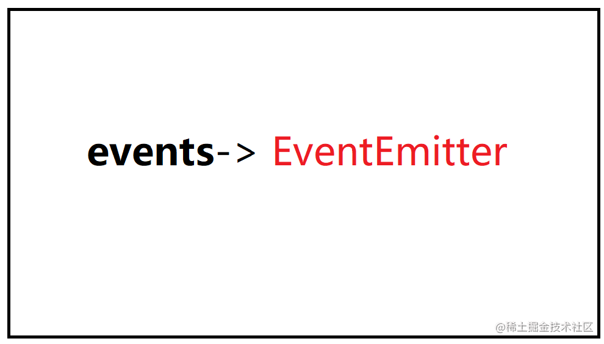

> 大多数 `Node.js` 核心 `API` 构建于惯用的异步事件驱动架构。Events（EventEmitter 事件触发器）是一个基于订阅发布的设计模式【ps:后面专门有一个专题是设计模式的】。

`Node.js` 中绝大多数模块都依赖于此模块，`Net、HTTP、FS、Stream` 等，除了这些系统模块比较知名的 `Express`、`Koa` 框架中也能看到 `EventEmitter` 。


 #### 1: on &  emit & once

```js
    const Events = require("events");
    class MyEvent extends Events {}
    var e1 = new MyEvent();

    e1.on("start", (name) => {
      console.log("start:event11 ", name，this === el);
    });
    e1.on("start", () => {
       console.log("start:event22 ");
    });
    
    // 只执行一次的注册函数
    el.once('eat:breskfast',function(){
        console.log('eat breakfast')
    })

    e1.emit("start", "anikin"); 
    
    // 执行结果是: 可以多次监听一次触发
    // console.log("start:event11 ", name，this === el);
    // console.log("start:event22 ");
    
    el.emit('eat:breskfast')
```

 注意区分`on` 和`once`:
    
```js
    var num = 0;
    e1.on("test", function () {
      console.log("test", ++num);
    });

    e1.emit("test");  //  test,1
    e1.emit("test");  //  test,2
    
    // 如果是once 
     e1.once("test", function () {
      console.log("test", ++num);
    });
    
    e1.emit("test");  //  test,1
    e1.emit("test");   //  test,1
    
    // 再次验证
    e1.prependOnceListener("test", function () {
      console.log("apend test", ++num);
    });
    
    e1.emit("apend test");  //   test,1
    e1.emit("test");   //  test,2
    
```
`prependOnceListener`方法可用于将事件监听器添加到监听器数组的开头。下次调用的时候也会清楚自身的，不会多次调用。

#### 2: 异步或者同步 
`EventEmitter` 以注册的顺序同步地调用所有监听器。 这样可以确保事件的正确排序，并有助于避免竞态条件和逻辑错误。 当适当时，监听器函数可以使用 `setImmediate()` 和 `process.nextTick()` 方法切换到异步的操作模式：

```js
    const myEmitter = new MyEmitter();
    myEmitter.on('event', (a, b) => {
      setImmediate(() => {
        console.log('异步地发生');
      });
    });
    myEmitter.emit('event', 'a', 'b');
```
#### 3： error

当 `EventEmitter` 实例出错时，应该触发 `error`事件。 这些在`Node.js`中被视为特殊情况。如果没有为 `error`事件注册监听器，则当 `error`事件触发时，会抛出错误、打印堆栈跟踪、并退出 `Node.js` 进程。

```js
const myEmitter = new MyEmitter();
myEmitter.emit('error', new Error('错误信息'));
```


#### 4：解决高并发下的雪崩问题
对于需要查询 `DB` 的数据，我们一般称之为热点数据，这类数据通常是要在 DB 之上增加一层缓存，但是在高并发场景下，如果这个缓存正好失效，此时就会有大量的请求直接涌入数据库，对数据库造成一定的压力，对于缓存雪崩的解决方案，网上也不乏有更好的解决方案，但是在` Node.js` 中我们可以利用 events 模块提供的 once() 方法来解决。

当触发多次相同名称事件，通过 `once` 添加的侦听器只会执行一次，并且在执行之后会接触与它关联的事件，相当于 on 方法和 `removeListener` 方法的组合，源码体现：

```js
    function onceWrapper(...args) {
      if (!this.fired) {
        this.target.removeListener(this.type, this.wrapFn);
        this.fired = true;
        return Reflect.apply(this.listener, this.target, args);
      }
    }

    function _onceWrap(target, type, listener) {
      var state = { fired: false, wrapFn: undefined, target, type, listener };
      var wrapped = onceWrapper.bind(state);
      wrapped.listener = listener;
      state.wrapFn = wrapped;
      return wrapped;
    }

    EventEmitter.prototype.once = function once(type, listener) {
      checkListener(listener);

      this.on(type, _onceWrap(this, type, listener));
      return this;
    };
```

利用 `once` 方法将所有请求的回调都压入事件队列中，对于相同的文件名称查询保证在同一个查询开始到结束的过程中永远只有一次，如果是 DB 查询也避免了重复数据带来的数据库查询开销。代码编写参考了深入浅出 Nodejs Events 模块一书，这里使用 fs 进行文件查询，如果是 DB 也同理，另外注意使用 status 键值对形式保存了触发/监听的事件名称和状态，最后建议进行清除，避免引起大对象导致内存泄露问题。

```js
    const events = require('events');
    const emitter = new events.EventEmitter();
    const fs = require('fs');
    const status = {};

    const select = function(file, filename, cb) {
        emitter.once(file, cb);

        if (status[file] === undefined) {
            status[file] = 'ready'; // 不存在设置默认值
        }
        if (status[file] === 'ready') {
            status[file] = 'pending';
            fs.readFile(file, function(err, result) {
                console.log(filename);
                emitter.emit(file, err, result.toString());
                status[file] = 'ready';

                setTimeout(function() {
                    delete status[file];
                }, 1000);
            });
        }
    }

    for (let i=1; i<=11; i++) {
        if (i % 2 === 0) {
            select(`/tmp/a.txt`, 'a 文件', function(err, result) {
                console.log('err: ', err, 'result: ', result);
            });
        } else {
            select(`/tmp/b.txt`, 'b 文件', function(err, result) {
                console.log('err: ', err, 'result: ', result);
            });
        }
    }
```
其实上面代码比较繁琐，说简单点就是加了一个锁来实现。


默认情况下，如果为特定事件添加了超过 10 个监听器，则 EventEmitter 会打印一个警告。 但是，并不是所有的事件都要限制 10 个监听器。 `emitter.setMaxListeners()` 方法可以为指定的 EventEmitter 实例修改限制。


许多 Node.js 成功的模块和框架都是基于 `EventEmitter` 的，学会 `EventEmitter `的使用，并且知道该在什么时候去使用是非常有用的。

`EventEmitter` 本质上就是观察者模式的实现，一个类似的模式是发布/订阅，生产者将消息发布之后无需关心订阅者的实现，类似`RabbitMQ` 本身也是基于 `AMQP` 协议，这在一个分布式集群环境中使用也是非常好的一种方案。

# 参考：
 http://nodejs.cn/api/events.html


 
 


```


```