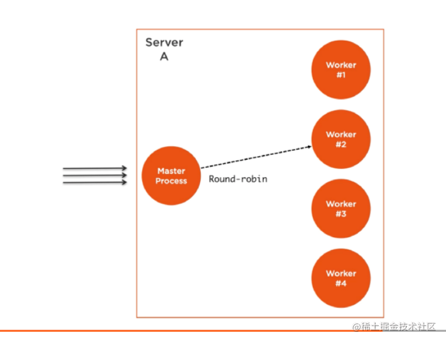
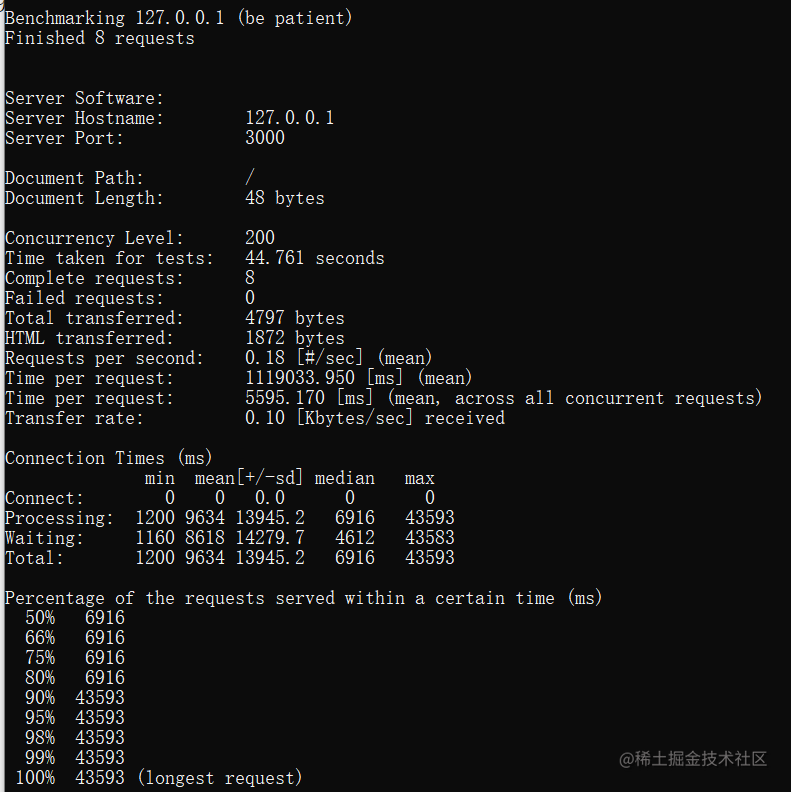
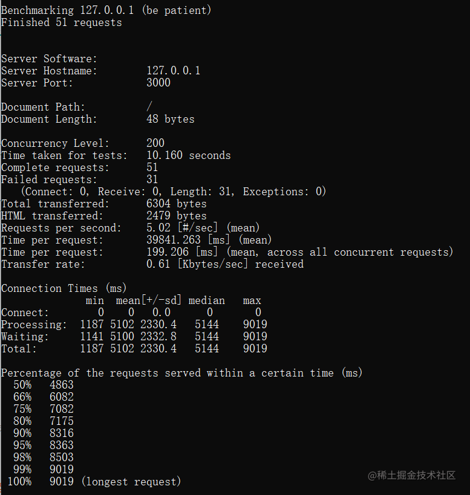

`Node` 的 `cluster` 模块不仅提供了充分利用机器` CPU` 内核开箱即用的解决方案，还有助于 `Node` 进程增加可用性的能力，另外还提供了一个选项 - 无停机重启整个应用的能力。

## 原理

**集群（cluster）** 模块可以被用来在多核 `CPU` 环境负载均衡。基于子进程的 `fork` 【[进程和线程里面有讲到](https://juejin.cn/post/6975804808389197838)】方法并且主要允许我们根据 `CPU` 核数衍生很多次主应用进程。然后主进程将接管并且通过主进程与所有的子进程的交流实现负载均衡。


`cluster` 模块的工作的结构很简单。我们创建一个 主进程并且主进程衍生`（fork）`了一些工作进程`（worker process）`，然后管理它们。每一个工作进程代理表了一个我们想要扩展的应用的一个实例。所有到来的请求都被主进程所处理，它决定着哪一个工作进程应该处理一个到来的请求



主进程的工作很简单，因为它实际上只使用了一个调度轮询算法去选择一个工作进程。默认在除了 `windows` 的所有平台是可用的，它可以被全局的更改让负载均衡被操作系统去处理。

调度轮询算法在循环的基础上通过所有可用的进程，将负载均匀地分布。第一个请求转发给第一个工作进程，第二个被转发到列表中的下一个工作进程，以此类推。当到达列表的最后，算法将会再一次从列表的头部开始。

这是一个最简单和最广泛使用的负载均衡算法。但是并不是唯一的一个。更多有特色的算法允许赋权和选择最小负载量的或者最快响应的那一个服务器。


## 负载均衡一个 HTTP 服务器
让我们使用 `cluster` 模块克隆和负载一个简单的 `HTTP` 服务器。这里有一个很简单的例子，稍微改动了，模拟在响应之前 `CPU` 的工作。


```js
    const http = require("http");
    const pid = process.pid;

    const longComputation = () => {
      let sum = 0;
      for (let i = 0; i < 1e9; i++) {
        sum += i;
      }
      return sum;
      v;
    };

    http
      .createServer((req, res) => {
        let start = Date.now();
        let sum = longComputation();
        res.end(`Sum is ${sum}--time-${Date.now() - start}--pid = ${pid}`);
      })
      .listen(3000, () => {
        console.log(`started process`, pid);
      });

```
`abs`压测： `ab -c200 -t10 http://localhost:3000/`

这个命令会没 10 秒钟发送 200 个并发请求来测试负载服务器。



由上图可以看出，由于我本地win性能比较差，几乎每秒钟处理0.18个请求。

接下来使用`cluster`来实现：

`main.js`:

```js
const cluster = require("cluster");
const numCPUs = require("os").cpus().length;

// 判断 cluster.js 文件是否在主进程上面加载的
// 第一次执行这个文件，我们将会在主进程上面执行并且 isMaster 标识将会被设置为 true。
console.log(
  `isMaster = ${cluster.isMaster},  isWorker = ${cluster.isWorker} cpu = ${numCPUs}`
);

if (cluster.isMaster) {
  for (let i = 0; i < numCPUs; i++) {
    cluster.fork();
  }

  cluster.on("exit", (worker, code, signal) => {
    console.log(`工作进程 ${worker.process.pid} 已退出`);
  });
} else {
  console.log(`工作进程 ${process.pid} 已启动`);
  require("./server.js");
}

```
`server.js`:

```js
// server.js
const http = require("http");
const pid = process.pid;

const longComputation = () => {
  let sum = 0;
  for (let i = 0; i < 1e9; i++) {
    sum += i;
  }
  return sum;
};

http.createServer((req, res) => {
    let start = Date.now();
    let sum = longComputation();
    console.log("===", count++);
    res.end(`Sum is ${sum}--time-${Date.now() - start}--pid = ${pid}`);
  }).listen(3000, () => {
    console.log(`started process`, pid);
  });

```



这次发现负载提高到了 `5次/s`,翻了`27`倍。

`cluster` 模块提供`isMaster`判断是否在主进程上面加载的。第一次执行这个文件，我们将会在主进程上面执行并且 `isMaster:true`。根据系统中 `cpu` 的数量创建尽可能多的工作进程，充分利用多核的优势。

**当在主进程里执行 `cluster.fork` 之后，当前文件将会被再次执行，不过这次是在 `worker` 模式执行的 `isMaster:false`。标识工作进程的`isWorker:true`。**

当应用作为一个 `worker` 运行时，它可以做些实际的工作。这是我们需要定义我们服务逻辑的地方，例如，我们可以通过导入之前就已经存在的 `server.js` 文件。

我的机器上面有 `8` 核，因此有 `8`个进程。理解它们是完全不同的`Node.js`进程非常重要。每一个工作进程将会有自己的事件循环和内存空间。


通过进程信息我们可以分析，创建了8个单独的进程。


## 向所有的工作进程广播信息

在主进程和工作进程之间交流很容易，因为在 `cluster` 模块底层使用的是 `child_process.fork API`，意味着在主进程和工作进程之间有通信通道。

主进程发送广播消息给所有的工作进程：在`main.js`主进程添加：
```js
// cluster.workers 储存了活跃的工作进程对象，使用 id 作为键名。
  //  这使得可以方便地遍历所有工作进程。 只能在主进程中调用
  let workerData = Object.values(cluster.workers);
  workerData.forEach((w) => {
    w.send({
      msg: "hi-->from master",
      id: w.id,
    });
  });
```
为了从主进程中读取收到的信息，我们可以在全局 `process` 对象上面注册一个 `message` 事件。 eg: `server.js` 结尾添加

```js
process.on("message", (msg) => {
  console.log(`Message from master:  ${msg.msg}--${msg.id}`);
});
```
每个工作进程从主进程接受信息。注意工作进程并没有按顺序。

## 增加服务器的可用性

在一个 `Node` 应用内运行一个单一实例，其中一个问题就是当实例崩溃时，应用不得不重启。这意味着即使这个过程是自动的，在两个行为之间应该也有一些停机时间。

这种情况也适用于当服务器部署新的代码必须重新启动。使用一个实例，将会有停机时间影响系统的可用性。

当我们有多个实例时，用一些额外少量的代码很容易地增加系统的可用性。比如我们在`master`主进程上增加监听，如果出发`exit`就重新开启一个进程。

```js
 // 在 isMaster=true 块里面的 for 循环后面
  cluster.on("exit", (worker, code, signal) => {
    // 如果工作进程由于 .kill() 或 .disconnect() 而退出，则此属性为 true。
    // 如果工作进程以任何其他方式退出，则为 false。 如果工作进程尚未退出，则为 undefined。
    // 可以用于区分自发退出还是被动退出
    if (code !== 0 && !worker.exitedAfterDisconnect) {
      console.log(`工作进程 ${worker.id} 崩溃了，正在开始一个新的工作进程`);
      cluster.fork();
    }
  });
```
上面添加一个很好的判断条件，确保工作进程崩溃了，而不是手动断掉连接或者被主进程杀掉了。例如，主进程可能根据负载模式判断我们使用了太多的资源，它认为在这种情况下需要杀掉一些工作进程。

## 不停机重启

当我们想要重启所有的工作进程，比如，我们需要部署一些新的代码。

我们有多个实例在运行，因此我们可以一次只启动他们之中的一个，而不是全部重启，允许当一个工作进程重启的时候，其他的工作进程继续服务请求。

用集群模块实现这个很容易。因为我们不想重启主进程，我们需要一个方法发送给主进程一个命令指导它去重启所有的工作进程。这个在 `Linux` 系统上面容易，我们可以简单的监听像 `SIGUSR2` 事件，这个事件在我们在进程 `id` 上面使用 `kill` 命令时，会触发并且将那个标志发送过去。

```js
// In Node
process.on('SIGUSR2', () => { //... });

//触发
$ kill -SIGUSR2 PID
```
这种方式，主进程不会被杀掉并且有了一个我们可以指导它做一些事情的方式。在这里使用的 `SIGUSR2` 是一个合适的标志，因为这将会是一个用户命令。如果你在疑惑为什么不是 `SIGUSR1`，因为被 `Node` 用来调试`（debugger）`用了，需要避免冲突。

不幸的是，在 `windows` 上面，这些进程标志（`signal）`不被支持，我们需要找到另一种方式命令主进程做一些事情。这里有一些替代的方案。例如，我们可以使用标准的输入或者 `socket` 输入。或者我们可以模拟一个 `process.pid` 文件的退出并且监视它的删除事件。但是为了让个示例简单，我们假设这个服务器在 `Linux` 上面运行。

在我们的例子中，当主进程接受到一个 `SIGUSR2` 标志，意味着是时候重启它的工作进程了，但是我们需要一次只重启一个工作进程。这也简单地意味着主进程在重启完当前的工作进程后应该重启下一个工作进程。

为了开始这个任务，我们需要使用 `cluster.workers` 对象得到一个所有当前进程地引用，我们可以在一个数组中存储下来。

然后，我们可以创建一个接受一个需要重启的工作进程的索引的 `restartWorker` 函数。我们在它已经为下个工作进程准备好了，然后调用函数，在序列里面做重启的工作。下面有一个我们可以在示例中使用的 `restartWorker` 函数：

```js
const workers = Object.values(cluster.workers);
```
然后，我们可以创建一个接受一个需要重启的工作进程的索引的 `restartWorker` 函数。我们在它已经为下个工作进程准备好了，然后调用函数，在序列里面做重启的工作。下面有一个我们可以在示例中使用的 `restartWorker` 函数：


```js
const restartWorker = (workerIndex) => {
    const worker = workers[workerIndex];
    if(!worker) return;
    worker.on('exit', () => {
        if (!worker.exitedAfterDisconnect) return;
        console.log('退出的进程', worker.process.pid);

        cluster.fork().on('listening', () => {
            restartWorker(workerIndex + 1);
        });
    });
    worker.disconnect();
};

restartWorker(0);
```
在 `restartWorker` 函数内部，我们获取到一个需要重启的工作进程的引用，我们会从序列里面递归地调用这个函数，我们需要一个停止的条件。当我们不再需要重启一个工作进程时，我们可以返回（return）。我们基本上想要断掉（`disconnect`）这个工作进程（使用 worker.disconnect）时，但是在重启下一个工作进程之前，我们需要衍生一个新的工作进程代替当前这个我们我想要断掉的工作进程。

我们可以使用工作进程上面的 `exit` 事件，当前的进程退出后，衍生一个新的工作进程，但是我们不得不保证这个 exit 行为实际上是被一个正常 `disconnect` 调用之后触发的。我们可以使用 `exitedAfterDisconnect` 标识。如果这个标识不是 true，那么这个退出行为是被其他一些事情引起的而不是我们的 `disconnect `调用，我们应该立马退出函数。但是如果这个标识是 true，我们可以继续并且衍生一个新的工作进程代替刚刚我们断掉的那个工作进程。

当这个新的衍生的工作进程准备好后，我们再重启下一个。然后记住衍生的进程不是同步的，因此我们不能再衍生调用之后直接重启下一个工作进程。应该是，我们在一个新衍生的工作进程上面模拟一个 listening 事件，告诉我们这个工作进程连接上了并且准备好了。当这个事件触发时，我们可以安全地重启序列中的下一个工作进程。

这就是我们需要的不停机重启。为了测试，你需要读取主进程的process id 并且将它发送到 SIGUSR2 标志：


```js
console.log(`Master PID: ${process.pid}`);
```

开启这个集群，复制主进程 id，并且使用 `kill -SIGUSR2 PID` 命令重启这个集群。


参考文章：

1： https://www.freecodecamp.org/news/scaling-node-js-applications-8492bd8afadc/
