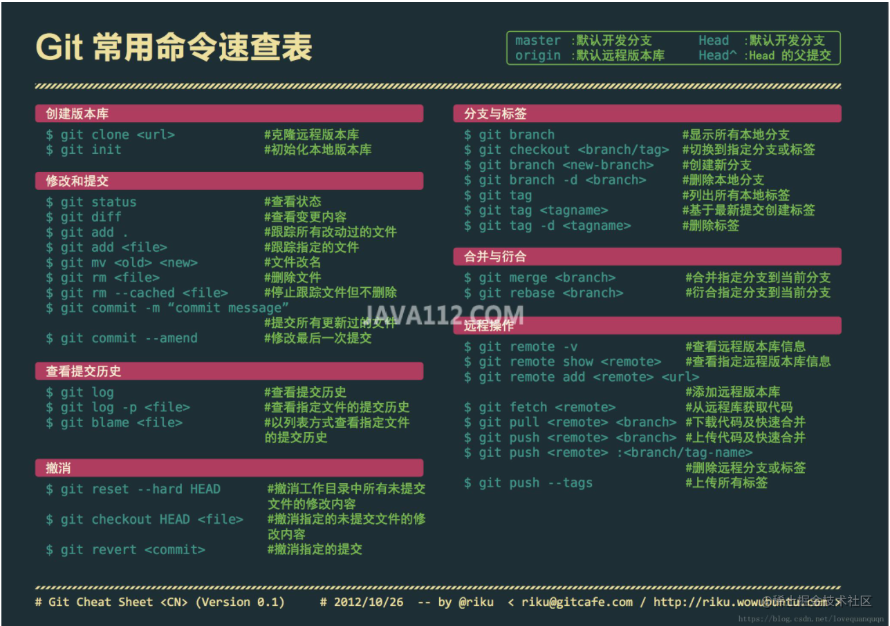

日常开中，公司电脑除了提交公司项目以外，我们可能还需要维护自己的小仓库，因为需要在本地可以支持多个`git`项目的提交。

```js
// 1： 生成本地公钥

// 生成git1.com 对应的账号
ssh-keygen -t rsa -C "tom@git1.com" -f ~/.ssh/id_rsa_git1

// 生成git2.com 对应的账号
ssh-keygen -t rsa -C "tom@git1.com" -f ~/.ssh/id_rsa_git2


// 2: 将对应的id_rsa_git1 和 id_rsa_git2 上传到仓库的ssh配置


// 3: 把密钥对添加到配置列表，
ssh-agent bash
ssh-add ~/.ssh/id_rsa_git1
ssh-add ~/.ssh/id_rsa_git2


```

4: 删除全局配置：

```js
git config --gloabl --unset user.name
git config --global --unset user.email

```

5: 进入对应的git工程，然后再次设置当前的用户名：

```js
git config user.name zhansgan
git config user.name zhangsan@gmail.com

```

6: 添加配置
在`.ssh/config` 新建一个`config`的配置文件，内容是：

```shell
   Host git.100tal.com
    Hostname git.100tal.com
    User zhangsan
    IdentityFile C:\Users\zhangsan\.ssh\id_rsa_yach

    Host gitee.com
        HostName gitee.com
        User zhaosi
        PreferredAuthentications publickey
        IdentityFile ~/.ssh/id_rsa_gitee
```

7: 测试

```js
ssh -T git@git1.com
ssh -T git@git2.com
```


