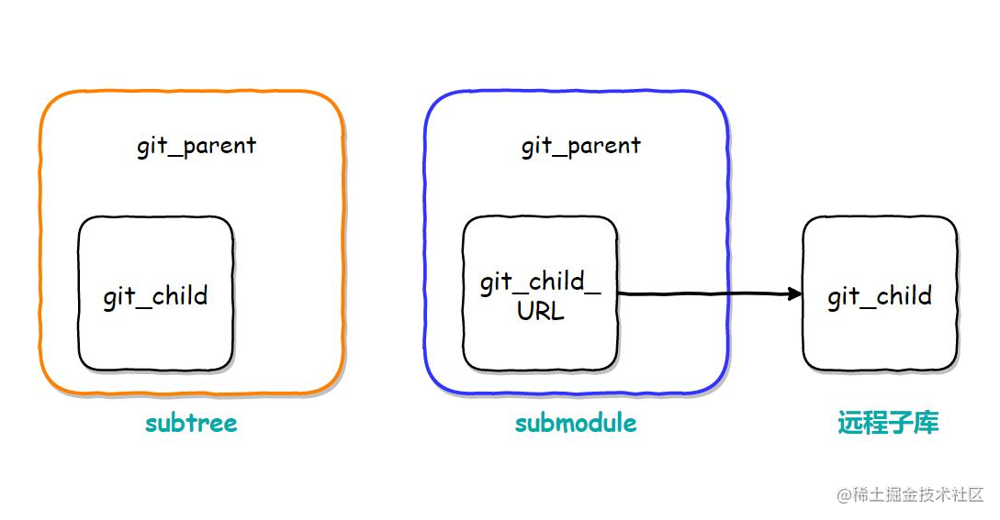
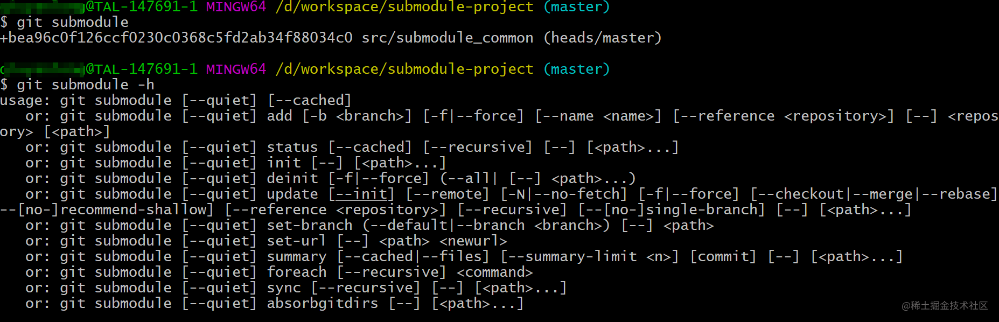
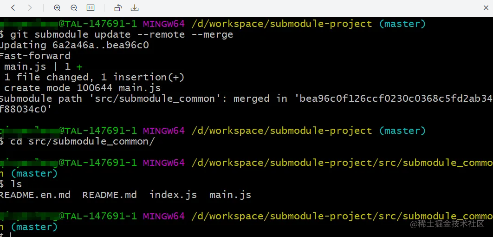

`submodule`  在很多大公司的大项目中非常常见，相比于`npm`等单独封装发版等来说要方便很多，也非常方便与项目管理。子模块允许你将一个 `Git` 仓库作为另一个 `Git` 仓库的子目录。 它能让你将另一个仓库克隆到自己的项目中，同时还保持提交的独立。




# 添加

```js
   
  // 1 新建一个主项目 submodule-project
  git clone  git@gitee.com:zhaosi/submodule-project.git

  // 2 另外存在一个子项目  submodule_common
  git submodule add https://gitee.com/zhaosi/submodule_common.git  // 默认添加到当前目录

  // 或者 默认添加到src目录下
  git submodule add https://gitee.com/zhaosi/submodule_common.git  src/submodulePath  

```
这个时候会生成一个 `.gitmoudles`的配置文件：

```shell
 
# 特点是子项目名称会包含路径 这个名称用途比较多 
[submodule "src/submodule_common"]
	path = src/submodule_common
	url = https://gitee.com/zhaosi/submodule_common.git

```
该文件也像 `.gitignore` 文件一样受到（通过）版本控制。 它会和该项目的其他部分一同被拉取推送。 这就是克隆该项目的人知道去哪获得子模块的原因。

# 删除 

删除子模块比较麻烦，需要手动删除相关的文件，否则在添加子模块时有可能出现错误。


### 1：删除子模块文件夹

```shell
 git rm --cached src/submodule_common
 rm -rf src/submodule_common
```

### 2: 删除.gitmodules文件中相关子模块信息

```shell
# 注释或者删除
# [submodule "src/submodule_common"]
#  path = src/submodule_common
#  url = https://gitee.com/zhaosi/submodule_common.git
```


### 3：删除.git/config中的相关子模块信息

```shell
# 注释或者删除
# [submodule "src/submodule_common"]
#  url = https://gitee.com/zhaosi/submodule_common.git
```

### 4; 删除.git文件夹中的相关子模块文件

```javascript

 // 一定注意 这个都是带着路径的 
 rm -rf .git/modules/src/submodule_common
```


# 拉去

```shell

# 1 主项目
git clone  git@gitee.com:zhaosi/submodule-project.git

# 2 返回值带下划线就代表这个子项目为空  待拉去 pedding状态
git submodule
# -6a2a46a092b075a0b6c5d1e09ed0728216a61558 src/submodule_common (heads/master）

# 3 初始化: 用来初始化本地配置文件
git submoduel init 

# 4 更新: 则从该项目中抓取所有数据并检出父项目中列出的合适的提交
git submoduel update 

# 或者 34合并写为一步：拉下来子项目可能是游离态
# 需要手动切换到分支 主动 pull 一下
git submodule update --init --recursive


# 5：当子项目远端代码有更新的时候
# a): 可以直接合使用单独仓库一样，cd src/submodule_common 然后 git pull 也可以。
# b): 也可以直接在主项目更新：git将会进入子模块然后抓取并更新，默认更新master分支

git submodule update --remote # 默认会更新master分支，也会让子模块游离，跟上面一样
git submodule update --remote --merge # 或者可以添加分支名称

```





除了上面这样拉去以外，还可以使用下面的命令直接一步到位：

```shell
git clone --recurse-submodules https://github.com/chaconinc/MainProject
````


`