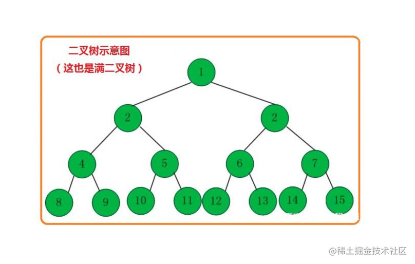
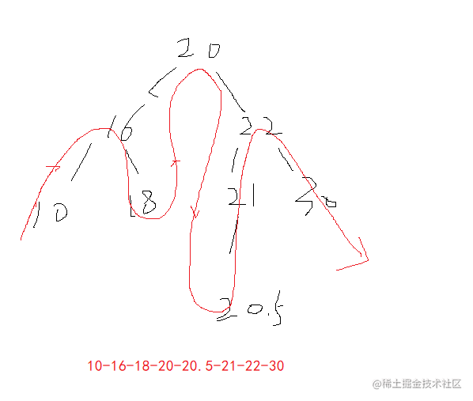
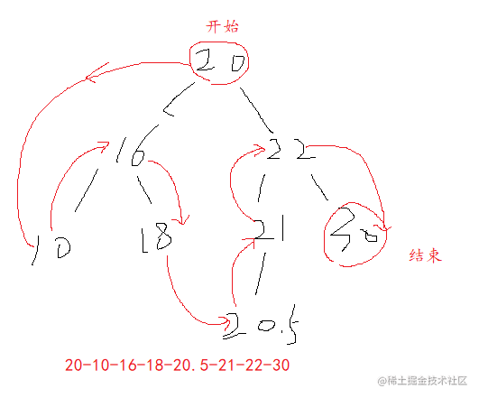

## 概念 
二叉树：最多只有两个子节点，左子节点和右子节点。

- 根节点
- 叶子节点
- 高：二叉树的层级

## 排序二叉树 Binary search tree：
排序二叉树满足：左小右大的特性。第i层最大子节点：`2^(i-1)`，也叫二叉搜索树。
代码实现一棵树，先定义每一个节点：

```js
function Node(data, left, right) {
  this.data = data;
  this.left = left;
  this.right = right;
  this.show = show;
}
```
其次是主要的`BST`的构造函数的实现：

```js
    function BST() {
      this.root = null;
      this.insert = insert;
      this.insertNode = insertNode;
      this.inOrder = inOrder;
      this.preOrder = preOrder;
      this.postOrder = postOrder;

      // 查找：特定的值 最大值 最小值
      this.find = find;
      this.max = max;
      this.min = min;

      // 删除
      this.remove = remove;
    }
```
#### 1: show 

```js
function show() {
  return this.data;
}
```
#### 1: insert

- 第一种递归方法实现：

```js
function insert(value) {
  let newNode = new Node(value, null, null);
  if (!this.root) {
    this.root = newNode;
  } else {
    this.insertNode(newNode, this.root);
  }
}


function insertNode(newNode, root) {
  if (newNode.data < root.data) {
    if (root.left === null) {
      root.left = newNode;
    } else {
      this.insertNode(newNode, root.left);
    }
  } else {
    if (root.right === null) {
      root.right = newNode;
    } else {
      this.insertNode(newNode, root.right);
    }
  }
}
```
- 第二种遍历实现

```js
function insert(value) {
  let newNode = new Node(value, null, null);
  if (!this.root) {
    this.root = newNode;
  } else {
     let current = this.root;
     let parent;
     while (true) {
      parent = current;
      if (value < current.data) {
        current = current.left;
        if (current === null) {
          parent.left = newNode;
          break;
        }
      } else {
        current = current.right;
        if (current === null) {
          parent.right = newNode;
          break;
        }
      }
    }
  }
}
```
#### 3:  中序遍历 inOrder
从叶子节点开始，最后结果是从小到大的排序展示。


```js
// 中序遍历
function inOrder(node) {
  if (node !== null) {
    inOrder(node.left);
    putstr(node.show());
    inOrder(node.right);
  }
}
```

#### 4: 先序遍历 preOrder

 先访问根节点，然后是左子树，再到右子节。
 


```js
    function preOrder(node) {
      if (node !== null) {
        putstr(node.show());
        preOrder(node.left);
        preOrder(node.right);
      }
    }
```

#### 5: 后序遍历 postOrder
 后序遍历：先访问叶子节点，再然后左子树右子树依次进行遍历访问

```js
    function postOrder(node) {
      if (node != null) {
        postOrder(node.left);
        postOrder(node.right);
        putstr(node.show());
      }
    }
```
#### 6：max

```js
    function max() {
      let maxV = null;
      let current = this.root;
      while (current.right) {
        current = current.right;
      }
      return current;
    }
```

#### 7: min

```js
    function min() {
      let maxV = null;
      let current = this.root;
      while (current.left) {
        current = current.left;
      }
      return current;
    }

```

#### 8: find

```js
    function find(v) {
      let current = this.root;
      while (current) {
        if (v < current.data) {
          current = current.left;
        } else if (v > current.data) {
          current = current.right;
        } else {
          return current;
        }
      }
      return null;
    }
```

#### 9: remove

  二叉树的删除：
     先找到这个要删除的节点，然后考虑到三种情况
        - 该节点是叶子节点: 将其父节点的引用置为null
        - 该节点有一个子节点: 因为这个节点肯定是父节点小，因此直接将父节点指向删除节点的子节点
        - 该节点有两个子节点
 


```js
function remove(v) {
  // 寻找要删除的节点

  let current = this.root;
  let parent = null;
  let isLeftChild = false;

  while (current.data !== v) {
    parent = current;
    if (v < current.data) {
      isLeftChild = true;
      current = current.left;
    } else {
      isLeftChild = false;
      current = current.right;
    }

    // 找到了最后依然没有找到相等的节点
    if (current === null) return false;
  }

  console.log("reove", current, parent);

  // 删除根节点
  if (current.left === null && current.right === null) {
    if (current === this.root) {
      this.root = null;
    } else if (isLeftChild) {
      parent.left = null;
    } else {
      parent.right = null;
    }
  }

  // 删除的节点只有一个子节点
  else if (current.right === null) {
    // 需要考虑parent == this.root 的情况
    if (current === this.root) this.root = current.left;
    else if (isLeftChild) {
      parent.left = current.left;
    } else {
      parent.right = current.left;
    }
  } else if (current.left === null) {
    // 需要考虑parent == this.root 的情况
    if (current === this.root) this.root = current.right;
    else if (isLeftChild) {
      parent.left = current.right;
    } else {
      parent.right = current.right;
    }
  }

  // 删除的节点有两个子节点
  // 暂时先不会实现 后续补充
}
```

## 测试

```js
    var b = new BST();
    b.insert(56);
    b.insert(22);
    b.insert(10);
    b.insert(30);
    b.insert(81);
    b.insert(15);
    b.insert(11);
    b.insert(9);
    b.insert(17);
    console.log(b);
    b.postOrder(b.root);
    console.log("===", putstr());

    // var fv = b.find(9);
    // console.log(fv);

    console.log("最小节点是", b.min());
    console.log("最大节点是", b.max());

    b.remove(9);
```


