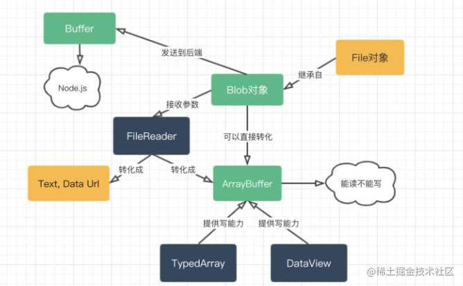
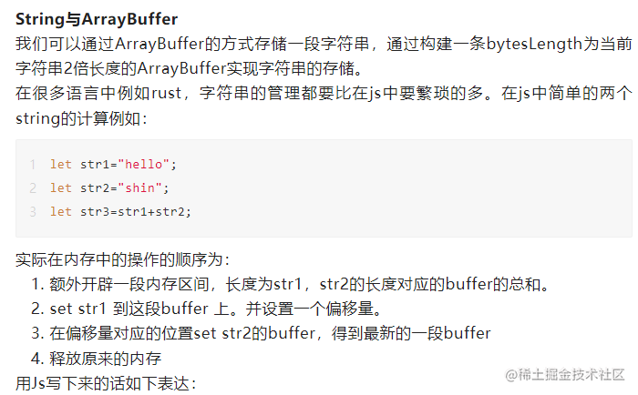
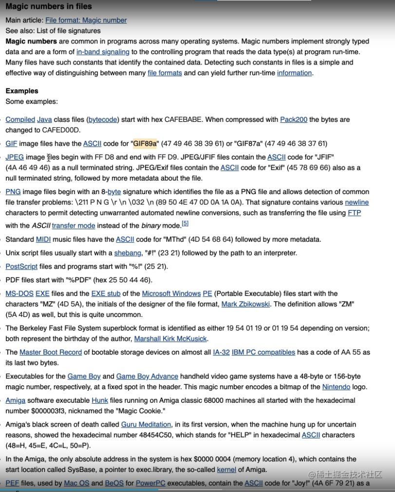
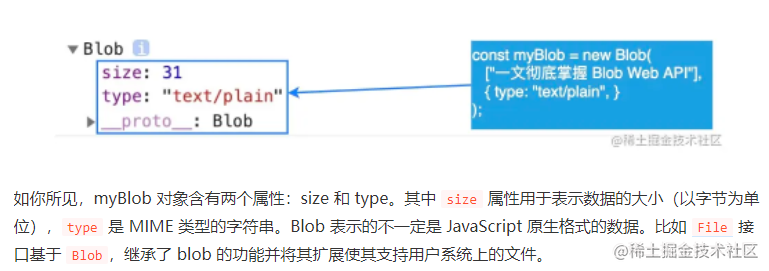

继承自这些文章：
- [你不知道的blob](https://juejin.cn/post/6844904178725158926#heading-0)
- [谈谈ArrayBuffer吧](https://mp.weixin.qq.com/s?__biz=Mzg2NDA5MzgyNA==&mid=2247483847&idx=1&sn=98eb685bf03fa2fa9efce4a6dc5776f4&chksm=ce6fd228f9185b3ec716aeb39057324b318934c3b9033b2d80144a99325d895ff9d22619c00b&mpshare=1&scene=24&srcid=0824UZJSZN4gRO3Cmbz0juGm&sharer_sharetime=1629767158098&sharer_shareid=ea92918c9c00daf5da2901de191de257#rd)
- [ArrayBuffer和TypedArray、DataView的关系](https://robberfree.github.io/fe/2020-04-21/index.html)
- [聊聊JS的二进制家族：Blob、ArrayBuffer和Buffer](https://zhuanlan.zhihu.com/p/97768916)
- [Fetch API 教程](https://www.ruanyifeng.com/blog/2020/12/fetch-tutorial.html)



# 1: ArrayBuffer
- 以字节为单位进行存储的
- 表示固定长度的通用的二进制数据，不能直接操作
- 类型化数组进行操作arraybuffer

一般叫做`byte array`(字节数组)，可以直接操作，元素值的范围在[0,255]之间，类似于`Uint8Array`。同一`ArrayBuffer`可以用不同的视图，以不同的 **“视角”** 去读写。


```ts
// 一个字节 = 8bits 位 初始化默认都是0
// 创建一个8个字节的内存池，也就是最大是8*8 = 64位
const buffer = new ArrayBuffer(8);
console.log("buffer: ", buffer.byteLength, buffer);


// 表示：类型化数组Int8Array 大小是1个bytes  长度是：8/1 = 8;
// 使用这个试图去填充内存池填写满，最大需要8个字节，也就是8个-127-128范围内的整数
const view8 = new Int8Array(buffer);
console.log("view8: ", view8);

// 使用16位无符号,大小是2个bytes，长度是： 8/2 = 4
const view16 = new Uint16Array(buffer);
console.log("view16: ", view16);

// Int8Array 只能够存贮数字
// view[0] = "A";
// 也有范围限制Int8Array  -128-128
// view[0] = 9999;
// view[0] = 129;

// 代表试图上的buffer指向的就是原内存数据
 console.log("view: ", view, view.buffer === buffer); // true
```

### 案例1：


```js
function stringAdd(str1: string, str2: string) {
  const buffer = new ArrayBuffer(str1.length + str2.length);
  const view = new Uint8Array(buffer);
  let offset = 0;

  for (let i = 0; i < str1.length; i++) {
    view[i] = str1.charCodeAt(i);
    offset++;
  }

// charCodeAt() 方法可返回指定位置的字符的 Unicode 编码。这个返回值是 0 - 65535 之间的整数。
// 由上图可以知道，这个范围刚好是Uint16Array所表示的范围：表示给定索引处的 UTF-16 代码单元
  for (let i = 0; i < str2.length; i++) {
    view[offset + i] = str2.charCodeAt(i);
  }

  offset = 0;
  str1 = "";
  str2 = "";
  let res = "";
  for (let j = 0; j < view.length; j++) {
    // 返回由指定的 UTF-16 代码单元序列创建的字符串
    res += String.fromCharCode(view[j]);
  }
  return res;
}
```

### 案例2 图片类型检测

`magic number` 表示：




图片的真是类型是判断方法：

```js
// 上传预览异步的写法
const uploadHandle = (e: any) => {
  const file = e.srcElement.files[0];
  console.log("file: ", file);
  const fileLoader = new FileReader();
  fileLoader.onload = function () {
    const view = new Uint8Array(this.result);
    console.log("view: ", view);
    console.log(checkTypePng(view));
  };
  fileLoader.readAsArrayBuffer(file);
};


// png的类型检测方法
function checkTypePng(buffer) {
  const pngStart = ["89", "50", "4E", "47", "0D", "0A", "1A", "0A"];
  const len_8 = buffer.slice(0, 8);
  
  // 解释一下：pngStart[4].toString(16) === 'a', 所以补全了前面的0
  
  const checkPng = len_8.every(
    (item, index) =>
      item.toString(16).padStart(2, "0").toLocaleUpperCase() === pngStart[index]
  );

  if (checkPng) return "png";
}

// gif的第一种检测方法
function checkTypeGif1(buffer) {
  const gifArray = ["47", "49", "46", "38", "39", "61"]; // 或者检测GIF89A
  let offset = 0;
  for (let i = 0; i < buffer.length; i++) {
    if (gifArray[i] === toHex(buffer[i])) {
      offset++;
    } else {
      offset = 0;
    }
    if (offset === gifArray.length) return "gif";
  }
}

// gif的第二种检测方法
function checkTypeGif2(buffer) {
  const gifArray = "GIF89A"; // 或者检测
  let res = "";
  let offset = 0;
  for (let i = 0; i < buffer.length; i++) {
    const activeString = String.fromCharCode(buffer[i]).toLocaleUpperCase();
    res += activeString;
    offset++;
    if (offset === gifArray.length) {
      if (gifArray === res) return "gif";
      break;
    }
  }
}

// jpeg
function checkTypeJpeg(buffer) {
  if (
    toHex(buffer[0]) === "ff" &&
    toHex(buffer[1]) === "d8" &&
    toHex(buffer[buffer.byteLength - 1]) === "d9" &&
    toHex(buffer[buffer.byteLength - 2]) === "ff"
  ) {
    return "jpeg";
  }
}

function toHex(number) {
  return number.toString(16);
}

```

**上面的做法是转化未了ASCll字符，但是其实可以直接反推为10进制的数据，buffer里的不在需要转换，直接可以拿来比较。**

# 2：blob

Blob（Binary Large Object）表示二进制类型的大对象。在数据库管理系统中，将二进制数据存储为一个单一个体的集合。Blob 通常是影像、声音或多媒体文件。**在 JavaScript 中 Blob 类型的对象表示不可变的类似文件对象的原始数据。**




a 标签下载图片等，一般如果是非同源是无法下载的，一般是直接会跳转打开，因此可以采用`blob`的形式来下载。
```js
  <a
    href="https://t7.baidu.com/it/u=4036010509,3445021118&fm=193&f=GIF"
    download
    >下载网络图片</a
  >
  <div><button @click="downloadXml">下载网络图片-xml</button></div>
  <div><button @click="downloadFetch">下载网络图片-fetch</button></div>
  <a :href="wumen" download>下载本地图片</a>
```

下面案例用到的html
```js

// 下载html
const downHtml = () => {
  const blob = new Blob([`<a download>下载本地图片</a>`], {
    type: "text/plain",
  });
  const blobUrl = URL.createObjectURL(blob);
  const atag = document.createElement("a");
  atag.setAttribute("href", blobUrl);
  atag.setAttribute("download", "另存为.html");
  atag.click();
  atag.remove();
  URL.revokeObjectURL(blobUrl);
};

```

```js
const downloadXml = async () => {
  const url = "https://t7.baidu.com/it/u=4036010509,3445021118&fm=193&f=GIF";
  const xhr = new XMLHttpRequest();
  xhr.open("GET", url);
  xhr.send();
  xhr.responseType = "blob";
  xhr.onload = function () {
    const res = xhr.response;
    const blobUrl = URL.createObjectURL(res);
    // 先预览同步的写法
    const imgTag = new Image();
    imgTag.src = blobUrl;
    imgTag.onload = function () {
      document.body.appendChild(imgTag);
    };

    const atag = document.createElement("a");
    atag.setAttribute("href", blobUrl);
    atag.setAttribute("download", "下载图片");
    atag.click();
    atag.remove();
    URL.revokeObjectURL(blobUrl);
  };
};
```


```js
const downloadFetch = async () => {
  const url = "https://t7.baidu.com/it/u=4036010509,3445021118&fm=193&f=GIF";
  const myRequest = new Request(url);
  fetch(myRequest)
    .then((response) => response.blob())
    .then((res) => {
      const blobUrl = URL.createObjectURL(res);
      const atag = document.createElement("a");
      atag.setAttribute("href", blobUrl);
      atag.setAttribute("download", "美女图片");
      atag.click();
      atag.remove();
      URL.revokeObjectURL(blobUrl);
    })
    .catch((e) => console.log("catch eee", e));
};
```

下面代码需要用到的注释：
参考`readerText` 读取大文件日志导致内存奔溃，可以采取 buffer的部分读取来解决这个问题，[参考链接](https://joji.me/zh-cn/blog/processing-huge-files-using-filereader-readasarraybuffer-in-web-browser/)
    
```js
// 上传预览异步的写法
const uploadHandle = (e: any) => {
  const file = e.srcElement.files[0];
  const fileLoader = new FileReader();

  console.log(file);
  if (file.type === "text/plain") {
    // 是文本类型
    fileLoader.readAsText(file);
    fileLoader.onload = function () {
      document.body.insertAdjacentText("beforebegin", this.result as string);
    };
  } else if (file.type === "text/html") {
    // 参考注释
    fileLoader.readAsArrayBuffer(file);
    fileLoader.onload = function () {
      //@ts-ignore
      const buffer = new Uint8Array(this.result);
      // 中文字符是3个长度 英文等是1个
      const snippet = new TextDecoder("utf-8").decode(
        buffer.slice(0, buffer.byteLength)
      );
      document.body.insertAdjacentText("afterend", snippet);
    };
  } else {
    // 图片类型
    const img = new Image();
    document.body.appendChild(img);
    fileLoader.onload = function () {
      img.src = this.result as string;
    };
    fileLoader.readAsDataURL(file);
  }
};
```


