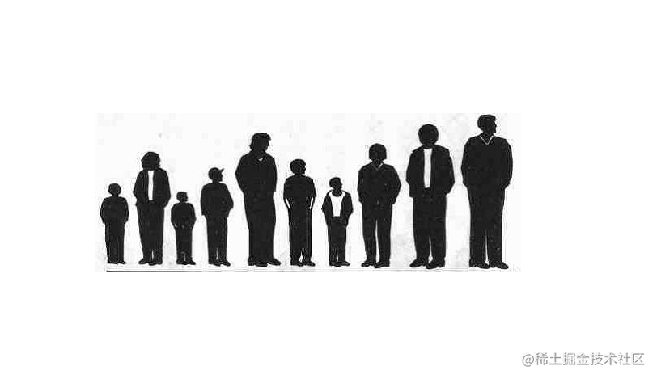
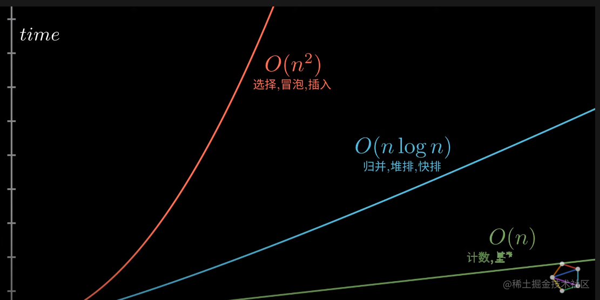
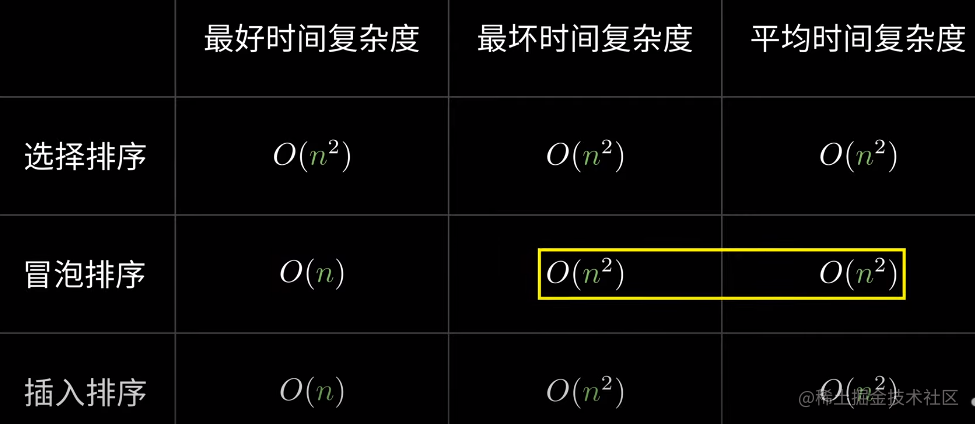
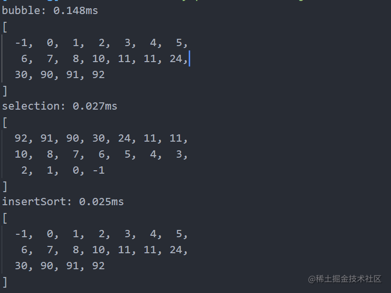
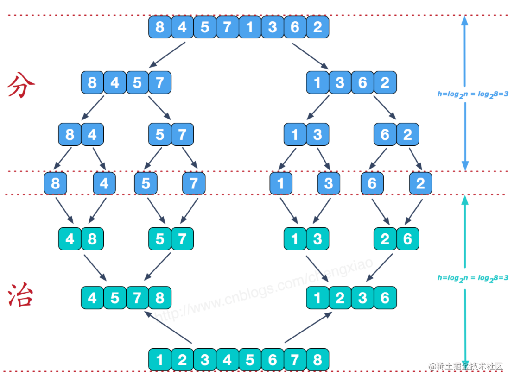
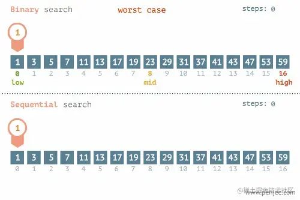

常见的一些排序算法，开发和面试很不错的技巧。
先上一张图，`youtube`大佬的视频截图，显示了随时时间和数据量的增长的情况下，复杂度的一个变化情况。



## 1：选择排序 Selection Sort

找到最大（最小也行）放到结尾或者开始也行，在找次之最大（最小）摆放到上一个排序的旁边，以此类推。

**类似： 老师选择排队，大高个一个一个被拉过去，小四就被留到了最后了。**
小四是我们家的一个小狗。


```js
    function selection(arr) {
      for (let i = 0; i < arr.length; i++) {
        let maxIndex = i;

        // 内层for 只负责找到最大值
        for (let j = i + 1; j < arr.length; j++) {
          if (arr[maxIndex] < arr[j]) {
            maxIndex = j;
          }
        }

        // 每次找完就和当前的项进行交换
        let temp = arr[i];
        arr[i] = arr[maxIndex];
        arr[maxIndex] = temp;
      }

      return arr;
    }
```

## 2：冒泡排序

非常简答的算法，我觉得只要是看这篇文章的人没人不会写这个算法。

重复地走访过要排序的数列，一次比较两个元素，如果它们的顺序错误就把它们交换过来。

走访数列的工作是重复地进行直到没有再需要交换，也就是说该数列已经排序完成。


```js
    function bubble(arr) {
      console.time("bubble");
      for (let i = 0; i < arr.length; i++) {
        for (let j = i + 1; j < arr.length; j++) {
          if (arr[j] < arr[i]) {
            let temp = arr[i];
            arr[i] = arr[j];
            arr[j] = temp;
          }
        }
      }
```

## 3：插入排序 Insertion Sort

描述是一种简单直观的排序算法。它的工作原理是通过构建有序序列，对于未排序数据，在已排序序列中从后向前扫描，找到相应位置并插入。


默认第一个元素已经排序，取出下一个元素，在已经排序的元素序列中从后向前扫描。
如果该元素大于新元素，将该元素移到下一位置，直到将新元素插入到合适的位置。

**很类似生活中的揭扑克牌，假设揭一张就按照大小插入。**

```js
// 外循环控制未排序的元素，
// 内循环控制已排序的元素，将未排序元素设为标杆，与已排序的元素进行比较，小于则交换位置，大于则位置不动

function insertSort(arr) {
  let len = arr.length;
  let preIndex, current;

  // 默认是从第一位已经排序过了
  for (let i = 1; i < len; i++) {
    // 当前项前面还有几位，需要参与遍历
    preIndex = i - 1;

    // 缓存当前项目，用来后续找到位置以后进行插入
    current = arr[i];

    // 从当前位置，向前遍历检查，寻找合适的位置，
    while (preIndex >= 0 && current < arr[preIndex]) {
      arr[preIndex + 1] = arr[preIndex];
      preIndex--;
    }
    // 找到位置插入缓存的数据
    arr[preIndex + 1] = current;
  }

  return arr;
}
```

简单总结一下：对比三个排序算法，发现再数据量很大情况下，复杂度是比较大的，不利于大数据的排序。



本地使用一个数组简单验证了一下：


## 4：快速排序 Quick Sort

> 快速排序的基本思想：通过一趟排序将待排记录分隔成独立的两部分，其中一部分记录的关键字均比另一部分的关键字小，则可分别对这两部分记录继续进行排序，以达到整个序列有序。


快速排序使用分治法来把一个串（list）分为两个子串（sub-lists）。具体算法描述如下：

从数列中挑出一个元素，称为 `基准（pivot）`；
重新排序数列，所有元素比基准值小的摆放在基准前面，所有元素比基准值大的摆在基准的后面（相同的数可以到任一边）。在这个分区退出之后，该基准就处于数列的中间位置。这个称为分区（partition）操作；
递归地（recursive）把小于基准值元素的子数列和大于基准值元素的子数列排序。

这种写法具有争议，是阮一峰大神写的，是前端比较主流的。

```js
function quickSort(arr) {
  if (arr.length <= 1) return arr;

  // 基准
  let mid = ~~(arr.length / 2);

  // 把基准从原数组中删除
  let flag = arr.splice(mid, 1)[0];

  let left = [];
  let right = [];

  arr.forEach((element) => {
    if (element < flag) {
      left.push(element);
    } else {
      right.push(element);
    }
  });
  return quickSort(left).concat([mid], quickSort(right));
}
```

## 5：归并算法  MERGE-SORT

归并排序是利用归并的思想实现的排序方法，该算法采用经典的分治（divide-and-conquer）策略（分治法将问题分(divide)成一些小的问题然后递归求解，而治(conquer)的阶段则将分的阶段得到的各答案"修补"在一起，即分而治之)。



```js
function merge(left,right){
    var temp=[];
    while(left.length&&right.length){
        if(left[0]<right[0]){
            temp.push(left.shift());
        }else{
            temp.push(right.shift());
        }
    }
    //left和right长度不一样时，直接连接剩下的长的部分（本身有序）
    return temp.concat(left,right);

}
function mergeSort(data){
    if(data.length<=1){
        return data;
    }
    var mid=Math.floor(data.length/2);
    var left=data.slice(0,mid);
    var right=data.slice(mid);

    return  merge(mergeSort(left),mergeSort(right));
}
```

## 二分查找



二分查找必须是有序的数组

非递归实现
```js
//arr:数组;key:查找的元素
function search(arr, key) {
    //初始索引开始位置和结束位置
    var start = 0,
        end = arr.length - 1;
    while(start <= end) {
        //取上限和下限中间的索引
        var mid = parseInt((end + start) /2);
        if(key == arr[mid]) {
            //如果找到则直接返回
            return mid;
        } else if(key > arr[mid]) {
            //如果key是大于数组中间索引的值则将索引开始位置设置为中间索引+1
            start = mid + 1;
        } else {
            //如果key是小于数组中间索引的值则将索引结束位置设置为中间索引-1
            end = mid -1;
        }
    }
    //如果在循环内没有找到查找的key(start<=end)的情况则返回-1
    return -1;
}
var arr = [0,13,21,35,46,52,68,77,89,94];
search(arr, 68); //6
search(arr, 1); //-1
```


## 参考文章
- https://www.cnblogs.com/onepixel/articles/7674659.html


