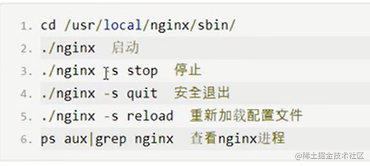
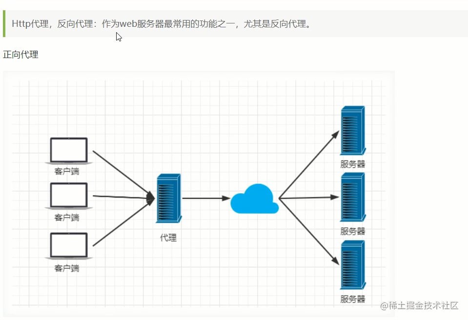
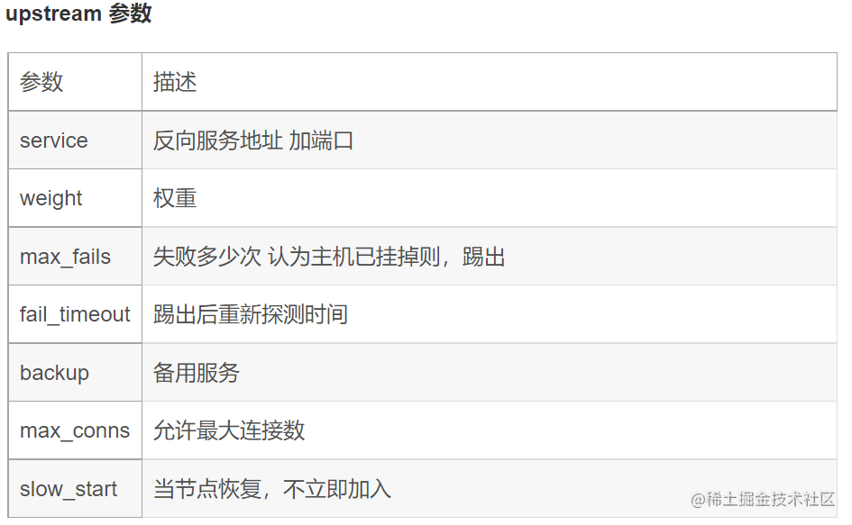
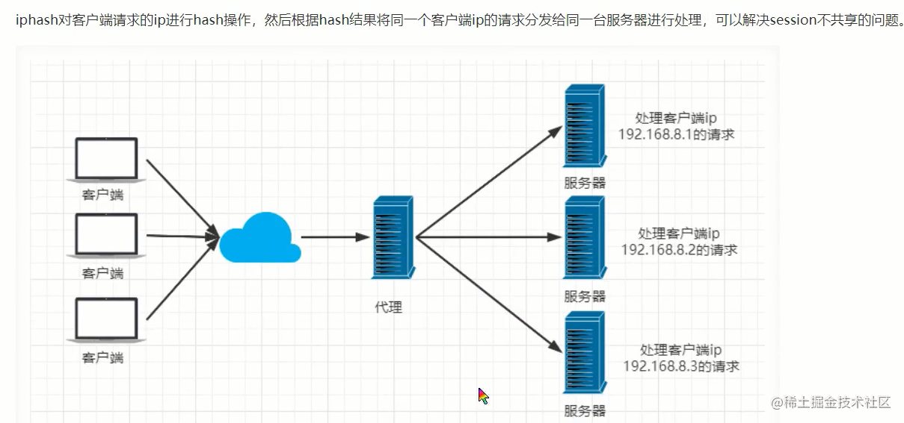

> 本文从前端开发的角度出发，尝试一篇文章尽量简单明了的介绍nginx的使用，和基本的原理，同时也方便后期自己学习和查询。

# 0：基础知识

`nginx`是一个反向代理的高性能服务器。实现反向代理和`session`在多台服务器上进行可以同步（实际开发中一般是使用`redis`进行`session`同步），对用户去感知的访问任何一台服务器。支持高并发。

`nginx`主要核心就三个点： `反向代理`，`负载均衡`,`动静分离`。

### 1 基本命令



### 2 安装
这里简单记录下 `centos`中的安装过程。本文部分代码是使用 `openresty`验证的，它是 `nginx`的一个继承框架，对于新手来说更加的有好。 

```js
// 0 先检查下本地是否安转过这个
whereis nginx 

// 1: 检测镜像源
yum search nginx
yum install nginx -y

// 2：安装完成后

rpm -qa | grep nginx 查看

// 3: 启动nginx
systemctl start nginx

// 4: 加入开机启动项
systemctl enable nginx

// 5： 查看nginx的状态
systemctl status nginx

// 6 查看80的占用，如果lsof 不存在，yum install lsof 
lsof -i:80 

# 停止Nginx
systemctl stop nginx

# 查看Nginx进程
ps -ef | grep nginx

# 杀死Nginx进程
kill -9 pid # 根据上面查看到的Nginx进程号，杀死Nginx进程，-9 表示强制结束进程
```

使用主机访问这个虚拟机的`nginx`服务。

```js
// 1： 检查下ip,如果提示ifconfig 不存在,参考 https://www.cnblogs.com/sethxiong/p/11725132.html
ifconfig 

// 2: 检测防火墙状态 如果提示命令不存在，yum install firewalld
firewall-cmd --status

// 3: systemctl stop firewalld 关闭防火墙
```

这个时候可以在主机的浏览器通过ip就可以访问虚拟机的服务了。 eg: http://192.168.1.77/

找到配置文件的地址，才问中也会对这个文件进行重点的讲解。


### 3: 常用参数

```
/etc/nginx/conf.d/default.conf 
```
整个配置文件内容：

- `main` 全局配置，对全局生效；
- `events` 配置影响 Nginx 服务器与用户的网络连接；
- `http` 配置代理，缓存，日志定义等绝大多数功能和第三方模块的配置；
- `server` 配置虚拟主机的相关参数，一个 http 块中可以有多个 server 块；
- `location` 用于配置匹配的 uri ；
- `upstream` 配置后端服务器具体地址，负载均衡配置不可或缺的部分；

```js
# main段配置信息
user  nginx;                        # 运行用户，默认即是nginx，可以不进行设置
worker_processes  auto;             # Nginx 进程数，一般设置为和 CPU 核数一样
error_log  /var/log/nginx/error.log warn;   # Nginx 的错误日志存放目录
pid        /var/run/nginx.pid;      # Nginx 服务启动时的 pid 存放位置
# events段配置信息
events {
    use epoll;     # 使用epoll的I/O模型(如果你不知道Nginx该使用哪种轮询方法，会自动选择一个最适合你操作系统的)
    worker_connections 1024;   # 每个进程允许最大并发数
}
# http段配置信息
# 配置使用最频繁的部分，代理、缓存、日志定义等绝大多数功能和第三方模块的配置都在这里设置
http { 
    # 设置日志模式
    log_format  main  '$remote_addr - $remote_user [$time_local] "$request" '
                      '$status $body_bytes_sent "$http_referer" '
                      '"$http_user_agent" "$http_x_forwarded_for"';
    access_log  /var/log/nginx/access.log  main;   # Nginx访问日志存放位置
    sendfile            on;   # 开启高效传输模式
    tcp_nopush          on;   # 减少网络报文段的数量
    tcp_nodelay         on;
    keepalive_timeout   65;   # 保持连接的时间，也叫超时时间，单位秒
    types_hash_max_size 2048;
    include             /etc/nginx/mime.types;      # 文件扩展名与类型映射表
    default_type        application/octet-stream;   # 默认文件类型
    include /etc/nginx/conf.d/*.conf;   # 加载子配置项
    # server段配置信息
    server {
        listen       80;       # 配置监听的端口
        server_name  localhost;    # 配置的域名
        # location段配置信息
        location / {
            root   /usr/share/nginx/html;  # 网站根目录
            index  index.html index.htm;   # 默认首页文件
            deny 172.168.22.11;   # 禁止访问的ip地址，可以为all
            allow 172.168.33.44；# 允许访问的ip地址，可以为all
        }
        error_page 500 502 503 504 /50x.html;  # 默认50x对应的访问页面
        error_page 400 404 error.html;   # 同上
    }
}
```


##### root

```js
 root path
 eg ：
location /image {
    root /opt/nginx/static;
}
# 当用户访问 www.test.com/image/1.png 时，实际在服务器找的路径是 /opt/nginx/static/image/1.png
```

##### alias
```js
location /image {
    alias /opt/nginx/static/image/;
}
当用户访问 www.test.com/image/1.png 时，实际在服务器找的路径是 /opt/nginx/static/image/1.png
```

##### return 
停止处理请求，直接返回响应码或重定向到其他 URL ；执行 return 指令后， location 中后续指令将不会被执行。

```js
location / {
    return 404; # 直接返回状态码
}
location / {
    return 404 "pages not found"; # 返回状态码 + 一段文本
}


```

##### location
```js
    # 1最高级别的全匹配
    location = /a {
        echo "/a";
    }

    # 2 匹配的优先级  ^~ 表示：以...开头，优先级高 43
    location ^~ /api {
        echo "/api";
    }

    # 3： 正则表达式 ~ 开始  匹配数字 字母 下划线 开头
    location ~ ^/\w {
        echo "100";
    } 

    # 4： 最弱的一组匹配
      location / {
            # root   html;
            # index  index.html index.htm;
            echo "hello world!";
     }
```

- `location/a`: 匹配到 1，因为1具有最高的优先级
- `location/ap`: 匹配到 3
- `location/apiss`: 匹配到 2

因此，路由的使用优先级顺序应该是：**如果命中是在同级别规则，那么有限匹配最前面的，否则按照优先级进行匹配。**

# 1： 代理


###  1：正向代理和反向代理




正向代理：比如 `vpn`,**正向代理是客户端和其他所有服务器（重点：所有）的代理者,只对客户端负责。**


反向代理：对所代理的服务器负责，eg:  `nginx`和常见的访问百度等的时候发生的代理。

### 2：反向代理：

本地开启一个 `node` 指向 `3000` 端口的服务，这个服务提供一个 `/list`的路由。

```js
const http = require('http');
const port = 3000;
const server = http.createServer((req,res)=>{
    res.writeHead(200,{'Content-type':'text/plain'});
    // 增加一个路由的判断
    if(req.url.includes('/list')){
        res.end('api list')
    }
    else{
      res.end('node server!');
    }
})

server.listen(port,()=>{
   console.log(`server is running at ${port}`);
})
```
然后`nginx`配置代理：

```js
 location / {
    echo "welcome main website";
}

location /api {
    proxy_pass http://127.0.0.1:3000;
}
```
刷新配置文件： `nginx -s reload`;
再次访问 `http://localhost/api` 就会默认指向`node`这个服务。


那么如果我想访问到 `node/list`下面又该怎么配置呢？

```js
 location /api/ {
    proxy_pass http://127.0.0.1:3000/;
}
```
http://localhost/api/list/ 就可以指向 `node`服务下的`list`路由了。


# 2：负载均衡

我们在本地在开启一个服务，指向`3001`端口，复制上面代码，修改配置文件：

```js
 upstream group1 {
    server 127.0.0.1:3000 weight=1;
    server 127.0.0.1:3001 weight=1;
}

location /api/ {
    proxy_pass  http://group1/;
} 
```

这个时候我们访问 http://localhost/api/ 的时候，就会随机的进行映射到这两个服务上。


### 3.1  upstream




`Nginx`的`upstream`支持5种 分配方式。

 其中 `轮询`、`权重`、`IP散列`这三种为`Nginx`原生支持的分配方式，`fair` 和 `url_hash`为第三方支持的分配方式。
 
##### 轮训
轮询是 `upstream`的默认分配方式，即每个请求按照时间顺序轮流分配到不同的后端服务器，如果某个后端服务器 down 掉后，能自动剔除。上面的案例就是默认的轮训策略。
##### 权重

轮询的加强版，既可以指定轮询比率，`weight` 和访问几率成正比，主要应用于后端服务器异质的场景下。

```js
  upstream group1 {
    server 127.0.0.1:3000 weight=1;
    server 127.0.0.1:3001 weight=1;
}
```

##### ip_hash

每个请求按照访问 `Ip`（即`Nginx`的前置服务器或客户端`IP`）的 `hash`结果分配，这样每个访客会固定访问一个后端服务器，可以解决 `session` 一致问题。



```js
upstream group1 {
    ip_hash;
    server 192.168.1.11:7777;
    server 192.168.1.22:8888;
    server 192.168.1.33:9999;
}
```
##### fair
`fair` 顾名思义，公平地按照后端服务器的响应时间（rt）来分配请求，响应时间（rt）小的后端服务器优先分配请求。

##### url_hash
与 `ip_hash`类似，但是按照访问 `url` 的 `hash` 结果来分配请求，使得每个 url 定向到同一个后端服务器，主要应用于后端服务器为缓存的场景下。

```js
upstream group1 {
    server 192.168.1.11;
    server 192.168.1.22;
    server 192.168.1.33;
    hash $request_uri；
    hash_method crc32；
}
```


参考文章 
- https://juejin.cn/post/6942607113118023710#heading-64


