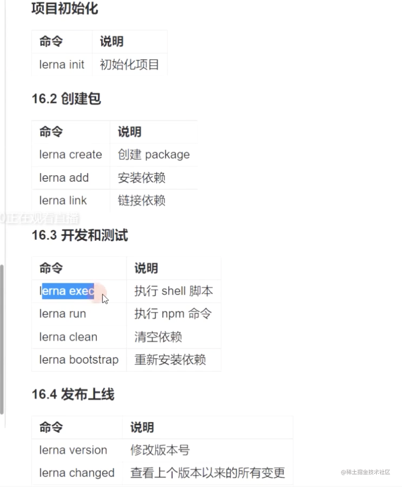

# 0： npm 最常用的命令行 收藏系列

```js

// 打开某个包的文档
npm home [package-name]  // eg npm home lodash

// 打开某个包的代码仓库
npm repo [package-name] // 例如 npm repo vue

// 查看某个包的详细信息 配合npm search 来使用
// npm v [package-name] // 例如 npm v vue

// 会提示输入用户名、密码、验证邮箱、输入邮箱收到的验证码后即可登录成功。
npm adduser

// 收藏
npm star [package-name]

// 查看当前登录用户已收藏包列表
npm stars

// 这个指令用来查看某个模块是否安装了
npm list <packagename>

// 这个指令用来查看全局安装了哪些工具
npm list --depth --global

// npm 查看安装了哪些包
// –depth 表示深度，我们使用的模块会有依赖，深度为零的时候，不会显示依赖模块
npm list --depth=0

npm view // 包名 version 相看某个包的最新版本号
npm ls // 列出当前安装的所有包
npm root // 查看当前包的安装路径
npm root -g // 查看全局包的安装路径
npm config ls // 查看 npm 当前配置

```

# 1: 发布scope作用域的npm包

比较简单，直接参考这两篇文章即可： 

- [ 官方文档](https://doc.codingdict.com/npm-ref/getting-started/scoped-packages.html) 

- [发布npm的scope包](https://segmentfault.com/a/1190000017234785)

# 2：npm的workspace 使用

npm 新版本的workspace 技术出现以前，很多是有lerna或者yarn来处理这个功能的。

- [热乎乎的 workspaces 替代 npm link 调试的新方式] (https://www.jianshu.com/p/b76d06b3eb58)
- [npm 官方文档] (https://docs.npmjs.com/cli/v8/configuring-npm/package-json#workspaces)

这个处理方式出现的核心目的是为了解决：单体仓库 [What is monorepo? (and should you use it?](https://semaphoreci.com/blog/what-is-monorepo)

**主要解决了依赖共享 或者 npm link 的链接。**

核心命令行：
```
// 快速创建一个子模块  w: workspace 
npm init -w ./packages/a -y    

// 单独为a模块添加子模块
npm install abbrev -w a

// 为所有的子模块安装
npm install uuid  --workspaces

// 全部运行 注意这里是s 复数形式  
// 但是不会执行当前root 目录下的package.json的
npm run test --workspaces  

// 指定workspace
npm run test --workspace=a --workspace=b
```

# 3 pnpm 更加高效

新一代包管理工具，主要解决**磁盘空间**和**幽灵依赖**。

具体深入可以查看学习 [关于现代包管理器的深度思考——为什么现在我更推荐 pnpm 而不是 npm/yarn?](https://juejin.cn/post/6932046455733485575) 一文，写的真好！


```
// 在顶层添加命令
pnpm add lodash --workspace-root

// 安装到具体项目下面
pnpm add dayjs -r --filter project


// 执行project4下面的server 命令
pnpm run serve --filter project4


// 在 node_modules 和 package.json 中移除指定的依赖。
pnpm uninstall axios --filter package-a
```

`pnpm`跟`npm`、`yarn`一样，也内置了对monorepo的支持，使用起来比较简单，在项目根目录中新建`pnpm-workspace.yaml`文件，并声明对应的工作区就好。
```
packages:
  # 所有在 packages/ 子目录下的 package
  - 'packages/**'
```


# 4: [verdaccio](https://github.com/verdaccio/verdaccio)
npm 的私服部署框架。


# 5： lerna 常用命令
https://www.lernajs.cn/




