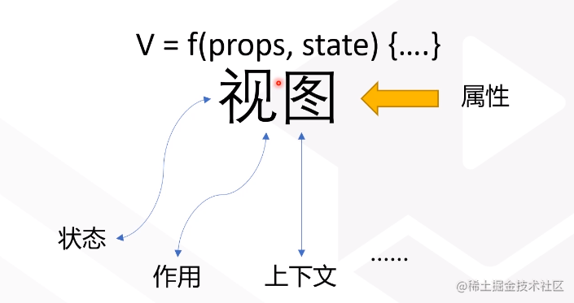
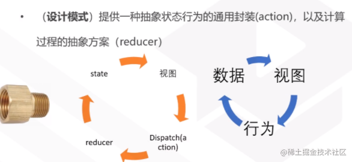
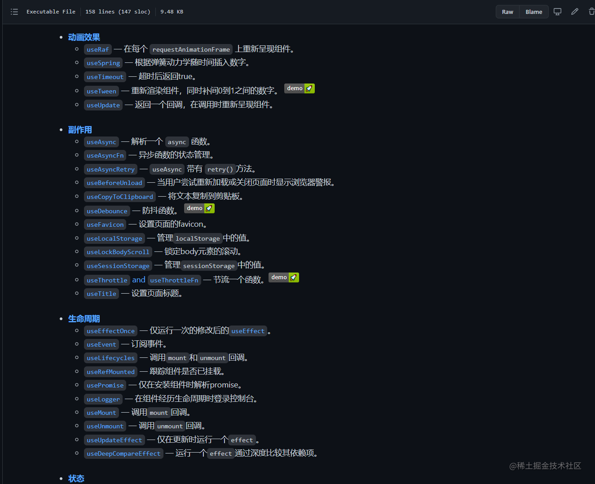

> 程序最关键的就是学习思想。记录hooks 相关，方便后面排忧。
# 1：hooks和类组件或者function component的区别

  `react`认为`ui`是数据的视图映射，V = f(props,state)；f 函数对于输入的数据进行加工和处理。相比较传统的class组件来说，类组件：
    
1. 编译完比较大
2. this指向问题
3. 复用性比较差

> `hooks`可以理解为一个功能独立且可以自`re-render`的函数组件。也是一种编程代码思想的转变，如下图：是视图和改变的体现。




**下面介绍api的时候会体现这一核心思想。**

# 2. hooks使用

## 2.1 状态： setState

`const [counyt,setCount] = useState(0); 
`描述的是 **状态** 和 **行为** 在`hooks api`中的体现，`react`会自动帮助我们将数据进行绑定。

每一次状态`count`发生变化，该函数就会`re-render`。每一次函数调用都是一个独立的个体，在底层体现在一个链表的数据结构中,也就是每一次render 都是会在链表中插入一个节点。

```js
function Example() {
  const [count, addCount] = useCount(0);
  return (
    <div>
      <p>You clicked {count} times</p>
      <button onClick={() => addCount()}>
        Click me
      </button>
    </div>
  );
}
```
也可以使用自定义`hook`按照业务调用来命名,`addCount`代替系统的`setCount`。 x
```js
function useCount(initData){
   const [count,setCount] = useState(initData);
   return [count,()=>{
     setCount(count +1)
   }]
}

// example
  const [count, addCount] = useCount(0);
```

## 2.2 作用 effect
```js
   // Example
   useEffect(() => {
      console.log('useffect')
      document.title = `You clicked ${count} times`;
   },[count]);
```

每一次 Example函数执行都会创建一个useEffect。或者我们使用自定义的`hooks`，封装数据解耦`ui`, `hook`提倡精细化控制,更加符合语义和行为。要让产生的作用变成可描述性的。

```js
function useCount(initData){
   const [count,setCount] = useState(initData);
   return [count,()=>{
     setCount(count +1)
   }]
}

function log(count){
  console.log('xxxxxx',count);
}

// Example
  useEffect(log.bind(null,count),[count]);
```

 * `effect` 理解为：依据[变化] 而变化的作用，如果依赖[]空数组，那么只会执行一次，因为空一直是空。 
 * 【变化】发生变化的时候才会产生这个作用，
 * 每一次都会创造一个新的函数，重新绑定当前依赖的函数
 * 组件re-render时，函数组件是重新执行整个函数，其中也包括所有“注册”过的hooks，默认情况下useEffect callback也会被重新执行！
 * 依赖不能少传也不要多传！deps数组项必须是mutable的，不能传入传入对象、函数进去是无意义 
 
 需要注意的地方。
 
```js 
    useInterval(()=>{
        console.log('ccc',count);
        // setCount(count+1);  // 只会执行一次
        setCount(count=>count+1); 
    },1000)
```
尽量使用函数式写法，因为赋值写法存在一些小问题。
## 2.3 useContext
`const value = useContext(MyContext);
`接收一个 context 对象（`React.createContext `的返回值）并返回该 context 的当前值。 用来组件之间共享状态的一个hooks。

```js
const ThemeContext = React.createContext(themes.light);
function App() {
  return (
    <ThemeContext.Provider value={themes.dark}>
       <div>
         <ThemedButton />
      </div>
    </ThemeContext.Provider>
  );
}

function ThemedButton() {
  const theme = useContext(ThemeContext);
  return (
    <button style={{ background: theme.background, color: theme.foreground }}>
      I am styled by theme context!
    </button>
  );
}
```
## 2.3 useReducer



用于管理复杂的数据结构（useState一般用于管理扁平结构的状态），基本实现了redux的核心功能。

```js
// 一个状态 拥有多个行为
function reducer(state, action) {
    switch (action.type) {
        case 'add':
            return state + 1;
        case 'red':
            return state - 1;
        default:
            console.error('sssss');
    }
    return 0;
}

export default () => {
    const [count, dispatch] = useReducer(reducer,0); // 第二个参数可以是对象，也可以是单值
    return (
        <div>
            <p>msg is: {count} </p>
            <button onClick={() => dispatch({type: 'add'})}>+</button>
            <button onClick={() => dispatch({ type: 'red' })}>-</button>
        </div>
    )
}
```

## 2.4 useRef
 * 引用行为： `ref(erence)
 * `ref`管理`react`以外的对象,我们知道`react` 在自己的`ui`上自己构建了一层，react自己不管理。eg：focus 媒体操作
 * 通常搭配 useEffect, 
 * **附带还有另外一个作用，就是保存一些值，这个和设计有关系，式一个取巧的方法**
 
 - 点击按钮`focus`。
````js
function useFousInput() {
    const refInput = useRef(null); // 返回一个可变的 ref 对象, 返回的 ref 对象在组件的整个生命周期内保持不变
    // 一开始式一个null，也就是在执行的过程中才能到这个值
    return (
        <div>
            <input type="text" ref={refInput} />
            <input
                type="button"
                value="foucs"
                onClick={() => {
                    refInput.current.focus();
                }}
            />
        </div>
    );
};
```

- 计算器 可以拿到之前的值  `ref` 是一个不可变的的东西，在面向函数变成的时候尤其重要,函数式的环境中很难做一个缓存，所以这个引用非常有用。

```js
function useCompute() {
    const [count, setCount] = useState(0);
    const preRef = useRef(0); 
    return (
        <div>
            <p>当前的值： {count} </p>
            <p>上一个值： {preRef.current}</p>
            <input type="button" onClick={() => {
                preRef.current = count;
                setCount(count => count + 1)
            }}  value="+"/>
            <input type="button" onClick={() => {
                preRef.current = count;
                setCount(count => count - 1)
            }} value="-"/>
        </div>
    );
}
```
这是因为它创建的是一个普通 Javascript 对象。而 useRef() 和自建一个 {current: ...} 对象的唯一区别是，useRef 会在每次渲染时返回同一个 ref 对象。变更 .current 属性不会引发组件重新渲染。

# 3 缓存
## 3.1 momo
在函数组件中，React提供了一个和类组件中和PureComponent相同功能的API React.memo，会在自身re-render时，对每一个 props 项进行浅对比，如果引用没有变化，就不会触发重渲染
```js
/**
 * React.memo 适用于纯函数，实现内部其实就是进行一个属性
 */
const MemoList = React.memo(({ list }) => {
    return (
        <ul>
            {list.map(item => (
                <li key={item.id}>{item.content}</li>
            ))}
        </ul>
    );
},areEqual) ;


/**
 * return true: 代表不在渲染该组件
 * return false: 代表渲染该组件 
   areEqual 不写默认是浅比较
 */
function areEqual(prevProps, nextProps) {
    if(nextProps.seconds % 10 === 0){
        return true
    }else {
        return false
    } 
}
```

相比`React.memo`，`useMemo`在组件内部调用，可以访问组件的props和state，所以它拥有更细粒度的依赖控制

## 3.2 useMemo && useCallback
  * 缓存一个函数：(useCallback)
  * 缓存一个值： (useMemo)
  
` useCallback(fn, deps) 相当于 useMemo(() => fn, deps)`
 
 `useMemo`用于缓存一些耗时的计算结果，只有当依赖参数改变时才重新执行计算：

 传入 `useMemo` 的函数会在渲染期间执行。请不要在这个函数内部执行与渲染无关的操作，诸如副作用这类的操作属于 `useEffect` 的适用范畴，而不是 `useMemo`。

```js
const UseMemoExample = () => {
    const [count, setCount] = useState(0);
    const depVal = Math.floor(count / 10);
    
    const memText = useMemo(() => {
        return 'this is time ' + depVal +'---'+ Date.now();
    }, [depVal]); // 永远记住，依赖发生变化，不是依赖为true或者false

    return (
        <div>
            <p>mem: { memText }</p>
            <p>real value {count} </p>
            <input type="button" onClick={() => {
                setCount(count => count + 1)
            }} value="+"/>
        </div>    
    )
}
```
缓存函数

```js
const memoizedCallback = useCallback(
  () => {
    doSomething(a, b);
  },
  [a, b],
);
```
# 4 自定义hooks
> 自定义 Hook 是一个函数，其名称以 “use” 开头，函数内部可以调用其他的 Hook。

这个自定义组件 其实返回的就是一个状态 封装行为。渲染函数里面其实就是一个值
返回的式一个状态 多用hooks封装行为。
```js
function usePerson() {
    const [list, setList] = useState(null);
    const request = () => {
        async function getData (){
            let res = await sleep();
            setList(res);
       }
       getData();
    }

    useEffect(request,[]);
    return list;
}
```
自定义 Hook 解决了以前在 React 组件中无法灵活共享逻辑的问题。你可以创建涵盖各种场景的自定义 Hook，如表单处理、动画、订阅声明、计时器，甚至可能还有其他我们没想到的场景。更重要的是，创建自定义 Hook 就像使用 React 内置的功能一样简单。

尽量避免过早地增加抽象逻辑。既然函数组件能够做的更多，那么代码库中函数组件的代码行数可能会剧增。这属于正常现象 —— 不必立即将它们拆分为 Hook。但我们仍鼓励你能通过自定义 Hook 寻找可能，以达到简化代码逻辑，解决组件杂乱无章的目的。
eg:

```js
function useData() {
    const [data, setData] = useState(0);
    const [loading, setLoding] = useState(false);
    // 这样子就可以见名知意，更加符合语义化
    const [count, addCount] = useCount(0);
    const fetchData = () => {
        setLoding(true);
        setTimeout(() => {
            setData(Date.now());
            setLoding(false);
        }, 3000);
    };
    return {
        loading,
        count,
        data,
        fetchData,
        addCount
    };
}
```


# 5 hooks 常用封装和库
## 5.1 解耦封装一些常见的功能开发
#### 自适应宽高的hooks

```js
function useWinSize() {
  const html = document.documentElement;
  const [ size, setSize ] = useState({ width: html.clientWidth, height: html.clientHeight });

  useEffect(() => {
    const onSize = e => {
      setSize({ width: html.clientWidth, height: html.clientHeight });
    };

    window.addEventListener('resize', onSize);

    return () => {
      window.removeEventListener('resize', onSize);
    };
  }, [ html ]);

  return size;
}
```

[react-use](https://github.com/streamich/react-use)
[文档地址](https://streamich.github.io/react-use/?path=/story/state-usemap--docs)
[中文文档](https://github.com/zenghongtu/react-use-chinese/blob/master/README.md)



