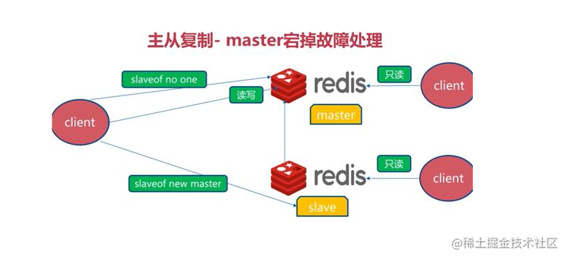
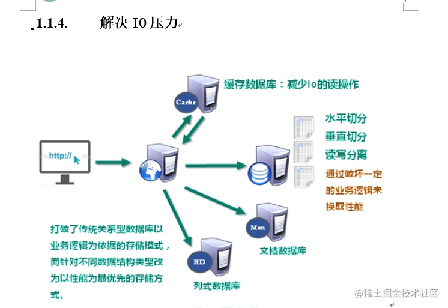
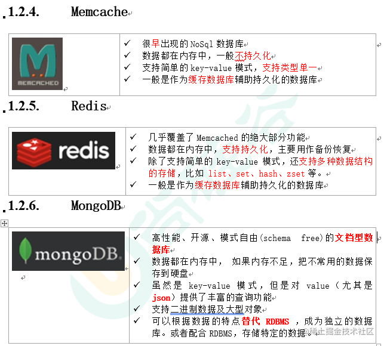
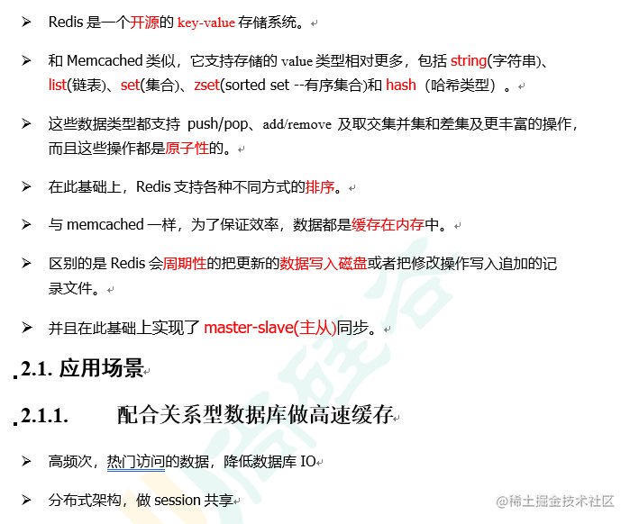
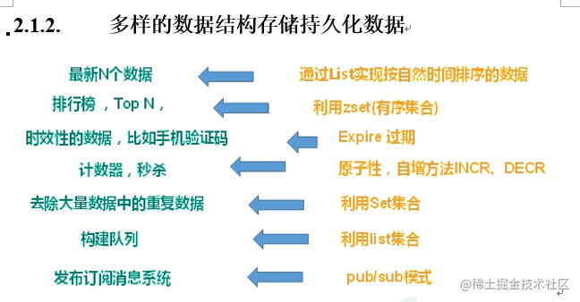
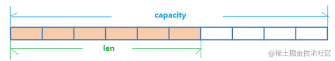

> 课程笔记来源于学习尚硅谷redis视频课程

# noSql（not only sql）数据库简介

传统`web1.0`和目前发展的`web2.0`时代下，碰到的问题：


`nosql`缓存数据库的特点：




**优点：**不支持**ACID**（原子性，一致性，隔离性，持久性），`nosql` 性能远超`sql`。

**适用的场景**：

- 对数据高并发的读写
- 海量数据的读写
- 对数据高可扩展性的


**不适合的场景**：
- 需要事务支持
- 基于sql的结构化查询存储，处理复杂的关系,需要即席查询。




核心目的：都是为了提高性能。


# 1 redis







##  1  **Redis** **介绍相关知识**

| 端口6379从何而来Alessia  Merz | 默认16个数据库，类似数组下标从0开始，初始默认使用0号库使用命令 select   <dbid>来切换数据库。如: select 8统一密码管理，所有库同样密码。dbsize查看当前数据库的key的数量flushdb清空当前库flushall通杀全部库 |
| ----------------------- | -------------------------------------------------------------------------------------------------------------------------------- |

`Redis`是单线程+多路`IO`复用技术

多路复用是指使用一个线程来检查多个文件描述符`（Socket）`的就绪状态，比如调用`select`和`poll`函数，传入多个文件描述符，如果有一个文件描述符就绪，则返回，否则阻塞直到超时。得到就绪状态后进行真正的操作可以在同一个线程里执行，也可以启动线程执行（比如使用线程池）

**串行**`vs`**多线程**+锁（memcached） vs   **单线程+多路IO复用(Redis)**

（与`Memcache`三点不同: **支持多数据类型，支持持久化，单线程+多路IO复用**）

## 1.1 String 字符串

```
keys *查看当前库所有key    (匹配：keys *1)
exists key判断某个key是否存在
type key 查看你的key是什么类型
del key       删除指定的key数据
unlink key   根据value选择非阻塞删除仅将keys从keyspace元数据中删除，真正的删除会在后续异步操作。
expire key 10   10秒钟：为给定的key设置过期时间
ttl key 查看还有多少秒过期，-1 表示永不过期，-2 表示已过期
select命令切换数据库
dbsize查看当前数据库的key的数量
flushdb清空当前库
flushall通杀全部库
```

### 1.1.1 字符串

`String`是`Redis`最基本的类型，你可以理解成与`Memcached`一模一样的类型，一个`key`对应一个`value`。
`String`类型是二进制安全的。意味着`Redis`的`string`可以包含任何数据。比如jpg图片或者序列化的对象。
`Strin`g类型是`Redis`最基本的数据类型，一个Redis中字符串value最多可以是512M

```
set   <key><value>添加键值对
    *NX：当数据库中key不存在时，可以将key-value添加数据库
    *XX：当数据库中key存在时，可以将key-value添加数据库，与NX参数互斥
    *EX：key的超时秒数
    *PX：key的超时毫秒数，与EX互斥

get   <key>查询对应键值
append  <key><value>将给定的<value> 追加到原值的末尾
strlen  <key>获得值的长度
setnx  <key><value>只有在 key 不存在时    设置 key 的值

incr  <key> 将 key 中储存的数字值增1 只能对数字值操作，如果为空，新增值为1  原子操作
decr  <key> 将 key 中储存的数字值减1 只能对数字值操作，如果为空，新增值为-1 原子操作
incrby / decrby  <key><步长>将 key 中储存的数字值增减。自定义步长。
```

所谓**原子操作**是指不会被线程调度机制打断的操作；
这种操作一旦开始，就一直运行到结束，中间不会有任何 **context switch**（切换到另一个线程）。

（1）在单线程中， 能够在单条指令中完成的操作都可以认为是"原子操作"，因为中断只能发生于指令之间。
（2）在多线程中，不能被其它进程（线程）打断的操作就叫原子操作。
Redis单命令的原子性主要得益于Redis的单线程。

```
mset  <key1><value1><key2><value2>  .....  同时设置一个或多个 key-value对  
mget  <key1><key2><key3> .....  同时获取一个或多个 value  
msetnx <key1><value1><key2><value2>  .....  同时设置一个或多个 key-value 对，
当且仅当所有给定 key 都不存在。 原子性，有一个失败则都失败

getrange  <key><起始位置><结束位置> 获得值的范围，类似java中的substring，前包，后包
  eg： grtrange name 0 3
setrange  <key><起始位置><value> 用 <value>  覆写<key>所储存的字符串值，从<起始位置>开始(索引从0开始)。

setex  <key><过期时间><value> 设置键值的同时，设置过期时间，单位秒。
getset <key><value> 以新换旧，设置了新值同时获得旧值。

```

**数据结构**

`String` 的数据结构为简单动态字符串`(Simple Dynamic String,缩写SDS)`。是可以修改的字符串，内部结构实现上类似于Java的ArrayList，采用预分配冗余空间的方式来减少内存的频繁分配.
 
 

 
如图中所示，内部为当前字符串实际分配的空间capacity一般要高于实际字符串长度len。当字符串长度小于1M时，扩容都是加倍现有的空间，如果超过`1M`，扩容时一次只会多扩1M的空间。需要注意的是字符串最大长度为`512M`。


## 1.2 List

`Redis` 列表是简单的字符串列表，按照插入顺序排序。你可以添加一个元素到列表的头部（左边）或者尾部（右边）。
它的底层实际是个双向链表，对两端的操作性能很高，通过索引下标的操作中间的节点性能会较差。


```js
lpush/rpush  <key><value1><value2><value3> .... 从左边/右边插入一个或多个值。
lpop/rpop  <key>从左边/右边吐出一个值。【值在键在，值光键亡。】

rpoplpush  <key1><key2>从<key1>列表右边吐出一个值，插到<key2>列表左边。

lrange <key><start><stop> 按照索引下标获得元素(从左到右)
lrange mylist 0 -1   0 左边第一个，-1右边第一个，（0-1表示获取所有）
lindex <key><index>按照索引下标获得元素(从左到右)
llen <key>获得列表长度 

linsert <key>  before <value><newvalue>在<value>的后面插入<newvalue>插入值
lrem <key><n><value>从左边删除n个value(从左到右)
lset<key><index><value>将列表key下标为index的值替换成value

```

**数据结构：**

`List`的数据结构为快速链表`quickList`。首先在列表元素较少的情况下会使用一块连续的内存存储，这个结构是`ziplist`，也即是压缩列表。

它将所有的元素紧挨着一起存储，分配的是一块连续的内存。当数据量比较多的时候才会改成`quicklist`。
因为普通的链表需要的附加指针空间太大，会比较浪费空间。比如这个列表里存的只是`int`类型的数据，结构上还需要两个额外的指针`prev`和`next`。


`Redis`将链表和`ziplist`结合起来组成了`quicklist`。也就是将多个`ziplist`使用双向指针串起来使用。这样既满足了快速的插入删除性能，又不会出现太大的空间冗余。


