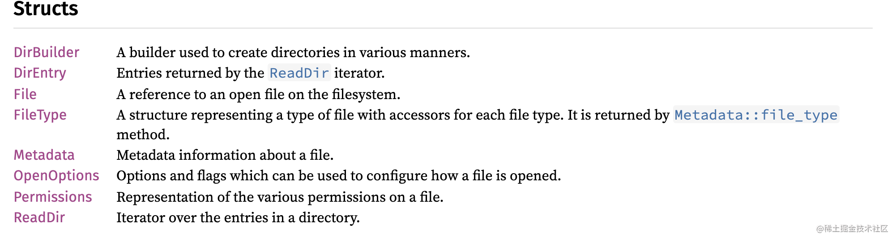
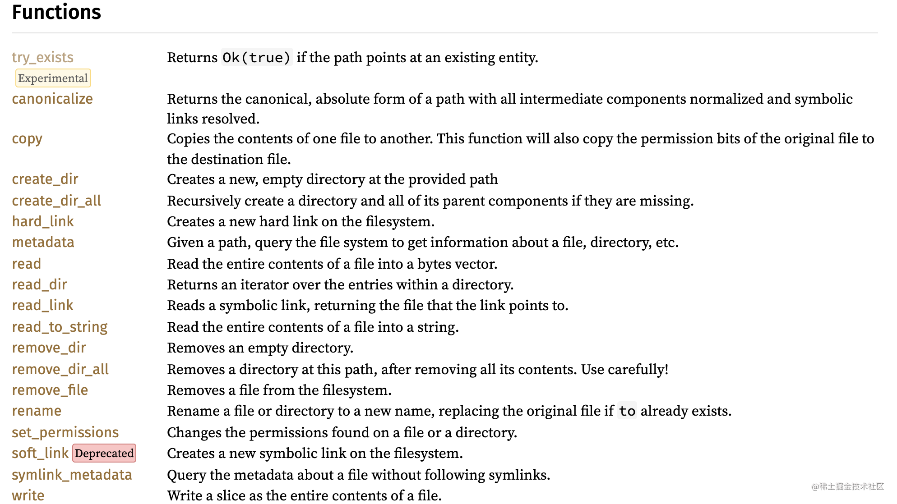
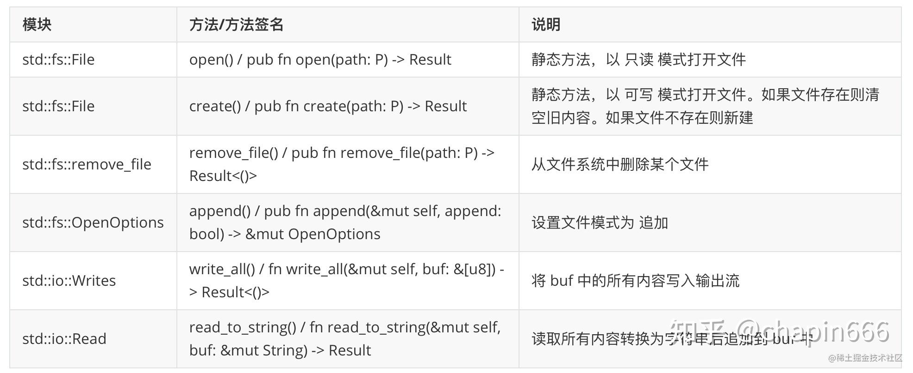

主要介绍Rust语言的`I/O` 操作。[官方文档](https://doc.rust-lang.org/std/fs/index.html)

# 前置知识

### 字节
对于byte这个数据类型，因为应用的少，所以需要深入运用才能实践。

1 byte = 8位二进制（实践证明：byte variable = 01100110，这样你就彻底错了，真正写byte类型的代码你就搞不定了），因为，二进制11111111对应的十进制是255，平常我们写代码时用的byte数据类型，就是存储的十进制的数，所以byte 变量 = **1到255之间的任何数是正确的**，因为ASCII字符对应的十进制就是1到255，所以写代码的时候可以byte 变量 = 任何一个ASCII字符。


### ASCII
以下来自百度百科：

在计算机中，所有的数据在存储和运算时都要使用二进制数表示（因为计算机用高电平和低电平分别表示1和0）。例如，像`a`、`b`、`c`、`d`这样的52个字母（包括大写）以及0、1等数字还有一些常用的符号（例如*、#、@等）在计算机中存储时也要使用二进制数来表示，而具体用哪些二进制数字表示哪个符号，当然每个人都可以约定自己的一套（这就叫编码），而大家如果要想互相通信而不造成混乱，那么大家就必须使用相同的编码规则，于是美国有关的标准化组织就出台了ASCII编码，统一规定了上述常用符号用哪些二进制数来表示。

ASCII 码使用指定的7 位或8 位二进制数组合来表示`128` 或`256` 种可能的字符。标准ASCII 码也叫基础ASCII码，使用7 位二进制数（剩下的1位二进制为0）来表示所有的大写和小写字母，数字0 到9、标点符号，以及在美式英语中使用的特殊控制字符。

### rust 中 byte的使用

```rust
use std::str;

 // 隐式的将字符串转换为字节数组。
 // 若需再将字符数组转化为字符串，可借助上面提到的`str::from_utf8`函数。
 let u8_text = b"EADSASD";
 println!("{:?}",u8_text);


 // 同上面的方法
 let bytes = "天下无贼".as_bytes();
 println!("bytes: {:?}", bytes);

 // 转化字节数组为字符串，不是所有的字节数组都可以转化为字符串
 let bs = str::from_utf8(bytes);
 println!("bs is:{:?}", bs);
```
运行结果：
```
[69, 65, 68, 83, 65, 83, 68]
bytes: [229, 164, 169, 228, 184, 139, 230, 151, 160, 232, 180, 188]
bs is:Ok("天下无贼")
```


# io命令行

### 获取启动命令

命令行程序必须能够接收来自命令行环境的参数，这些参数往往在一条命令行的命令之后以空格符分隔。

```rust
use std::env;
fn main(){
    let args = env::args();
    for arg in args {
        println!("{}", arg);
    }
}
```

执行`cargo run 100 200`运行结果是：这个结果中 `Args` 结构体中有一个 `inner` 数组，只包含唯一的字符串，代表了当前运行的程序所在的位置:
```
Args { inner: ["target/debug/async", "100", "200"] }
```
### 命令行输入
```rust
use std::io;
fn main(){
    let mut buf = String::new();
    let input = io::stdin().read_line(&mut buf).expect("input error!");
    println!("input is:{:?}", input);
}
```
# 文件类型

Rust 标准库提供了大量的模块和方法用于读写文件。使用结构体 **File** 来描述/展现一个文件。结构体 **File** 有相关的成员变量或函数用于表示程序可以对文件进行的某些操作和可用的操作方法。

所有对结构体 **File** 的操作方法都会返回一个 **Result** 枚举。

### 官方文档主要api

> All methods in this module represent cross-platform filesystem operations.主要是模块的主要方法都是跨平台的。






下表列出了一些常用的文件读写方法。




### 1: 打开文件 open

Rust 标准库中的 `std::fs::File` 模块提供了静态方法 `open()` 用于打开一个文件并返回文件句柄。
`open()` 函数用于以只读模式打开一个已经存在的文件，如果文件不存在，则会抛出一个错误。如果文件不可读，那么也会抛出一个错误。
```rust
pub fn open(path: P) -> Result
```
eg:
```rust
use std::fs;
fn main(){
    let file = fs::File::open("hello.txt");
    println!("{:?}", file);
}
```
执行的结果是：

```
// 找不到文件的
Err(Os { code: 2, kind: NotFound, message: "No such file or directory" })
// 能找到文件的时候
Ok(File { fd: 3, path: "/Users/qiududu/workspace/weibo/hello.txt", read: true, write: false })
```


### 2: 创建文件 create 

标准库中的 std::fs::File 模块提供了静态方法 `create()` 用于创建一个文件并返回创建的文件句柄。原型如下:

```
pub fn create(path: P) -> Result
```

`create()` 函数用于创建一个文件并返回创建的文件句柄。如果文件已经存在，则会内部调用 `open()` 打开文件。如果创建失败，比如目录不可写，则会抛出错误。eg:

```rust
use std::fs;
fn main(){
    let file = fs::File::create("hello2.txt").unwrap();
    println!("{:?}", file);
}
```
执行结果是：
```
// 文件已经存在，则自动调用open
File { fd: 3, path: "/Users/qiududu/workspace/weibo/hello.txt", read: false, write: true }

// 文件不存在，则创建文件
File { fd: 3, path: "/Users/qiududu/workspace/weibo/hello2.txt", read: false, write: true }
```

### 3:写入文件 write_all 

Rust 语言标准库 std::io::Writes 提供了函数 `write_all()` 用于向输出流写入内容。因为文件流也是输出流的一种，所以该函数也可以用于向文件写入内容。`write_all()` 函数在模块 `std::io::Writes` 中定义，它的函数原型如下

```
fn write_all(&mut self, buf: &[u8]) -> Result<()>
```

`write_all()` 用于向当前流写入 `buf` 中的内容。如果写入成功则返回写入的字节数，如果写入失败则抛出错误。eg:
```rust
use std::{fs, io::{Write, Read}};
fn main(){
    let mut file = fs::File::create("hello2.txt").unwrap();
    let buf = b"Rust is fk language!";
    file.write_all(buf).expect("write failed!");
    file.write_all("\nRust 是一门很郁闷的语言！".as_bytes()).expect("write failed!");
}
```
> write_all() 方法并不会在写入结束后自动写入换行符 \n。


文件写入分为**一次性写入**和**流式写入**。**流式写入需要打开文件，打开方式有"新建"（create）和"追加"（append）两种**。


### 4: 读取文件内容

在 Rust 中读取内存可容纳的一整个文件是一件极度简单的事情，`std::fs` 模块中的 `read_to_string` 方法可以轻松完成文本文件的读取。但如果要读取的文件是二进制文件，我们可以用 `std::fs::read` 函数读取 `u8` 类型集合：

一次性读取`test.txt`文件:

```rust
use std::fs;
fn main(){
    let file = fs::read("test.txt").unwrap();
    println!("==>{:?}", file);
}
```
执行结果是：
```
[82, 117, 115, 116, 32, 105, 115, 32, 103, 111, 111, 100, 33]
```


也可以使用`read_to_string()`。Rust 读取内容的一般步骤为:
 - 使用 `open()` 函数打开一个文件。
 - 然后使用 `read_to_string()` 函数从文件中读取所有内容并转换为字符串。`read_to_string()` 函数用于从一个文件中读取所有剩余的内容并转换为字符串,原型如下：
```
fn read_to_string(&mut self, buf: &mut String) -> Result
```

案例：
展示一次性读取，文件中的所有内容并追加到`buf`中，如果读取成功则返回读取的字节数，如果读取失败则抛出错误。


```rust
use std::{fs, io::{Read, self}};

fn main(){
    let read_content = read_file().unwrap();
    println!("read_content :{:?}", read_content);
}

fn read_file()-> Result<String, io::Error> {
    let mut file = fs::File::open("hello2.txt")?;
    let mut read_buf = String::new();
    file.read_to_string(&mut read_buf)?;
    Ok(read_buf)
}
```

以上两种方式是一次性读取，十分适合 Web 应用的开发。但是对于一些底层程序来说，传统的按流读取的方式依然是无法被取代的，因为更多情况下文件的大小可能远超内存容量。

案例：以下展示一个按照写入流来读取文件的：
```rust
use std::{fs, io::Read};

fn main(){
    let mut buffer = [0u8;5];
    let mut read_file = fs::File::open("test.txt").unwrap();

    loop {
        let read_res = read_file.read(&mut buffer).unwrap();
        println!("==>{:?}==={:?}",read_res, buffer);
        // 清空多余的数据
        buffer = [0u8;5];
        if read_res < buffer.len() {
            break;
        }
    }
}

```


### 5: 追加文件
Rust 核心和标准库并没有提供直接的函数用于追加内容到文件的末尾。但提供了函数 `append()` 用于将文件的打开模式设置为 追加。当文件的模式设置为 追加 之后，写入文件的内容就不会代替原先的旧内容而是放在旧内容的后面。

函数 append() 在模块 `std::fs::OpenOptions` 中定义，它的函数原型为

```
pub fn append(&mut self, append: bool) -> &mut OpenOptions
```
在上面添加的基础上增加案例：
```rust
use std::{fs::{self, OpenOptions}, io::{Write, Read, self}};

fn main(){
    
    let mut file = OpenOptions::new()
            .read(true)
            .append(true)
            .write(true)
            .create(true)
            .open("hello2.txt").expect("open filed!");

    file.write_all(b"\n javascript is an not good language!").unwrap(); 
   
    let res = read_file("hello2.txt").unwrap();
    println!("read result is:{}", res);
}

// 入参是读取文件的名称；读物目标文件的内容
fn read_file(filename:&str)-> Result<String, io::Error> {
    let mut file = fs::File::open(filename)?;
    let mut read_buf = String::new();
    file.read_to_string(&mut read_buf)?;
    Ok(read_buf)
}

```

### 6: 删除文件

Rust 标准库 `std::fs` 提供了函数 `remove_file()` 用于删除文件。原型如下

```
pub fn remove_file<P: AsRef>(path: P) -> Result<()>
```


Note that there is no guarantee that the file is immediately deleted (e.g., depending on platform, other open file descriptors may prevent immediate removal).


请注意，无法保证该文件立即删除（例如，根据平台，其他打开文件描述符可能会阻止立即删除）。

This function will return an error in the following situations, but is not limited to just these cases:

-   `path` points to a directory.路径不存在
-   The file doesn’t exist.文件不存在
-   The user lacks permissions to remove the file. 没权限

```rust
use std::fs;

fn main(){
    let rm = remove_file("copy.txt");
    match rm {
        Ok(true) => println!("remove success!"),
        Error=>{
            println!("remove failed!");
        }
    }
}
fn remove_file(filename:&str)->Result<bool,io::Error> {
    fs::remove_file(filename)?;
    Ok(true)
}
```
### 7: 复制文件
Rust 标准库没有提供任何函数用于复制一个文件为另一个新文件。可以使用上面提到的函数和方法来实现文件的复制功能。以下代码实现一个复制文件的功能：

```
cargo run hello.txt a.txt 
```
实现代码如下：
```rust 
use std::{env::{self, Args}, fs, io::{Read, Write}};

fn main(){
    let commond = env::args();
    let res = get_commond_arg(commond);
    println!("res is {:?}", res.len());

    // 检测如果没有参数就直接panic!
    if res.len() <=0 {
        panic!("your commond is not right!");
    }

    let mut file_in = fs::File::open(&res[0]).unwrap();
    let mut destion_file = fs::File::create(&res[1]).unwrap();

    // 设置4Kb的缓存区
    let mut buffer = [0u8; 4096];

    loop {
        let nfile = file_in.read(&mut buffer).unwrap();
        
        //  let mut arr = [1,2,3,4,5]; 实现非字符串的切片功能
        //  let a1 = &arr[..3];
        destion_file.write(&buffer[..nfile]).unwrap();
        if nfile < buffer.len() { break; }
    }
}

// 获取命令行的输入参数
fn get_commond_arg (commond:Args)->Vec<String>{
    let mut store= Vec::new();
    let mut index = 0;

    for item in commond {
        if index == 0 {
            index +=1;
            continue;
        }
        store.push(item);
    }
    store
}
```
### 8: fs::write 写入文件
一次性写入：这和一次性读取一样简单方便。执行程序之后， `test.txt` 文件的内容将会被重。所以，一次性写入请谨慎使用！因为它会直接删除文件内容（无论文件多么大）。如果文件不存在就会创建文件。

```rust
use std::fs;
fn main() -> std::io::Result<()> {
    fs::write("test.txt", b"Rust is good!")?;
    Ok(())
}   
```
如果想使用流的方式写入文件内容，可以使用 `std::fs::File` 的 `create` 方法：


# 参考资料
- https://doc.rust-lang.org/std/fs/index.html
- https://www.runoob.com/rust/rust-file-io.html
- https://zhuanlan.zhihu.com/p/351994681


