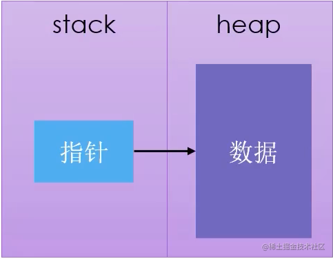
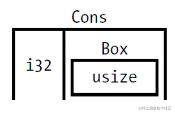
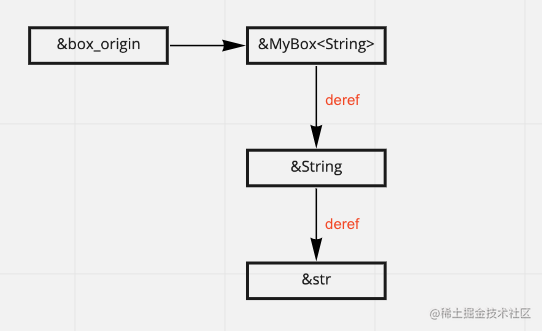

# 概念提出

### 指针
**指针** （*pointer*）是一个包含内存地址的变量的通用概念。这个地址引用，或 “指向”（points at）一些其他数据。Rust 中最常见的指针是 **引用**（*reference*）。
 - 使用`&`来表示
 - **借用**指向的值
 - 没有其余的开销

**智能指针**（*smart pointers*）是一类数据结构，他们的表现类似指针，但是也拥有额外的元数据和功能。比如：`String` 和 `Vec<T>`。

区别： 是引用是一类只借用数据的指针；但是智能指针 **拥有** 他们指向的数据。


**智能指针通常使用结构体实现**。智能指针区别于常规结构体的显著特性在于其实了 `Deref` 和 `Drop` trait。

- `Deref` trait 允许智能指针结构体实例表现的像引用一样，这样就可以编写既用于引用、又用于智能指针的代码。
- `Drop` trait 允许我们自定义当智能指针离开作用域时运行的代码。

这里将会讲到的是来自标准库中最常用的一些：
-   `Box<T>`，用于在堆上分配值。
-   `Rc<T>`，*reference count* 一个引用计数类型，其数据可以有多个所有者，
-   `Ref<T>` 和 `RefMut<T>`，通过 `RefCell<T>` 访问，一个在运行时而不是在编译时执行借用规则的类型。
- **内部可变性**（*interior mutability*）模式，这时不可变类型暴露出改变其内部值的 API。
- **引用循环**（*reference cycles*）的实现和避免方法。


### 堆栈
堆栈 [所有权和堆栈](https://juejin.cn/post/7043646833993711624/)

Rust 堆上对象还有一个特殊之处，它们都拥有一个所有者，因此受所有权规则的限制：当赋值时，发生的是所有权的转移（只需浅拷贝栈上的引用或智能指针即可）：

```rust
fn main() {
    let b = foo("world");
    println!("{}", b);
}

fn foo(x: &str) -> String {
    let a = "Hello, ".to_string() + x;
    a
}
```
在 `foo` 函数中，`a` 是 `String` 类型，它其实是一个智能指针结构体，该智能指针存储在函数栈中，指向堆上的字符串数据。当被从 `foo` 函数转移给 `main` 中的 `b` 变量时，栈上的智能指针被复制一份赋予给 `b`，而底层数据无需发生改变，这样就完成了所有权从 `foo` 函数内部到 `b` 的转移。


## Box 智能指针
最简单直接的智能指针是 *box*，其类型是 `Box<T>`。 `box` 允许你将一个值放在堆上而不是栈上。留在栈上的则是指向堆数据的指针。`Box` **是简单的封装，除了将值存储在堆上外，并没有其它性能上的损耗。**




使用场景：
-   当有一个在编译时未知大小的类型，而又想要在需要确切大小的上下文中使用这个类型值的时候。
-   当有大量数据并希望在确保数据不被拷贝的情况下转移所有权的时候。
-   当希望拥有一个值并只关心它的类型是否实现了特定 `trait` 而不是其具体类型的时候。

```rust
fn main(){

    // 创建智能指针 100存贮的堆上  a是在栈上的指针地址
    let a = Box::new(100);
    println!("a is {}", a);


    let b = 1;
    let c = b +a;
    
    // 需要手动显示的解引用来调用
    // c = b + *a;

    // help: the trait `Add<Box<{integer}>>` is not implemented for `{integer}`
    println!("c is {}", c);

}
```
由于智能指针实现了`Deref` 和 `Drop`。
-   `println!` 可以正常打印出 `a` 的值，是因为它隐式地调用了 `Deref` 对智能指针 `a` 进行了解引用
-   `c`报错，是因为在表达式中，我们无法自动隐式地执行 `Deref` 解引用操作.
-   `a` 持有的智能指针将在作用域结束（`main` 函数结束）时，被释放掉，这是因为 `Box<T>` 实现了 `Drop` 特征。实际开发中很少将普通类型存贮到堆上

### 避免栈上数据拷贝

以下代码，可以清晰看出大块的数据为何应该放入堆中，此时 `Box` 就成为了我们最好的帮手。

```rust
    // 在栈上创建一个长度为1000的数组
    let arr1 = [0;1000];

    // 将arr所有权转移arr1，由于 `arr` 分配在栈上，因此这里实际上是直接重新深拷贝了一份数据
    let arr2 = arr1;

    println!("arr1 {:?}", arr1); 
    println!("arr2 {:?}", arr2);


    // 在堆上创建一个长度为1000的数组，然后使用一个智能指针指向它
    let box_arr1 = Box::new([0;1000]);

    // 将堆上数组的所有权转移给 arr1，由于数据在堆上，因此仅仅拷贝了智能指针的结构体，底层数据并没有被拷贝
    let box_arr2 = box_arr1;


    // 报错error: value borrowed here after move，所有权发生了转移，box_arr1不再拥有所有权
    // println!("box_arr1 {:?}", box_arr1);

    // 打印box_arr2
    println!("box_arr2 {:?}", box_arr2);
```
### rust 计算非递归类型的大小
```rust
enum Message {
    Quit,
    Move { x: i32, y: i32 },
    Write(String),
    ChangeColor(i32, i32, i32),
}
```

当 Rust 需要知道要为 `Message` 值分配多少空间时，它可以检查每一个成员并发现 `Message::Quit` 并不需要任何空间，`Message::Move` 需要足够储存两个 `i32` 值的空间，依此类推。**因此，`Message` 值所需的空间等于储存其最大成员的空间大小。**

### 将动态大小类型变为 Sized 固定大小类型

```rust
#[derive(Debug)]
pub enum List {
    Cons(i32, Box<List>),
    Nil,
}

use crate::List::{Cons,Nil};

fn main(){
    let list = Cons(1, Box::new(Cons(2, Box::new(Nil))));
    println!("list is {:?}", list);
}
```

当不适用box的时候，无限的递归会造成大小也是不可计算的。但是当使用了`Box`以后，大小就可以计算了。原因是**不是直接存贮数据，而是存贮指针，因为指针的大小不会因为数据的大小而变化，是恒定的**。如下图



所需要的空间综总和是：`Cons` 成员将会需要一个 `i32` 的大小加上储存 box 指针数据的空间。`Nil` 成员不储存值，所以它比 `Cons` 成员需要更少的空间。通过使用 box ，打破了这无限递归的连锁。

`Box<T>` 类型是一个智能指针，因为它实现了 `Deref` trait，它允许 `Box<T>` 值被当作引用对待。当 `Box<T>` 值离开作用域时，由于 `Box<T>` 类型 `Drop` trait 的实现，box 所指向的堆数据也会被清除。


## `Deref` trait 将智能指针当做常规引用

这个概念的主要目的是：是为了写出 `****s` 形式的解引用，因此称之为**智能指针。**

`Deref` trait 允许我们重载 **解引用运算符**（*dereference operator*）`*`。

通过这种方式实现 `Deref` trait 的智能指针可以被当作常规引用来对待，可以编写操作引用的代码并用于智能指针。

如果一个结构体类型，如果你直接对它进行 `*myStruct`**解引用**，显然编译器不知道该如何办，因此我们可以为智能指针结构体实现 `Deref` 特征。实现 `Deref` 后的智能指针结构体，就可以像普通引用一样，通过 `*` 进行解引用，例如 `Box<T>` 智能指针：
```rust
    let x = 5;
    let y = &x;

    assert_eq!(x,5);
    assert_eq!(*y,5);

    let a = Box::new(100);
    assert_eq!(*a, 100);
}
```

### 自定义智能指针
`Deref` trait，由标准库提供，要求实现名为 `deref` 的方法，其借用 `self` 并返回一个内部数据的引用。
`type Target = T;` 语法定义了用于此 trait 的关联类型。关联类型是一个稍有不同的定义泛型参数的方式

```rust
use std::ops::Deref;
struct MyBox<T>(T);

impl<T> MyBox<T> {
    fn new(x:T)->MyBox<T>{
        MyBox(x)
    }
} 

impl<T> Deref for MyBox<T> {
    type Target = T;
    fn deref(&self) -> &T {
        &self.0  // 元组的第一个元素
    }
}

fn main(){
    let y = MyBox::new(100);
    assert_eq!(*y, 100); 
    println!("底层的实现方式是：{}", *(y.deref()));


    let str = String::from("hello world!");
    // let res = str.deref();
    // display_fn(str.deref());
    display_fn(&str); // 发生了隐式类型转换：&String->.deref()->&str


    let box_origin = MyBox::new(String::from("jock is master!"));
 
    // 手动类型转换
    let box_string:&String = box_origin.deref();
    let box_str:&str = box_string.deref();
    display_fn(box_str);
    
    // 隐式类型转换       
    display_fn(&box_origin);
}

fn display_fn(s: &str){
    println!("display_fn is {}", s);
}
```
这里以及大部分使用解引用运算符的情况下我们并不希望获取 `MyBox<T>` 内部值的所有权。

### 函数和方法的隐式解引用强制多态

**解引用强制多态**（*deref coercions*）是 Rust 在函数或方法传参上的一种便利。其将实现了 `Deref` 的类型的引用转换为原始类型通过 `Deref` 所能够转换的类型的引用。

当这种特定类型的引用作为实参传递给和形参类型不同的函数或方法时，解引用强制多态将自动发生。这时会有一系列的 `deref` 方法被调用，把我们提供的类型转换成了参数所需的类型。

解引用强制多态的加入使得 Rust 程序员编写函数和方法调用时无需增加过多显式使用 `&` 和 `*` 的引用和解引用。

当所涉及到的类型定义了 `Deref` trait，Rust 会分析这些类型并使用任意多次 `Deref::deref` 调用以获得匹配参数的类型。这些解析都发生在编译时，所以利用解引用强制多态并没有运行时惩罚！





```rust
// 写法上完全等同，但是隐式解引用更加易读和使用
hello(&(*m)[..]); === display_fn(&box_origin);
```


### 解引用强制多态与可变性交互

在之前，我们讲的都是不可变的 `Deref` 转换，实际上 Rust 还支持将一个可变的引用转换成另一个可变的引用以及将一个可变引用转换成不可变的引用，规则如下：

-   当 `T: Deref<Target=U>`，可以将 `&T` 转换成 `&U`，也就是我们之前看到的例子
-   当 `T: DerefMut<Target=U>`，可以将 `&mut T` 转换成 `&mut U`
-   当 `T: Deref<Target=U>`，可以将 `&mut T` 转换成 `&U`


## Drop 释放资源
在一些无 GC 语言中，程序员在一个变量无需再被使用时，需要手动释放它占用的内存资源，如果忘记了，那么就会发生内存泄漏。对于智能指针模式来说第二个重要的 trait 是 `Drop`，其允许我们在值要离开作用域时执行一些代码。

指定在值离开作用域时应该执行的代码的方式是实现 `Drop` trait。`Drop` trait 要求实现一个叫做 `drop` 的方法，它获取一个 `self` 的可变引用。`Drop` trait 包含在 prelude 中，所以无需导入它。

```rust
struct CustomSmartPointer {
    data: String,
}

impl Drop for CustomSmartPointer {
    fn drop(&mut self) {
        println!("Dropping ====== `{}`!", self.data);
    }
}

fn main() {
    let c = CustomSmartPointer { data: String::from("my stuff") };
    
    // `std::mem::drop` 函数不同于 `Drop` trait 中的 `drop` 方法。
    // 可以通过传递希望提早强制丢弃的值作为参数。`std::mem::drop` 位于 prelude
    drop(c);
    let d = CustomSmartPointer { data: String::from("other stuff") };
}

```
也可以按照用例提前调用drop来清理掉。所有权系统保证，无需担心重复清理的问题。


## Rc 和Arc 

主要适用于一个数据被多个所有者持有的场景：
- 在图数据结构中，多个边可能会拥有同一个节点，该节点直到没有边指向它时，才应该被释放清理。
- 在多线程中，多个线程可能会持有同一个数据，但是你受限于 Rust 的安全机制，无法同时获取该数据的可变引用。

解决的方法是：**通过引用计数的方式，允许一个数据资源在同一时刻拥有多个所有者。** 实现机制就是 `Rc` 和 `Arc`，前者适用于单线程，后者适用于多线程。


### 1: RC: 引用计数(reference counting)

在 Rust 中，所有权机制保证了一个数据只会有一个所有者，但如果你想要在图数据结构、多线程等场景中共享数据，这种机制会成为极大的阻碍。好在 Rust 为我们提供了智能指针 `Rc` 和 `Arc`，使用它们就能实现多个所有者共享一个数据的功能。

`Rc` 和 `Arc` 的区别在于，后者是原子化实现的引用计数，因此是线程安全的，可以用于多线程中共享数据。

通过记录一个数据被引用的次数来确定该数据是否正在被使用。当引用次数归零时，就代表该数据不再被使用，因此可以被清理释放。当我们**希望在堆上分配一个对象供程序的多个部分使用且无法确定哪个部分最后一个结束时，就可以使用 `Rc` 成为数据值的所有者**。

```rust
use std::rc::Rc;
fn main() {
    let a = Rc::new(String::from("hello, world"));
    let b = Rc::clone(&a);
    println!("a = {}", Rc::strong_count(&a)); // 2
}
```
使用 `Rc::new` 创建了一个新的 `Rc<String>` 智能指针并赋给变量 `a`，该指针指向底层的字符串数据。智能指针 `Rc<T>` 在创建时，还会将引用计数加 1，此时获取引用计数的关联函数 `Rc::strong_count` 返回的值将是 `1`。


也可以调用 `a.clone()`进行深拷贝类的克隆和增加引用计数类的克隆。但是通常使用`Rc::clone` 只会增加引用计数，这并不会花费多少时间。深拷贝可能会花费很长时间。

`Rc::clone`是**仅仅复制了智能指针并增加了引用计数，并没有克隆底层数据**，因此 `a` 和 `b` 是共享了底层的字符串 `s`，这种**复制效率是非常高**。

```rust
use std::rc::Rc;
fn main() {
    let a = Rc::new(String::from("test ref counting"));
    println!("count after creating a = {}", Rc::strong_count(&a)); // 1
    let b =  Rc::clone(&a);
    println!("count after creating b = {}", Rc::strong_count(&a)); // 2
    {
        let c =  Rc::clone(&a);
        println!("count after creating c = {}", Rc::strong_count(&c)); // 3
    }
    println!("count after c goes out of scope = {}", Rc::strong_count(&a)); // 2
}


```

### 2： **不可变引用：**
`Rc<T>` 是指向底层数据的不可变的引用，因此你无法通过它来修改数据，这也符合 Rust 的借用规则：**要么存在多个不可变借用，要么只能存在一个可变借用**。

但是实际开发中我们往往需要对数据进行修改，这时单独使用 `Rc<T>` 无法满足我们的需求，需要配合其它数据类型来一起使用，例如内部可变性的 `RefCell<T>` 类型以及互斥锁 `Mutex<T>`。事实上，在多线程编程中，`Arc` 跟 `Mutext` 锁的组合使用非常常见，它们既可以让我们在不同的线程中共享数据，又允许在各个线程中对其进行修改。

-   `Rc/Arc` 是不可变引用，你无法修改它指向的值，只能进行读取，如果要修改，需要配合后面章节的内部可变性 `RefCell` 或互斥锁 `Mutex`
-   一旦最后一个拥有者消失，则资源会自动被回收，这个生命周期是在编译期就确定下来的
-   `Rc` 只能用于同一线程内部，想要用于线程之间的对象共享，你需要使用 `Arc`
-   `Rc<T>` 是一个智能指针，实现了 `Deref` 特征，因此你无需先解开 `Rc` 指针，再使用里面的 `T`，而是可以直接使用 `T`，例如上例中的 `gadget1.owner.name`

```rust
use std::rc::Rc;

struct Owner {
    name: String,
    // ...其它字段
}

struct Gadget {
    id: i32,
    owner: Rc<Owner>,
    // ...其它字段
}

fn main() {
    // 创建一个基于引用计数的 `Owner`.
    let gadget_owner: Rc<Owner> = Rc::new(Owner {
        name: "Gadget Man".to_string(),
    });

    // 创建两个不同的工具，它们属于同一个主人
    let gadget1 = Gadget {
        id: 1,
        owner: Rc::clone(&gadget_owner),
    };
    let gadget2 = Gadget {
        id: 2,
        owner: Rc::clone(&gadget_owner),
    };

    // 释放掉第一个 `Rc<Owner>`
    drop(gadget_owner);

    // 尽管在上面我们释放了 gadget_owner，但是依然可以在这里使用 owner 的信息
    // 原因是在 drop 之前，存在三个指向 Gadget Man 的智能指针引用，上面仅仅
    // drop 掉其中一个智能指针引用，而不是 drop 掉 owner 数据，外面还有两个
    // 引用指向底层的 owner 数据，引用计数尚未清零
    // 因此 owner 数据依然可以被使用
    println!("Gadget {} owned by {}", gadget1.id, gadget1.owner.name);
    println!("Gadget {} owned by {}", gadget2.id, gadget2.owner.name);

    // 在函数最后，`gadget1` 和 `gadget2` 也被释放，最终引用计数归零，随后底层
    // 数据也被清理释放
}

```

### 3: ARC
  `Arc` 是 `Atomic Rc` 的缩写，顾名思义：原子化的 `Rc<T>` 智能指针。原子化是一种并发原语，能够安全的在线程间共享。

原子化或者其它锁虽然可以带来的线程安全，但是都会伴随着性能损耗，而且这种性能损耗还不小。因此 Rust 把这种选择权交给你，毕竟需要线程安全的代码其实占比并不高，大部分时候我们开发的程序都在一个线程内。      

`Arc` 和 `Rc` 拥有完全一样的 API：
```rust
use std::sync::Arc;
use std::thread;

fn main() {
    let s = Arc::new(String::from("hi~ fucken man!"));
    for _ in 0..10 {
        let s = Arc::clone(&s);
        let handle = thread::spawn(move || {
           println!("{}", s)
        });
    }
}
```


## [Cell 和 RefCell]
Rust 的编译器之严格，可以说是举世无双。特别是在所有权方面，Rust 通过严格的规则来保证所有权和借用的正确性，最终为程序的安全保驾护航。

但损失了灵活性。因此 Rust 提供了 `Cell` 和 `RefCell` 用于内部可变性，简而言之，可以在拥有不可变引用的同时修改目标数据，对于正常的代码实现来说，这个是不可能做到的（要么一个可变借用，要么多个不可变借用）。


### 1: Cell

```rust
use std::cell::Cell;

fn main(){
    let c = Cell::new("fuck man!");
    let one = c.get();
    println!("one is {}", one); // one is fuck man  

    c.set("fuck world");
    let two = c.get();
    println!("two is {}",two); //two is fuck world 
    
    // expected `&str`, found struct `String` 
    // help: consider borrowing here: `&String::from("hello")`
    c.set(String::from("hello"));
    
}
```
-   c的类型是：Cell<&str>; `&str` 类型，它实现了 `Copy` 特征
-   `c.get` 用来取值，`c.set` 用来设置新值

取到值保存在 `one` 变量后，还能同时进行修改，这个违背了 Rust 的借用规则，但是由于 `Cell` ,可以做到了这一点，但是如果你尝试在 `Cell` 中存放`String`就会报错。

### 2: Refcel
由于 `Cell` 类型针对的是实现了 `Copy` 特征的值类型，因此在实际开发中，`Cell` 使用的并不多，因为我们要解决的往往是可变、不可变引用共存导致的问题，此时就需要借助于 `RefCell` 来达成目的。

将所有权、借用规则与这些智能指针做一个对比：

| Rust 规则            | 智能指针带来的额外规则              |
| ------------------ | ------------------------ |
| 一个数据只有一个所有者        | `Rc/Arc`让一个数据可以拥有多个所有者   |
| 要么多个不可变借用，要么一个可变借用 | `RefCell`实现编译期可变、不可变引用共存 |
| 违背规则导致**编译错误**     | 违背规则导致**运行时`panic`**     |

可以看出，`Rc/Arc` 和 `RefCell` 合在一起，解决了 Rust 中严苛的所有权和借用规则带来的某些场景下难使用的问题。但是它们并不是银弹，例如 `RefCell` 实际上并没有解决可变引用和引用可以共存的问题，只是将报错从编译期推迟到运行时，从编译器错误变成了 `panic` 异常：
```rust
use std::cell::RefCell;
fn main() {
    let s = RefCell::new(String::from("hello, world"));
    let s1 = s.borrow();
    let s2 = s.borrow_mut();

    println!("{},{}", s1, s2);
}

```
上面代码在编译期不会报任何错误，你可以顺利运行程序.

`RefCell`存在的原因：**用于你确信代码是正确的，而编译器却发生了误判时**。总之，当你确信编译器误报但不知道该如何解决时，或者你有一个引用类型，需要被四处使用和修改然后导致借用关系难以管理时，都可以优先考虑使用 `RefCell`。


### 3： 选择Cell 还是RefCell 

大概总结下两者的区别：

-   `Cell` 只适用于 `Copy` 类型，用于提供值，而 `RefCell` 用于提供引用.
-   `Cell` 不会 `panic`，而 `RefCell` 会.

### 4: 内部可变性
下面代码会报错，因为我们不能对一个不可变的值进行可变借用，这会破坏 Rust 的安全性保证，相反，你可以对一个可变值进行不可变借用。

```rust
fn main() {
    let x = 5;
    let y = &mut x;
}

```

某些场景中，一个值可以在其方法内部被修改，同时对于外部来说仍是不可变。下面模拟实现一个MQ功能。
> MQ（Message Queue）消息队列，是基础数据结构中“先进先出”的一种数据结构。指把要传输的数据（消息）放在队列中，用队列机制来实现消息传递——生产者产生消息并把消息放入队列，然后由消费者去处理。消费者可以到指定队列拉取消息，或者订阅相应的队列，由MQ服务端给其推送消息。

> 消息队列中间件是分布式系统中重要的组件，主要解决应用解耦，异步消息，流量削锋等问题，实现高性能，高可用，可伸缩和最终一致性架构。

```rust
use std::{cell::{RefCell}};

// 定义在外部库中的特征
pub trait Messenger {
    fn send(&self, msg: String);
}


struct MsgQueue {
    // msg_cache:Vec!<String>,
    msg_cache: RefCell<Vec<String>>,
}

impl MsgQueue {
    fn get_cache(&self){
        println!("get cache! {:?}", self.msg_cache);
    }
}

impl Messenger for MsgQueue {
    fn send(&self, msg: String) {
        // self.msg_cache.push(msg)
        self.msg_cache.borrow_mut().push(msg);
    }
}


fn main() {
    let message = MsgQueue{
      msg_cache: RefCell::new(vec![]),
    };

    message.send("hi".to_string());
    message.send("rust".to_string());
    message.send("javascript".to_string());
    message.get_cache();

}

```
该特征实现一个异步消息队列，出于性能的考虑，消息先写到本地缓存(内存)中，然后批量发送出去，因此在 `send` 方法中，需要将消息先行插入到本地缓存 `msg_cache` 中。但是问题来了，该 `send` 方法的签名是 `&self`，因此上述代码会报错。 实现的特征是定义在外部库中，因此该签名根本不能修改。但是使用`RefCell` 完全可以避免这个问题。

### 5: rc和refCell 组合使用
在 Rust 中，一个常见的组合就是 `Rc` 和 `RefCell` 在一起使用，前者可以实现一个数据拥有多个所有者，后者可以实现数据的可变性：

使用 `RefCell<String>` 包裹一个字符串，同时通过 `Rc` 创建了它的三个所有者：`s`、`s1`和`s2`，并且通过其中一个所有者 `s2` 对字符串内容进行了修改。

由于 `Rc` 的所有者们共享同一个底层的数据，因此当一个所有者修改了数据时，会导致全部所有者持有的数据都发生了变化。

```rust
use std::cell::RefCell;
use std::rc::Rc;
fn main() {
    let s = Rc::new(RefCell::new("我很善变，还拥有多个主人".to_string()));

    let s1 = s.clone();
    let s2 = s.clone();
    // let mut s2 = s.borrow_mut();
    s2.borrow_mut().push_str(", on yeah!");

    println!("{:?}\n{:?}\n{:?}", s, s1, s2);
}

```
执行结果是：
```rust
RefCell { value: "我很善变，还拥有多个主人, on yeah!" }
RefCell { value: "我很善变，还拥有多个主人, on yeah!" }
RefCell { value: "我很善变，还拥有多个主人, on yeah!" }

```

### 参考文章
- https://course.rs/advance/smart-pointer/box.html
- https://rust.bootcss.com/ch15-02-deref.html


