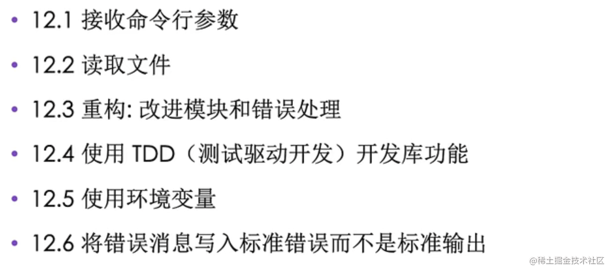

# 主要几个步骤



目标是：实现类似在`grep`一样在文件搜索功能。


## 1： 项目创建

```rust
cargo new open_editor
```

`main.rs` 如下：

```rust
use std::env;
use std::fs;

fn main() {
    let args:Vec<String> = env::args().collect();

    let query = &args[1];
    let filename = &args[2];

    println!("Search for {}", query);
    println!("In file {}", filename);

    let contents = fs::read_to_string(filename)
     .expect("Something wneg wrong!!");

    println!("With text:\n{}", contents);
}

```
创建`poem.txt`文件内容如下：
```
床前明月光，
疑是地上霜，
举头望明月，
低头思故乡。
Are you nobody, too?
How drealy to be somebody!
To an admiring bog!
```
在控制台搜索：
```
cargo run 月 poem.txt
```

## 2: 项目优化

`main`函数负责的功能比较多，尽量让函数保持单一原则。

`query`和`filename`是存贮的配置，随着程序变大，变量越来越多，使用了结构体来进行统一。

读取文件错误信息等缺少详细的描述，如果全部使用`expect`的话，错误都是rust语言内部的，尽量让错误集中放置，也方便了维护。

社区内产生的一些原则：


`main.rs` 负责入口和运行，里面应该只有很少的胶水代码，`lib.rs`负责真正的业务处理。


`main.rs`进行修改：
```rust
use std::env;
use std::fs;


struct Config {
    query: String,
    filename: String,
}

impl Config {
    // 一般实例化的结构体可以叫做new
    fn new (args: &[String]) ->Config{
        let query = args[1].clone();
        let filename = args[2].clone();
        Config{query, filename}
    }
}

fn main() {
    let args:Vec<String> = env::args().collect();
    let config = Config::new(&args);
    
    let contents = fs::read_to_string(config.filename)
     .expect("Something wneg wrong!!");

    println!("With text:\n{}", contents);
}
```

## 3：持续优化

- **测试驱动开发TDD**。
- 标准输出和标准错误应该加以区分。
- 使用环境变量


`lib.rs`:

```rust
use std::error::Error;
use std::fs;
use std::env;


pub struct Config {
    pub query: String,
    pub filename: String,
    pub case_sensitive: bool
}

// 第一个返回不需要什么 所以是一个空元组
// 实现了错误trait
pub fn run (config:Config) -> Result<(), Box<dyn Error>> {
    // ? 发生错误以后会不会发生panic,会将错误值返回给函数的调用者
    let contents = fs::read_to_string(config.filename)?;
    
    // 有返回值的表达式
    let results = if config.case_sensitive {
        search(&config.query, &contents)
    }else {
        search_case_insensitive(&config.query, &contents)
    };
    
    
    for line in results{
      println!("{}", line);   
    }
    Ok(())
}


impl Config {
    // 一般实例化的结构体可以叫做new
    pub fn new (args: &[String]) -> Result<Config, &'static str> {
        if args.len() < 3 {
            return Err("not enough argunments!");
        }
        let query = args[1].clone();
        let filename = args[2].clone();

        // 调用环境变量 var->Result 如果设置了Ok("CASE_INSENSITIVE")，否则会在err变体中，所以只检测有没有is_err(),并不关心具体的值是多少。
        let case_sensitive = env::var("CASE_INSENSITIVE").is_err();
        Ok(Config{query, filename,case_sensitive})
    }
}

// 检查当前行是否包含需要查询的字符串
pub fn search<'a>(query: &str, contents: &'a str)->Vec<&'a str>{
    let mut results = Vec::new();
    for line in contents.lines() {
        if line.contains(query) {
            results.push(line);
        }
    }
    results
}

// 使用环境变量来区分大小写：全都转换为小写，就不会区分大小写
pub fn search_case_insensitive<'a>(query: &str, contents: &'a str)->Vec<&'a str>{
    let mut results = Vec::new();
    let query = query.to_lowercase();
    for line in contents.lines() {
        if line.to_lowercase().contains(&query) {
            results.push(line);
        }
    }
    results
}


// TDD 测试驱动开发
#[cfg(test)]
mod tests{
    use super::*;

    #[test]
    fn one_result(){
        let query = "duct";
        let contents = "\
Rust:
safe, fast, productive.
Pick three.";
        assert_eq!(vec!["safe, fast, productive."],search(query, contents));
    }

    #[test]
    fn case_insensitive(){
        let query = "rUsT";
        let contents = "\
Rust:
safe, fast, productive.
Pick three.
Trust me";
        assert_eq!(vec!["Rust:", "Trust me"],search_case_insensitive(query, contents));

    }
}
```

`main.rs`:
标准错误和标准输出要加以区分：
- 标准输出：stdout: `println！`
- 标准错误：sdterr: `eprintln!`


```rust
use open_editor::Config;
use open_editor::run;
use std::env;
use std::process;


/**
 * 配置解析 错误处理 之外的所有逻辑都提取到 run 函数中 ，方便阅读和排查问题
 * 
 * eprintln! 标准错误 和 标准输出要加以区分，只包含正常的运行数据
 */
fn main() {
    let args:Vec<String> = env::args().collect();
    // unwrap_or_else 返回成功以后就类似unwrap ，把ok里面的值取出来返回来
    // 失败以后就返回一个闭包
    let config = Config::new(&args).unwrap_or_else(|err| {
        eprintln!("Problem parsing arguments: {}", err);
        process::exit(0);
    });
   
    // 只需检测是否有错误即可，和上面的判断错误不同 
    if let Err(e) = run(config) {
        eprintln!("Application error: {}", e);
        process::exit(1);
    }
}
```

验证：

```rust

// 运行测试
cargo test

// 正常查询
cargo run to poem.txt 

// 使用环境变量，区分大小写查询，标出输出到文件里面
CASE_INSENSITIVE=1 cargo run to poem.txt > output.txt

```


