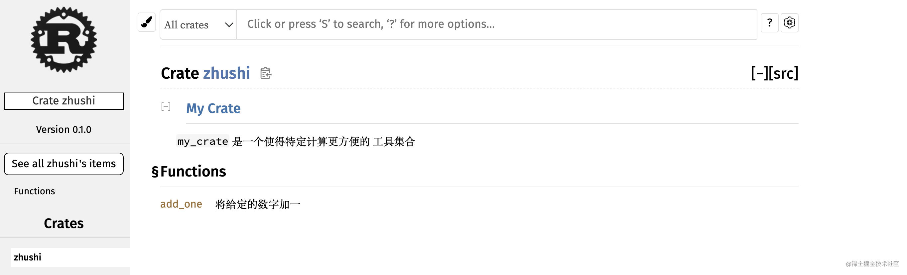

# 本篇主要内容：

-   使用发布配置来自定义构建
-   将库发布到 [crates.io](https://crates.io/)
-   使用工作空间来组织更大的项目
-   从 [crates.io](https://crates.io/) 安装二进制文件
-   使用自定义的命令来扩展 Cargo

`cargo` 的官方[文档](https://doc.rust-lang.org/cargo/)。


## 1: release profiles
在 Rust 中 **发布配置**（*release profiles*）是预定义的、可定制的带有不同选项的配置，他们允许程序员更灵活地控制代码编译的多种选项。主要是用于覆盖默认配置。


- `dev profile`: 适用于开发 `cargo build`
- `release profile`: 适用于发布， `cargo build --release` 

eg: `opt-level` 设置控制 Rust 会对代码进行何种程度的优化。这个配置的值从 0 到 3。以下展示的是默认值。
```rust
[profile.dev]
opt-level = 0

[profile.release]
opt-level = 3

```
[更多配置](https://doc.rust-lang.org/cargo/reference/manifest.html#the-profile-sections)。

## 2: 文档注释

#### 注释语法
文档注释：用于生成文档
- 生成html文档
- 显示公共api的文档注释：如何使用api。
- 使用///
- 支持Markdown
- 放置再被说明条目之前

`cargo doc`
- 它会运行`rustdoc`工具与（rust安装包自带）
- 把生成的html文档放在`target/doc` 目录下

`cargo doc -open`
- 构建当前的crate的文档（也包含`crate`依赖的文档）
- 在浏览器打开文档

#### **常用（文档注释）部分**

`# Examples` Markdown 标题在 HTML 中创建了一个以 “Examples” 为标题的部分。其他一些 crate 作者经常在文档注释中使用的部分有：

-   **Panics**：这个函数可能会 `panic!` 的场景。并不希望程序崩溃的函数调用者应该确保他们不会在这些情况下调用此函数。
-   **Errors**：如果这个函数返回 `Result`，此部分描述可能会出现何种错误以及什么情况会造成这些错误，这有助于调用者编写代码来采用不同的方式处理不同的错误。
-   **Safety**：如果这个函数使用 `unsafe` 代码（这会在第十九章讨论），这一部分应该会涉及到期望函数调用者支持的确保 `unsafe` 块中代码正常工作的不变条件（invariants）。

大部分文档注释不需要所有这些部分，不过这是一个提醒你检查调用你代码的人有兴趣了解的内容的列表。

####  **文档作为测试：**

在文档注释中增加示例代码块是一个清楚的表明如何使用库的方法，这么做还有一个额外的好处：`cargo test` 也会像测试那样运行文档中的示例代码！


#### 文档注释

`//!`这类注释通常用于描述`crate`和模块：这通常用于 `crate` 根文件（通常是 *src/lib.rs*）或模块的根文件为 `crate `或模块整体提供文档。


```rust
//! # My Crate
//!
//! `my_crate` 是一个使得特定计算更方便的
//! 工具集合

/// 将给定的数字加一
///
/// # Examples
///
/// ```
/// let arg = 5;
/// let answer = zhushi::add_one(arg);
///
/// assert_eq!(6, answer);
/// ```
pub fn add_one(x: i32) -> i32 {
    x + 1
}

```





#### 使用pub use 导出方便使用的公共api
你的结构可能是一个包含多个层级的分层结构，不过这对于用户来说并不方便。

他们也可能会厌烦使用 `use my_crate::some_module::another_module::UsefulType;` 而不是 `use my_crate::UsefulType;` 来使用类型。

公有 `API` 的结构是你发布 `crate` 时主要需要考虑的。`crate` 用户没有你那么熟悉其结构，并且如果模块层级过大他们可能会难以找到所需的部分。

**因此，你可以选择使用 `pub use` 重导出（re-export）项来使公有结构不同于私有结构。**

假设我们创建了一个描述美术信息的库 `art`。这个库中包含了一个有两个枚举 `PrimaryColor` 和 `SecondaryColor` 的模块 `kinds`，以及一个包含函数 `mix` 的模块 `utils`，

```rust
//! # Art
//!
//! 一个描述美术信息的库。

// 重新设置导出
pub use self::kinds::PrimaryColor;
pub use self::kinds::SecondaryColor;
pub use self::utils::mix;

pub mod kinds {
    /// 采用 RGB 色彩模式的主要颜色。
    pub enum PrimaryColor {
        Red,
        Yellow,
        Blue,
    }

    /// 采用 RGB 色彩模式的次要颜色。
    pub enum SecondaryColor {
        Orange,
        Green,
        Purple,
    }
}

pub mod utils {
    use crate::kinds::*;

    /// 等量的混合两个主要颜色
    /// 来创建一个次要颜色。
    pub fn mix(c1: PrimaryColor, c2: PrimaryColor) -> SecondaryColor {
        // --snip--
        SecondaryColor::Orange
    }
}
```

在`main.rs`使用的时候：
```rs

// 之前的长写法
// use zhushi::kinds::PrimaryColor;
// use zhushi::utils::mix;

// 重新导出后的写法
use zhushi::PrimaryColor;
use zhushi::mix;

fn main() {
    let red = PrimaryColor::Red;
    let yellow = PrimaryColor::Yellow;
    mix(red, yellow);
}
```
对于有很多嵌套模块的情况，使用 `pub use` 将类型重导出到顶级结构对于使用 crate 的人来说将会是大为不同的体验。

创建一个有用的公有 API 结构更像是一门艺术而非科学，你可以反复检视他们来找出最适合用户的 API。

`pub use` 提供了解耦组织 crate 内部结构和与终端用户体现的灵活性。观察一些你所安装的 crate 的代码来看看其内部结构是否不同于公有 API。

## 3: crates.io

#### 登录
使用生成的`token`登录。使用方法完全类似`npm`。这个命令会通知 Cargo 你的 API token 并将其储存在本地的  *~/.cargo/credentials* 文件中

`cargo login abcdefghijklmnopqrstuvwxyz012345`

#### 发布新的 `cargo` 包:

在发布之前，你需要在 crate 的 *Cargo.toml* 文件的 `[package]` 部分增加一些本 crate 的元信息（metadata）

```rs
[package]
name = "guessing_game"  // 唯一的名称，类似npm先去官方搜索是否存在重名，唯一先到先到获得
version = "0.1.0"

// 必须 
authors = ["Your Name <you@example.com>"] 
edition = "2018"

// 必须
description = "A fun game where you guess what number the computer has chosen." 

// 必须 
license = "MIT OR Apache-2.0" 

[dependencies]

```

#### 发布

发布是 **永久性的**（*permanent*）。对应版本不可能被覆盖，其代码也不可能被删除。[crates.io](https://crates.io/) 的一个主要目标是作为一个存储代码的永久文档服务器。

修改了 `crate` 并准备好发布新版本时，改变 *Cargo.toml* 中 `version` 所指定的值。请使用 [语义化版本规则](http://semver.org/) 来根据修改的类型决定下一个版本号。接着运行 `cargo publish` 来上传新版本。


#### 撤回某个版本

虽然你不能删除之前版本的 crate，但是可以阻止任何将来的项目将他们加入到依赖中。这在某个版本因为这样或那样的原因被破坏的情况很有用。对于这种情况，Cargo 支持 **撤回**（*yanking*）某个版本。

撤回某个版本会阻止新项目开始依赖此版本，不过所有现存此依赖的项目仍然能够下载和依赖这个版本。从本质上说，撤回意味着所有带有 *Cargo.lock* 的项目的依赖不会被破坏，同时任何新生成的 *Cargo.lock*将不能使用被撤回的版本。

```

// 撤回某个版本的发布
cargo yank --vers 1.0.1

// 取消||撤回上面撤回某个版本的动作
cargo yank --vers 1.0.1 --undo
```

撤回 **并没有** 删除任何代码。


## 4: 工作空间
**工作空间** 是一系列共享同样的 *Cargo.lock* 和输出目录的包。让我们使用工作空间创建一个项目 —— 这里采用常见的代码以便可以关注工作空间的结构。
[具体参考](https://rust.bootcss.com/ch14-03-cargo-workspaces.html)


