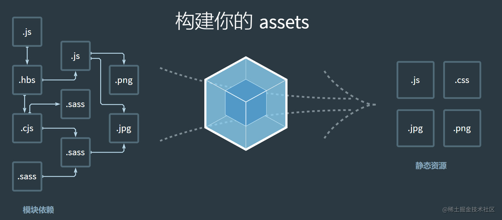
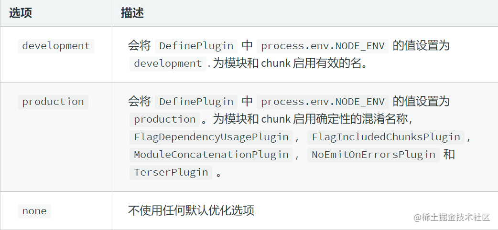
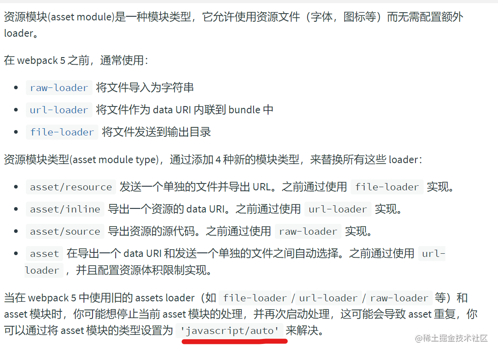

> 抽空再次全面的研究下前端构建工具，本篇是webpack(最新版5)。


**各人学习笔记，完全 *没有* 任何参考性。**


# webpack解决了什么问题？

**webpack 是前端静态资源（模块）构建工具**，静态模块打包器。

其是由`nodejs`编写的前端资源加载/打包工具，由`nodejs`提供了强大的文件处理，`IO`能力，因此 `webpack` 自身只支持`js`和`json`这两种格式的文件，对于其他文件需要通过`loader`将其转换为`commonJS`规范的文件后，`webpack`才能解析到。


**打包原理：** 从入口文件开始分析每一个依赖的资源，通过逐层识别模块依赖(`Commonjs`、`amd`或者`es6`的`import`，`webpack`都会对其进行分析，来获取代码的依赖); webpack做的就是分析代码，转换代码，编译代码，输出代码; 最终形成打包后的代码

**核心关键：5个步骤：**：

- `entry`：入口
- `output`：出口
- `loader`：让`wp` 能够去处理哪些非js文件（wp自身只能理解js）
- `plugin`：执行范围更大任务，打包压缩，变量env等很多
- `mode`：模式生产还是开发。

# 安装和命令行使用

**安装**： `yarn add webpack webpack-cli `。

**命令行打包**：` node_modules/.bin/webpack ./src/index.js -o ./development/  --mode=development `

封装简单的构建脚本：`wp.sh`:
```shell
if [[ $1x == "dev"x ]]; then
    echo "=====development===="
    node_modules/.bin/webpack ./src/index.js -o ./development/ --mode=development --color
elif [ $1x == "pro"x ]; then
    echo "=====production===="
    node_modules/.bin/webpack ./src/index.js -o ./production/ --mode=production --color
else
    echo "========error======="
fi
```

**package.json 入口打包：**

```js
"scripts": {
      "dev": "cross-env NODE_ENV=development webpack --config ./pack/config1.js",
    "serve": "cross-env NODE_ENV=development  && webpack serve --config ./pack/config1.js",
    "dll": "rm -rf ./dllOut &&cross-env NODE_ENV=production && webpack --config ./pack/dll.js",
    "analyse": "webpack-bundle-analyzer --port 9000 buildOut/stats.json",
    "build": "cross-env NODE_ENV=production webpack --config ./pack/config1.js"
  },
```

- `cross-env` makes it so you can have a single command without worrying about setting or using the environment variable properly for the platform

ps: `rm -rf` 也可以通过在`output`增加 `clean:true`实现。


# 核心概念分析：

`webpack`打包开发环境配置主要是为了能让代码运行。主要考虑以下几个方面：
**打包样式资源**、**html 资源**、**图片资源**、**其他资源*** 、**devServe**。

前置知识点： 
- [AMD、CommonJS、UMD 是什么？](https://segmentfault.com/a/1190000012419990)
- [# commonjs 和 commonjs2](https://www.jianshu.com/p/f4c7640a629a?utm_campaign=maleskine&utm_content=note&utm_medium=seo_notes&utm_source=recommendation)


### 1: mode:
```js
module.exports = {
  mode: 'production', // 默认是production
};
```


### 2:entry:

不写默认是 `main`。
```js
entry: {

  // 每个入口使用多种文件类型
  // production 是两个文件，会分别引入到html里面去，注入两个文件依赖
  // dev 会形成一个chunk, 输出出去只有一个bundle文件。
  home: ['./home.js', './home.scss'],

  // 形成一个chunk，输出一个bundle文件。
  add: './src/add.js'
}
```

### 3: output 

```js
output: {
  // 文件名称（指定名称+目录）
  filename: 'js/[name].js',
  // 输出文件目录（将来所有资源输出的公共目录）
  path: resolve(__dirname, 'build'),
  
   // 清除打包目录
   clean: true, 
  // 所有资源引入公共路径前缀 --> 'imgs/a.jpg' --> '/imgs/a.jpg'
  publicPath: '/',
  chunkFilename: 'js/[name]_chunk.js', // 指定非入口chunk的名称
  library: '[name]', // 打包后整个库后向外暴露的变量名
  libraryTarget: 'window' // 变量名添加到哪个上 browser：window
  // libraryTarget: 'global' // node：global
  // libraryTarget: 'commonjs' // conmmonjs模块 exports
},
```


### 5: resolve
主要作用是配置模块如何解析，

```js
// 解析模块的规则
resolve: {
  // 创建 `import` 或 `require` 的别名，来确保模块引入变得更简单。
  // 配置解析模块路径别名: 优点：当目录层级很复杂时，简写路径；缺点：路径不会提示
  alias: {
  '@': path.join(__dirname, '..', 'src')
   Utilities: path.resolve(__dirname, 'src/utilities/'),
  },
  // 配置省略文件路径的后缀名（引入时就可以不写文件后缀名了）
  extensions: ['.js', '.json', '.jsx', '.css'],
  // 告诉 webpack 解析模块应该去找哪个目录
  modules: [resolve(__dirname, '../../node_modules'), 'node_modules']
}
```

### 6: target
由于 `JavaScript` 既可以编写服务端代码也可以编写浏览器代码，所以` webpack` 提供了多种部署 *target*，
```
module.exports = {
  target: 'node',
};
```
在上述示例中，target 设置为 `node`，webpack 将在类 Node.js 环境编译代码。(使用 Node.js 的 `require` 加载 chunk，而不加载任何内置模块，如 `fs` 或 `path`)

默认常用： `web`, `node`, `electron-main`,`electron-render`

### 7: plugin

列举常见的插件：
- `DefinePlugin`允许在 **编译时** 将你代码中的变量替换为其他值或表达式。这在需要根据开发模式与生产模式进行不同的操作时。

```js
new webpack.DefinePlugin({
   PRODUCTION: JSON.stringify(true),
}),

// 业务中使用
if(PRODUCTION){...}
```
 - `html-webpack-plugin`: [npm地址](https://www.npmjs.com/package/html-webpack-plugin)，This is a [webpack](http://webpack.js.org/) plugin that simplifies creation of HTML files to serve your `webpack` bundles.

```js
 new HtmlWebpackPlugin({
  title: "My App",
  filename: "index.html",
  template: "src/view/home.html",
  inject: body,
}),
```

- `mini-css-extract-plugin` : css 提取
- `css-minimizer-webpack-plugin`： css 压缩，这个算是loader了，为了两个比较都放在一起。
```js
const commmonCssLoader = [
  isDev ? "style-loader" : MiniCssExtractPlugin.loader,
  // 将css文件变成commonjs模块加载到js中，里面内容是样式字符串
  "css-loader",
  {
    // 使用 postcss 为 css 加上浏览器前缀
    loader: "postcss-loader",
    options: {
      postcssOptions: {
        plugins: [
          // eslint-disable-next-line global-require
          require("autoprefixer"),
          // eslint-disable-next-line global-require
          require("postcss-preset-env")(),
        ],
      },
    },
  },
];
```
- `DllPlugin`和 `webpack.DllReferencePlugin`

- `add-asset-html-webpack-plugin` Add a JavaScript or CSS asset to the HTML generated by `html-webpack-plugin`。

```js
 // 将某个文件打包输出到build目录下，并在html中自动引入该资源
   new AddAssetHtmlWebpackPlugin({
    filepath: require.resolve("./../../dllOut/jquery.js"),
    publicPath: "./",
  }),
```

- `eslint-webpack-plugin`: This plugin uses [`eslint`](https://eslint.org/) to find and fix problems in your JavaScript code。

You also need to install `eslint >= 7` from npm, if you haven't already:安装：

```js
yarn add eslint eslint-webpack-plugin --save-dev
```

采用的是`airbnb`这个标准，`eslint-config-airbnb-base`,This package provides Airbnb's base JS .eslintrc (without React plugins) as an extensible shared config.

Our default export contains all of our ESLint rules, including ECMAScript 6+. It requires `eslint` and `eslint-plugin-import`.


```js
yarn add eslint-plugin-import eslint-config-airbnb-base  --save-dev
```
在`package.json`里面新增`eslint`依赖的字段：eslint [参考前端项目代码流程规范化常见工具](https://juejin.cn/post/6986210058623254559)

```js
"eslintConfig": {
    "env": {
      "browser": true,
      "node": true
    },
    "ignorePatterns": [
      "dist"
    ],
    "extends": "airbnb-base",
    "rules": {
      "quotes": "off",
      "node/no-unsupported-features/es-syntax": 0,
      "node/no-extraneous-import": 0,
      "node/no-unsupported-features/node-builtins": 0,
      "node/no-extraneous-require": 0,
      "node/no-deprecated-api": 0,
      "node/no-missing-import": 0,
      "node/no-unpublished-import": 0,
      "node/no-missing-require": 0,
      "node/no-unpublished-require": 0,
      "no-unused-vars": "off",
      "func-names": [
        "error",
        "never"
      ],
      "no-console": "off"
    }
  },
```

最后在`plugin`里面新增这个插件的使用：
`new ESLintPlugin({ 
   fix: true 
}),`

- `webpack-bundle-analyzer` 打包分析工具,上面是入口，在`plugin`里面增加：

```js
 new BundleAnalyzerPlugin({
    analyzerMode: "disabled",
    generateStatsFile: true,
    statsOptions: { source: false },
  }),
```

- `webpack.ProvidePlugin`: 自动加载，而不必模块`import`或`require`它们无处不在。

```js
 // 自动加载，而不必模块import或require它们无处不在。
  new webpack.ProvidePlugin({
    $: 'jquery',
    jQuery: 'jquery',
    _map: ['lodash', 'map'],
  }),
```


### 8: devServe

`contentBase`由于使用了`dllPlugin`单独打包，如果这里不增加打包的结果路径，`localhost:5000`一刷新就找不到路径了。

另外`webpack5`版本开始，启动的时候脚本中运行的命令是：`webpack serve`来启动.

```js
devServer: {
  // 运行代码所在的目录
 contentBase: [
    path.join(__dirname, "./../../build"),
    path.join(__dirname, "./../../dllOut"),
  ],,
  // 监视contentBase目录下的所有文件，一旦文件变化就会reload
  watchContentBase: true,
  watchOptions: {
    // 忽略文件
    ignored: /node_modules/
  },
  // 启动gzip压缩
  compress: true,
  // 端口号
  port: 5000,
  // 域名
  host: 'localhost',
  // 自动打开浏览器
  open: true,
  // 开启HMR功能
  hot: true,
  // 不要显示启动服务器日志信息
  clientLogLevel: 'none',
  // 除了一些基本信息外，其他内容都不要显示
  quiet: true,
  // 如果出错了，不要全屏提示
  overlay: false,
  // 服务器代理，--> 解决开发环境跨域问题
  proxy: {
    // 一旦devServer(5000)服务器接收到/api/xxx的请求，就会把请求转发到另外一个服务器3000
    '/api': {
      target: 'http://localhost:3000',
      // 发送请求时，请求路径重写：将/api/xxx --> /xxx （去掉/api）
      pathRewrite: {
        '^/api': ''
      }
    }
  }
}

```

### 9: loader 

- `style-loader`:Inject CSS into the DOM.动态插入`style`标签到`head`标签中让`CSS`代码生效。

- `css-loader`: 将css文件变成 `commonjs`模块加载到`js`中，里面内容是样式字符串。也就是使用`import`和`require`的方式处理`css`中的依赖，例如`@import`和`url()`等引用外部文件的声明。

因为这种处理方式使得`css`文件中引用资源模块化，而且`Webpack`只处理 `JavaScript`，这种模块化处理有利于编译抽离。
- `poster-loader`
- `sass-loader`: `yarn add sass-loader sass --save-dev`,主要作用是 Loads a `Sass/SCSS` file and compiles it to CSS.

- `babel-loader`: 主要解决js兼容性处理。 需要下载 `babel-loader` 和 `@babel/core`(这个是babel的核心代码库文件)。
 1. 基本js兼容性处理，使用插件 `@babel/preset-env` ，但是问题是：只能转换基本语法，如`promise`高级语法不能转换。
 
 
2. 全部js兼容性处理 ，使用插件 `@babel/polyfill` ，但是问题：只要解决部分兼容性问题，但是将所有兼容性代码全部引入，体积太大了

3. 需要做兼容性处理的就做：按需加载，使用 `core-js`。

总结：需要安装`yarn add babel-loader @babel/preset-env @babel/core core-js`。

4. 支持 `react`和`jsx`语法，备注：`jsx`语法是`js`语言的特性。因此还需要单独安装一个：

`yarn add react react-dom @babel/preset-react`

```js
 {
    test: /\.m?js$/,
    exclude: /node_modules/,
    include: [path.resolve("./../../src")],
    use: {
      loader: "babel-loader",
      options: {
        cacheDirectory: true, // babel 打包缓存
        presets: [
          [
            "@babel/preset-env",
            {
              useBuiltIns: "usage", // 按需加载
              corejs: {
                version: 3, // 需要指定corejs的版本
              },
               targets: { // 指定兼容到什么版本的浏览器
                chrome: '60',
                firefox: '50',
                ie: '9',
                safari: '10',
                edge: '17'
              },
            },
          ],
          "@babel/preset-react", // 支持jsx语法
        ],
      },
    },
  },
```
- `vue-loader`
`vue3.x` 项目的配置：
安装依赖包：

```js
 yarn add vue@next -S
 yarn add vue-loader@next
```
lodaer 的配置：

```js
{
    test: /\.vue$/,
    use: [
      'vue-loader'
    ]
},
```

还需要配置 `VueLoaderPlugin`：它的作用是：就是先读取`compiler.option.module.rule`,然后加入`pitchloader`，然后把`vue-loade`顺序放到最后,主要就是在处理`rule`。

```js
const { VueLoaderPlugin } = require('vue-loader/dist/index')
...

 //  添加 VueLoaderPlugin 插件
  // 的职责是将你定义过的其它规则复制并应用到 .vue 文件里相应语言的块。
  // 例如，如果你有一条匹配 /\.js$/ 的规则，那么它会应用到 .vue 文件里的 <script> 块。
  new VueLoaderPlugin(),
```


- `file-loader` 和 `url-loader`

`file-loader` : The `file-loader` resolves `import`/`require()` on a file into a url and emits the file into the output directory.可以指定要复制和放置资源文件的位置，以及如何使用版本哈希命名以获得更好的缓存。

此外，这意味着 你可以就近管理图片文件，可以使用相对路径而不用担心部署时 `URL` 的问题。使用正确的配置，`webpack` 将会在打包输出中自动重写文件路径为正确的 `URL`。

`url-loader` 允许你有条件地将文件转换为内联的 `base-64` URL (当文件小于给定的阈值)，这会减少小文件的 HTTP 请求数。**如果文件大于该阈值，会自动的交给 `file-loader` 处理。**


```
import img from './image.png'; // 或者css里面引入的图片

// 得到的是引用路径，并不是把图片导入到JS里面
// require其实就是使用 fs.readFile 同步读取文件中的内容做相对应的解析，
// 默认只支持 js 和 json 文件类型，导入其他的文件类型就无法识别了
const c = require("./static/c.png");  
```

如果使用`commonjs`引入图片，需要关闭默认的参数，`esModule: false`。

```js
   {
        test: /\.(png|jpg|gif)$/i,
        use: [
          {
            loader: "url-loader",
            options: {
              limit: 8192, // 8kb
              esModule: false,
              name(resourcePath, resourceQuery) {
                if (ENV === "development") {
                  return "[path][name].[ext]";
                }
                return "[contenthash].[ext]";
              },
            },
          },
        ],
      },
```

**区别：** 以上是wp4版本的写法，下面是新的[wp5](https://webpack.docschina.org/guides/asset-modules/#resource-assets)的实现：
现在，`wp` 将按照默认条件，自动地在 `resource` 和 `inline` 之间进行选择：小于 `8kb` 的文件，将会视为 `inline` 模块类型，否则会被视为 `resource` 模块类型。





因此，综上，在`wp5`中资源类型的文件不在单独配置，可以类似如下配置：

```js
{
    test: /\.(png|jpg|gif)$/i,
    type: "asset",
    generator: {
      filename: "img/[name].[hash:6][ext]",
    }
},

 // 字体等其他资源的打包方式
 {
    test: /\.(ttf|eot|svg|woff|woff2)$/i,
    type: "asset",
    generator: {
      filename: "font/[name].[hash:6][ext]",
    },
},
```

# 性能优化

## 开发环境优化

### 1： HMR (hot module replacement) 热模块替换

作用：一个模块发生变化，只会重新打包构建这一个模块（而不是打包所有模块） ，极大提升构建速度。开发环境下只需要在 `devServer` 中设置 `hot :true`，就会自动开启HMR功能（只能在开发模式下使用）

```
devServer: {
  // 开启HMR功能
  // 当修改了webpack配置，新配置要想生效，必须重启webpack服务
  hot: true
}
```

每种文件实现热模块替换的情况：

- 样式文件：可以使用`HMR`功能，因为开发环境下使用的 `style-loader` 内部默认实现了热模块替换功能。
- js 文件：默认不能使用`HMR`功能（修改一个 js 模块所有 js 模块都会刷新）,需要手动添加支持 HMR 功能的代码）

    ```
    // 绑定
    if (module.hot) {
      // 一旦 module.hot 为true，说明开启了HMR功能。 --> 让HMR功能代码生效
      module.hot.accept('./print.js', function() {
        // 方法会监听 print.js 文件的变化，一旦发生变化，
        // 只有这个模块会重新打包构建，其他模块不会。
        // 会执行后面的回调函数
        print();
      });
    }
    ```

    **注意**：`HMR`功能对`js`的处理，只能处理非入口`js`文件的其他文件。

- `html`文件: 默认不能使用 `HMR`功能,一般`html` 不用做 `HMR` 功能，因为只有一个 `html` 文件，不需要再优化。使用 HMR 会导致问题：html 文件不能热更新了（不会自动打包构建）
解决：修改 `entry` 入口，将 `html` 文件引入（这样 `html` 修改整体刷新）

```
entry: ['./src/js/index.js', './src/index.html']
```

### 2: devtools(source-map)

source-map：一种提供**源代码到构建后代码的映射**的技术 （如果构建后代码出错了，通过映射可以追踪源代码错误。

- source-map  外部，错误代码准确信息和源代码错误位置
- hidden-source-map 外部 不能追踪源代码错误，只能提示到错误位置和文件
- cheap-source-map 外部  错误信息和源代码，只能精确到行
- cheap-module-source-map 外部 误代码准确信息和源代码错误位置
- eval-source-map 内
- inlinep-source-map  内  错误代码准确信息和源代码错误位置

**开发环境：** 速度快：eval > inline > cheap

**生产环境**：需要考虑源代码要不要隐藏，调试要不要更友好

- 内联会让代码体积变大，所以在生产环境不用内联
- 隐藏源代码

```js
 nosources-source-map 全部隐藏
 hidden-source-map 只隐藏源代码，会提示构建后代码错误信息
```

**最终得出最好的两种方案 --> eval-source-map（完整度高，内联速度快） / eval-cheap-module-souce-map（错误提示忽略列但是包含其他信息，内联速度快）**


## 生产环境代码优化

### 打包速度：
#### 1：开启本地持久化缓存

**之前的缓存：**

- 使用 `cache-loade`r 可以将编译结果写入硬盘缓存，`Webpack` 再次构建时如果文件没有发生变化则会直接拉取缓存。
- 还有一部分 `loader` 自带缓存配置，比如 `babel-loader`，可以配置参数 `cacheDirectory` 使用缓存，将每次的编译结果写进磁盘（默认在 `node_modules/.cache/babel-loader` 目录）
- `terser-webpack-plugin` 开启缓存

**webpack5的缓存：**

[webpack5本地缓存方案] (https://webpack.docschina.org/configuration/cache/#cache0) 这一套持久化缓存，非常的方便和快捷。
https://jishuin.proginn.com/p/763bfbd3a0c0
```js
 cache: {
    type: "filesystem",
    buildDependencies: {
      config: [__filename], // 当你 CLI 自动添加它时，你可以忽略它
    },
  },
```

#### 2：多进程打包
采用官方推荐的`thread-loader`
使用时，需将此 loader 放置在其他 loader 之前。放置在此 loader 之后的 loader 会在一个独立的 worker 池中运行。进程启动大概为600ms，进程通信也有开销。(启动的开销比较昂贵，不要滥用),只有工作消耗时间比较长，才需要多进程打包。 因此如果项目不是非常的大的情况下，是不建议采用这个。


```js
 {
    test: /\.m?js$/,
    exclude: /node_modules/,
    include: [path.resolve("./../../src")],
    use: [
      {
        loader: "thread-loader",
        options: {
          workers: 2, // 进程2个
        },
      },
      {
        loader: "babel-loader",
      },
    ],
  },
```


#### 3：externals：

外部扩展 `externals`配置选项提供了「从输出的 `bundle` 中排除依赖」的方法。相反，所创建的 `bundle` 依赖于那些存在于用户环境(`consumer's environment`)中的依赖。**让某些库不打包，通过 cdn 引入**

**防止**将某些 `import` 的包(package)**打包**到 `bundle` 中，而是在运行时`(runtime)`再去从外部获取这些*扩展依赖(external dependencies)* 。

`index.html`:

```
<script src="https://code.jquery.com/jquery-3.1.0.js"></script>
```

```js
  externals: {
   // 属性名称是 `jquery`，表示应该排除 `import $ from 'jquery'` 中的 `jquery` 模块。
    jquery: 'jQuery',
    
  
  // 如果你想将一个符合 CommonJS 模块化规则的类库外部化，
    'fs-extra': 'commonjs fs-extra',
  },
```
注意： 一个形如 `{ root, amd, commonjs, ... }` 的对象仅允许用于 [`libraryTarget: 'umd'`](https://webpack.docschina.org/configuration/output/#outputlibrarytarget) 这样的配置.它不被允许 用于其它的 `library targets` 配置值.这个写法是错误的,


```js
// 错误的写法，如果一定这么写，output:{libraryTarget: 'umd'}
lodash: {
  commonjs: "lodash",
  commonjs2: "lodash",
  amd: "lodash",
  root: "_", // 指向全局变量
},

// 应该是：
lodash: "_"
```

**注意：** `externals`和 `dll`配置有冲突的地方，

**dll：** 符合前端模块化的要求，`webpack`配置稍复杂，需要预打包所需的`dll`资源，并在构建是配置相应的`plugin`。使用`dll`的前提，这些外部依赖一般不需要发送变更，如果发生了变更，需要将项目重新构建。


**external：** 不太符合前端的模块化思想，所需要的外部库需要在浏览器全局环境下可访问。外部库升级的话，如果兼容之前的 `API`，不需要项目重新构建。`webpack`配置稍微简单些，但是同样需要将所需的外部库打包为所需要的格式，并在运行态引用

相比较而言，`dll`比`external`应该更加智能一些，主要体现在模块的引用和打包上。eg：

`import AA from  'react/lib/createClass'`

如果采用`dll`的方式，是不会造成重复打包的，他会将引用直接指向`dll`。如果使用`external`的话，会`react`中的代码打包进来。


#### 4：dll

主要结合这两个插件：`DllPlugin`和 `webpack.DllReferencePlugin`

`node_modules`的库会打包到一起，但是很多库的时候打包输出的js文件就太大了,而且一般不会发生变化，eg: `vue`、`react` 、`jQuery`。不是每次打包都必须要打的，因此这些可以单独打包到一起，不再参与每次一的打包。
新建 `dll.js`
```js
const { resolve } = require("path");
const webpack = require("webpack");
const path = require("path");
const { isDev } = require("./util/env");

module.exports = {
  entry: {
    // 最终打包生成的[name] --> jquery
    // ['jquery] --> 要打包的库是jquery
    jquery: ["jquery"],
  },
  output: {
    // 输出出口指定
    path: path.resolve(process.cwd(), "dllOut"), // 打包到dll目录下
    filename: !isDev ? "[name].[contenthash:10].js" : "[name].js", // 打包的库里面向外暴露出去的内容叫什么名字

    // 存放动态链接库的全局变量名称，例如对应 react 来说就是 _dll_react
    // 之所以在前面加上 _dll_ 是为了防止全局变量冲突
    library: "_dll_[name]",
  },
  plugins: [
    // 打包生成一个manifest.json -->
    // 提供jquery的映射关系（告诉webpack：jquery之后不需要再打包和暴露内容的名称）
    new webpack.DllPlugin({
      // 动态链接库的全局变量名称，需要和 output.library 中保持一致
      // 该字段的值也就是输出的 manifest.json 文件 中 name 字段的值
      // 例如 react.manifest.json 中就有 "name": "_dll_react"
      name: "_dll_[name]", // 映射库的暴露的内容名称
      path: resolve(__dirname, "../dllOut/manifest.json"), // 输出文件路径
    }),
  ],
  mode: "production",
};

```
单独打包完以后，再`webpack.config.js`增加引用：

```js
// 告诉webpack哪些库不参与打包，同时使用时的名称也得变
  new webpack.DllReferencePlugin({
    manifest: path.resolve(process.cwd(), "dllOut/manifest.json"),
  }),
```
之后采用`add-asset-html-webpack-plugin` 动态的添加到html里面，形成引用。


### 代码运行性能

#### 1： tree-shaking
`tree shaking` 是一个术语，通常用于描述移除 `JavaScript` 上下文中的未引用代码`(dead-code)`。[参考](https://zhuanlan.zhihu.com/p/343202930)
前提条件： 
- `mode: production`
- `es module引入文件分析`
- 在`package.json`中增加，`sideEffects:[*./css]`。

 
ps: 开发过程中，由于在`package.json`中添加了这个`"sideEffects": false`,导致css引用 `import a.css`等全部失效，因此这个就是`tree-shaking`的副作用，因此上面写法是非常的有必要的。


#### 2：懒加载和预加载 或者 动态加载

**懒加载**：当文件需要使用时才加载（需要代码分割）。但是如果资源较大，加载时间就会较长，有延迟。

**预加载 prefetch（兼容性很差）**：会在使用之前，提前加载。等其他资源加载完毕，浏览器空闲了的时候加载这个资源。这样在使用时已经加载好了，速度很快。所以在懒加载的基础上加上预加载会更好。


```js
img1.onclick = function () {
  
  // 指定打包后chunk的名称imhClick，wp5会自动分配一个
  import(
    /* webpackChunkName: 'imhClick'*/ "./util"
  ).then(({ add }) => {
    console.log(add(3000, 5000));
  })
  .catch(() => {
    console.log('文件加载失败~');
  })


  // 预加载
  import(
    /* webpackChunkName: 'imhClick',webpackPrefetch: true */ "./util"
  ).then(({ add }) => {
    console.log(add(3000, 5000));
  });
};
```

让某个（`eg: util.js`）被单独打包成一个`chunk`。

`import`动态导入语法：能将某个文件单独打包(test文件不会和index打包在同一个文件而是单独打包)。


但是实际开发中一般很少这么用，`react`和`vue` 都有各自的方法来支持。常见路由切换，和单独的模块等都会进行这个处理，资源也不会占用启动的时候包资源。

-   React: [Code Splitting and Lazy Loading](https://reactjs.org/docs/code-splitting.html)
-   Vue: [Dynamic Imports in Vue.js for better performance](https://vuedose.tips/tips/dynamic-imports-in-vue-js-for-better-performance/)
-   Angular: [Lazy Loading route configuration](https://angular.io/guide/router#milestone-6-asynchronous-routing) and [AngularJS + webpack = lazyLoad](https://medium.com/@var_bin/angularjs-webpack-lazyload-bb7977f390dd)


#### 3：code splite

[参考：](https://juejin.cn/post/6844903614759043079#heading-5)


#### 4：pwd 离线缓存
`pwa`：离线可访问技术（渐进式网络开发应用程序），使用 serviceworker 和 workbox 技术。优点是离线也能访问，缺点是兼容性差。

```js
// plugins中加入：
  new WorkboxWebpackPlugin.GenerateSW({
    /*
      1. 帮助serviceworker快速启动
      2. 删除旧的 serviceworker

      生成一个 serviceworker 配置文件
    */
    clientsClaim: true,
    skipWaiting: true
  })
```

`index.js`

```js
if ('serviceWorker' in navigator) { // 处理兼容性问题
window.addEventListener('load', () => {
navigator.serviceWorker
  .register('http://127.0.0.1:5500/buildOut/service-worker.js') // 注册serviceWorker 必须是在服务端
  .then(() => {
    console.log('sw注册成功了~');
  })
  .catch(() => {
    console.log('sw注册失败了~');
  });
});
}
```

# 开发loader和plugin

**loader 自定义开发**： [参考](https://www.cnblogs.com/champyin/p/12238528.html) 实现一个`loader`替换敏感词。

```js
mkdir loader && cd loader && npm init -y && yarn add webpack weboack-cli 

touch index.js > console.log('this is fuck!');

touch loader1.js  // vi 

// const loaderUtils = require('loader-utils'); // wp5不在需要这个获取参数
module.exports = function (source) {
  // const options = loaderUtils.getOptions(this);
  
  const options = this.getOptions();
  if (options.mode === "kindly") {
    let result = source.replace("fuck", "kiss");
    return result;
  } else {
    return source;
  }
};

// loader上的pitch方法，非必须
module.exports.pitch = function (arg) {
  console.log("=====loader1");
  // todo
};


touch loader.js  // vi


module.exports = function (source) {
  const options = this.getOptions();
  const result = source.replace('!', options.endFlag);
  return result;
}
module.exports.pitch =  function(arg) { 
   console.log('=====loader2');
 }
```
设置`webpack.config.js`配置：

```js
const path = require("path");

module.exports = {
  mode: "production",
  entry: {
    main: "./index.js",
  },
  output: {
    filename: "[name].js",
    path: path.resolve(__dirname, "dist"),
  },
  module: {
    rules: [
      {
        test: /\.js$/,
        use: [
          {
            loader: path.resolve(__dirname, "./loader1.js"),
            options: {
              mode: "kindly",
            },
          },
          {
            loader: path.resolve(__dirname, "./loader2.js"),
            options: {
              endFlag: "???",
            },
          },
        ],
      },
    ],
  },
};

```
最后执行完`npm run build`就可以在`dist`目录下看到:`console.log("this is kiss???");` loader的调用顺序是**从右向左**，但是pitch方法是**从左向右**执行。


**plugin**开发：

```js
mkdir plugin && cd plugin && npm init -y && yarn add webpack weboack-cli 

touch myplugin.js  //vi

class myPlugin {

    constructor(doneCallback, failCallback) {
        this.doneCallback = doneCallback;
        this.failCallback = failCallback;
    }

    apply(compiler) {
        compiler.hooks.done.tap('myPlugin', (stats) => {
            this.doneCallback(stats);
        });
        compiler.hooks.failed.tap('myPlugin', (err) => {
            this.failCallback(err);
        });
    }
}

module.exports = myPlugin;
```
调用这个插件：

```js
plugins: [
    new myPlugin(
      () => {
        console.log("成功");
      },
      (error) => {
        console.log('失败',error);
      }
    ),
  ],
```


# 参考文章
- [ webpack中hash、chunkhash、contenthash区别](https://www.cnblogs.com/giggle/p/9583940.html)
- [webpack5重大变更](https://webpack.docschina.org/blog/2020-10-10-webpack-5-release/#major-changes-long-term-caching)
- https://juejin.cn/post/6909731086977368078/#heading-59
- http://www.woc12138.com/article/45
- https://juejin.cn/post/6909719159773331463/
- https://juejin.cn/post/6909719159773331463/#heading-10

