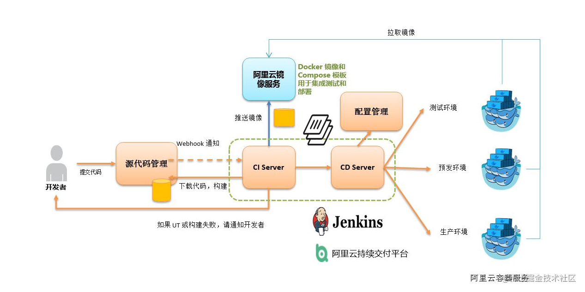

> You build it, you run it. 


# 本文目标

- `CI/CD`是什么？
- **各种姿势的 `jenkins`安装，`win`、`linux`和`docker`。**
- **实现gitlab本地独立部署（虚拟机内存4g+,磁盘30g以上）**, 相信很多的小伙伴和我一样很好奇公司的 `gitlab`是怎么部署的，有了`docker`这个神器就非常的方便。
- `jenkins` **自由风格的配置以及使用方式前端集成**
- `jenkins` **流水线简单的语法和流水线方式的实现和前端集成**。


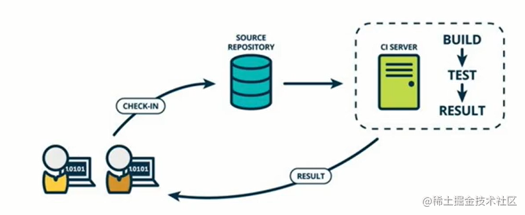
**持续集成和交付 **CI** (Continuous integration)**：强调开发人员提交了新代码以后，自动构建，合并，和单元测试，打包等。


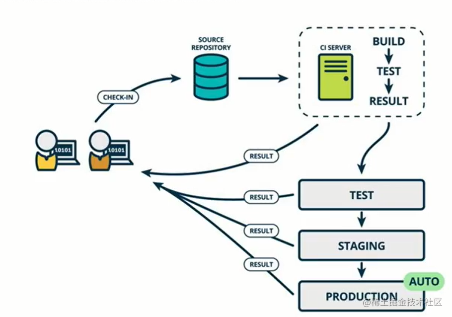

**持续部署 **CD** (Continuous deployment)**：在完成 CI后，自动化发布和部署。持续集成有很多工具： `jenkins`、`TravisCi`、`Docker`。


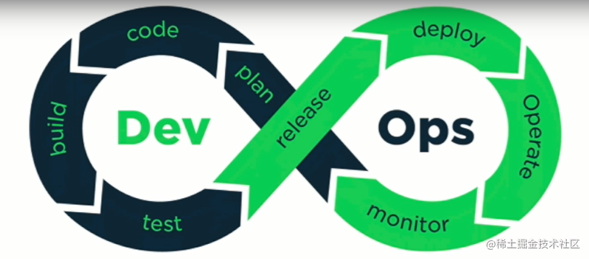

持续集成解决的问题：**高效率**，**高质量**和**高产出**。

工作流最佳实践：`单元测试`，`结对编程`（英语：`Pair programming`）是一种敏捷软件开发的方法，两个程序员在一个计算机上共同工作,`自动化流水线`。


因此我们希望开发和交付行程这么一个闭环，下图是常见`ci`工具，本文主要重点介绍 `jenkins`的使用。

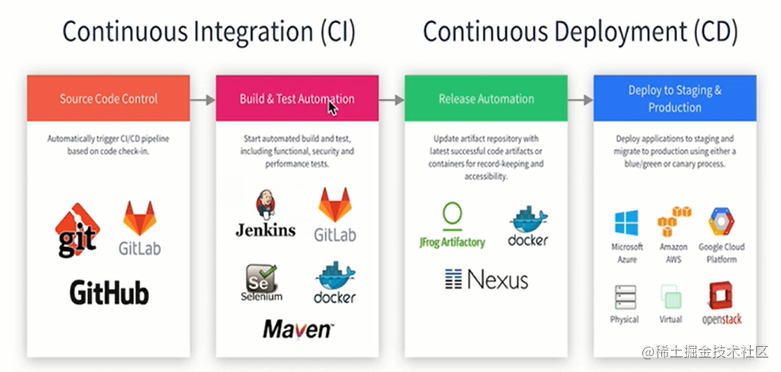

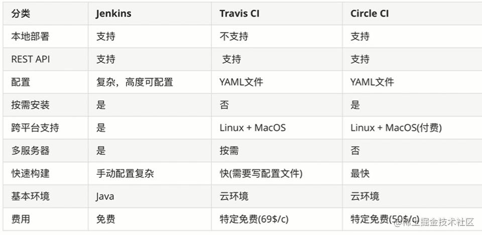
                   （上图三类构建工具对比）


`Jenkins` 是一个开源软件项目，是基于`Java`开发的。

# 各种姿势的安装

## 1: java 开发环境搭建

`java` 的`jdk`下载地址： https://www.oracle.com/java/technologies/javase-jdk16-downloads.html

`JDK` 是整个 `Java` 的核心，包括了`Java`运行环境，`Java`工具和`Java`基础的类库。`JDK`是学好`Java`的第一步。


`javac` 是 **编译**，其实是运行 `javac.exe`，该程序会启动编译器，将我们写的`java`源码`(.java)`编译为字节码文件`(.class)`。因为虚拟机无法识别源码，只认识字节码文件。必须注意的是，编译只是检查语法等，不保证程序逻辑的自洽。 本地必须的三个环境变量：

```js
// 新建系统变量, jdk的安装目录即可
JAVA_HOME  :   F: /java

// path中新增变量
Path:  %JAVA_HOME%\bin

// 和编译相关的系统变量 新建,jenkins 依赖一般不需要
CLASSPATH： `.;%JAVA_HOME%\dt.jar;%JAVA_HOME%\lib\tools.jar;`
```

来一个 `hello.java`:

```java
public class HelloWorld {
    public static void main(String[] args) {
        System.out.println("Hello World");
    }
}
```
打开控制台面板或者系统面板：`java hello`,运行成功，说明环境安装成功。


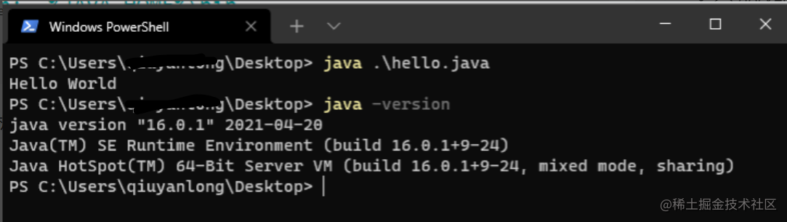

## 2: 安装Jenkins

**jenkins 官网：** https://www.jenkins.io/zh/

### 2.1 window

`window` 下分别有两种场景都可以安装，分别介绍和记录。
##### 使用msi安装Jenkins

一直运行不起来，查看的错误日志，发现了一句话： `Jenkins requires Java versions [8, 11] but you are running with Java 16 from`。

再次下载11版本需要登陆，还好 http://bugmenot.com/view/oracle.com 这里有现成的用户名和密码。

##### 使用war包安装Jenkins

- 首选选择下载 `.war`的包。
- 进入指定目录： `java -jar jenkins.war --httpPort=5016`, 指定端口。
- 访问： http://localhost:5016/ 

此种方式安装的 `Jenkins`可以在`web`容器中运行，例如`Tomcat`，但是不建议在持续集成环境中使用此种安装方式。

### 2.2 linux

本文使用的是`centos7`进行下载安装的。

可以先下载 `jdk`文件通过 `filezilla`等`FTP`上传上去，或者使用`wget`直接下载。

```js
mkdir -p /opt/jdk8

# --strip-components 1 自动解压到一级目录并且删除
tar zxvf jdk-8u211-linux-x64.tar.gz -C /opt/jdk8 --strip-components 1

# vi /etc/profile
export JAVA_HOME=/opt/jdk8
export JRE_HOME=${JAVA_HOME}/jre
export CLASSPATH=.:${JAVA_HOME}/lib:${JRE_HOME}/lib
export PATH=${JAVA_HOME}/bin:$PATH


# 下载Jenkins最新的war包：
mkdir -p jenkins && cd /opt/jenkins

wget -O /opt/jenkins/jenkins.war \ 
http://mirrors.jenkins.io/war-stable/latest/jenkins.war

java -jar jenkins.war --httpPort=8080
```


> 如果提示 **/opt/jdk_11/bin/java: 无法执行二进制文件** 那是以内下载的这个包和系统不匹配造成的。uname -a 查看一下自己系统的架构来下载特定的jdk包。

启动过程中 `jdk11` 包兼容错误
```shell

hudson.util.BootFailure#publish: Failed to initialize Jenkins
yum -y install java-1.8.0-openjdk-devel
```

这个时候可以使用`ip:port`在浏览器查看`jenkens`的界面了，如果这个访问不了，应该是防火墙没有打开。[参考关闭防火墙或者打开特定的端口](https://blog.csdn.net/s_p_j/article/details/80979450)


### 2.3 docker 安装jenkins

关于`docker`的使用，可以参考 [docker前端从入门到精通](https://juejin.cn/post/6988513822818435080) 。

> 建议使用的Docker映像是jenkinsci/blueocean image(来自 the Docker Hub repository)。 该镜像包含当前的长期支持 (LTS) 的Jenkins版本 （可以投入使用） ，捆绑了所有Blue Ocean插件和功能。这意味着你不需要单独安装Blue Ocean插件。

```js
docker run \
  -u root \
  --rm \
  -d \
  -p 8080:8080 \
  -p 50000:50000 \
  -v jenkins-data:/var/jenkins_home \
  -v /var/run/docker.sock:/var/run/docker.sock \
  jenkinsci/blueocean
```
`docker logs containerid`通过查看初始化密码。

查看下数据卷的挂载点位置：`jenkins`的容器的数据都在这里。

```js
[root@zhangsan /]# find / -iname jenkins-data
/var/lib/docker/volumes/jenkins-data
[root@zhangsan /]# 

```


## 3: kenkins 关闭和重启

- **关闭Jenkins** ： http://localhost:8080/exit
- **重启Jenkies** ： http://localhost:8080/restart
- **重新加载配置信息** ：http://localhost:8080/reload

## 4：jenkins 环境配置

加速： https://mirrors.tuna.tsinghua.edu.cn/jenkins/updates/update-center.json


由于要配置一个内网的回掉函数，因此采用`gitlab-docker`私有化部署的方案来做这个事情，也就是在搭建一套本地的`gitlab`服务，借助`docker`这个实现非常的简单。

# gitlab 本地搭建

## Docker-compose的使用

`Docker Compose `可以轻松、高效的管理容器，它是一个用于定义和运行多容器 `Docker` 的应用程序工具

第一步：安装`docker-compose`的安装：
```js
sudo curl -L "https://github.com/docker/compose/releases/download/1.24.1/\
docker-compose-$(uname -s)-$(uname -m)" -o /usr/local/bin/docker-compose

sudo chmod +x /usr/local/bin/docker-compose
```

最常用的一些命令：

```shell
docker-compose up -d nginx                构建建启动nignx容器
docker-compose exec nginx bash            登录到nginx容器中
docker-compose down                       删除所有nginx容器,镜像
docker-compose ps                         显示所有容器
docker-compose restart nginx              重新启动nginx容器
docker-compose run --no-deps --rm php-fpm php -v  在php-fpm中不启动关联容器，并容器执行php -v 执行完成后删除容器
docker-compose build nginx                     构建镜像 。        
docker-compose build --no-cache nginx          不带缓存的构建。
docker-compose logs  nginx                     查看nginx的日志 
docker-compose logs -f nginx                   查看nginx的实时日志
docker-compose config  -q                      验证（docker-compose.yml）文件配置，当配置正确时，不输出任何内容，当文件配置错误，输出错误信息。 
docker-compose events --json nginx              以json的形式输出nginx的docker日志
docker-compose pause nginx                      暂停nignx容器
docker-compose unpause nginx                    恢复ningx容器
docker-compose rm nginx                         删除容器（删除前必须关闭容器）
docker-compose stop nginx                       停止nignx容器
docker-compose start nginx                      启动nignx容器
```

第二步：
使用`docker-gitlab`https://github.com/sameersbn/docker-gitlab 仓库下的`docker-compose.yml`拷贝到 `/home/gitlab/docker-compose.yml`。

修改其中的几项：

```shell
- GITLAB_HOST=192.168.1.78
- GITLAB_ROOT_PASSWORD=12345678
- GITLAB_ROOT_EMAIL=mayun2016@gmail.com
```
到 `/home/gitlab` 目录下面新增`docker-compose.yml`文件，拷贝进来保存。

在`gitlab`目录下面，然后执行 `docker-compose up -d`后台运行。 开始拉去镜像和执行，时间比较久，启动成功后浏览器访问：`ip:10025`端口就可以访问这个服务了，初始化账户是`root`，密码就是上面修改的值。

我本地执行成功后的镜像列表：

```js
sameersbn/gitlab       14.1.1        7cb006777e60   41 hours ago    2.74GB
jenkinsci/blueocean    latest        8b64b7a7dfc8   4 days ago      699MB
redis                  6.2           aa4d65e670d6   9 days ago      105MB
node                   10            28dca6642db8   3 months ago    910MB
sameersbn/postgresql   12-20200524   d08b64823adb   14 months ago   272MB
```

- 一般的会发生内存问题，搜一下如何扩容。
- 启动的时候如果一切正常，`docker-compose logs -f` 发现日志也是正常的，但是就是无法访问`10025`,那么就查看下这个端口是否被占用。

我在这一步花费了整整一天半的时间，上面两个点就是我自己碰到的坑。


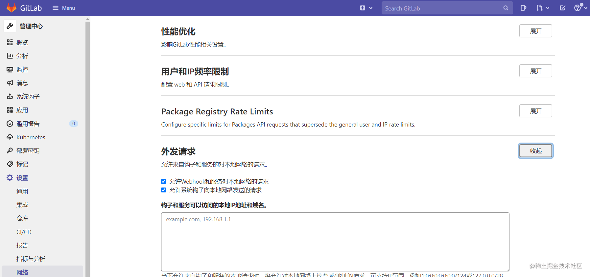

`jenkins` 和 `gitlab` 是在同一台服务器的时候，需要勾选掉本地网络的出发选项, 否则无法进行接下来的事情。

# jenkins的使用

下面的场景都需要提前再搭建好的 `gitlab`上创建项目配合使用。

## 1： 配置一个简单的自由风格的任务

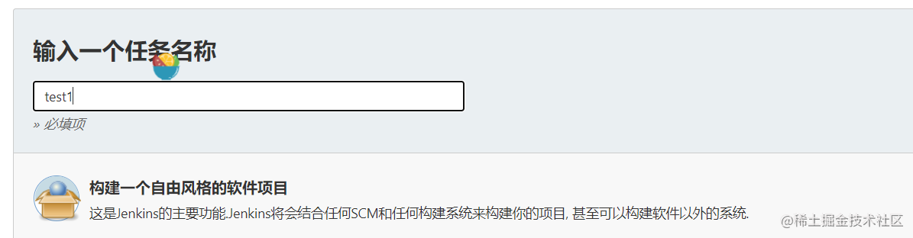

这一步需要添加一下自己的账户和密码到全局，有多种形式的添加。

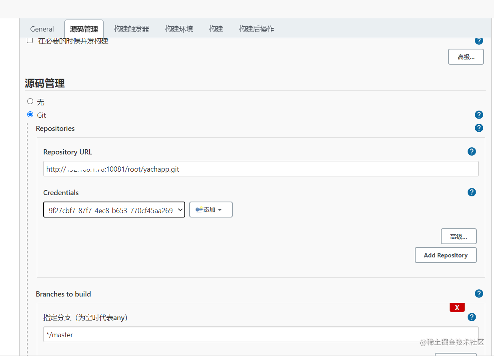

暂时先不使用 `hooks`，直接采用轮训`git`仓库变化的形式来检测：

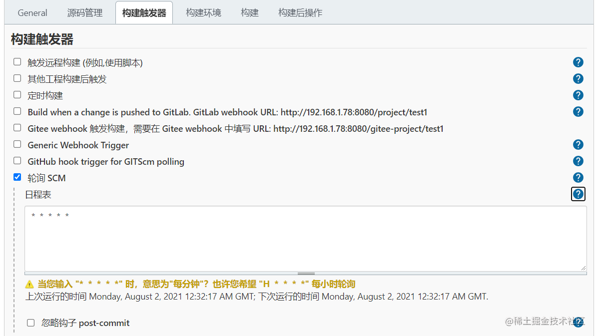

增加构建的脚本，点击保存应用保存。

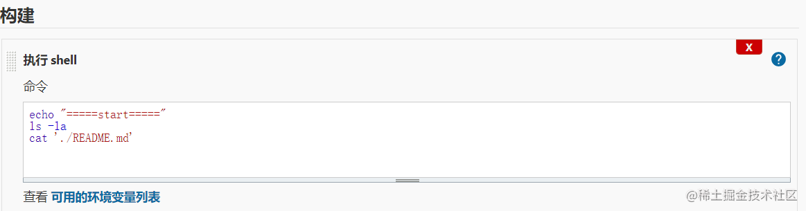

点击进去，发现已经开始构建了或者自己可以手动执行一次构建，查看下控制台输出信息。

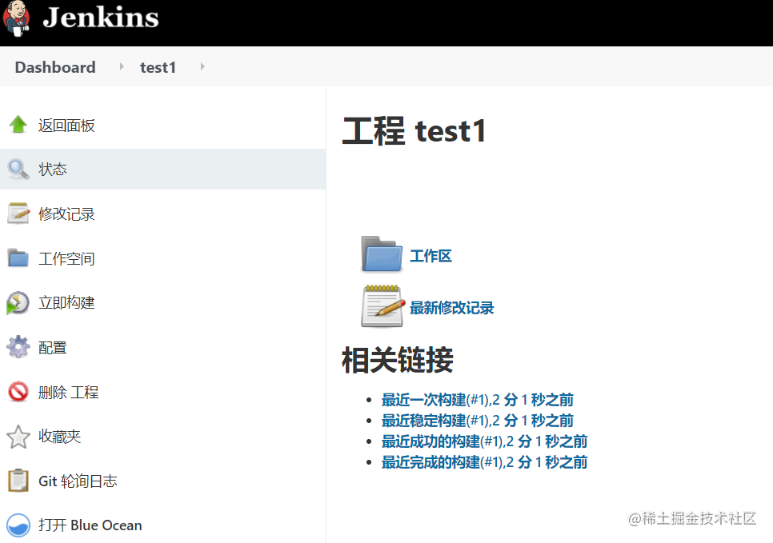

## 2：hooks 风格的构建

创建一个自由风格的`test2`项目，源码`git`同上,构建触发器使用hooks。


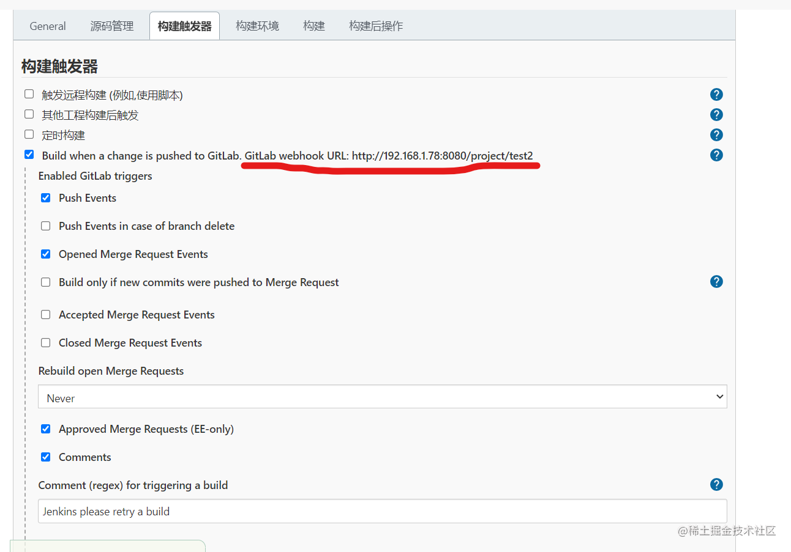

向下拉，点击高级获取`token`

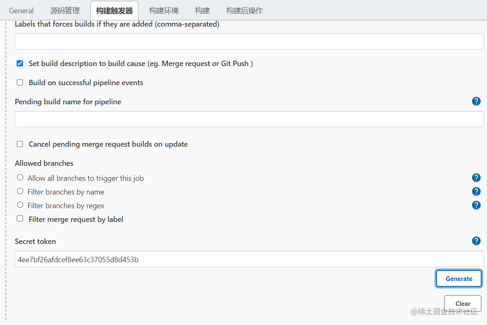

其他选项同上一个。


接下来回到仓库中，在`gitlab`的当前项目`test2`仓库中设置: `hooks`和`token` 填写上面获取的值。

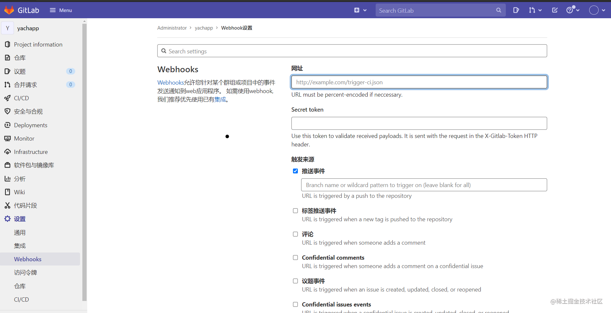

**启用SSL验证** 不要勾选，目前是http的内网不支持，点击 `add hooks`。点击测试发送一个事件过去触发一下构建。

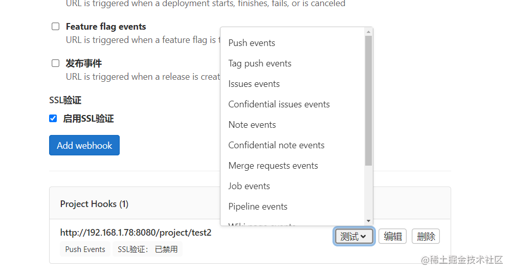

这个时候就可以看到一个正在构建的任务和日志的输出。

**存在的问题：**

`jenkins`安装了`node`插件，因此在`shell`脚本中调用`node & npm` 发现无法找到这个命令，


> 在Jenkins的镜像中集成NodeJS插件，发现node和npm都无法执行，最终确认之后定位为libc的问题，在这篇文章中进行memo。中介来说，这个问题还可以描述为：如何在Alpine镜像中支持NodeJS，或者如何在Alpine镜像中使用npm和node。

https://blog.csdn.net/liumiaocn/article/details/102587460 但是我还是没能解决这个问题，如果不是容器的话是没有这个问题的。目前能想到的就是在这一层添加 `nodejs`进去，在`build`一个镜像出来。也尝试了在容器内部安装`node`版本,但是还是不行。

```js
[root@zhansan _data]# docker exec -it a2e13be38713 /bin/bash 
bash-5.1# node -v 
v14.17.4
bash-5.1# 
```


## 3：构建一个流水线的
使用 `vue create app -n -d` 创建一个本地项目，推送`gitlab`上。
`vscode`安装插件`jenkinsfile`。

在项目中新建一个文件 `Jenkinsfile`:

```shell
pipeline { 
    agent {
        docker {
            image 'node:10'
            args '-p 20000:8080'
        }
    } 
    stages {
        stage('Build') { 
            steps { 
                sh 'node -v'
                sh 'echo "hello wolrd===build==="'
            }
        }
    }
}
```
流水线语法可以参考`jenkins`官网，上面使用docker，因此jenkins也需要安装这个插件。推送这个文件到仓库。

回到`jenkins`中，点击左侧的**打开blue ocean**

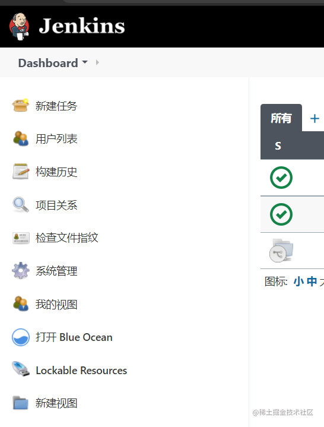
 

输入仓库地址，输入用户名密码或者使用全局配置。

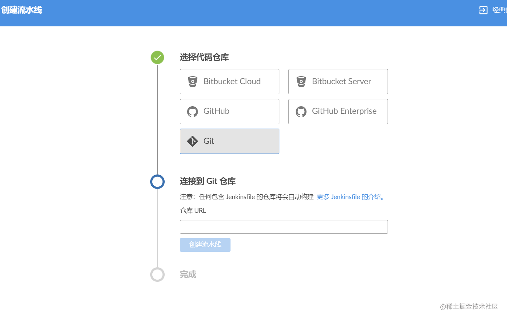

经过测试发现用户名密码好像创建不成功，使用全局配置密码的方式。

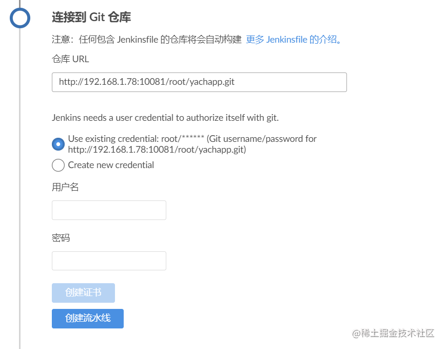

点击进去流水线里面查看：可以看到已经成功运行

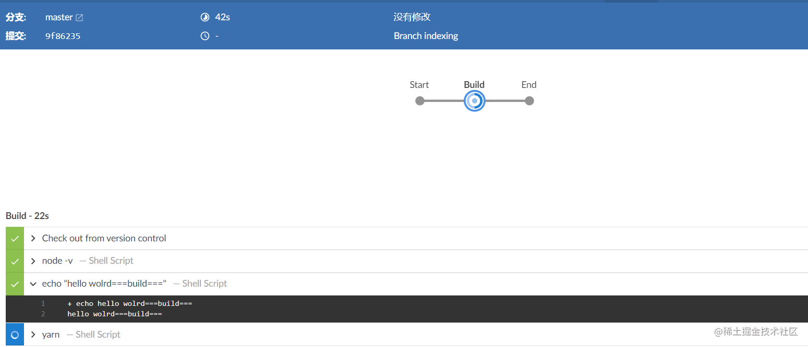

## 4：稍微复杂点的流水线
修改 `jenkinsfile` 文件内容:

```shell
pipeline { 
    agent {
        docker {
            image 'node:10'
            args '-p 20000:8080'
        }
    } 
    stages {
        stage('Build') { 
            steps { 
                sh 'node -v'
                sh 'echo "hello wolrd===build==="'
                sh 'yarn'
            }
        }
        stage('Deploy') {
            steps {
                sh 'ls -la'
                sh 'chmod +x ./scripts/*.sh'
                sh './scripts/deploy.sh'
                sh 'echo "deploy stage"'
                sh 'echo "end====="'
                input '是否用web网站？（点击继续）'
                sh './scripts/kill.sh'
            }
        }
    }
}
```

`script/deploy.sh`:

```js
set -x
npm run serve &
sleep 1
echo $! >.pidfile
set +x
```

`script/kill.sh`

```js
set -x
npm run serve &
sleep 1
echo $! >.pidfile
set +x
```
执行这个流水线，在`input`交互模式点击之前，访问`http://192.168.1.78:20000/` 就可以看到整个部署的项目，点击交互按钮以后就会杀死这个进程。其实这个是在`docker`启动了一个容器然后又杀死了这个容器的过程。


**结语：**

还可以使用 `ssh` 插件发送到宿主机的固定目录完成项目发包和部署，邮箱服务，自动化测试等一系列的功能。有了上面这些操作基础，完成其他的功能就比较简单，希望以后有机会还能在完善下。


### 参考内容
- https://www.jenkins.io/zh/doc/book/installing/
- https://www.bilibili.com/video/BV12y4y1M7jU?p=1
- https://www.bilibili.com/video/BV1Mt411V7cN?from=search&seid=7178605361919264174


