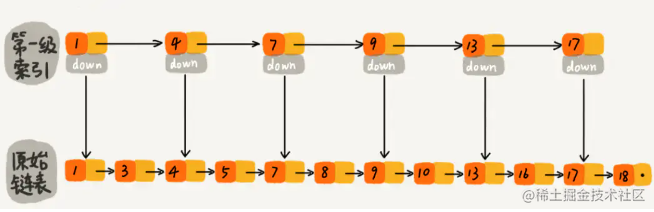

# 1：Leveldb 模型

> LevelDB is a fast key-value storage library written on Google that provides an ordered mapping from string keys to string values. 谷歌开发的k-v映射离线单机的存贮库。


### 1.0: LSM 理解

基于 LSM(LOG Structured Merge Tree) [The Log-Structured Merge-Tree 白皮书全文](https://www.cs.umb.edu/~poneil/lsmtree.pdf) 实现。

> **LSM树的核心特点:** 是利用顺序写来提高写性能，但因为分层(此处分层是指的分为内存和文件两部分)的设计会稍微降低读性能，但是通过牺牲小部分读性能换来高性能写，使得LSM树成为非常流行的存储结构 https://zhuanlan.zhihu.com/p/181498475


将所有的 **Key/Value** 按照 Key 的词法序有序地储存在文件中，具有很高的**随机写，顺序读/写性能**，但是**随机读的性能很一般，也就是说，LevelDB很适合应用在查询较少，而写很多的场景**。


`leveldb`首先将数据更新到内存中。当内存中的数据量达到一定阈值，将这部分数据再真正刷新到磁盘文件中。一般来说，顺序写`60MB/s`，随机写`45MB/s`.

### 1.1 特性

-   键和值是任意字节数组。

<!---->

-   数据按key排序存储。

<!---->

-   调用者可以提供自定义比较函数来覆盖排序顺序。

<!---->

-   基本运算是`Put(key,value)`, `Get(key)`, `Delete(key)`.

<!---->

-   可以在一个原子批处理中进行多项更改。

<!---->

-   用户可以创建临时快照以获得一致的数据视图。

<!---->

-   支持对数据进行前向和后向迭代。

<!---->

-   [使用Snappy 压缩库](https://google.github.io/snappy/)自动压缩数据。

<!---->

-   外部活动（文件系统操作等）通过虚拟接口中继，因此用户可以自定义操作系统交互。

缺点：

-   非关系型数据模型（NoSQL），不支持sql语句，也不支持索引。

<!---->

-   一次只允许一个进程访问一个特定的数据库；

<!---->

-   没有内置的`C/S`架构，但开发者可以使用`LevelDB`库自己封装一个`server`；


### 1.2 本地安装和简单使用

```
git clone --recurse-submodules https://github.com/google/leveldb.git
cd leveldb
mkdir -p build && cd build
cmake -DCMAKE_BUILD_TYPE=Release .. && cmake --build .
sudo make install
```


#### **1.2.1 编译碰到的问题**

1： `Cmake` 不存在，直接通过 `brew install cmake`来安装，`CMake`是一个**跨平台**的编译(Build)工具,可以用简单的语句来描述所有平台的编译过程`makefile`的一个工具：读入所有源文件之后，自动生成`makefile`文件。


2: 编译错误

```
/Users/mac/workspace/c/leveldb/third_party/benchmark/src/complexity.cc:85:10: error: variable 'sigma_gn' set but not used [-Werror,-Wunused-but-set-variable]
  double sigma_gn = 0.0;
         ^
1 error generated.
make[2]: *** [third_party/benchmark/src/CMakeFiles/benchmark.dir/complexity.cc.o] Error 1
make[1]: *** [third_party/benchmark/src/CMakeFiles/benchmark.dir/all] Error 2
make: *** [all] Error 2
```

解决方案：

打开 `complexity.cc` 文件注释掉 `line88和93`中关于 `sigma_gn` 的使用。


3: `c++ 11` 带来的问题. 编译的时候记得加 `-std`.

```
g++ dbtest.cpp -o dbtest -L. -I./include -lpthread -lleveldb -std=c++11
```

#### 1.2.2: 编写测试用例

尝试创建一个hello的测试数据库并且查询。

```
#include <iostream>
#include "leveldb/db.h"

using namespace std;
using namespace leveldb;

int main()
{
    DB *db;
    Options op;
    op.create_if_missing = true;
    Status s = DB::Open(op, "/tmp/hello", &db);
    if (s.ok())
    {
        cout << "创建成功" << endl;
        s = db->Put(WriteOptions(), "name", "tom");
        s = db->Put(WriteOptions(), "age", 100);
        if (s.ok())
        {
            cout << "插入数据成功" << endl;
            string value;
            s = db->Get(ReadOptions(), "abcd", &value);
            if (s.ok())
            {
                cout << "获取数据成功,value:" << value << endl;
            }
      
        }
    }
    delete db;
    return 0;
}
```

#### 1.2.3 编译运行

`g++ test.cpp -o test -L. -I./include -lpthread -lleveldb -std=c++11`

运行： `./test`

查看 `ls /tmp/testdb/` 就会看到创建成功了这个数据库。

使用第三方库工具编译查看：https://icode.best/i/17020938176553 本地编译到`leavel` 查看刚才生成的数据库。    


### 1.2 文件构成


### 1.3 什么是跳跃表？

跳表（[skiplist](http://en.wikipedia.org/wiki/Skip_list)）是一种随机化的数据， 由 William Pugh 在论文[《Skip lists: a probabilistic alternative to balanced trees》](http://www.cl.cam.ac.uk/teaching/0506/Algorithms/skiplists.pdf)中提出， **跳跃表**以有序的方式在层次化的链表中保存元素， 效率和平衡树媲美 —— 查找、删除、添加等操作都可以在对数期望时间下完成， 并且比起平衡树来说， 跳跃表的实现要简单直观得多。[深入了解参考](https://www.jianshu.com/p/9d78d8719afe)： 





跳表是可以实现二分查找的有序链表，利用**空间换时间**来获取最大的查找效果。


时间复杂度 = 索引的高度 * 每层索引遍历元素的个数。

空间复杂度： 假如原始链表包含 n 个元素，则一级索引元素个数为 n/2、二级索引元素个数为 n/4、三级索引元素个数为 n/8 以此类推。所以，索引节点的总和是：n/2 + n/4 + n/8 + … + 8 + 4 + 2 = n-2，**空间复杂度是 O(n)。 如果降低索引，则空间下去，但是时间就会上来，eg: n/3 + n/9 + n/27 + … + 9 + 3 + 1= n/2，减少了一半。**


### 1.4: 文件组成

#### **1.4.1： memtable**

`leveldb`的一次写入操作并不是直接将数据写入到磁盘文件，而是采用先将数据写入内存的方式。所以,`memtable`就是一个内存中进行数据组织与维护的结构。在`memtable`中，数据按用户定义的方法排序之后按序存储。等到其存储内容到达阈值时（**4MB**）时，便将其转换成一个不可修改的`memtable`，与此同时创建一个新的`memtable`来供用户进行读写操作。`memtable`底层采用跳表，它的大多数操作都是`O(logn)`。


**memtable** 是一个基于 `SkipList` [**也就是上面讲过的跳表**] 的有序的结构，每一个 Key 都会按序组织到 **memtable** 中。


#### 1.4.2 ：mmutable memtable

当**memtable**的容量达到阈值时，便会转换成一个不可修改的memtable即**immutable memtable**。它同**memtable**的结构定义一样。两者的区别只是**immutable memtable**是只读的。**immutable memtable**被创建时，`leveldb`的后台压缩进程便会利用其中的内容创建一个`sstable`,然后持久化到磁盘中。


这个时刻： **levelDB 会新建新的 Log 文件和 memtable 结构用来接收后续的插入操作。**

#### 1.4.3：sstable

`leveldb` 虽然采用了先写内存的方式来提高写效率。**但是内存中的数据不可能是** **无线** **增长，并且日志中记录的写入操作过多会造成异常发生，而且恢复时间过长。** 因此内存中的数据达到一定容量就得将数据持久化到磁盘中。除了某些元数据文件，**leveldb**的数据主要都是通过**sstable**来存储的。

虽然在内存中，所有的数据都是按序排列的，但是当多个**memtable**数据持久化到磁盘后，其对应的sstable之间是存在交集的，这样造成在读操作时得对所有的sstable文件进行遍历，严重影响了读效率。所以，leveldb会定期整合这些文件，也叫做**compaction**。随着compaction的进行，sstable文件在逻辑上被分成若干层。通过内存数据直接dump出来的是level 0 层文件，后期整合出来的level i层文件。sstable本身是不可修改的。

https://blog.csdn.net/ws1296931325/article/details/86635751/


磁盘上的 **sstable** 文件按照 **level** 的形式组织，从 **memtable** 序列化得到的 sst 文件位于 level0 层。**由于经过 compaction 线程的压缩，文件将不断地从 level n 层向 level n+1层移动。这也就是 levelDB 命名的由来**。


#### 1.4.4：manifest

**以前使用碰到过的坑**：`mainfest` 是最容易出问题的地方，**丢失和无效**，大型的项目和高度依赖的项目一定需要验证这个文件和有补偿措施在这里。参考如下链接：

http://bean-li.github.io/leveldb-manifest/


#### 1.4.5：current

主要是记录当前**manifest** 的文件名。为什么需要这个？因为leveldb每次启动时，都会创建一个新的manifest文件，因此会出现很多个manifest文件。current则用来指出那个才是我们需要关心的文件。

#### 1.4.6：log

> A log file (*.log) stores a sequence of recent updates. Each update is appended to the current log file. When the log file reaches a pre-determined size (approximately **4MB** by default), it is converted to a sorted table (see below) and a new log file is created for future updates.
>
> 日志文件 (*.log) 存储一系列最近的更新。每个更新都附加到当前日志文件中。当日志文件达到预定大小（默认约为 4MB）时，它会转换为排序表（见下文）并创建新的日志文件以供将来更新。
>
> 当前日志文件的副本保存在内存结构 ( `memtable`) 中。每次读取都会查阅此副本，以便读取操作反映所有记录的更新。


leveldb写操作不是直接写入磁盘，而是先写入内存。加入写入到内存的数据还未来得及持久化，leveldb发生异常或者服务器宕机等会造成写入的数据丢失。因此，**leveldb在写入内存之前会首先将所有的写操作写入日志文件中。每次写操作都是一次顺序写入，这样写效率高，整体写入性能好。此外，leveldb写操作的原子性也可以通过log来实现。**

异常情况主要有以下几种：

1.  写log完成，写内存未完成。

<!---->

2.  写log期间进程异常。

<!---->

3.  write操作完成后（写日志、写内存都完成）异常。

<!---->

4.  **immutable memtable** 持久化过程异常。

<!---->

5.  其它压缩异常

第2种情况发生，数据库重启读取log时，发现异常日志数据则丢弃该条日志数据，即视作这次用户写入失败，第1、3、4情况发生时，都可以通过读取redo日志文件中记录的写入操作来完成数据库的恢复。


#### 1.4.8：Info logs

Informational messages are printed to files named LOG and LOG.old.


#### 1.4.7： 验证系统chrome 浏览器的写入过程

```
tail -f  ~/Library/Application\ Support/Google/Chrome/Default/Local\ Storage/leveldb/*.log
```


#### 1.4.8： 为什么要讲这个存贮模型 ？

为什么要了解这些个模型的背景，主要是用来补充和了解相关前端能力背后的实现，属于了解性质。


以**chrome** 为例，其内部`Local storage` 和 `Session storage` 以及常见的``indexedDb` 都是基于**leveldb**来编译实现的。在chrome内部，大量的使用 `leveldb`, 比如`gpu cache`, `GCM store`, `File System`等都是如此，因此学习和深入了解比较重要。


另被w3c标准废弃的**web sql** 内部是**sqlite** ，虽然现在websql 标准被废弃了，但是sqlite在桌面客户端以及移动端**ios**和**Android**和嵌入式中大量使用，有必要了解。
  


# 2: 客户端常见的存贮容器

- local storage / session storage 
- indexdb 
- websql
- cookie 
- 内存


**Web SQL** 数据库 API 并不是 HTML5 规范的一部分，但是它是一个独立的规范，引入了一组使用 SQL 操作客户端数据库的 APIs。

https://www.zhihu.com/question/41951041

### 其他几个对比：

### 2.1： Local Storage & session Storage


Localstorage 设计者的一些初衷和思考。

[LocalStorage using Chrome Service Model](https://jwzg.feishu.cn/docx/doxcnz9eTfIrYbwyh4Qm29EAnRf)（原文在google doc）。

兼容和大小

第三方网站检测当前浏览器的大小 和本地代码检测：

https://arty.name/localstorage.html

主动使用伪代码在控制台进行检测。electron 环境下比较大。

````
   (function () {
        if (!window.localStorage) {
            console.log('当前浏览器不支持localStorage!')
        }
        let test = '0123456789';
        let add = function (num) {
            num += num;
            if (num.length == 10240) {
                test = num;
                return;
            }
            add(num);
        }
        add(test);
        let sum = test;
        let show = setInterval(function () {
            sum += test;
            try {
                window.localStorage.removeItem('test');
                window.localStorage.setItem('test', sum);
                console.log(sum.length / 1024)
            } catch (e) {
                console.log("最大容量" + sum.length / 1024)
                clearInterval(show);
            }
        }, 0.1)
    })()
```


**`localStorage`** **是同步的，会阻塞主线程，注意！！** 。其大小限制约为 5MB，并且只能包含字符串。**无法从 web worker 或 service worker 访问 LocalStorage**。


只读的`localStorage` 属性允许你访问一个`Document` 源（origin）的对象 `Storage`；存储的数据将保存在浏览器会话中。


`localStorage` 类似 `sessionStorage`，但其区别在于：**存储在** **`localStorage`** **的数据可以长期保留；而当页面会话结束——也就是说，当页面被关闭时，存储在** **`sessionStorage`** **的数据会被清除** 。


无论数据存储在 `localStorage` 还是 `sessionStorage` ，它们**都特定于页面的协议**。`localStorage` 中的键值对总是以字符串的形式存储。


### 2.2： indexedDb

w3c 最新的文档和标准：

https://www.w3.org/TR/IndexedDB/

-   通过支持多种类型的键，来存储几乎可以是任何类型的值。

<!---->

-   支撑事务的可靠性。

<!---->

-   支持键值范围查询、索引。

<!---->

-   和 `localStorage` 相比，它可以存储更大的数据量。

<!---->

-   IndexedDB 适用于离线应用，可与 ServiceWorkers 和其他技术相结合使用。


> IndexedDB 不属于关系型数据库（不支持 SQL 查询语句），更接近 NoSQL 数据库，可以简单认为是一个基于事务操作的 key-value 型前端数据库。它的 API 大部分都是**异步，不会阻塞主线程。**
>
> 可以从`window`对象、` Web worker  `和 ` service worker  `访问它们，从而轻松地在代码中的任何位置使用。


由于本身api 比较底层，缺少上层的封装，因此一般使用现有的框架来做处理。

-   [localForage](https://link.zhihu.com/?target=https%3A//localforage.github.io/localForage/): 一个提供 name:value 的简单语法的客户端数据存储垫片（Polyfill），它基于 IndexedDB 实现，并在不持支 IndexedDB 的浏览器中自动回退只 WebSQL 和 localStorage。

<!---->

-   **[dexie.js](https://link.zhihu.com/?target=http%3A//www.dexie.org/)** ******对 IndexedDB 的封装，通过提供更友好和简单语法以进行快速的编码开发。

<!---->

-   [ZangoDB](https://link.zhihu.com/?target=https%3A//github.com/erikolson186/zangodb): 一个类 MongoDB 的 IndexedDB 接口实现，提供了诸如过滤、投影、排序、更新和聚合等大多数 MongoDB 常见的特性。

<!---->

-   [JsStore](https://link.zhihu.com/?target=http%3A//jsstore.net/): 一个具备类 SQL 语法的简单和先进的 IndexedDB 封装实现。


##### **1：OPEN 打开数据库**

```
// name: 数据库名称， version: 版本默认是1
let openRequest = indexedDB.open(name, version);  
```

返回`openRequest` 对象，监听捕获以下方法的调用：

-   **success**：数据库准备就绪，**openRequest.result** 中有了一个数据库对象“Database Object”，我们应该将其用于进一步的调用。以下两个场景都会进入这个回调函数。

    -   打开数据库使用的版本比现有的低 。
    -   打开成功。

<!---->

-   **error**：打开失败。事件冒泡，所有的错误事件都会上来。

<!---->

-   **upgradeneeded**：数据库已准备就绪。 这个事件很重要。 这个事件非常的重要，会再以下事件中都会触发：

    -   打开之前不存在的数据库。upgradeneeded: client had version 1 success: **continue** **to** work **with** database **using** `db` **object。**
    -   升级数据库版本。
    -     当且仅当 `onupgradeneeded` 处理程序没有错误地执行完成，`openRequest.onsuccess` 被触发，数据库才算是成功打开了。
   


##### **2：Version 版本控制**

**一个数据库只能在同一时间存在一个 version，不能同时存在多个 version** **。** **version 在什么时候升级，非常的重要。**

```
let openRequest = indexedDB.open("store", 2); // 假设之前已经存在了1版本

openRequest.onupgradeneeded = function(event) {
  // 现有的数据库版本小于 2（或不存在）
  let db = openRequest.result;
  switch(event.oldVersion) { // 现有的 db 版本
    case 0:
      // 版本 0 表示客户端没有数据库
      // 执行初始化
    case 1:
      // 客户端版本为 1
      // 更新
  }
};
```

**并行更新案例：**

1.  一个用户在一个浏览器标签页中打开了数据库版本为 `1` 的我们的网站。

<!---->

2.  接下来我们发布了一个更新，使得代码更新了。

<!---->

3.  接下来同一个用户在另一个浏览器标签中打开了这个网站。

这时，有一个标签页和版本为 `1` 的数据库建立了一个连接，而另一个标签页试图在`upgradeneeded` 处理程序中将数据库版本升级到 `2`。

问题是，**这两个网页是同一个站点，同一个源，共享同一个数据库**。而数据库不能同时为版本 `1` 和版本 `2`。要执行版本 `2` 的更新，必须关闭对版本 `1` 的所有连接，包括第一个标签页中的那个。


为了解决这一问题，`versionchange` 事件会在“过时的”数据库对象上触发。

```
let openRequest = indexedDB.open("store", 2);
openRequest.onupgradeneeded = function(){}

openRequest.onsuccess = function() {
  let db = openRequest.result; 
  db. onversionchange = function () {    db. close ();
        alert ( "优雅地进行处理，提示访问者在连接关闭之前保存数据等" )};
      // ……数据库已经准备好，请使用它……
  };
openRequest. onblocked = function () {
    // 如果我们正确处理了 onversionchange 事件，这个事件就不应该触发
    // 这意味着还有另一个指向同一数据库的连接
    // 并且在 db.onversionchange 被触发后，该连接没有被关闭
    alert("很友好的告诉用户，高抬贵手 刷新一次吧！！！！")
}; 
```

监听这个事件，关闭对旧版本数据库的连接（还应该建议访问者**重新加载页面**，以加载最新的代码）。


综上，数据库**版本升级要处理以下两个事情：**

1.  我们实现每个版本的升级功能：在 upgradeneeded 中，可以进行版本比较（例如，老版本是 2，需要升级到 4），并针对每个中间版本（2 到 3，然后 3 到 4）逐步运行每个版本的升级。


2.  或者我们可以检查数据库：以 `db.objectStoreNames` 的形式获取现有对象库的列表。该对象是一个 [DOMStringList](https://html.spec.whatwg.org/multipage/common-dom-interfaces.html#domstringlist) 提供 `contains(name)` 方法来检查 `name` 是否存在，再根据存在和不存在的内容进行更新。 对于小型数据库，第二种方法可能更简单。


```
let openRequest = indexedDB.open("db", 2);// 创建/升级 数据库而无需版本检查
openRequest.onupgradeneeded = function() {
  let db = openRequest.result;
  if (!db.objectStoreNames.contains('books')) { // 如果没有 “books” 数据
    db.createObjectStore('books', {keyPath: 'id'}); // 创造它
  }
};
```

##### **3：DELETE**: 删除数据库

```
let deleteRequest = indexedDB.deleteDatabase(name)
deleteRequest.onsuccess/onerror 追踪（tracks）结果
```


##### **4：对象库（object store）**

要在 **IndexedDB** 中存储某些内容，我们需要一个 **对象库**。

对象库是 **IndexedDB** 的核心概念，在其他数据库中对应的对象称为“表”或“集合”。但是也可以存储原始类型： **几乎可以存储任何值，包括复杂的对象；** **String, Date, Object, Arra, File, Blob, ImageData，** **ArrayBuffer**。

https://zhuanlan.zhihu.com/p/104536473

IndexedDB 使用 [标准序列化算法](https://www.w3.org/TR/html53/infrastructure.html#section-structuredserializeforstorage) 来克隆和存储对象。类似于 **JSON.stringify**，不过功能更加强大，能够存储更多的数据类型。

循环引用的对象无法存贮，必须要先解引用。此类对象不可序列化，也不能进行 JSON.stringify。


**库中的每个值都必须有唯一的键 key： 键的类型必须为数字、日期、字符串、二进制或数组**。它是唯一的标识符，所以我们可以通过键来搜索/删除/更新值


-   **创建库表的语法**：

```
db.createObjectStore(name[, keyOptions]);

// db.createObjectStore('books', {keyPath: 'id'});
```

请注意，操作是同步的，不需要 await。

-   **name** 是存储区名称，例如 "books" 表示书。

<!---->

-   **keyOptions** 是具有以下两个属性之一的可选对象：

<!---->

-   **keyPath** —— 对象属性的路径，IndexedDB 将以此路径作为键，例如 id。

<!---->

-   **autoIncrement** —— 如果为 true，则自动生成新存储的对象的键，键是一个不断递增的数字。


只有在 `upgradeneeded` 处理程序中，只有在创建数据库版本时，对象库被才能被 创建/修改。包括后面讲的索引，必须事先建立好，否则需要需要使用数据迁移等方式，成本很高，因此设计数据库的schema的时候必须权衡好。


-   删除表的语法是：

```
db.deleteObjectStore(name); 
```


##### **5：事务（transaction）**

**事务**是一组操作，要么全部成功，要么全部失败。例如，当一个人买东西时，我们需要：

1.  从他们的账户中扣除这笔钱。

<!---->

2.  将该项目添加到他们的清单中。如果完成了第一个操作，但是出了问题，比如停电。这时无法完成第二个操作，这非常糟糕。

**所有数据操作都必须在 IndexedDB 中的事务内进行：**

-   启动事务：**db.transaction(store[, type])** ;

<!---->

-   store 是事务要访问的库名称，例如 "books"。如果我们要访问多个库，则是库名称的数组。

<!---->

-   type – 事务类型，以下类型之一：

    -   readonly —— 只读，默认值。
    -   readwrite —— 只能读取和写入数据，而不能 创建/删除/更改 对象库。

还有 versionchange 事务类型：这种事务可以做任何事情，但不能被手动创建。IndexedDB 在打开数据库时，会自动为 upgradeneeded 处理程序创建 versionchange 事务。这就是它为什么可以更新数据库结构、创建/删除 对象库的原因。

**事务类型不同的原因主要是性能的考虑。** **性能是事务需要标记为 readonly 和 readwrite 的原因。**

许多 readonly 事务能够同时访问同一存储区，但 **readwrite** 事务不能。因为 readwrite 事务会“锁定”存储区进行写操作。下一个事务必须等待前一个事务完成，才能访问相同的存储区。

对象库支持两种存储值的方法：

-   **put(value, [key])** 将 value 添加到存储区。仅当对象库没有 keyPath 或 autoIncrement 时，才提供 key。如果已经存在具有相同键的值，则将替换该值。

<!---->

-   **add(value, [key])** 与 put 相同，但是如果已经有一个值具有相同的键，则请求失败，并生成一个名为 "ConstraInterror" 的错误


与打开数据库类似，我们可以发送一个请求：**books.add(book)** ，然后等待 **success/error** 事件。

```
const request = indexedDB.open("library");
let db;

request.onupgradeneeded = function() {
    // The database did not previously exist, so create object stores and indexes.
    const db = request.result;
    const store = db.createObjectStore("books", {keyPath: "isbn"});
    const titleIndex = store.createIndex("by_title", "title", {unique: true});
    const authorIndex = store.createIndex("by_author", "author");
    
    // Populate with initial data.
    store.put({title: "Quarry Memories", author: "Fred", isbn: 123456});
    store.put({title: "Water Buffaloes", author: "Fred", isbn: 234567});
    store.put({title: "Bedrock Nights", author: "Barney", isbn: 345678});};

request.onsuccess = function() {
    db = request.result;
};
```


##### **6：事务的自动提交**


**当所有事务的请求完成，并且** **[微任务队列](https://zh.javascript.info/microtask-queue)** **为空时，它将自动提交。** 通常，我们可以假设事务在其所有请求完成时提交，并且当前代码完成。

事务自动提交原则有一个重要的副作用。不能在事务中间插入 **fetch, setTimeout** 等异步操作。**IndexedDB** 不会让事务等待这些操作完成。

```
let request1 = books.add(book);
request1.onsuccess = function() {
// 宏任务  事务在浏览器开始执行宏任务之前关闭
  fetch('/').then(response => {
    let request2 = books.add(anotherBook); // (*)
    request2.onerror = function() {
      console.log(request2.error.name); // TransactionInactiveError
    };
  });
};
```

request2 中的行 (*) 失败，因为事务已经提交，不能在其中发出任何请求. 主要是性能原因。


如果需要在一个事务中把所有操作保持一致，更好的做法是将 IndexedDB 事务和“其他”异步内容分开。

首先，执行 **fetch**，并根据需要准备数据。然后创建事务并执行所有数据库请求，然后就正常了。为了检测到成功完成的时刻，我们可以监听 **transaction.oncomplete** 事件。只有 complete 才能保证整个事务作为一个整体保存 。手动终止事务，**transaction.abort()** ;


##### **7：错误处理**

写入请求可能会失败。**失败的请求将自动中止事务，并取消所有的更改。**

在一些情况下，我们会想自己去处理失败事务（例如尝试另一个请求）并让它继续执行，而不是取消现有的更改。可以调用 **request.onerror** 处理程序，在其中调用 **event.preventDefault()** 防止事务中止


添加了一本新书，键 (`id`) 与现有的书相同。`store.add` 方法生成一个 `"ConstraInterror"`。可以在不取消事务的情况下进行处理。

```
let transaction = db.transaction("books", "readwrite");
let book = { id: 'js', price: 10 };
let request = transaction.objectStore("books").add(book);

request.onerror = function(event) {
  // 有相同 id 的对象存在时，发生 ConstraintError
  if (request.error.name == "ConstraintError") {
    console.log("Book with such id already exists"); // 处理错误
    event.preventDefault(); // 不要中止事务
    // 这个 book 用另一个键？
  } else {
    // 意外错误，无法处理
    // 事务将中止
  }
};

transaction.onabort = function() {
  console.log("Error", transaction.error);
};
```


##### **8：事件委托**

**IndexedDB 事件冒泡：请求 → 事务 → 数据库。** db.onerror 处理程序捕获所有错误：已处理的错误场景 event.stopPropagation() 来停止冒泡，阻止事件上报。


```
db.onerror = function(event) {
  let request = event.target; // 导致错误的请求 上报所有的错误信息接口❌
  console.log("Error", request.error);
};

request.onerror = function(event) {
  if (request.error.name == "ConstraintError") {
     // 这里已经处理错误，就不需要再上报
    console.log("Book with such id already exists"); 
    event.preventDefault(); // 不要中止事务
    event.stopPropagation(); // 不要让错误冒泡, 停止它的传播
  } else {
    // 什么都不做
    // 事务将中止
    // 我们可以解决 transaction.onabort 中的错误
  }
};
```


##### **9：搜索**

通常的搜索方式共有两种形式存在：

1.  **通过key搜索。** 通过键值或键值范围。上面 books库中，将是 id。****

<!---->

2.  **索引搜索**。通过另一个对象字段，例如 book.price。这需要一个额外的数据结构，名为 **“索引（index）”**

\


###### **9.1: 通过key 搜索：**

支持精确的键值和被称为“值范围”的搜索方法 —— [IDBKeyRange](https://www.w3.org/TR/IndexedDB/#keyrange) 对象，指定一个可接受的“键值范围”。

`IDBKeyRange` 对象是通过下列调用创建的，是搜索范围的体现。第二个参数为**true**则不会包含当前的值。

```
// 表示：≥lower（如果 open 是 true，表示 >lower）
IDBKeyRange.lowerBound(lower, [open]) 

// 表示：≤upper（如果 open 是 true，表示 <upper）
IDBKeyRange.upperBound(upper, [open]) 

// 表示: 在 lower 和 upper 之间。如果 open 为 true，则相应的键不包括在范围中。
IDBKeyRange.bound(lower, upper, [lowerOpen], [upperOpen]) 

// 仅包含一个键的范围 key，很少使用。
IDBKeyRange.only(key) 
```

\


要进行实际的搜索，有以下方法。它们接受一个可以是精确键值或键值范围的 query 参数：

```
store.get(query) —— 按键或范围搜索第一个值。
store.getAll([query], [count]) —— 搜索所有值。如果 count 给定，则按 count 进行限制。
store.getKey(query) —— 搜索满足查询的第一个键，通常是一个范围。
store.getAllKeys([query], [count]) —— 搜索满足查询的所有键，通常是一个范围。如果 count 给定，则最多为 count。
store.count([query]) —— 获取满足查询的键的总数，通常是一个范围。
```

\


使用案例： 为什么可以按照key 进行范围比较，比如 **'css' <= id <= 'html' 为什么会成立？** 参考上面leveldb的实线。

```
// 获取一本书
books.get('js')

// // 获取 'css' <= id <= 'html' 的书
books.getAll(IDBKeyRange.bound('css', 'html'))

// // 获取 id < 'html' 的书
books.getAll(IDBKeyRange.upperBound('html', true));

// 获取所有书
books.getAll();

// 获取所有 id > 'js' 的键
books.getAllKeys(IDBKeyRange.lowerBound('js', true))
```


###### **9.2：通过使用索引的字段搜索**

**索引一定要提前建好，indexdb更新索引非常的麻烦或者基本不可能。**


创建索引语法：****

```
objectStore.createIndex(name, keyPath, [options]); 

eg: objectStore.createIndex('price', 'book.price', { unique: false })
```

-   **name** —— 索引名称。

<!---->

-   **keyPath** —— 索引应该跟踪的对象字段的路径（我们将根据该字段进行搜索）。

<!---->

-   **option** —— 具有以下属性的可选对象：

    -   **unique** —— 如果为true，则存储中只有一个对象在 keyPath 上具有给定值。如果我们尝试添加重复项，索引将生成错误。 **唯一索引，也就是这个price是唯一的。**
    -   **multiEntry** —— 只有 keypath 上的值是数组时才使用。这时，默认情况下，索引将默认把整个数组视为键。但是如果 multiEntry 为 true，那么索引将为该数组中的每个值保留一个存储对象的列表。所以数组成员成为了索引键。

\


**index** 索引实际上是对 **objectStore** 查询条件的补充。**如果没有 index，我们只能通过 objectStore 的 key 来查值，但是有了 index，我们可以查询的能力被扩展到了任意属性路径**。

\


索引是存储的"附加项"，用于跟踪给定的对象字段。对于该字段的每个值，它存储有该值的对象的键列表。创建索引这个动作，实际上是对 objectStore 进行修改，因此，只能在 db 的 onupgradeneeded 事件中处理。索引自动保持最新，所以我们不必关心它。

\


```
button.oninput = function(){
    let transaction = db.transaction("books"); // 只读
    let books = transaction.objectStore("books");
    let priceIndex = books.index("price_idx");
    let request = priceIndex.getAll(10);
    
    request.onsuccess = function() {
      if (request.result !== undefined) {
        console.log("Books", request.result); // 价格为 10 的书的数组
      } else {
        console.log("No such books");
      }
    };
    
    // 通过范围查询 查询大于5块钱以上的书籍
    const getAllBooks = priceIndex.getAll(IDBKeyRange.upperBound(5,true));
    // ...
}
```

\


##### **10：从存储中删除**

-   **delete(query)** —— 通过查询删除匹配的值。

```
store = db.createObjectStore("store1", { autoIncrement: true });
store.put("a"); // Will get key 1
store.delete(1);
store.put("b"); // Will get key 2
store.clear();  // 清楚所有的数据
store.put("c"); // Will get key 3
store.delete(IDBKeyRange.lowerBound(0));
store.put("d"); // Will get key 4
```

\


##### **11：光标（Cursors）**

\


**在indexedDB中使用索引和游标是**分不开的，对数据库熟悉的同学很好理解游标是什么东，有了数据库object store 的游标，我们就可以利用游标遍历object store了。 简单的说，就是对已知的集合对象（比如 objectStore 或 index）进行遍历。

\


**getAll/getAllKeys** 这样的方法，会返回一个 键/值 数组。但是一个对象库可能很大，**比可用的内存还大，会导致内存溢出** **。这时，getAll 就无法将所有记录作为一个数组获取**。

\


**光标是一种特殊的对象，它在给定查询的情况下遍历对象库，一次返回一个键/值，从而节省内存。** 由于对象库是按键在内部排序的，因此光标按键顺序（默认为升序）遍历存储。类似于 getAll，但带有光标：**let request = store.openCursor(query, [direction]);**

-   **query** 是一个键值或键值范围，与 getAll 相同。

<!---->

-   **direction** 是一个可选参数，使用顺序是：

<!---->

-   "next" —— 默认值，光标从有最小索引的记录向上移动。

<!---->

-   "prev" —— 相反的顺序：从有最大的索引的记录开始下降。

<!---->

-   "nextunique"，"prevunique" —— 同上，但是跳过键相同的记录 （仅适用于索引上的光标，例如，对于价格为 5 的书，仅返回第一本）

普通cursor 使用方式：

```
let transaction = db.transaction("books");
let books = transaction.objectStore("books");
let request = books.openCursor();// 为光标找到的每本书调用
request.onsuccess = function() {
  let cursor = request.result;
  if (cursor) {
    let key = cursor.key; // 书的键（id字段）
    let value = cursor.value; // 书本对象
    console.log(key, value);
    cursor.continue();
  } else {
    console.log("没有新书了");
  }
};
```

\


索引上创建光标

-   `advance(count)` —— 将光标向前移动 `count` 次，跳过值。

<!---->

-   `continue([key])` —— 将光标移至匹配范围中的下一个值（如果给定键，紧接键之后）。

```
let request = priceIdx.openCursor(IDBKeyRange.upperBound(5));// 为每条记录调用
request.onsuccess = function() {
  let cursor = request.result;
  if (cursor) {
    let primaryKey = cursor.primaryKey; // 下一个对象存储键（id 字段）
    let value = cursor.value; // 下一个对象存储对象（book 对象）
    let key = cursor.key; // 下一个索引键（price）
    console.log(key, value);
    cursor.continue();
  } else {
    console.log("No more books"); // 没有书了
  }
};
```

\


```
const tx = db.transaction("books", "readonly");
const store = tx.objectStore("books");
const index = store.index("by_author");
const request = index.openCursor(IDBKeyRange.only("Fred"));
request.onsuccess = function() {
    const cursor = request.result;
    if (cursor) {// Called for each matching record.
        report(cursor.value.isbn, cursor.value.title, cursor.value.author);
        cursor.continue();
    } else {// No more matching records.
      report(null);
    }
 };
```

##### 12：到底占用系统多大？

我们知道**local Storage** 在浏览器端占用的是系统**5M**， chromumim 其他系统应用是可以单独配置。但是**indexedDb**到底能占用多大，整个磁盘吗？

\


【来源：https://github.com/GoogleChrome/web.dev/pull/3896】

-   Chrome 将多达 80% 的总磁盘空间用于网络存储。来源[在这里](https://source.chromium.org/chromium/chromium/src/+/master:storage/browser/quota/quota_features.cc?q=kExperimentalPoolSizeRatio)。

<!---->

-   在这 80% 中，Chrome 最多愿意将 75% 用于单一来源。来源[在这里](https://source.chromium.org/chromium/chromium/src/+/master:storage/browser/quota/quota_features.cc?q=kPerHostRatio)。75% * 80% = 60% 总磁盘空间/来源。

\


【来源： https://web.dev/storage-for-the-web/#%E5%A4%9A%E5%B0%91】

-   Chrome 允许浏览器使用多达 80% 的总磁盘空间。一个来源最多可以使用总磁盘空间的 60%。

您可以使用 StorageManager API 来确定可用的最大配额。其他基于 Chromium 的浏览器可能允许浏览器使用更多的存储空间。有关 Chrome 实施的详细信息，请参阅 PR #3896。

-   Internet Explorer 10 及更高版本最多可以存储 250MB，并且在使用量超过 10MB 时会提示用户。

Firefox 允许浏览器使用多达 50% 的可用磁盘空间。eTLD+1 组（例如 example.com 、www.example.com 和 foo.bar.example.com）最多可以使用 2GB。您可以使用 StorageManager API 来确定还有多少空间可用。

-   Safari（桌面版和移动版）似乎允许 1GB 左右。当达到限制时，Safari 会提示用户，同时以 **200MB** 的增量增加限制。我找不到有关这方面的任何官方文档。

\


**结论**：隐式模式下100M。正常web，每一个浏览器的标准不一样。不会超过当前磁盘的浏览器限制内存。参考 https://zhuanlan.zhihu.com/p/104536473 和共享空间和组挂钩。如果真的内存不够，可以尝试开启持久存贮，https://web.dev/persistent-storage/

\


### 2.3：sqlite 数据库的使用

SQLite是一种嵌入式数据库，它的数据库就是一个文件。由于**SQLite**本身是C写的，而且体积很小，所以，经常被集成到各种应用程序中，在iOS和Android的App和嵌入式设备，桌面端等使用。

\


SQLite 是一个独立的、基于文件的、完全开源的 RDBMS，即使在低内存环境中也以其可移植性、可靠性和强大的性能而闻名。即使在系统崩溃或断电的情况下，它的事务也是符合 ACID 的。

[SQLite 项目的网站](https://www.sqlite.org/serverless.html)将其描述为“无服务器”数据库。无需配置，简化通信场景，免费开源。

\


**SQLite 的优点**

-   占用空间小：顾名思义，SQLite 库非常轻量级。尽管它使用的空间因安装它的系统而异，但它占用的空间不到 600KiB。此外，它是完全独立的，这意味着您无需在系统上安装任何外部依赖项即可使 SQLite 正常工作。

<!---->

-   用户友好：SQLite 有时被描述为开箱即用的“零配置”数据库。SQLite 不作为服务器进程运行，这意味着它永远不需要停止、启动或重新启动，并且不附带任何需要管理的配置文件。这些功能有助于简化从安装 SQLite 到将其与应用程序集成的路径。

<!---->

-   便携：与通常将数据存储为大量单独文件的其他数据库管理系统不同，整个 SQLite 数据库存储在单个文件中。该文件可以位于目录层次结构中的任何位置，并且可以通过可移动媒体或文件传输协议共享。

<!---->

-   **处理大量数据**：只要磁盘驱动器和文件系统也支持数据库的大小要求，SQLite 在技术上可以支持最大 **140TB** 的数据库。但是，SQLite 网站[建议](https://www.sqlite.org/whentouse.html)将任何接近 1TB 的数据库放在一个集中的客户端-服务器数据库上，因为这样大小或更大的 SQLite 数据库将难以管理。


来源参考

https://www.digitalocean.com/community/tutorials/sqlite-vs-mysql-vs-postgresql-a-comparison-of-relational-database-management-systems


#### 2.3.1： 安装

Mac 自带，比如其他 环境下官网下载压缩包加压即可。或者可以使用各个语言的集成比如 **node/go/rust-sqlite3，内置编译模块会自动编译一个当前的版本来使用。**


#### 2.3.2： 简单使用

https://www.tutorialspoint.com/sqlite/index.htm

##### 命令主要分为点命令和普通sql，不区分大小写。

```

.help --显示帮助
.show --显示设置参数当前值

        echo: off
         eqp: off
.explain: auto
     headers: off
.mode: list
   nullvalue: ""
.output: stdout
.table
.schemal
```

##### 2.3.2.1: open

```
 sqlite3 message.db // 新建或者打开已有的数据库
```

有机会在写吧，懒得写了，


#### 2.3.4：两类数据库的横向对比分析

-   [大型Electron应用本地数据库技术选型](https://cloud.tencent.com/developer/article/1640142) （飞书文档禁用了腾讯的文档url）

https://jlongster.com/future-sql-web

两篇的分析对比，数据符合上面分析的leveldb 大的随机写性能很高，但是随机读就不如关系形的数据库的特性。

\


### 2.4: 实例分析

企业微信或者其他im设计中，搜索是一个非常重要的模块。特别是离线本地搜索的设计非常复杂，因为取决于客户端的硬件设备等差异性，没有es，因此搜索模块的设计比较复杂。

**搜索范围**和**搜索时间**是两个主要考核指标。预计 50w+ 消息量, <= 1s 为接受标准。

\


1: **单纯数据库层面的优化核心实现**

参考上面的描述，数据库选择：leveldb 和sqlite 取长补短，既然一个适合写，一个适合读，进行组合使用才能发挥最大的作用。

分词拆分需要注意字符编码类型和频率，拆分涉及到很多细节，可参考：**node-jiaba** 库，可以自定义配置文本。

\


-   **分词拆分索引在sqLite3 中进行存贮**，的第一个搜索返回的时候

```
const searchData = {
   status: "SUCCESS",
   count: 1000,
   res: [
      {
        messageId: 1,
        sessionId: '1-1'
      },
      {
        messageId: 2,
        sessionId: '2-31'
      },
]
}
```

-   Indexdb 层

```
// 每一层展示N条,飞书是3条,点击查看更多是单独请求的接口,不在整体搜素
const res = []
loop{
   const messageId = searchData.res[messageId];
   let  data = db.getMessage(messageId);
   if(data === null){
        data = db.fromServerGetMessage(messageId); // 假设服务端漫游配置一个月
        if(data === null) {
            // 搜不到，没消息
        }     
   }
   res.push(data);
}
```


# 全文参考链接：

- https://github.com/google/leveldb/blob/main/doc/impl.md

- https://www.jianshu.com/p/9d8296562806

- https://redisbook.readthedocs.io/en/latest/internal-datastruct/skiplist.html

- https://zhuanlan.zhihu.com/p/104536473

- https://developer.mozilla.org/en-US/docs/Web/API/IndexedDB_API

- https://www.zhihu.com/question/52412013

- https://juejin.cn/post/6986554737042669576

