## 码率：

比特率，是指每秒钟视频数据量有多少比特，但是是**bps** (`Bit per second`)。

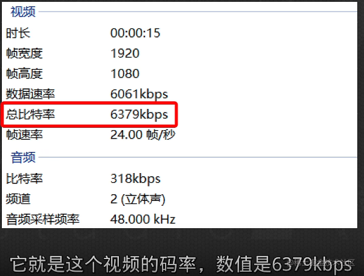

意味着这，个视频每秒钟有**6379**千比特的数据量，对视频的影响参考下面介绍：

对比视频，分辨率分别是：1920 * 1080.

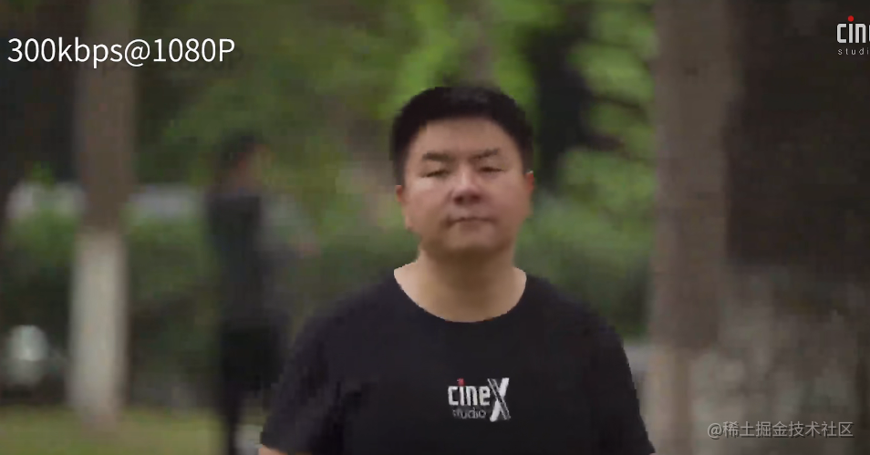

总结：视频的分辨率越高，则越需要更高的码率来保证清晰，如果是相同的分辨率，则码率优先影响清晰度。

## 码率和kb的单位转换：

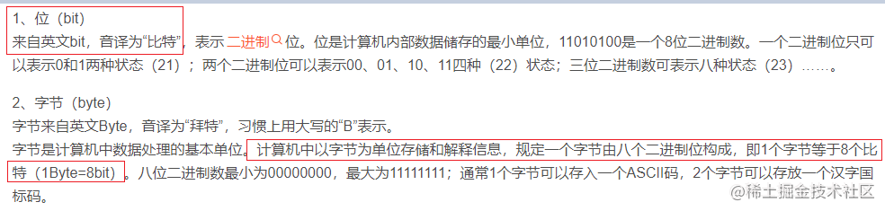

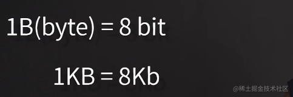

因此上面 `6379kbps /8 = 797kb/s`。 码率来计算视频大小

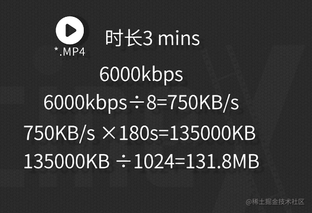

## 视频文件构成

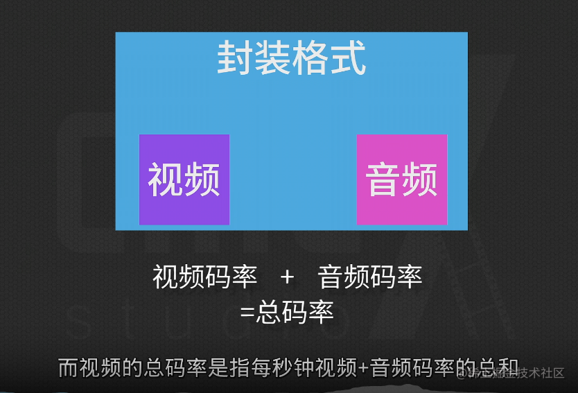

视频的压制需要遵循一定的规则：**编码方式**
b站使用的编码方式H.264，也叫做AVC, 而音频编码则是AAC
其他编码方式

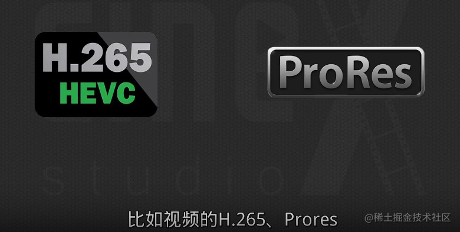

## 码率的边际递减效应 

码率并不是越大越好。到达一定的极限后，人眼就很难辨别出更好的画质了，但是会让视频的体积变得更大
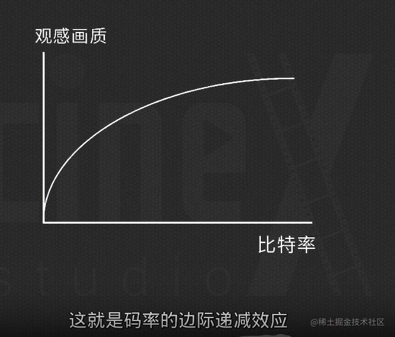

手机网络，选择低质量画面的原因，需要更小的带宽。
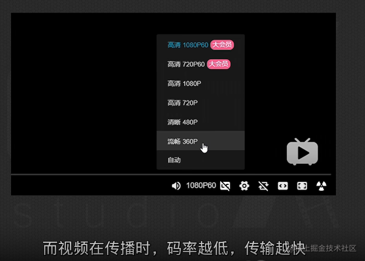

## 编码分为动态和固态

- **动态比特率**：VBR,编码器会根据画面的复杂程度来设置编码率，偏向静态的画面比特率越低，画面越复杂的则越高。平均码率等于你设定的值。 因此在选择的时候，如果视频偏向动态的比较多，则选择VBR更加合适

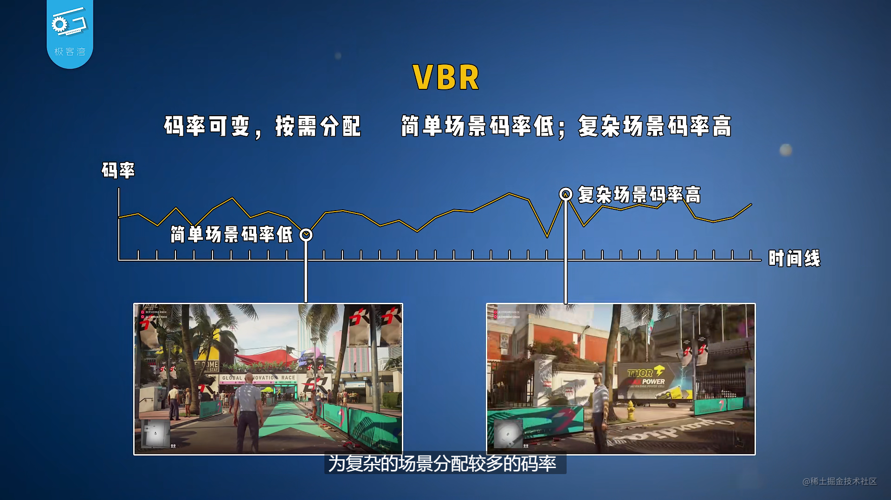

**还可以设置渲染两边：**
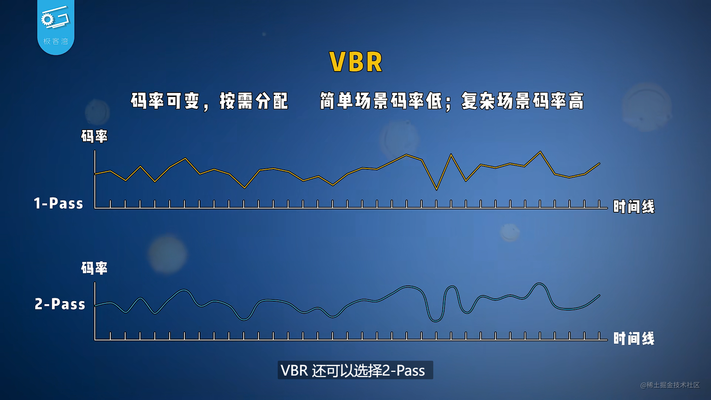

先分析视频的复杂度，分配好视频各部分的码率，第二遍在渲染视频。

- **固定比特率**: CBR, 每一秒的码率是相等的。

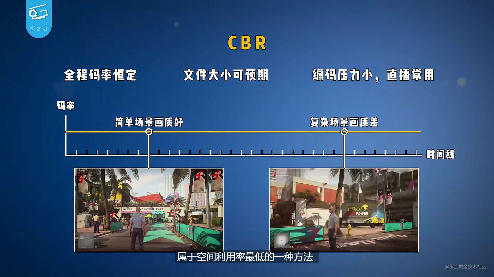

b站的码率要求：

- **CRF 固定质量模式 首选该模式**

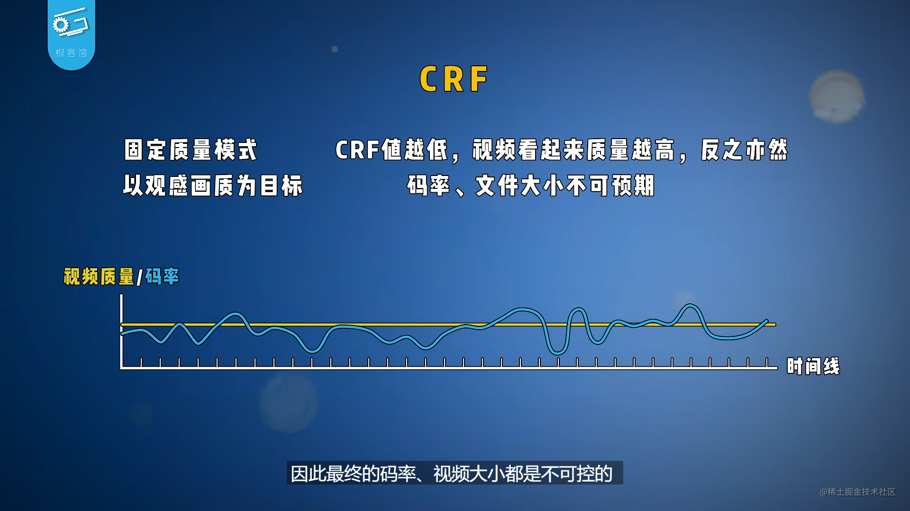

常见的压缩软件：

- **premiere**
- 小丸压制工具
- **handbrake**

