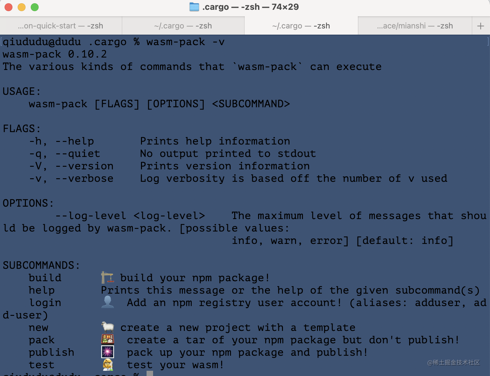
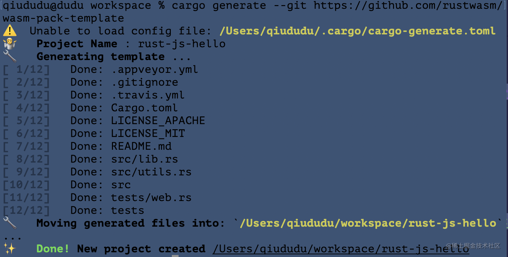

两天时间终于安装好`wasm`整个环境，记录以下:


# **什么是Wasm**

> WebAssembly（缩写为Wasm）是一种基于堆栈的虚拟机的二进制指令格式。Wasm被设计为一个可移植的编程语言编译目标，使客户端和服务器应用程序能够部署在网络上。

从这段描述上可以看出，`Wasm`就是一种类汇编结果的二进制指令格式，看起应该是高性能的；而基于虚拟机，则表示它像Java那样具有跨平台性。

官网宣称Wasm具有**高效和快速**、**安全**以及**开放和易于debug**的特点，而且是**开放网络平台的一部分**。

`Wasm` 被设计为可以和现有前端工具协作，用来更好地辅助`JS`，承担一些`JS`不擅长的、需要高性能的计算工作。事实上，就目前而言，`Wasm`还无法避开`JS`调用`DOM`节点。


# 镜像选择
尝试了很多都下载都一半不行了，最后选择了**上海交通大
```
# 放到 `$HOME/.cargo/config` 文件中
[source.crates-io]
#registry = "https://github.com/rust-lang/crates.io-index"

# 替换成你偏好的镜像源
#replace-with = 'ustc'
replace-with = 'sjtu'

# 清华大学
[source.tuna]
registry = "https://mirrors.tuna.tsinghua.edu.cn/git/crates.io-index.git"

# 中国科学技术大学
[source.ustc]
registry = "git://mirrors.ustc.edu.cn/crates.io-index"

# 上海交通大学
[source.sjtu]
registry = "https://mirrors.sjtug.sjtu.edu.cn/git/crates.io-index"

# rustcc社区
[source.rustcc]
registry = "git://crates.rustcc.cn/crates.io-index"

```
# 安装 cargo-generate
将用来拉取`wasm`项目模板，节省项目布置时间。
最后选择的是这个命令。

```
sudo cargo install cargo-generate --features vendored-openssl
```

中间失败了N多次，发现一个依赖`pkg-config`没有，[参考](https://www.cnblogs.com/sddai/p/10266624.html)

# 安装 wasm-pack
**[wasm-pack](https://link.zhihu.com/?target=https%3A//github.com/rustwasm/wasm-pack)**是一个Rust->Wasm的一站式工具，提供构建、测试和发布功能。

该工具旨在成为构建和使用 `rust` 生成的 `WebAssembly` 的一站式商店，您希望与 `JavaScript`、浏览器或 `Node.js` 进行互操作。`wasm-pack`帮助您构建 rust 生成的 `WebAssembly` 包，您可以将其发布到 npm 注册表，或者以其他方式与您已经使用的工作流中的任何 `javascript` 包一起使用，例如[webpack](https://webpack.js.org/)。


使用以下命令可以顺利安装成功。

```
sudo cargo install wasm-pack --features vendored-openssl
```

大功告成，这玩意太费劲了，根本不需要翻墙啥的，中间一直怀疑是翻墙软件和`github`本地访问的问题，安装编译很慢，失败了很多次。




# 尝鲜wasm
初次感受下`rust + js` 的化学效应。
使用`cargo-generate`模板建立一个`rust-js-hello`的项目：

`cargo generate --git https://github.com/rustwasm/wasm-pack-template`:



 > wasm-pack build 发现编译失败，尝试了好几天，才成功，感觉wasm-pack也不是很靠谱！
 
 `.bash_profile` 增加PATH变量：
 
 ```rust
 # 用于更新 toolchain
export RUSTUP_DIST_SERVER=https://mirrors.ustc.edu.cn/rust-static

# 用于更新 rustup
export RUSTUP_UPDATE_ROOT=https://mirrors.ustc.edu.cn/rust-static/rustup
 ```

`.config`文件内容是：
```rust
[source.crates-io]
registry = "https://github.com/rust-lang/crates.io-index"


# 替换成你偏好的镜像源
#replace-with = 'ustc'
replace-with = 'tuna'


# 清华大学
[source.tuna]

registry = "https://mirrors.tuna.tsinghua.edu.cn/git/crates.io-index.git"


# 中国科学技术大学
[source.ustc]
registry = "git://mirrors.ustc.edu.cn/crates.io-index"


# 上海交通大学

[source.sjtu]
registry = "https://mirrors.sjtug.sjtu.edu.cn/git/crates.io-index"


# rustcc社区
[source.rustcc]
registry = "git://crates.rustcc.cn/crates.io-index"
```

编译成功！


