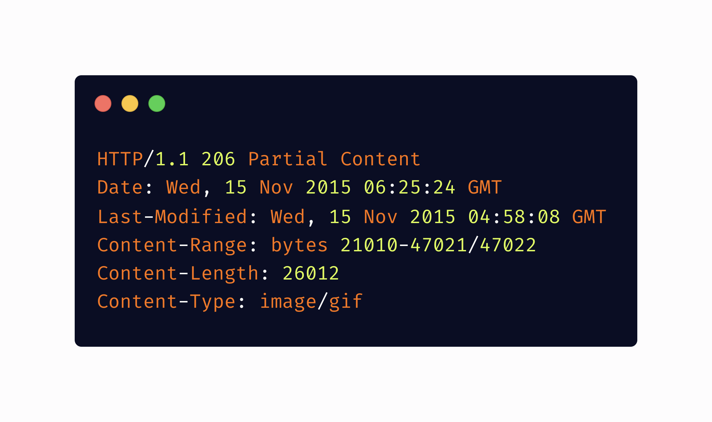

#

**一：本文主要内容。**

-   视频在前端开发中的使用场景。
-   了解涉及音视频开发中基本编码、码流、帧率等基础概念。
-   常见的视频协议介绍。
-   分析播放器原理。
-   实现一个简易视频剪辑，和相关mtmp，mse, hls的案例展示。
# **二：和音视频相关的一些内容介绍。**

### **2.1：blob和arraybuff**

Blob 类型的对象表示不可变的类似文件对象的原始数据。位于磁盘、高速缓存内存和其他不可用的位置。


#### **2.1.1 blob 案例展示：**


ArrayBuffer 表示通用的，固定长度的原始二进制数据缓冲区。存在于内存中，类型化数组进行操作。


**2.1.2 arraybuffer 案例展示**

Magic numbers are the first few bytes of a file that are unique to a particular file type. These unique bits are referred to as magic numbers, also sometimes referred to as a file signature.

These bytes can be used by the system to “**differentiate between and recognize different files**” without a file extension.

***

**png 图片类型的magic number: 89 50 4e 47 0d 0a 1a 0a**


（上图展示hex fiend图形查看器查看png的编码格式）


#### **2.1.3: blob 播放视频**


src 属性已经变成一个 **Blob URL**。但是碰到一个问题，这种形式要等到视频数据全部到内存后才可以播放。因此，需要**流媒体，最直观体验就是使媒体文件可以边下边播**，web端如果要使用流媒体，有多个流媒体协议可以供我们选择。

### **2.2 http 206**

206 Partial Content 成功状态响应代码表示请求已成功，主体包含所请求的数据区间，该数据区间是在请求的 Range 首部指定的。服务器支持范围请求的话，你可以使用 Range 首部来生成该类请求。




### **2.3 视频中涉及到的概念和编码基础知识**

**为什么要编码？** 以一部刚上映的**1080p**电影为例, 一帧大小等于1920 x 1080 x 3（rgb三原色）x 8【8bit，色深】约 **5.93MB**, 按照标准的 **24**帧，则对于一部90分钟的电影来说，如果不压缩，则体积量是**750G**。

**编码的目的**：**做有损压缩。压缩原始数据的体积**。有两种主要的压缩技术，**空间压缩和时间压缩**。

**空间压缩**是节省视频各个帧内空间的技术，通常称为帧内压缩。它是通过将像素分组在一起并将其存储为单个颜色值（称为块）来工作的。

**时间压缩**是一种节省多个帧空间的技术，通常也称为帧间压缩。它使用与空间压缩相同的块压缩技术，但不是每个帧都用。

**封装格式（多媒体容器）** ：常见的 MP4、mov、**mkv**、AVI、RMVB、WMV、FLV，webm。

**视频编码格式**：常见的H.264/AVC，H.265/HEVE，VP8, VP9 和 **AV1** 等。

**音频编码格式**：MP3、AAC 和 Opus 等就是音频编码格式。

比如将一个 H.264 视频编码文件和一个 AAC 音频编码文件按 MP4 封装标准封装以后，就得到一个 MP4 文件。多媒体容器用来存储/传输编码数据，并按一定规则把音视频、字幕等数据组织起来，同时还会包含一些元信息，比如当前流中包含哪些编码类型、时间戳等，播放器可以按照这些信息来匹配解码器、同步音视频。

#### **2.3.0 几类常见的视频编码方式对比**

-   **h264/avc** 目前**性能最好**最完善的h264编解码库,由大名鼎鼎的VLC播放器的维护机构，法国videolan开源组织维护的libx264编解码库。

<!---->

-   **h265（hevc**）业界最好的编解码库。H.265 的编码单位可以选择从最小的 8x8 到最大的 64x64， 同时，H.265的帧内预测模式支持33种方向（H.264只支持8种），并且提供了更好的运动补偿处理和矢量预测方法。反复的质量比较测试已经表明，在相同的图象质量下，相比于H.264，通过H.265编码的视频大小将减少大约 39-44%。

<!---->

-   **VP8**是google定义并开源的视频编解码标准和编解码库实现。同时宣布开源了 **VP8** 和 **WebM** 视频格式（H264/H265有不同版权，因此谷歌研发的vp8），现代浏览器都支持VP8视频编码，当然也支持webm视频格式。在 HTML5 上 video 可以选择播放该形式的视频，数据测试表明相对 H.264 ，WebM 可以明显节约 25% 的体积，这对于 Web 而言无疑是利好。但是apple缺单独不支持播放该类型视频。

<!---->

-   **VP9**也是google开源的用与比拼H265(HEVC)的编解码器，现代浏览器都支持VP9视频编码。VP9的目标是在同画质下比 VP8 编码减少50%的文件大小并在编码效率上超越由动态专家图像组主导开发的 HEVC。

<!---->

-   **AV1**:google最新推出的针对VP9编码有多项优化后的新的编解码器。是一个开放、免专利的影片编码格式。比H265（HEVC）压缩率提升约27%，可以说是力压H265。是目前为止，**世界上压缩性能最好的视频编解码器**。得益于AV1的开源和相比于H265更节省带宽的缘故，目前AV1有超过h265编码的趋势，更多视频平台和直播平台选择使用AV1编码，而不是H265。目前使用AV1编码的主流流媒体平台有这几家：“奈飞、YouTube、BBC、爱奇艺”。

js 检测支持

```
const av1 = 'video/mp4; codecs=av01.0.05M.08';

const hevc = 'video/mp4; codecs="hevc"';

if (MediaSource.isTypeSupported(av1)) {}

if (videoEle.canPlayType(hevc)) {}
```

#### **2.3.1 Mp4的封装格式**

MPEG-4 Part 14（MP4）是最常用的容器格式之一，通常以 .mp4 文件结尾。它用于 HTTP（DASH）上的动态自适应流，也可以用于 Apple 的 HLS 流。MPEG 代表动态图像专家组，是国际标准化组织（ISO）和国际电工委员会（IEC）的合作。MPEG 的成立是为了设置音频和视频压缩与传输的标准。

mp4 容器文件分析： <https://gpac.github.io/mp4box.js/test/filereader.html>

MP4 是由一些列的 box 组成，它的最小组成单元是 box。MP4 文件中的所有数据都装在 box 中，即 MP4 文件由若干个 box 组成，每个 box 有类型和长度，可以将 box 理解为一个数据对象块。box 中可以包含另一个 box，这种 box 称为 **container box**。

一个 MP4 文件首先会有且仅有 一个 ftype 类型的 ，作为 MP4 格式的标志并包含关于文件的一些信息，之后会有且只有一个 moov 类型的 box（movie box），它是一种 container box，可以有多个，也可以没有，媒体数据的结构由 metadata 进行描述。


#### **2.3.2 FPS**

**每秒帧数，** 表示一秒的时间内静止画面的数量。理论上来说画面越多越流畅。由于人眼有视觉残留效应，当它们依照顺序通过眼球反映给我们大脑的时候，视觉上就像动了起来一样，这也是动画和电影制作的原理。


电影的每一帧都带有**动态模糊效果**。如果我们把电影某个动态的画面单独截取出来，例如人在疾速奔跑中，会发现人物或者周围带有残影效果。而我们的大脑能够针对这样的画面自动补全。所以，即便帧数少，也不会让人产生突兀卡顿的感觉。

####


视频中图像编码的主要依赖：

-   帧内的图像压缩编码

<!---->

-   帧之间的数据压缩编码

帧内的图像压缩很好理解就是对于图片中相同像素的压缩。帧之间的数据压缩就主要依赖连续帧之间具有极高的相似性的原理。如一段视频有十几秒都是不动的或者有50%的画面都是不变的，那么这块存储就可以节省了。

视频压缩的核心原理就是将多张图像进行编码后生产成一段一段的 GOP ( Group of Pictures ) ， 解码器在播放时则是读取一段一段的GOP进行解码后读取画面再渲染显示。

视频压缩的核心原理就是将多张图像进行编码后生产成一段一段的 GOP ( Group of Pictures ) ， 解码器在播放时则是读取一段一段的GOP进行解码后读取画面再渲染显示。一组GOP中的帧分为三类（有些视频只有两类，没有B帧），分别是：I帧(自带全部信息的独立帧，GOP[0])-P帧（帧间预测编码帧）-B帧（双向预测编码帧）。

**总结：帧率越大,画面越流畅体积越大,帧率越小,画面越卡顿。分辨率不会影响画面的流畅度,只会影响画面的清晰度和文件的体积,分辨率越大,视频体积越大。另一个重要因素就是码率。**

#### **2.3.1: 码率**

**码率bps (Bit per second)** ，每秒传递数据量，单位是比特。代表了视频画质的数据量，在其他因素不变的情况下，码率越高画质越清晰。同时文件的体积也会增大。


（相同分辨率下码率越高则越清晰）


（码流的边际递减效应）

计算方式：

-   每秒传输的数据量=码率/8

<!---->

-   视频文件体积=码率/8x视频时长(s) =每秒传输的数据量*视频时长(s)。距离说明

1.  500Kbps,也就是每秒传输62K大小的数据, 假如按照帧率30fps进行计算,那么每张图片大小约为2kb大小。
1.  如果一个视频的视频码率为3Mbps, 音频码率为512Kbps, 时长90分钟(5400秒), 那么整个视频文件的大小就是: (512/1024 + 3) x 5400 / 8 = 2362MB。
1.  如果一个视频文件大小有10GB，时长为90分钟(5400秒)， 那么它的码率（视频＋音频）为:

10 x 1024 x 8 / 5400 = 15Mbps。

总结：分辨率只能保证视频每一帧像素的数量，并不能保证它的质量。在视频编辑中常用到一下三种码率设置参数：

1：固定码率（CBR）：在牺牲视频质量的同时，平均码率保持不变。

2：可变码率（VBR）：根据画面复杂程度来设置码率，偏向静态画面码率越低，打斗等复杂画面越高，平均码率等于设定的值，因此如果编码的时候画面动态比较多可以选择该编码。

3：**固定质量 CRF**，推荐首选方式，根据画质的质量来编码。

# **三：相关的协议介绍**

**协议是为了解决问题而生的，它有着天然的指向性。同时，也有着它自身的局限。**

常见的音视频开发中直播是很常见的业务。随着国内直播行业的发展和5G时代的到来，特别是短视频行业等平台的出现，对于前端开发来说了解很有必要。

在开始之前，先把流媒体服务中的双端关系说一下。**在一个完整的流媒体服务框架中，角色就是"两端加一服"。推流端、拉流端加上媒体服务器。**


同时按照应用场景的不同，协议又分：

-   推流协议；

<!---->

-   拉流播放协议；

协议的应用场景到底是什么？ 比如：RTMP 可以用在双端，但 HLS 只能用在拉流端。

**推流**，**指的是把采集阶段封包好的内容传输到服务器的过程**。其实就是将现场的视频信号传到网络的过程。“推流”对网络要求比较高，如果网络不稳定，直播效果就会很差，观众观看直播时就会发生卡顿等现象，观看体验很是糟糕。要想用于推流还必须把音视频数据使用传输协议进行封装，变成流数据。**常用的流传输协议有RTSP、RTMP、HLS等**，使用RTMP传输的延时通常在1–3秒，对于手机直播这种实时性要求非常高的场景，RTMP也成为手机直播中最常用的流传输协议。最后通过一定的Qos算法将音视频流数据推送到网络端，**通过CDN进行分发。**

**拉流**是指服务器已有直播内容，根据协议类型（如RTMP、RTP、RTSP、HTTP等），与服务器建立连接并接收数据，进行拉取的过程。**拉流端的核心处理在播放器端的解码和渲染**，在互动直播中还需集成聊天室、点赞和礼物系统等功能。

**拉流端现在支持RTMP、HLS、HDL（HTTP-FLV）三种协议**，其中，在网络稳定的情况下，对于HDL协议的延时控制可达1s，完全满足互动直播的业务需求。

RTMP 延时一般在1-3秒。

HLS 是苹果提出的基于HTTP的流媒体传输协议，优点是跨平台性比较好，HTML5可以直接打开播放，移动端兼容性良好，但是缺点是延迟比较高。

## **3.1 RTMP协议**

**RTMP 协议 (Real Time Messaging Protocol)** 是一种基于TCP的协议（默认端口为 1935（有可能被封）），旨在保持持久、低延迟的连接，进而提供流畅的流媒体体验。

该协议设计最初设计用于在专用流服务器和 Adobe Flash Player 之间传输音频、视频和其他数据。**虽然曾经是专有的，但 RTMP 现在是一个开放的规范。**

**下图展示支持编码的格式**


RTMP协议是目前各大云厂商直线直播业务所公用的基本直播推拉流协议。

**The most common live streaming workflow out there is** **[RTMP to HLS](https://www.wowza.com/blog/converting-rtmp-to-hls)** **. Using a combination of RTMP and HLS helps maximize compatibility without pushing latency too high. 这种架构还允许广播公司在直播视频传输链的任一端使用支持良好的协议。几乎所有的软硬件编码器都支持RTMP，播放端的HLS也是如此。**


RTMP协议主要的特点有：**多路复用，分包和应用层协议**。

**多路复用：** 就是在一个 TCP 连接上，将需要传递的Message分成一个或者多个 Chunk，同一个Message 的多个Chunk 组成 ChunkStream，在接收端，再把 ChunkStream 中一个个 Chunk 组合起来就可以还原成一个完整的 Message，这就是多路复用的基本理念。


**分包：** 在多媒体网络传输案例中，绝大多数的多媒体传输的音频和视频的数据包都相对比较偏大，在TCP这种可靠的传输协议之上进行大的数据包传递，很有可能阻塞连接，导致优先级更高的信息无法传递，分包传输就是为了解决这个问题而出现的。

演示本地进行摄像头推流和本地推送本地mp4视频流和拉流播放(需要获取摄像头权限)。

```
# 镜像名称

docker: docker pull nginx-rmtp  

#本机虚拟ip查询

ipconfig getifaddr en0


# 拉流

ffplay rtmp://172.30.0.58:1935/live/haha


# 推送本地视频流

# -vcodec 设置视频编解码器。这是-codec:v的别名。

# copy 将不重新编码而复制所有流

# -f 强制输入或输出文件格式,一般不设置自动查找

ffmpeg -re -i /Users/mac/Desktop/video/duck.mp4 -vcodec copy -f flv rtmp://172.30.0.58:1935/live/haha


# 推送本地摄像头流

#  -f 指定使用avfoundation库采集数据

ffmpeg -f avfoundation -framerate 30 -video_size 1280x720 -i  "0" -vcodec libx264 -preset ultrafast -acodec libfaac -f flv  "rtmp://172.30.0.58:1935/live/haha"
```

## **3.2 http-flv/HDL**

**HttpFlv**的出现最早是2008年，从它的协议本身我们能看到Adobe的影子，就是flv协议本身。也可以说，httpflv是争夺与放弃之间妥协的产物。人们再也不愿意看到Adobe，但又不得不面对海量Flv历史文档。httpflv诞生了。

HttpFlv 就是 http+flv ，将音视频数据封装成FLV格式，然后通过 HTTP 协议传输给客户端。虽然传输协议变了，但在flv数据格式下，脱离FlashPlayer还是无稽之谈。但在2016年，因为**flv.js**的出现彻底告别了flash！

B站和爱奇艺有限开启弹幕观影模式，为我们提供了另一种观影交互体验。更重要的，Flv.js的诞生，让我们在视频播放领域彻底告别Adobe时代。一个全新、干净的HTML5就这样向我们走来了。

和RMTP协议对比：**两者都是针对 FLV 格式，两者延时都很低，两者都走的 HTTP 通道。**

不同的是：HTTP-FLv直接发起长连接，下载对应的 FLV 文件，头部信息简单。

因此在该协议下的一般工作模式是：**RTMPT握手协议过于复杂，分包，组包过程耗费精力大，RTMP 发的包很容易处理，通常 RTMP 协议会作为视频上传端来处理，然后经由服务器转换为 FLV 文件，通过 HTTP-FLV 下发给用户。**

**flv.js** 是用纯 JavaScript 编写的 HTML5 Flash Video（FLV）播放器，它底层依赖于 Media Source Extensions。在实际运行过程中，它会自动解析 FLV 格式文件并喂给原生 HTML5 Video 标签播放音视频数据，使浏览器在不借助 Flash 的情况下播放 FLV 成为可能。

## **3.3 HLS 协议 (HTTP Live Streaming)**

HLS 是一种为提供实时和点播流媒体内容而开发的协议，它利用 HTTP 技术实现可扩展性和自适应比特率流媒体。

**HTTP Live Streaming**（缩写是 HLS）是由苹果公司提出基于 HTTP 的流媒体网络传输协议，它是苹果公司 QuickTime X 和 iPhone 软件系统的一部分。

**它的工作原理**是把整个流分成一个个小的基于 HTTP 的文件来下载，按需下载。当媒体流正在播放时，客户端可以选择从许多不同的备用源中以不同的速率下载同样的资源，允许流媒体会话适应不同的数据速率。

**HLS 视频流被分解为数据段（也称为块或数据包），而不是作为连续的信息流传递**。也就是说，它还推高了延迟，因此大多数内容分发者使用实时消息传递协议 (RTMP)对其流媒体内容进行编码，然后在到达媒体服务器后重新打包以进行 HLS 交付。


**自适应比特率流转码**

为了向观看的每个人（包括小屏幕和连接不良的人）提供最高质量的流媒体，HLS 流媒体动态调整分辨率以适应每个人的情况。这被称为自适应比特率流媒体，它允许广播公司以出色的带宽和处理能力向用户提供高质量的流媒体，同时也满足那些缺乏速度和电力部门的用户。

不是以一种比特率创建一个直播流，而是使用转码器（通常位于媒体服务器中）以不同的比特率和分辨率创建多个流。然后，服务器针对每个观众的屏幕和连接速度发送可能的最高分辨率流。

创建单个流的多个再现有助于防止缓冲或流中断。此外，当观众的信号强度从两格变为三格时，流会动态调整以提供出色的再现效果。因此在高铁上和公交车以及家里看到的分辨率是不相同的。


HLS 是当今用于直播的最常用协议，在我们的 [2021 年视频流延迟报告](https://www.wowza.com/blog/2021-video-streaming-latency-report)中，超过 70% 的参与者采用了 HLS 。


HLS产生的主要原因：**是为了解决 RTMP 协议存在的一些问题**。比如 RTMP 协议不使用标准的 HTTP 接口传输数据，所以在一些特殊的网络环境下可能被防火墙屏蔽掉。但是 HLS 由于使用的 HTTP 协议传输数据，通常情况下不会遇到被防火墙屏蔽的情况。除此之外，它也很容易通过 CDN（内容分发网络）来传输媒体流，CDN 还通过缓存音频和视频片段来帮助改善观众体验。

另外随着flash的死亡，h5播放器支持相应的编码格式视频十分关键，后面会讲述。

**hls 编码支持：**

-   [音频编解码器：](https://www.wowza.com/blog/best-audio-codecs-live-streaming) AAC-LC、HE-AAC+ v1 & v2、xHE-AAC、Apple Lossless、FLAC

<!---->

-   [视频编解码器：](https://www.wowza.com/blog/video-codecs-encoding) H.265、H.264

<!---->

-   播放兼容性：很好（所有 Google Chrome 浏览器；Android、Linux、Microsoft 和 MacOS 设备；一些机顶盒、智能电视和其他播放器）

<!---->

-   优点：自适应比特率、可靠且得到广泛支持。

<!---->

-   缺点：体验质量优先于低延迟。

<!---->

-   延迟：虽然 HLS 传统上提供 6-30 秒的延迟，但[低延迟 HLS](https://www.wowza.com/blog/hls-streaming-protocol#low-latency-hls)扩展现在已[作为 HLS 的功能集合并](https://www.wowza.com/blog/ietf-incorporates-low-latency-hls-into-the-hls-spec)，承诺提供低于 2 秒的延迟。

**.m3u8支持文件**：

HLS 视频片段被索引到媒体播放列表中，以便视频播放器了解如何组织数据。还必须创建一个主 .m3u8 播放列表文件 - 将其视为索引的索引 - 以指导播放器如何在特定于变体的播放列表之间跳转。这也称为清单文件。然后，任何提供流的人都可以通过在网页中嵌入 .m3u8 参考 URL 或创建下载文件的应用程序来分发内容。


```
curl https://test-streams.mux.dev/x36xhzz/x36xhzz.m3u8


curl https://test-streams.mux.dev/x36xhzz/url_0/193039199_mp4_h264_aac_hd_7.m3u8

 

curl https://test-streams.mux.dev/x36xhzz/url_0/url_462/193039199_mp4_h264_aac_hd_7.ts -o ./1.ts
```

当用户选定某种清晰度的视频之后，将会下载该清晰度对应的媒体播放列表（m3u8 文件），该列表中就会列出每个片段的信息。HLS 的传输/封装格式是 MPEG-2 TS（MPEG-2 Transport Stream），是一种传输和存储包含视频、音频与通信协议各种数据的标准格式，用于数字电视广播系统，如 DVB、ATSC、IPTV 等等。

**如果要做视频版权保护，使用对称加密算法，比如 AES-128 对切片进行对称加密**


当客户端进行播放时，先根据 m3u8 文件中配置的密钥服务器地址，获取对称加密的密钥，然后再下载分片，当分片下载完成后再使用匹配的对称加密算法进行解密播放。

**[HLS.js](https://hls-js.netlify.app/demo/)** 是一个实现**HTTP Live Streaming**客户端的 JavaScript 库。它**依赖HTML5 视频和MediaSource 扩展进行播放**。它通过将 MPEG-2 传输流和 AAC/MP3 流转换为 ISO BMFF (MP4) 片段来工作。当浏览器中可用时，使用Web Worker异步执行 Transmuxing 。HLS.js 还支持 HLS + fmp4，正如在WWDC2016期间宣布的那样。目标是实现在其它平台兼容 HLS。

```
var video = document.getElementById('video');

if (!Hls.isSupported()) return;

var hls = new Hls({ debug: true,});

hls.loadSource('https://teststreams.mux.dev/x36xhzz/x36xhzz.m3u8')    

hls.attachMedia(video);    

hls.on(Hls.Events.MEDIA_ATTACHED, function () {          

     video.muted = true;          

     video.play();       

})} 
```

还有大名鼎鼎的**video.js**, 功能强大，有很多功能封装好了，而且有自己的一套UI，在不同浏览器下显示比较一致。 但是相反缺点是：包比较大，实现hls直播的时候其实是内嵌了hls.js的代码，实际上是运用了hls.js，而且由于封装的ui和功能，使其不够纯净，不够灵活，修改ui的时候要用到其他的插件。

## **综合对比三个协议：**

##


**3.4：DASH**

**一种服务端、客户端的流媒体解决方案。**

基于 HTTP 的动态自适应流（**Dynamic Adaptive Streaming over HTTP**，也称 MPEG-DASH）是一种自适应比特率流技术，使高质量流媒体可以通过传统的 HTTP 网络服务器以互联网传递。非常类似HLS。**MPEG-DASH** 会将内容分解成一系列小型的基于 HTTP 的文件片段，**每个分片可以存在不同的编码形式（不同的codec、profile、分辨率、码率等）** ；

解决目标是： **实现adaptive bitrate streaming技术。不同画质内容无缝切换。**

MPEG-DASH 是首个基于 HTTP 的自适应比特率流解决方案，它也是一项国际标准。MPEG-DASH 不应该与传输协议混淆 —— MPEG-DASH 使用 TCP 传输协议。不同于 HLS、HDS 和 Smooth Streaming，DASH 不关心编解码器，因此它可以接受任何编码格式编码的内容，如 H.265、H.264、VP9 等。

虽然 HTML5 不直接支持 MPEG-DASH，但是已有一些 MPEG-DASH 的 JavaScript 实现允许在网页浏览器中通过 MSE 使用 MPEG-DASH。参考下一章MSE实现。

为什么采用dash? YouTube采用DASH！其网页端及移动端APP都使用了DASH.国内b站18年开始使用dash方法。 [参考 ](https://www.bilibili.com/read/cv855111)https://www.bilibili.com/read/cv855111。

#### **3.3.1 dash中的重要概念**

-   MPD（xml格式） 媒体文件的描述文件（manifest），作用类似HLS的m3u8文件。

<!---->

-   **fMP4（fragmented MP4）** ，可以简单理解为分片化的MP4，是DASH采用的媒体文件格式，文件扩展名通常为（.m4s或直接用.mp4）。


[西瓜视频](https://h5player.bytedance.com/examples/) dash 查看

在 Fragmented MP4 文件中含有三个非常关键的 **boxes：moov、moof 和 mdat**。

-   moov（movie metadata box）：用于存放多媒体 file-level 的元信息。

<!---->

-   mdat（media data box）：和普通 MP4 文件的 mdat 一样，用于存放媒体数据，不同的是普通 MP4 文件只有一个 mdat box，而 Fragmented MP4 文件中，每个 fragment 都会有一个 mdat 类型的 box。

<!---->

-   **moof（movie fragment box）** ：用于存放 fragment-level 的元信息。该类型的 box 在普通的 MP4 文件中是不存在的，而在 Fragmented MP4 文件中，每个 fragment 都会有一个 moof 类型的 box。

Fragmented MP4 文件中的 fragment 由 moof 和 mdat 两部分组成，每个 fragment 可以包含一个音频轨或视频轨，并且也会包含足够的元信息，以保证这部分数据可以单独解码。Fragment 的结构如下图所示


# **四： MSE (Media Source Extensions媒体源扩展）**

**MSE: 大大地扩展了浏览器的媒体播放功能，提供允许JavaScript 生成媒体流。** 这可以用于自适应流（adaptive streaming）及随时间变化的视频直播流（live streaming）等应用场景。

传统播放视频形式：


音频播放形式：也是一个audio标签元素添加src进行播放。

● **MPEG 4** 文件使用 H264 视频编解码器和AAC音频编解码器。

● **WebM** 文件使用 VP8 视频编解码器和 Vorbis 音频编解码器。

● **Ogg** 文件使用 Theora 视频编解码器和 Vorbis音频编解码器 。

但这缺少了诸如视频分段加载、视频码率切换、部分加载等等现代播放器应该有的功能，所以绝大部分的浏览器视频播放器过去都是基于 Flash 开发的，这也是为什么直到现在2017年中旬，Flash 这个老古董依然在各大视频网站上活着的原因。

但是，**MSE弥补了这一不足，提供了实现无** **插件** **且基于 Web 的流媒体的功能**。**使用 MSE，媒体串流能够通过 JavaScript 创建，并且能通过使用 audio 和 video 元素进行播放。**


媒体源扩展（MSE）实现后，情况就不一样了。MSE 使我们可以把通常的单个媒体文件的 src 值替换成引用 MediaSource 对象（一个包含即将播放的媒体文件的准备状态等信息的容器），以及引用多个 SourceBuffer 对象（代表多个组成整个串流的不同媒体块）的元素。MSE 让我们能够根据内容获取的大小和频率，或是内存占用详情（例如什么时候缓存被回收），进行更加精准地控制。 它是基于它可扩展的 API 建立自适应比特率流客户端（例如 DASH 或 HLS 的客户端）的基础。

#### **4.0 基础案例展示【演示】**

创建一个带有给定 MIME 类型的新的 SourceBuffer 并添加到 MediaSource 的 SourceBuffers 列表。


#### **4.1：mime类型的含义：**

其中mimeCodec 讲解：

```
var mime = 'video/mp4; codecs="avc1.42E01E, mp4a.40.2"'
```

video/mp4 类型可以使用js 方法supportType 检测，支持音视频格式。

```
const sup = supportType(event,'video/mp4','avc1.42E01E, mp4a.40.2');
```

'**avc1.42E01E'** ，即它用于告诉浏览器关于视频编解码的一些重要信息，诸如编码方式、分辨率、帧率、码率以及对解码器解码能力的要求。在这个例子中，'avc1' 代表视频采用 H.264 编码，随后是一个分隔点，之后是 3 个两位的十六进制的数，代表编解码先关含义，后面是音频。

#### **4.2：如何转码出符合标准的视频**

**MSE必须使用fmp4（如果扩展名是.m4s也fmp4）。** **什么事fmp4?** 参考上面dash技术实现。

**普通的mp4会报错误： Failed to execute 'endOfStream' on 'MediaSource': The MediaSource's readyState is not 'open'。**

**或者前端安装使用 yarn add mp4box** 是这个插件在前端的封装。再或者使用bento4，是一款非常强大的工具库。在实际生产中是事实转码的。


bento4 是一款强大的mp4文件处理工具：

```
mp4info         显示有关MP4文件的高级信息，包括所有tracks和codec的详细信息。

mp4dump         显示MP4文件的整个atom/box结构。mp4fragment     从非碎片化的MP4文件创建碎片化MP4文件。

mp4info -i | grep fragment 查看是否是fmp4

# 指定fragment时长为2s

mp4fragment --fragment-duration 2000 input.mp4 fragmented.mp4 # 进行切片 分离音轨

mp4dash fragmented.mp4 # 或这直接 拆条

mp4box -dash 4000 threef.mp4
```

或者直接使用ffmpeg。

```
ffmpeg -ss 00:00:00 -i source2.mp4 -c copy -t 00:00:05 xxxx.mp4
```

#### **4.3 代码需要注意的问题**

**appendBuffer** 是异步执行的，在完成前，不能 append 新的 chunk

```
sourceBuffer.appendBuffer(buffer1)
```

而是应该监听 SourceBuffer 上的 updateend 事件，确定空闲后，再加入新的 chunk。

```
sourceBuffer.addEventListener('updateend', () => {    // 先设定新chunk加入的位置，比如第20秒处    sourceBuffer.timestampOffset = 20    sourceBuffer.append(newBuffer)}
```

因此总结大概流程是：

1.  使用 **fetch range** 请求 **mp4 -> arraybuffer**。
1.  如果 **sourceBuffer** 正在**updating**，则将buffer放入队列，否则直接mediaSource.appendBuffer。
1.  **sourceBuffer**触发**updateend**后（处理appendBuffer就会是updating）再从队列中取第一个buffer。
1.  **fetch** 最后如果还未请求完数据则递归请求（改变range的起始值）。

深入研究mse的实现和高级使用，请参考「**hls.js**」 或 「**flv.js**」两个库的。

#### **4.4 码流自适应实现**

控制算法决定当前加载哪个码率的视频。很容易就能想到一种简单的算法：上一段 chunk 加载完后，计算出加载速度，从而决定下一个 chunk 的码率。

但这种朴素的算法有很严重的问题，换句话说，我们没办法预测未来的网络环境。

所以学术界提出了一系列新的算法，比如最常见的 **Buffer-Based** 算法，即**根据当前缓冲区里视频的长度，决定下一个 chunk 的码率**。如果有很长的缓冲，那么就加载高码率的视频。这在相当于一个积分控制器，把时刻变化的无法预测的网络环境在时间维度上积分，以获得一个更平缓更能预测的函数。

但是 Buffer-Based 算法依然有问题，在视频起步阶段，**缓冲区里的视频很短，导致无论网络环境如何，起步阶段的码率都是很低的**。所以 Buffer-Based 算法只适用于视频 startup 后的稳态阶段。在起步阶段，依然有很多优化的空间，不在阐述。

# **五： 视频播放器**

视频播放器是指能播放以数字信号形式存储的视频的软件，也指具有播放视频功能的电子器件产品。大多数视频播放器（除了少数波形文件外）携带解码器以还原经过压缩的媒体文件，视频播放器还要内置一整套转换频率以及缓冲的算法。大多数的视频播放器还能支持播放音频文件。视频播放基本处理流程大致包括以下几个阶段：

（1）解协议

从原始的流媒体协议数据中删除信令数据，只保留音视频数据，如采用 RTMP 协议传输的数据，经过解协议后输出 flv 格式的数据。**从http协议中拿多媒体二进制流。**

（2）解封装

分离音频和视频压缩编码数据，常见的封装格式 MP4，MKV，RMVB，FLV，AVI 这些格式。从而将已经压缩编码的视频、音频数据放到一起。例如 FLV 格式的数据经过解封装后输出 H.264 编码的视频码流和 AAC 编码的音频码流。

（3）解码

视频，音频压缩编码数据，还原成非压缩的视频，音频原始数据，音频的压缩编码标准包括 AAC，MP3，AC-3 等，视频压缩编码标准包含 H.264，MPEG2，VC-1 等经过解码得到非压缩的视频颜色数据如 YUV420P，RGB 和非压缩的音频数据如 PCM 等。

（4）音视频同步：将同步解码出来的音频和视频数据分别送至系统声卡和显卡播放。


基本都是基于MSE，对FLV视频demux之后remux成mp4，直接交给video标签播放。

以github 上的h265播放器为例： https://github.com/goldvideo/h265player 是通过wesm 调用ffmpeg 来进行**软解**码。

软解和硬解区别：对电脑的影响非常大，一个是利用cpu的计算来强制解码，后者是结合电脑硬件显卡等来自动解码，目前市面上很多显卡已经支持主流的解码能力。 （B站）为了节省宽带，默认在网页播放器使用用8个wasm worker来软解，1080p高码率能吃掉接近2个核。https://hot.cnbeta.com/articles/movie/1255189.htm?pid=ikjia.cn


演示案例项目： https://gitee.com/qiududu/video-share （暂时有权限个人可见）

# **七： 参考引用**

-   https://github.com/goldvideo/h265player
-   **https://hot.cnbeta.com/articles/movie/1255189.htm?pid=ikjia.cn**

<!---->

-   <https://developer.mozilla.org/en-US/docs/Web/API/Media_Source_Extensions_API>

<!---->

-   <https://www.bilibili.com/read/cv6889257/>

<!---->

-   <https://blog.csdn.net/u012961419/article/details/120491439>

<!---->

-   <https://www.jianshu.com/p/32417d8ee5b6>

- [https://driverzhang.github.io/post/%E7%9B%B4%E6%92%AD%E5%8D%8F%E8%AE%AErtmphlshttp-flv/](https://driverzhang.github.io/post/直播协议rtmphlshttp-flv/)

-   <https://www.wowza.com/blog/hls-streaming-protocol>

<!---->

-   <https://www.wowza.com/blog/rtmp-streaming-real-time-messaging-protocol>

<!---->

-   <https://juejin.cn/post/6963146761992945672#heading-2>

<!---->

-   <https://blog.csdn.net/yue_huang/article/details/78466537>

<!---->

-   https://zhuanlan.zhihu.com/p/187441421