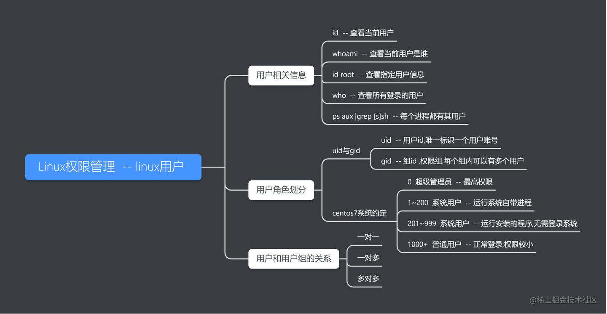
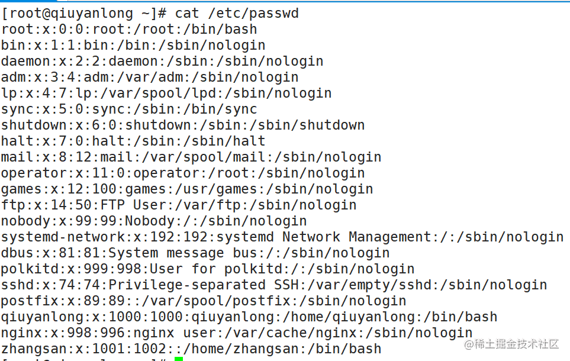
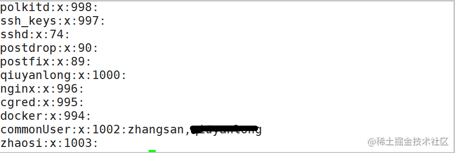

`Linux` 系统是一个多用户多任务的分时操作系统。也就是说同一时刻可能存在多个用户使用不同的权限在同一台服务器上在工作，所以权限至关重要。


# 1: UID 和 GID

每个用户登陆系统的时候，使用的是用户名，但是系统会根据`/etc/passwd`和`/etc/group`文件中的内容，分别找对应的用户名和群组名，然后显示出来。因此对于系统而言，只标识用户`id`。`Linux` 系统中， `ID` 细分为2种，分别是用户`UID（用户id）`和组`GID(组id)`，这与文件有拥有者和拥有群组两种属性相对应。

`UID` 就是一个 `0~65535` 之间的数，不同范围的数字表示不同的用户身份，具体可以参考封面图片上面不同权限对应的不同的范围。

`GID`分为初始组和附加组。每个用户都可以加入多个附加组，但是只能属于一个初始组,一般情况下，用户的初始组就是在建立用户的同时建立的和用户名相同的组。


- **初始组**，指用户登陆时就拥有这个用户组的相关权限。每个用户的初始组只能有一个，通常就是将和此用户的用户名相同的组名作为该用户的初始组。

```shell

 # 创建zhaosi用户，并且设置主页和描述，系统会默认给一个zhaosi的组 
 useradd -d /home/zhaosi -m zhaosi -c "乡村爱情的一个 喜剧演员" 

```

- **附加组**，指用户可以加入多个其他的用户组，并拥有这些组的权限。每个用户只能有一个初始组，除初始组外，用户再加入其他的用户组，这些用户组就是这个用户的附加组。附加组可以有多个，而且用户可以有这些附加组的权限

# 2: 用户组

**用户组** 是具有相同特征用户的逻辑集合，具有相同权限的用户在一个分组里面进行管理。用户组和用户的关系可以是一对多，多对一的。 也就是一个用户可以分属多个分组。

# 3: 主目录

用户登录后有操作权限的访问目录,

```shell
# root的主目录
/root

# anikin的主页
/home/anikin

```

# 4: 默认的shell

`Shell`是 `Linux`的命令解释器，是用户和 `Linux` 内核之间沟通的桥梁。

 用户登陆 `Linux` 系统后，通过使用 `Linux` 命令完成操作任务，但系统只认识类似 0101 的机器语言，这里就需要使用命令解释器。也就是说，`Shell` 命令解释器的功能就是将用户输入的命令转换成系统可以识别的机器语言。

通常情况下，`Linux` 系统默认使用的命令解释器是 `bash（/bin/bash）`，当然还有其他命令解释器，例如 `sh`、`csh` 等。

`/etc/passwd` 文件中，可以把这个字段理解为用户登录之后所拥有的权限。如果这里使用的是 `bash` 命令解释器，就代表这个用户拥有权限范围内的所有权限。例如：

```shell
zhaosi:x:1002:1003:乡村爱情的一个喜剧演员:/home/zhaosi:/bin/bash

#  zhaosi的 Shell 命令解释器修改为 /sbin/nologin，那么，这个用户就不能登录了, 禁止登录的 Shell
zhaosi:x:1002:1003:乡村爱情的一个喜剧演员:/home/zhaosi:/sbin/nologin

```

# 4:etc/passwd

`/etc/passwd`： 系统用户配置文件，存储了系统中所有用户的基本信息，并且所有用户都可以对此文件执行读操作。除了普通用户外还有**系统用户**，系统用户无法用来登录系统，不允许删除。

**用户名：密码：UID（用户ID）：GID（组ID）：描述性信息：主目录：默认Shell**



`"x"` 表示此用户设有密码，但不是真正的密码，真正的密码（加密后的）保存在 `/etc/shadow` 文件中，此文件只有 `root` 用户可以浏览和操作，这样就最大限度地保证了密码的安全。

# 5: etc/group

文件是用户组配置文件，即用户组的所有信息都存放在此文件中。



**组名：密码：GID：该用户组中的用户列表**


到目前为止，我们可以总结下 `liunx` 用户登陆的流程：

- 先在 `/etc/group` 文件中查询用户组的 `GID` 和组名。
- 然后在 `/etc/passwd` 文件中查找该 `GID` 是哪个用户的初始组，同时提取这个用户的用户名和 `UID`。
- 最后通过 `UID` 到 `/etc/shadow` 文件中提取和这个用户相匹配的密码。

# 6: 基本命令

### 1: useradd 
添加新的用户账号: `useradd 选项 用户名`

- `-c` comment 指定一段注释性描述。
- `-d` 目录 指定用户主目录，如果此目录不存在，则同时使用 `-m` 选项，可以创建主目录。
- `-g` 用户组 指定用户所属的用户组。
- `-G` 用户组，用户组 指定用户所属的附加组。
- `-s` Shell文件 指定用户的登录Shell。
- `-u` 用户号 指定用户的用户号，如果同时有-o选项，则可以重复使用其他用户的标识号

```shell
 useradd -d /home/zhaosi -m zhaosi -c "乡村爱情的一个 喜剧演员" 
```

### 2: userdel

删除账户，`userdel 选项 用户名`。

- -r，它的作用是把用户的主目录一起删除。

```shell
userdel -r zhaosi
```

### 3: usermod

修改用户账号就是根据实际情况更改用户的有关属性，如 **用户号、主目录、用户组、登录Shell**等。
常用的选项包括 -c, -d, -m, -g, -G, -s, -u 以及-o等，这些选项的意义与`useradd`命令中的选项一样，可以为用户指定新的资源值。

- `-l` 新用户名

```js
usermod -g commonUser -l wangwu_01 wangwu 

# 查询wangwu_01 的信息
id wangwu_01

# 查询root的信息
id root

```
### 4: passwd 
用户管理的一项重要内容是用户口令 **(密码)** 的管理。用户账号刚创建时没有口令，但是被系统锁定，无法使用，必须为其指定口令后才可以使用，即使是指定空口令。

超级用户可以为自己和其他用户指定口令，普通用户只能用它修改自己的口令。命令的格式为：`passwd 选项 用户名`

- -l 锁定（lock）口令，即禁用账号,封禁。
- -u 口令解锁。
- -d 使账号无口令。
- -f 强迫用户下次登录时修改口令。

`passwd` 命令会先询问原口令，验证后再要求用户输入两遍新口令，如果两次输入的口令一致，则将这个口令指定给用户。而`root`为用户指定口令时，就不需要知道原口令。

```js
# root 为其他用户设置口令
passwd wangwu_01 

# 清除掉 wangwu_01的密码，下次登陆不需要密码
passwd -d wangwu_01

```

### 5: groupadd

增加一个新的用户组使用 `groupadd`命令: **groupadd 选项 用户组**
- `-g` `GID` 指定新用户组的组标识号`（GID）`。
- `-o` 一般与-g选项同时使用，表示新用户组的`GID`可以与系统已有用户组的`GID`相同。

```shell
# 新增一个组，指定gid为 2000 名称是baidu
groupadd -g 2000 baidu

cat /etc/group
```

### 5: groupdel 

删除组： **groupdel 用户组**

### 6: groupmod 

修改组属性：**groupmod 选项 用户组**

- -g GID 为用户组指定新的组标识号。
- -o 与-g选项同时使用，用户组的新GID可以与系统已有用户组的GID相同。
- -n新用户组 将用户组的名字改为新名字

```js
groupmod -g 102 group2
```
### 7: gpasswd

`Linux gpasswd` 是 `Linux` 下工作组文件 `/etc/group` 和 `/etc/gshadow` 管理工具，用于将一个用户添加到组或者从组中删除。

`gpasswd [可选项] 组名`

- -`a`：添加用户到组；
- -`d`：从组删除用户；
- -`A`：指定管理员；
- -`M`：指定组成员和-A的用途差不多；
- -`r`：删除密码；
- -`R`：限制用户登入组，只有组中的成员才可以用newgrp加入该组。

```
gpasswd -a $USER docker

```

### 8:newgrp
`Linux newgrp` 命令用于登入另一个群组。

`newgrp` 指令类似 `login` 指令，当它是以相同的帐号，另一个群组名称，再次登入系统。欲使用 `newgrp` 指令切换群组，您必须是该群组的用户，否则将无法登入指定的群组。单一用户要同时隶属多个群组，需利用交替用户的设置。若不指定群组名称，则 `newgrp` 指令会登入该用户名称的预设群组。

```
newgrp root 
newgrp docker 
```


