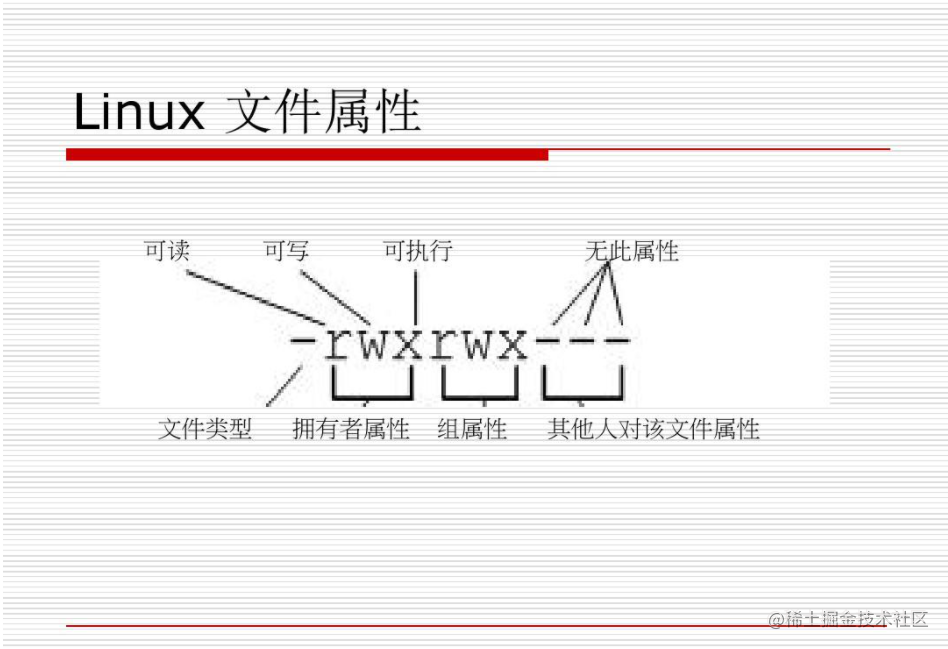
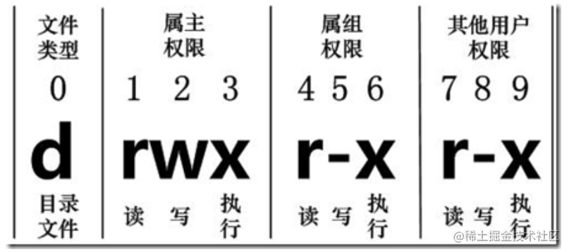
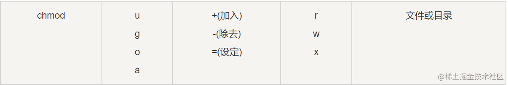

`Linux` 系统是一种典型的多用户系统，不同的用户处于不同的地位，拥有不同的权限。为了保护系统的安全性，`Linux` 系统对不同的用户访问同一文件（包括目录文件）的权限做了不同的规定。

在 Linux 中我们通常使用以下两个命令来修改文件或目录的所属用户与权限：

- `chown` (change ownerp) ： 修改所属用户与组。
- `chmod` (change mode) ： 修改用户的权限。

```shell
[wangwu_01@zhangsan ~]$ ls -l 
总用量 0
-rw-r--r--. 1 wangwu_01 commonUser 0 7月  12 21:50 index.js
drwxr-xr-x. 2 wangwu_01 commonUser 6 7月  12 21:50 web
```



### 文件类型

- 当为 `d` 则是目录
- 当为 `-` 则是文件；
- 若是 `l` 则表示为链接文档(link file)；
- 若是 `b` 则表示为装置文件里面的可供储存的接口设备(可随机存取装置)；
- 若是 `c`则表示为装置文件里面的串行端口设备，例如键盘、鼠标(一次性读取装置)。

### 权限

- 第 `1、4、7` 位表示读权限，如果用 `r `字符表示，则有读权限，如果用 `- `字符表示，则没有读权限

- 第 `2、5、8` 位表示写权限，如果用` w`字符表示，则有写权限，如果用 `-` 字符表示没有写权限；

- 第 `3、6、9` 位表示可执行权限，如果用 `x `字符表示，则有执行权限，如果用 `-` 字符表示，则没有执行权限。

### 属主和属组

对于文件来说，它都有一个特定的所有者，也就是对该文件具有所有权的用户。

```shell
[root@www /]# ls -l
drwxr-xr-x 3 mysql mysql 4096 Apr 21  2014 mysql
```
`mysql`文件是一个目录文件，属主和属组都为 `mysql`，属主有可读、可写、可执行的权限；与属主同组的其他用户有可读和可执行的权限；其他用户也有可读和可执行的权限。

### 更改文件属性

#### 1: chgrp (change group)

`chgrp`允许普通用户改变文件所属的组，只要该用户是该组的一员。
否则权限都是`root`。

格式： **chgrp [-R] 属组名 文件名**

- `-R`：递归更改文件属组，就是在更改某个目录文件的属组时，如果加上-R的参数，那么该目录下的所有文件的属组都会更改。


```js
# 修改index.js 文件的组为baidu
chgrp baidu index.js
```
#### 2: chown
`chown`：更改文件属主，也可以同时更改文件属组。

**chown [–R] 属主名 文件名**

**chown [-R] 属主名：属组名 文件名**

```shell
chown baidu index.js
```

#### 3: chmod

`Linux`文件属性有两种设置方法: **一种是数字，一种是符号**。

`Linux` 文件的基本权限就有九个，分别是 `owner/group/others`(拥有者/组/其他) 三种身份各有自己的 `read/write/execute` 权限。

##### 使用数字代表权限：

- `r`:4
- `w`:2
- `x`:1
- `-`:0 

每种身份各自的三个权限(r/w/x)分数是需要累加的，例如当权限为： `- rwx rwx ---` 分数则是：

**owner** = `rwx` = 4+2+1 = 7

**group** = `rwx` = 4+2+1 = 7

**others**= `---` = 0+0+0 = 0

语法： **chmod [-R] xyz 文件或目录**

```js
chmod 777 .bashrc
```

##### 符号类型改变文件权限

- **u** : `user`：用户
- **g**: `group`：组
- **o**: `others`：其他





```js
chmod u=rwx,g=rx,o=r  test1    // 修改 test1 权限

chomd +x index.js

chmod -r log.txt

chmod -R +wrx web
```


