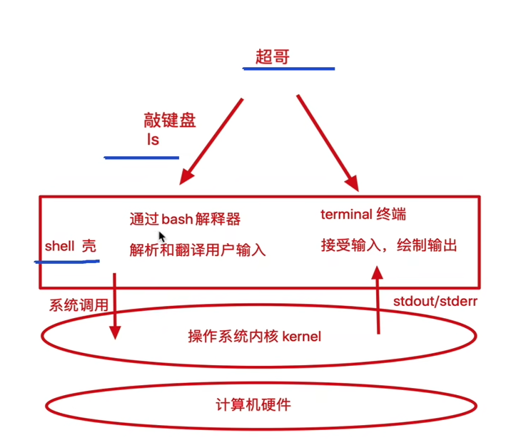
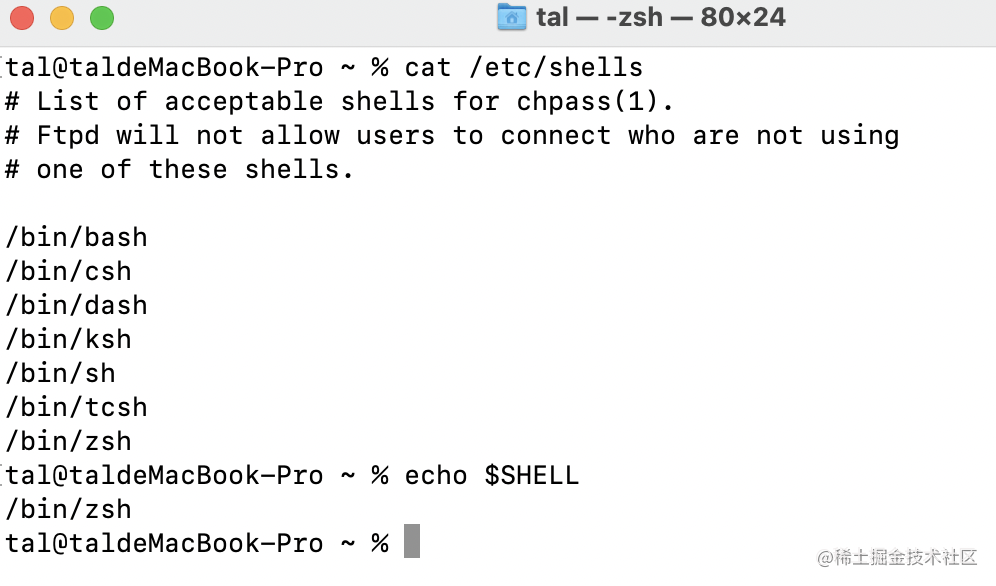
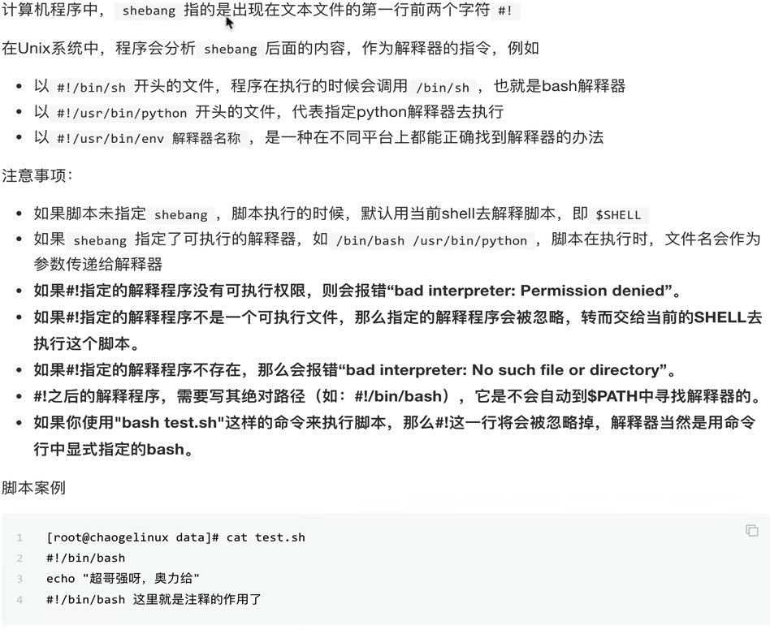
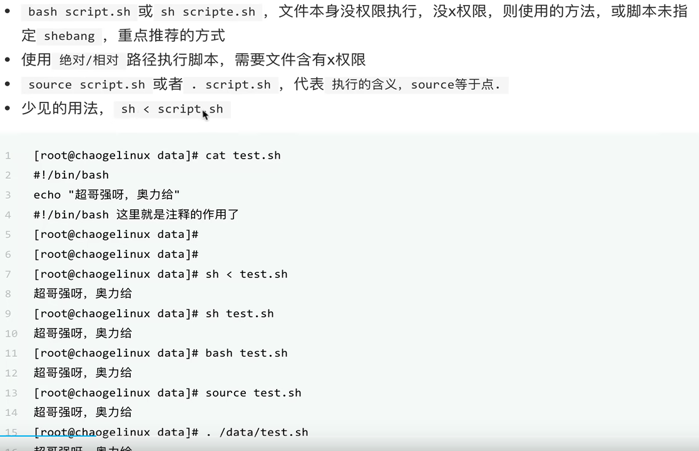
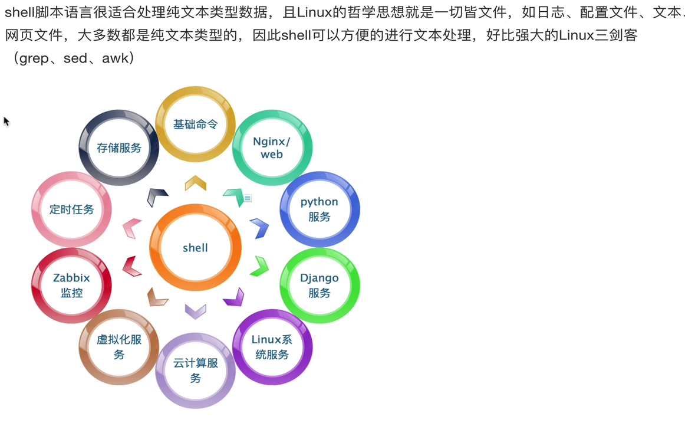
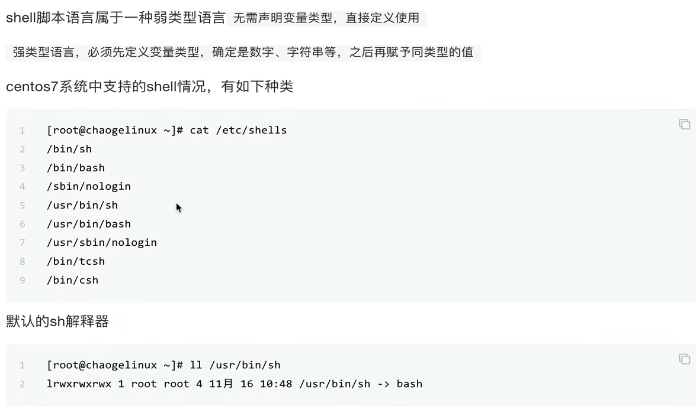
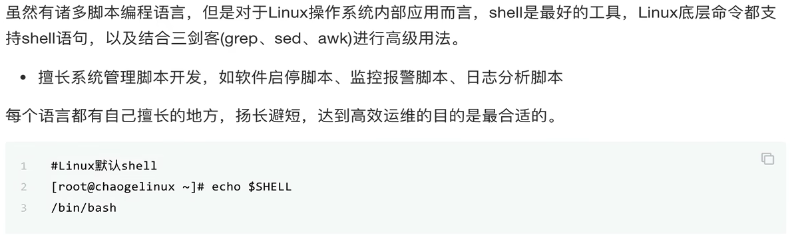
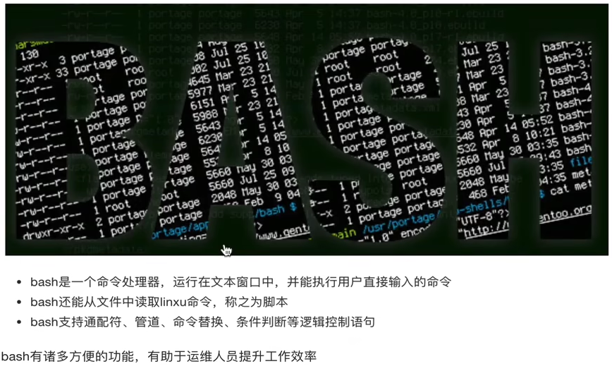
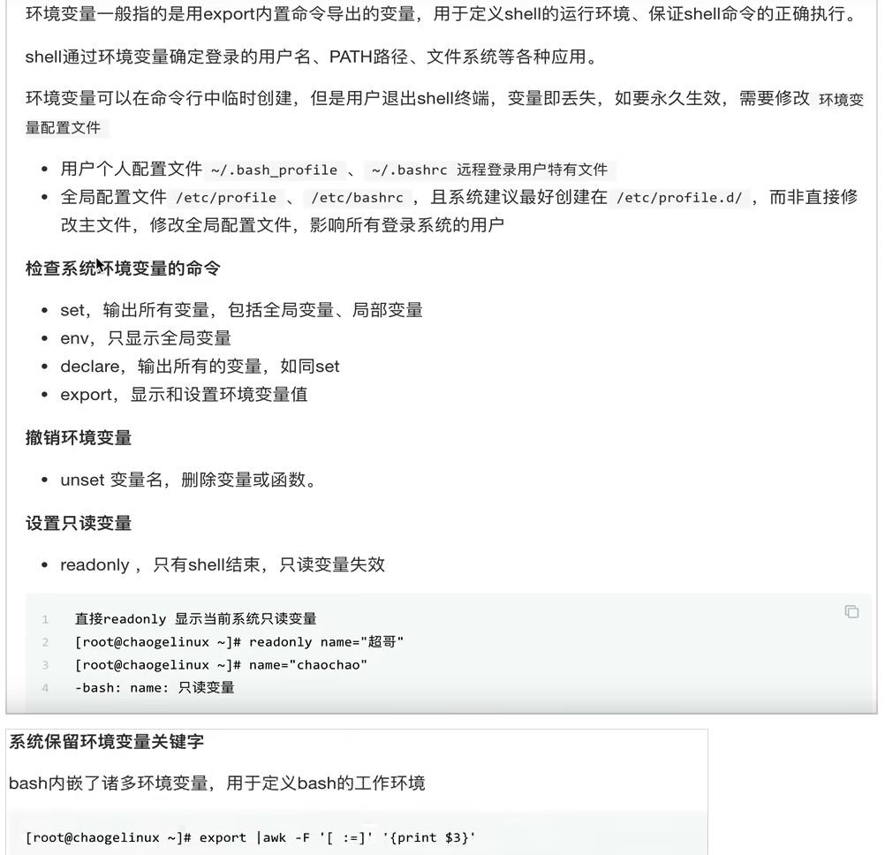

> 前端开发过程中，工程批处理脚本，定时脚本，以及部署服务器的一些脚本，如果使用`nodejs`来书写，那就默认依赖了`node`开发环境，但是可能需要的这些本身其实跟`node`没关系，`php\python`等、都一样。因此想到了`shell`脚本，这个底层内核编译的脚本语言，特此全面熟悉和了解一下。


[前置需要了解的bash和shell的区别](https://www.zhihu.com/question/328533621)

# 1：shell 是什么？
`Shell` 翻译过来为壳,就是一个套在操作系统外层的壳,将用户的命令解析为内核可以执行的命令，起到命令**解释的作用**，是用户与操作系统直接的一个桥梁纽带。`Shell` 脚本由于其作为直接与 Linux 系统交互，在批量 / 定时任务中有着独特无可取代的作用。

 > 其实就是一段c语言的代码，被解释执行了。

- 解释执行用户输入的命令或者程序
- 用户输入一条命令，shell就解释一条
- 键盘输入命令，linux给与响应的方式，称为交互式。


执行流程：



目前在 `Linux` 系统上主流的 `CLI Shell` 都为 `Bash`，是许多 `Linux` 发行版默认的 `Shell`。我们可以在 `Linux` 系统上执行 `cat /etc/shells `来查看本版本支持的各 `Shell` 类型，同时可以利用命令 `echo $SHELL` 来查看当前环境中的默认 Shell.


从上图可以看出`mac`下的支持类型非常的多。


#### 1：**常见的解释器：**
- `bash`: `Bash`是`Bourne shell`的替代品，属`GNU Project`，二进制文件路径通常是`/bin/bash`。业界通常混用`bash`、`sh`、和`shell`。
- `sh`:标准的`shell`解释器，它的二进制文件路径通常是`/bin/sh`


#### 2：**执行环境**：
当前主流的操作系统都支持`shell`编程，是POSIX标准下的功能，所以，也适用于Unix及BSD（如Mac OS）。
- `Linux`: `Linux`默认安装就带了`shell`解释器。
- `Mac OS`:`Mac OS`不仅带了`sh`、`bash`这两个最基础的解释器，还内置了`ksh`、`csh`、`zsh`等不常用的解释器。
- `Windows上的模拟器`: `git bash`。

#### 3：**常见应用场景：**：
- 应用安装：`Shell` 脚本适用于重复性的工作，eg:安装配置一些软件或配置环境，重复使用。
- 定时任务：`Shell` 脚本非常适用于周期性的工作；
- 应用操作：例如我们自己写的应用，可以为其编写启动 / 停止 / 重启等操作的脚本，将脚本添加进系统环境中，后期很方便进行服务管理；
- 备份恢复：可以利用脚本来进行网站文件或数据库的异地备份，以及恢复到测试环境进行验证等；
- CI/CD: `Shell` 脚本适用于 `DevOPS` 中的在服务器中持续集成持续部署的 `pipeline` 流程中，适用于应用发布最后一公里配置。
  


####  4: **Shebang**
  


#### 5: 执行shell 脚本的方式


- 直接在终端指定脚本文件名称方式执行，此种方式需要为脚本添加可执行权限，在当前`Shell` 来执行，不启动子 `Shell`，`chmod +x test.sh `,如果直接在控制台运行就会报错 `permission denied`。
- 命令来执行脚本，一般用在当前目录没有在 `PATH` 中，所以第二个`./ `是用来表示当前目录的,eg: `. ./banner.sh`。
- 直接`source` 执行，指定编译器: `bash ./banner.sh`


```bash
bash -x banner.sh
```
注意： 
- `source` 或者 `.` 是在当前`shell`环境下加载脚本，保留环境变量
- 每次调用`bash`都会开启一个新的子shell。

面试题：

```shell
cat test.sh
user1=`whoami`

sh test.sh
echo $user1 #执行结果为空，如果是source的话就会有值
```
#### 6: shell 和运维

linux shell 命令远比其他要高效很多，因为是c语言开发的。



#### 7: 脚本语言
弱类型，默认都是字符串


#### 8: shell 的优势


#### 9: bash



history 命令

```bash
history
echo $HISTSIZE
echo $HISTFFILE
ls -a ~/.bash_histroy 
# /root/.bash_histroy

history 
-c 清空内存中历史命令
-r 从文件中恢复历史命令


!n #n是历史编号 指针执行这个命令
!! #执行上一次的命令，
```

# 2：开始shell编程之旅
#### 1：基础规范
- 一般是`.sh`作为后缀名。也可以 `/bin/php test.php`。扩展名对于执行没有影响。
- 第一行需要有指明解释器，例如 `#!/bin/bash`, 但是这种方式存在一定的局限性，我们推荐使用 `env` 环境变量中的 `bash`，推荐使用这种方式`#!/usr/bin/env bash`。 

可以`which node` 查看一下`node`的`path`路径设置。

比如：`hello.node /hello.sh`文件

```shell
    #!/usr/bin/env node
    console.log(process.execPath);  // 输出/usr/local/bin/node
    console.log(1);
```
> #! /usr/bin node 和#! /usr/bin/env node两者的区别
`!/usr/bin/node`： 是告诉操作系统执行这个脚本的时候，调用`/usr/bin`下的node解释器，写死了路径。
`!/usr/bin/env node`: 这种用法是为了防止操作系统用户没有将`node`装在默认的`/usr/bin`路径里。当系统看到这一行的时候，首先会到`env`设置里查找`node`的安装路径，再调用对应路径下的解释器程序完成操作。**会去环境设置寻找node目录,推荐这种写法**。


#### 4: bash 常见符号和工具以及快捷键

- **分号（;）** 是命令的结束符，使得一行可以放置多个命令，上一个命令执行结束后，再执行第二个命令。
`clear;ls -l`,不管`clear`执行成功与否，都会执行后面的`ls -l`。

- **&&** 必须前者执行成功才会执行后者。`cat filelist.txt && ls -l filelist.txt`

- **||**, `mkdir foo || mkdir bar`只有前面的执行失败了才会执行后面的。

- `type`:  `Bash`本身内置了很多命令，同时也可以执行外部程序。怎么知道一个命令是内置命令，还是外部程序呢？

```js
$ type echo  # echo is a shell builtin
$ type type  # type is a shell builtin
```
- 组合快捷键：
    - `Ctrl + U`：从光标位置删除到行首。
    - `Ctrl + K`：从光标位置删除到行尾。
    - `Ctrl + A`：将光标移动到头，对应`E`就是尾部。
    - Bang (!) 命令: `!!`：执行上一条命令, `!cc`：执行最近的以cc开头的命令，如!l会执行ls命令


#### 5: 变量
##### 5.0： 环境变量

```shell
    BASHPID：Bash 进程的进程 ID。
    BASHOPTS：当前 Shell 的参数，可以用shopt命令修改。
    HOME：用户的主目录。
    HOST：当前主机的名称。
    IFS：词与词之间的分隔符，默认为空格。
    PATH：由冒号分开的目录列表，当输入可执行程序名后，会搜索这个目录列表。
    PS1：Shell 提示符。
    PS2： 输入多行命令时，次要的 Shell 提示符。
    PWD：当前工作目录。
    RANDOM：返回一个0到32767之间的随机数。
    SHELL：Shell 的名字。
    SHELLOPTS：启动当前 Shell 的set命令的参数，参见《set 命令》一章。
    UID：当前用户的 ID 编号。
    USER：当前用户的用户名。
```
例如下面的脚本获取用户信息：

```js
    #!/bin/bash
    echo "当前登录系统用为:  ${USER}"
    echo "当前登录系统时间:  $(date +"%Y-%m-%d %H:%M:%S")"
    echo "当前登录系统Shell: ${SHELL}"
    echo "当前用户家目录为:  ${HOME}"
```

##### 5.1： 环境变量设置


`.bash_profile` 在每次登录的时候都会初始化，是当前用户的环境变量。是先执行这个，再执行`.bashrc`。

`.bash_profile` 文件添加
```sh
export name='anikin';
source .bash_profile;
echo $name; #anikin
```

##### 5.2: 自定义变量
###### 5.2.1 命名规则：
 - 字母、数字和下划线字符组成。
 - 第一个字符必须是一个字母或一个下划线，不能是数字。
 - **不允许出现空格和标点符号，包含空格必须在双引号中**。`NAME="hello shell"`.
 - `bash`中的所有变量都是字符串。
 - 严格区分大小写
 - 见名知意
 - 双引号变量会识别特殊语法
 - 默认全部是字符串，尽量全部加上引号
 
```bash
a=z                     # 变量 a 赋值为字符串 z
b="a string"            # 变量值包含空格，就必须放在引号里面
c="a string and $b"     # 变量值可以引用其他变量的值
d="\t\ta string\n"      # 变量值可以使用转义字符
e=$(ls -l foo.txt)      # 变量值可以是命令的执行结果
```
变量的作用域只在当前的`shell`下执行，切换`shell`变量会消失。


###### 5.2.2 查看变量

set命令可以显示所有变量（包括环境变量和自定义变量），以及所有的 `Bash` 函数。

#### 6 参数：

##### 6.1 普通参数
`$n`。**n**  代表一个数字。例如传递给脚本的第一个参数就为 `$1`，第 2 个参数就为 `$2`, 以此类推……，其中 `$0` 为该脚本的名称。eg:脚本`argu.sh`。

```bash
#!/bin/bash
echo "第一个参数是: $1"
echo "第一个参数是: $2"
echo "脚本名称是: $0"
```
运行结果是：

```bash
第一个参数是: python
第一个参数是: node
脚本名称是: argu.sh
```
##### 6.2 特殊参数

- `$#`传递给脚本或函数的**参数个数总和**。
- `$*`所有参数，被双`" "`包含时，所有的参数被当做一个参数。
- `$@`所有参数，被双`" "`包含时，每个位置参数被看做独立的参数。
- `$?`上个命令的退出状态，或函数的返回值，`0`为执行成功，非`0`则为执行失败，一般在脚本判断。
- `$$`当前`Shell`进程`ID`。对于`Shell`脚本，就是这些脚本所在的进程 `ID`。

```bash
#!/bin/bash

echo "第一个参数是: $1"
echo "第一个参数是: $2"
echo "脚本名称是: $0"
echo "脚本接受参数总数为: $#"

curl -I baidu.com
echo "运行命令的状态为：$?"

echo "脚本的的id是: $$"

echo '脚本{$*}的结果是:'${*}
for i in "$*"; do
    echo $i
done

echo "脚本\$@的结果是:"
for j in "$@"; do
    echo $j
done
```


