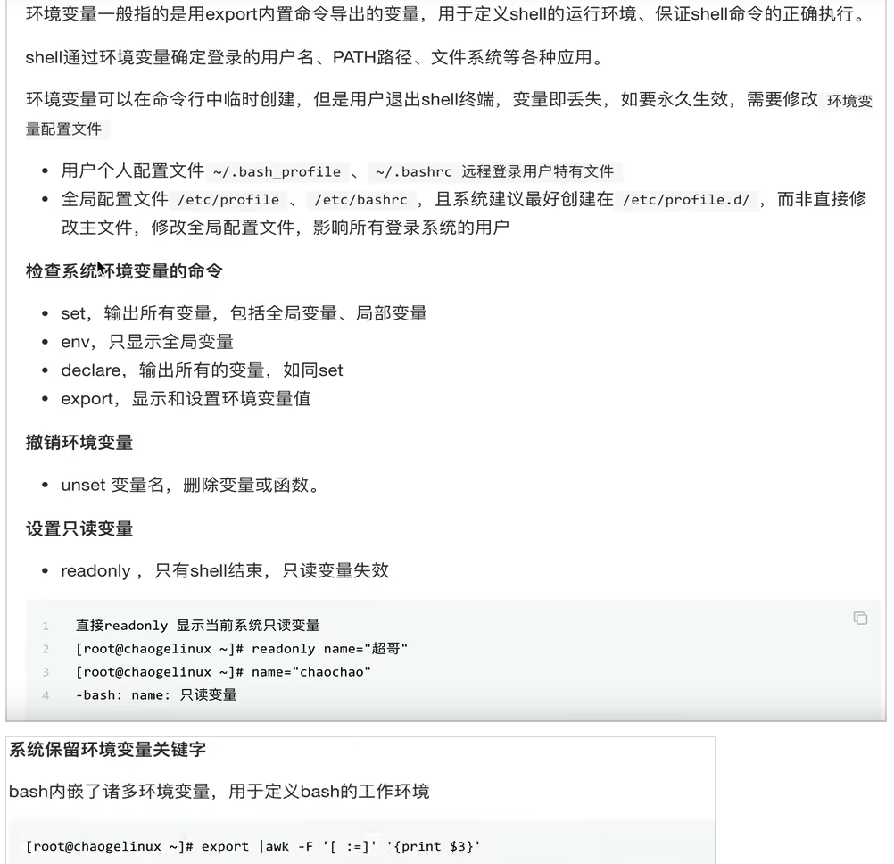
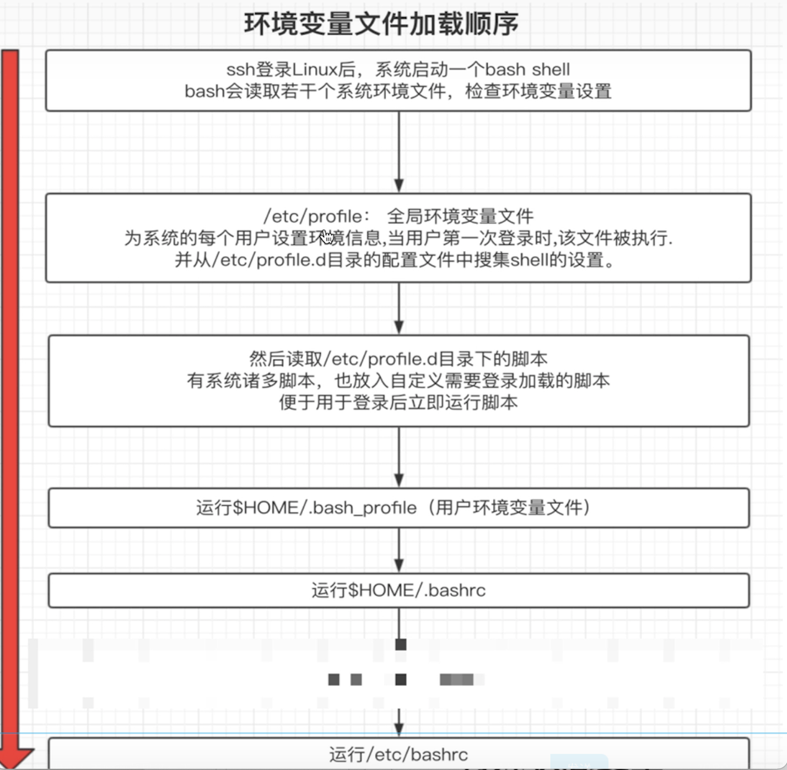
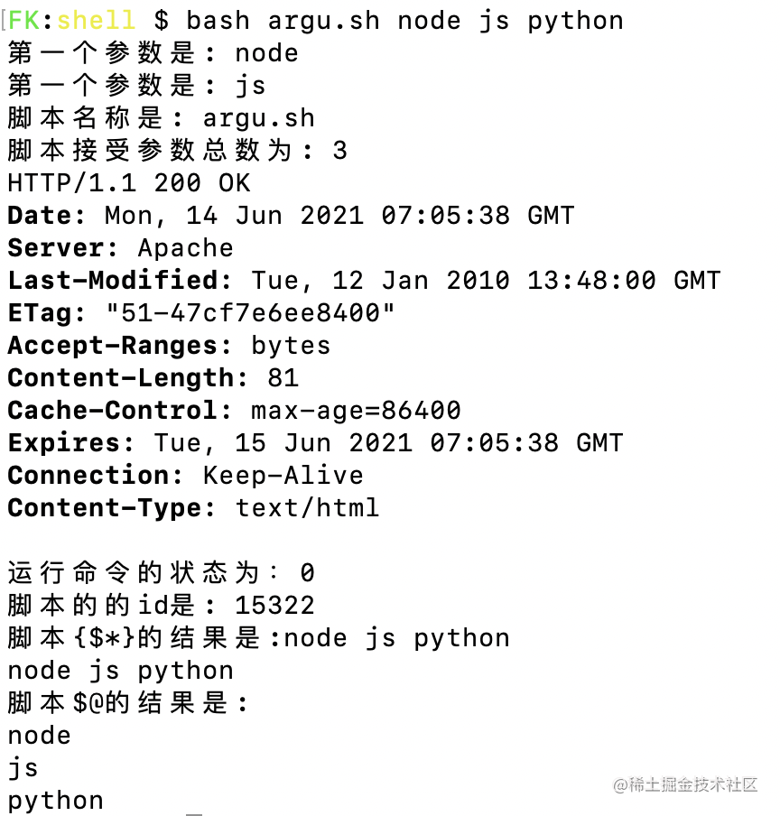
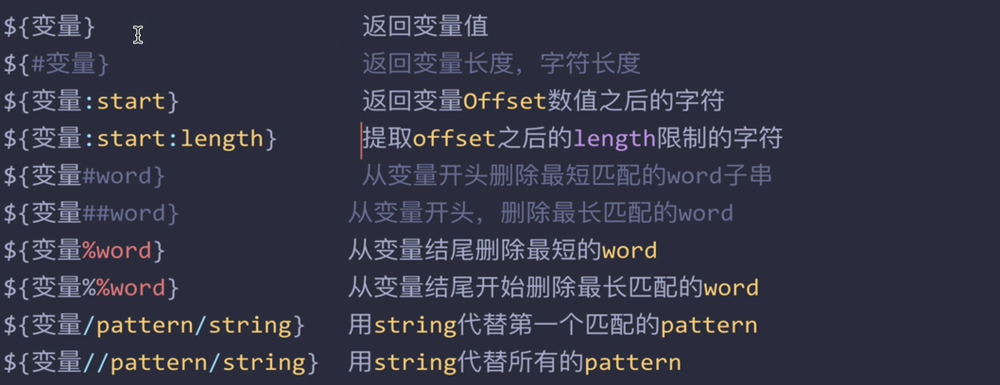

# 变量


## 环境变量

```bash
    BASHPID：Bash 进程的进程 ID。
    BASHOPTS：当前 Shell 的参数，可以用shopt命令修改。
    HOME：用户的主目录。
    HOST：当前主机的名称。
    IFS：词与词之间的分隔符，默认为空格。
    PATH：由冒号分开的目录列表，当输入可执行程序名后，会搜索这个目录列表。
    PS1：Shell 提示符。
    PS2： 输入多行命令时，次要的 Shell 提示符。
    PWD：当前工作目录。
    RANDOM：返回一个0到32767之间的随机数。
    SHELL：Shell 的名字。
    SHELLOPTS：启动当前 Shell 的set命令的参数，参见《set 命令》一章。
    UID：当前用户的 ID 编号。
    USER：当前用户的用户名。
```
例如下面的脚本获取用户信息：

```js
    #!/bin/bash
    echo "当前登录系统用为:  ${USER}"
    echo "当前登录系统时间:  $(date +"%Y-%m-%d %H:%M:%S")"
    echo "当前登录系统Shell: ${SHELL}"
    echo "当前用户家目录为:  ${HOME}"
```

### 环境变量设置

<div align='center'></div>

加载顺序

<div align='center'></div>


## 自定义变量

### 命名规则：
 - 字母、数字和下划线字符组成。
 - 第一个字符必须是一个字母或一个下划线，不能是数字。
 - **不允许出现空格和标点符号，包含空格必须在双引号中**。`NAME="hello shell"`.
 - `bash`中的所有变量都是字符串。
 - 严格区分大小写,见名知意
 - 双引号变量会识别特殊语法
 - 默认全部是字符串，尽量全部加上引号
 - 反引号，引用命令执行结果，等于$()
 
```bash
a=z                     # 变量 a 赋值为字符串 z
b="a string"            # 变量值包含空格，就必须放在引号里面
c="a string and $b"     # 变量值可以引用其他变量的值
d="\t\ta string\n"      # 变量值可以使用转义字符
e=$(ls -l foo.txt)      # 变量值可以是命令的执行结果
```
变量的作用域只在当前的`shell`下执行，切换`shell`变量会消失,除了全局变量


###  普通参数
`$n`。**n**  代表一个数字。例如传递给脚本的第一个参数就为 `$1`，第 2 个参数就为 `$2`, 以此类推……，其中 `$0` 为该脚本的名称。eg:脚本`argu.sh`。

```bash
#!/bin/bash
echo "第一个参数是: $1"
echo "第一个参数是: $2"
echo "脚本名称是: $0"
```
### 特殊变量

主要用在脚本开发中，函数传递的参数使用，有如下特殊的位置 ， 变数变量


- `$0` 获取shell脚本文件名，以及脚本路径
- `$n` n(1-9) 从1-9开始传递参数
- `$#`传递给脚本或函数的**参数个数总和**。
- `$?`上个命令的退出状态，或函数的返回值，`0`为执行成功，非`0`则为执行失败，一般在脚本判断。
- `$$`当前`Shell`进程`ID`。对于`Shell`脚本，就是这些脚本所在的进程 `ID`。


这俩一般是相同的结果，唯一不同的就是
- `$*`所有参数，被双`" "`包含时，所有的参数被当做一个参数。
- `$@`所有参数，被双`" "`包含时，每个位置参数被看做独立的参数。


```bash
#!/bin/bash

echo "第一个参数是: $1"
echo "第一个参数是: $2"
echo "脚本名称是: $0"
echo "脚本接受参数总数为: $#"

curl -I baidu.com
echo "运行命令的状态为：$?"

echo "脚本的的id是: $$"

echo '脚本{$*}的结果是:'${*}
for i in "$*"; do
    echo $i
done

echo "脚本\$@的结果是:"
for j in "$@"; do
    echo $j
done
```

<div align='center'></div>


## 子串

- echo -e 参数格式输出
  ```Bash
  echo -e "Hello\nWorld"
    #Hello
    #World
  ```
- eval:Eval 执行多命令 `eval ls;cd /user`
- exec
- export
- read
- shift


> 怎么让程序在后台执行  nohub xxx &  1 > /dev/null   日志重定向到黑洞文件中的命令


### 特殊子串
<div align='center'></div>

获取串长度的几种方法：
```bash
echo $name |  wc -L
expr length ${name}
echo 'this is a test' | awk '{print length($0)}'
echo ${#name} # 性能最好的
# 统计时间 realtime 表示真是时间
time for n in {1..10000}; do echo $n; done;`
# 生成1-10的随机序列
seq 10;
```
内置命令效果更加高效。

```bash
# 
echo ${name2#a*a}
echo $name2
echo ${name2##a*a}

# 严格匹配开头和结尾
echo ${name/anikin/jack}
```

### 字符串的处理
- ${param:-word} 如果param 为空，返回world
- ${param:=word} 如果param 为空，则world替代变量值，返回
- ${param:?word} 如果param 为空，world当做标准输出，否则将word设置错误信息
- ${param:+word} 如果param 为空，什么都不做，否则返回world

案例：

```bash
#! /bin/bash

# 以下两个都是 有值等于自己 否则等于给定的值 只是=也会给变量赋值
change="origin data"
result=${change:-no change data}
echo $result

unset change
result=${change:=no change data}
echo $result; echo $change;

# :? 处理错误使用的 当变量值为空的时候主动抛出错位
# stdout code = 1
# stderr code = 2

echo ${new_name}
echo ${new_name:?该变量值为空}

# :+ 变量为空什么都不做，否则字符返回给接受者
new_name="has value!"
result2=${new_name:+last value is 100}
echo $result2; 
```

```bash
#! /bin/bash
# 如果变量名不存在，进行兼容
getText=`grep "^#" names.txt -v  | grep "^$" -v`
echo $getText
```

文件名批量替换
```bash
touch fk_{1..5}_face.jpg
touch fk_{1..5}_face.png

# ls *.jpg *.png
# ls *_face.jpg *_face.png
str=`ls | grep fk`;  

for i in $str;
 do newName=`echo ${i//_face/}`; # 全局匹配的方式  
  mv $i $newName;  
done;
```

