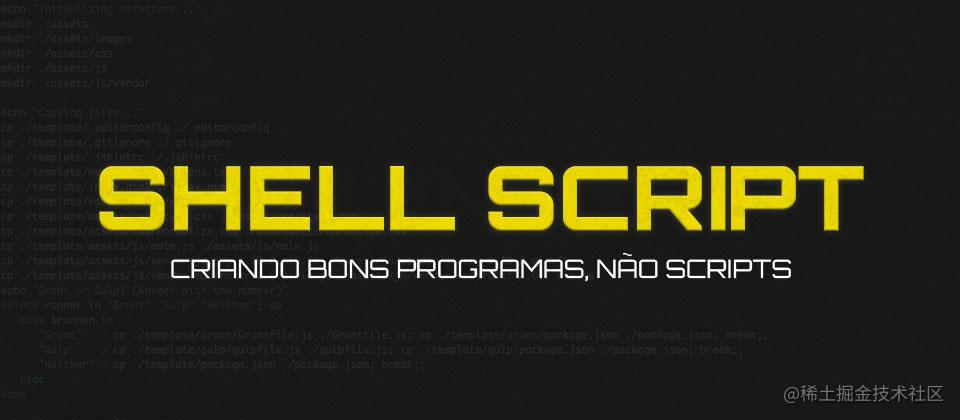
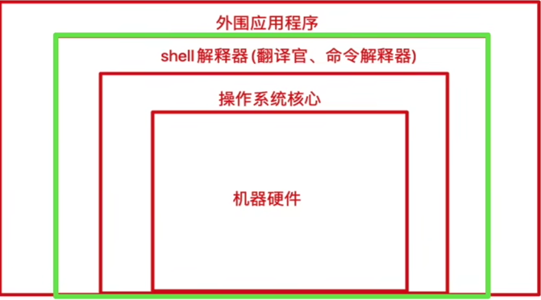
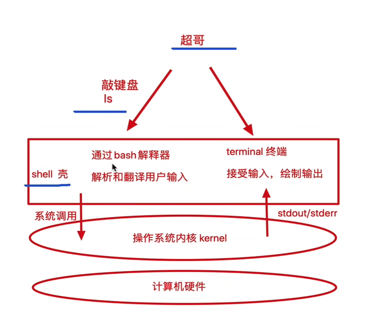
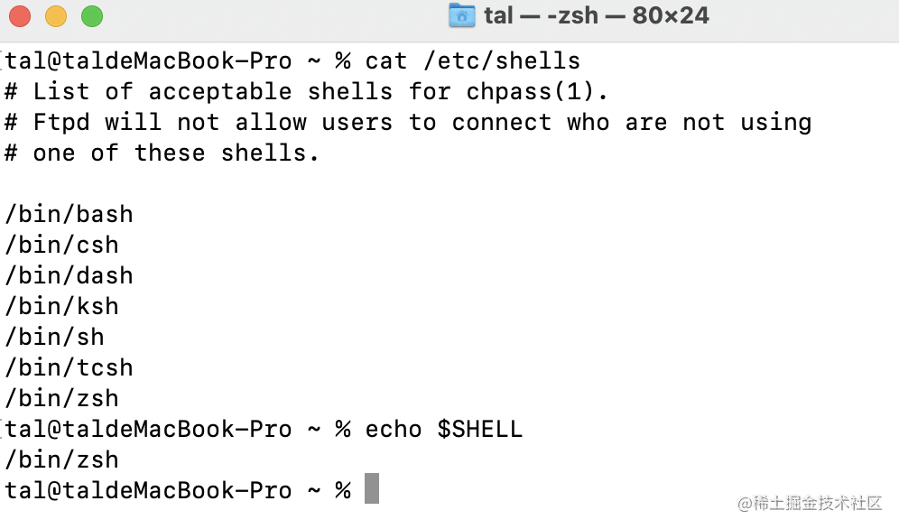
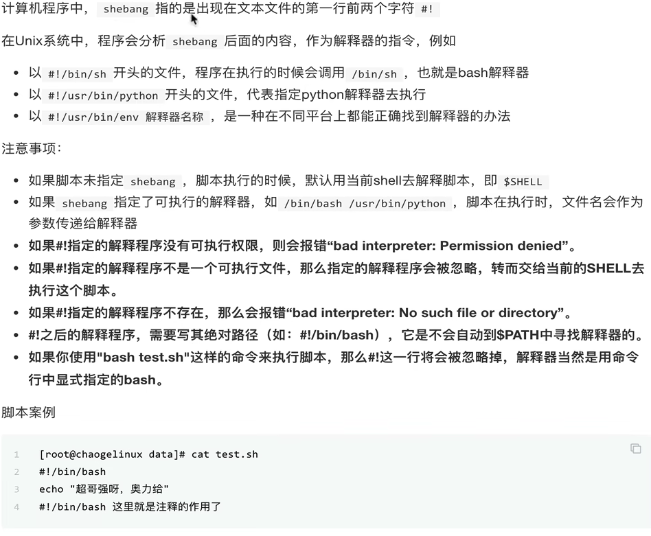
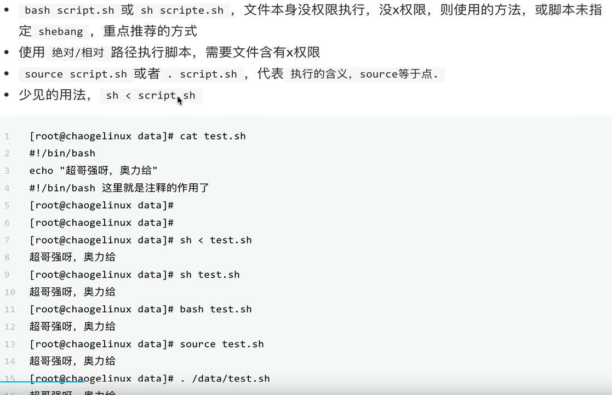
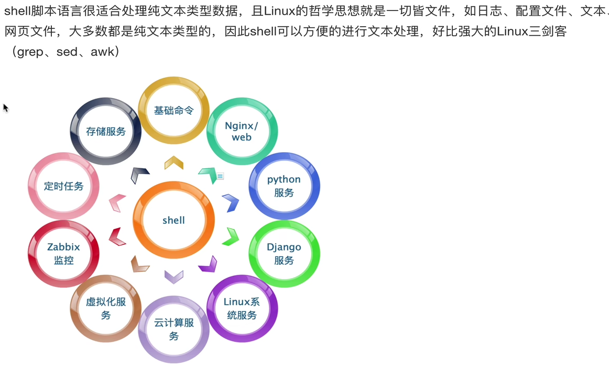
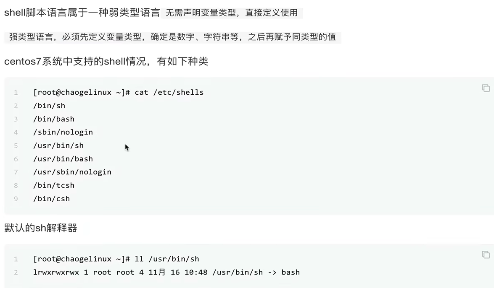
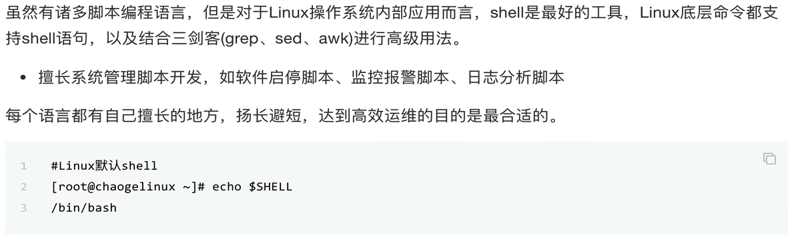
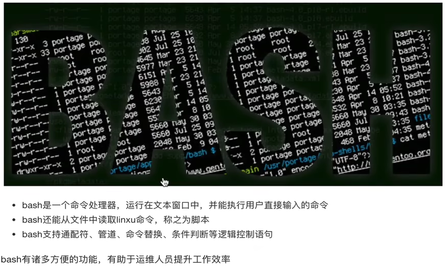

> 前端开发过程中，工程批处理脚本，定时脚本，以及部署服务器的一些脚本，如果使用`nodejs`来书写，那就默认依赖了`node`开发环境，但是可能需要的这些本身其实跟`node`没关系，`php\python`等、都一样。因此想到了`shell`脚本，这个底层内核编译的脚本语言，特此全面熟悉和了解一下。


[前置需要了解的bash和shell的区别](https://www.zhihu.com/question/328533621)


# 1：shell 是什么？
`Shell` 翻译过来为壳,就是一个套在操作系统外层的壳,将用户的命令解析为内核可以执行的命令，起到命令**解释的作用**，是用户与操作系统直接的一个桥梁纽带。`Shell` 脚本由于其作为直接与 Linux 系统交互，在批量 / 定时任务中有着独特无可取代的作用。

 > 其实就是一段c语言的代码，被解释执行了。

- 解释执行用户输入的命令或者程序
- 用户输入一条命令，shell就解释一条
- 键盘输入命令，linux给与响应的方式，称为交互式。



执行流程：



目前在 `Linux` 系统上主流的 `CLI Shell` 都为 `Bash`，是许多 `Linux` 发行版默认的 `Shell`。我们可以在 `Linux` 系统上执行 `cat /etc/shells `来查看本版本支持的各 `Shell` 类型，同时可以利用命令 `echo $SHELL` 来查看当前环境中的默认 Shell.


从上图可以看出`mac`下的支持类型非常的多。


#### 1：**常见的解释器：**
- `bash`: `Bash`是`Bourne shell`的替代品，属`GNU Project`，二进制文件路径通常是`/bin/bash`。业界通常混用`bash`、`sh`、和`shell`。
- `sh`:标准的`shell`解释器，它的二进制文件路径通常是`/bin/sh`


#### 2：**执行环境**：
当前主流的操作系统都支持`shell`编程，是POSIX标准下的功能，所以，也适用于Unix及BSD（如Mac OS）。
- `Linux`: `Linux`默认安装就带了`shell`解释器。
- `Mac OS`:`Mac OS`不仅带了`sh`、`bash`这两个最基础的解释器，还内置了`ksh`、`csh`、`zsh`等不常用的解释器。
- `Windows上的模拟器`: `git bash`。

#### 3：**常见应用场景：**：
- 应用安装：`Shell` 脚本适用于重复性的工作，eg:安装配置一些软件或配置环境，重复使用。
- 定时任务：`Shell` 脚本非常适用于周期性的工作；
- 应用操作：例如我们自己写的应用，可以为其编写启动 / 停止 / 重启等操作的脚本，将脚本添加进系统环境中，后期很方便进行服务管理；
- 备份恢复：可以利用脚本来进行网站文件或数据库的异地备份，以及恢复到测试环境进行验证等；
- CI/CD: `Shell` 脚本适用于 `DevOPS` 中的在服务器中持续集成持续部署的 `pipeline` 流程中，适用于应用发布最后一公里配置。
  


####  4: **Shebang**
  


#### 5: 执行shell 脚本的方式


- 直接在终端指定脚本文件名称方式执行，此种方式需要为脚本添加可执行权限，在当前`Shell` 来执行，不启动子 `Shell`，`chmod +x test.sh `,如果直接在控制台运行就会报错 `permission denied`。
- 命令来执行脚本，一般用在当前目录没有在 `PATH` 中，所以第二个`./ `是用来表示当前目录的,eg: `. ./banner.sh`。
- 直接`source` 执行，指定编译器: `bash ./banner.sh`


```bash
bash -x banner.sh
```
注意： 
- `source` 或者 `.` 是在当前`shell`环境下加载脚本，保留环境变量
- 每次调用`bash`都会开启一个新的子shell。

面试题：

```shell
cat test.sh
user1=`whoami`

sh test.sh
echo $user1 #执行结果为空，如果是source的话就会有值
```
#### 6: shell 和运维

linux shell 命令远比其他要高效很多，因为是c语言开发的。



#### 7: 脚本语言
弱类型，默认都是字符串


#### 8: shell 的优势


#### 9: bash



history 命令

```bash
history
echo $HISTSIZE
echo $HISTFFILE
ls -a ~/.bash_histroy 
# /root/.bash_histroy

history 
-c 清空内存中历史命令
-r 从文件中恢复历史命令


!n #n是历史编号 指针执行这个命令
!! #执行上一次的命令，
```


#### 10：基础规范
- 一般是`.sh`作为后缀名。也可以 `/bin/php test.php`。扩展名对于执行没有影响。
- 第一行需要有指明解释器，例如 `#!/bin/bash`, 但是这种方式存在一定的局限性，我们推荐使用 `env` 环境变量中的 `bash`，推荐使用这种方式`#!/usr/bin/env bash`。 

可以`which node` 查看一下`node`的`path`路径设置。

比如：`hello.node /hello.sh`文件

```shell
    #!/usr/bin/env node
    console.log(process.execPath);  // 输出/usr/local/bin/node
    console.log(1);
```
> #! /usr/bin node 和#! /usr/bin/env node两者的区别
`!/usr/bin/node`： 是告诉操作系统执行这个脚本的时候，调用`/usr/bin`下的node解释器，写死了路径。
`!/usr/bin/env node`: 这种用法是为了防止操作系统用户没有将`node`装在默认的`/usr/bin`路径里。当系统看到这一行的时候，首先会到`env`设置里查找`node`的安装路径，再调用对应路径下的解释器程序完成操作。**会去环境设置寻找node目录,推荐这种写法**。


#### 11: bash 常见符号和工具以及快捷键

- **分号（;）** 是命令的结束符，使得一行可以放置多个命令，上一个命令执行结束后，再执行第二个命令。
`clear;ls -l`,不管`clear`执行成功与否，都会执行后面的`ls -l`。

- **&&** 必须前者执行成功才会执行后者。`cat filelist.txt && ls -l filelist.txt`

- **||**, `mkdir foo || mkdir bar`只有前面的执行失败了才会执行后面的。

- `type`:  `Bash`本身内置了很多命令，同时也可以执行外部程序。**怎么知道一个命令是内置命令，还是外部程序呢？** 使用type命令就可以检测出来。

```js
$ type echo  # echo is a shell builtin
$ type type  # type is a shell builtin
```
- 组合快捷键：
    - `Ctrl + U`：从光标位置删除到行首。
    - `Ctrl + K`：从光标位置删除到行尾。
    - `Ctrl + A`：将光标移动到头，对应`E`就是尾部。
    - Ctrl + b：向行首移动一个字符，与左箭头作用相同。
    - Ctrl + f：向行尾移动一个字符，与右箭头作用相同。
    - Bang (!) 命令: `!!`：执行上一条命令, `!cc`：执行最近的以cc开头的命令，如!l会执行ls命令


