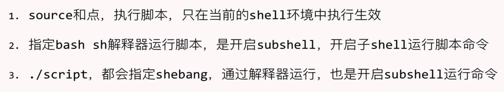
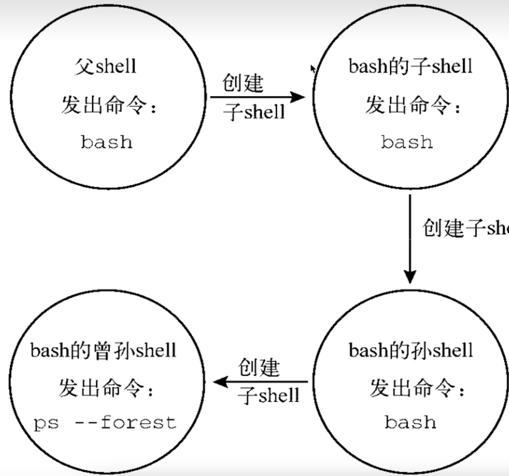
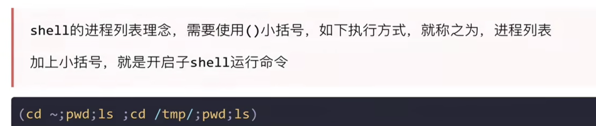
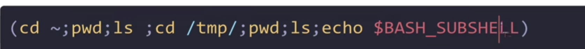
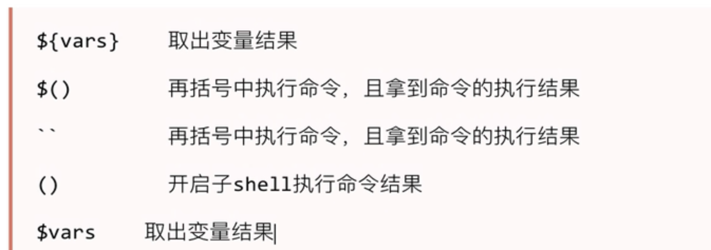
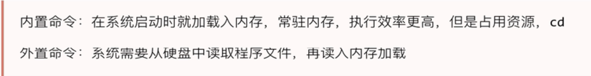
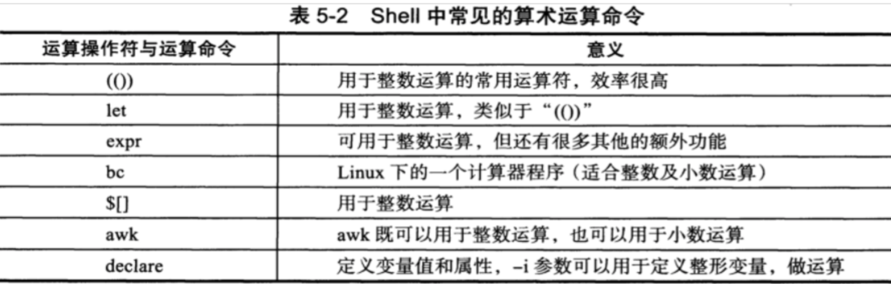
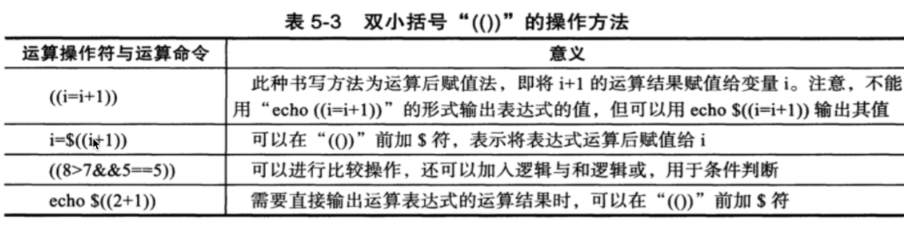

# 父子shell


<div align='left'></div>

<br/>


```bash
# 检查父子shell
ps -ef --foresr
# -f 现实uid pid ppid
```

子shell可以提升效率,提高并发执行的效率.而且当前进程可能被占用。

<div align='center'></div>


<div align='center'></div>


括号语法是shell 特有的。



bash_subshell 返回0表示再当前进程，否则数字表示对应的子shell个数。




特殊符号




## 内置命令



外置命令一定会开启子进程，nginx node mysql等

内置命令不会产生子进程，和`shell` 是一体的。不需要单独读取某个文件，系统启动的时候默认就在内存中。 `compgen -b`所有命令


## 计算





[具体参考代码实现](./compute.sh)


## Let 运算符

等效与`(())`,但是效率更高。

```bash
num=2
let num=num+2
echo $num; # 4
num=$((num+10))
echo $num; # 14
```

检测`nginx`服务运行的脚本。

脚本开发的思路：
- 功能，作用
- 先写伪代码，变量，存贮，安装，启动，重启等

[参考代码](./checknginx.sh)


## expr 

主要是在不支持计算的时候使用简单计算器和统计字符的长度。不是bash的一部分。

`expr` is not part of bash -- it's an ancient UNIX tool from back when the shell couldn't do math (or much else useful) on its own.

```bash
string_var=blah
echo "${#string_var}"

```


```bash
expr length 1234 # 4  完全可以使用这个来代替这个函数${#i} 
expr  5 + 3 # 8
expr 2 \* 2  # 10


expr 5 \> 6 # 0 逻辑判断

# 支持模式匹配
# : 冒号 计算字符串的字符数量
# .* 任意的字符串重复0次或者多次 是正则

expr a.png ":" ".*"  # 5个 .* 模式匹配到了5个
expr a.png ":" ".*p" # 3个
expr aa.png ":" ".*\.png"
```
案例:

判断文件名是否合法：[判断文件名是否合法](./lessSixWords.sh)

## bc 计算器

- awk 支持计算器
- 中括号运算
  
```bash
 echo "4*4" | bc # 16

 num=10
 result=`echo $num *4|bc` # 40
```

案例： [计算1-1000的和](./sum.sh)


## 中括号计算

测试发现linux 不支持小数计算，mac支持小数计算。

```bash
num=5
res=$[num+10]
echo $res #15
```


