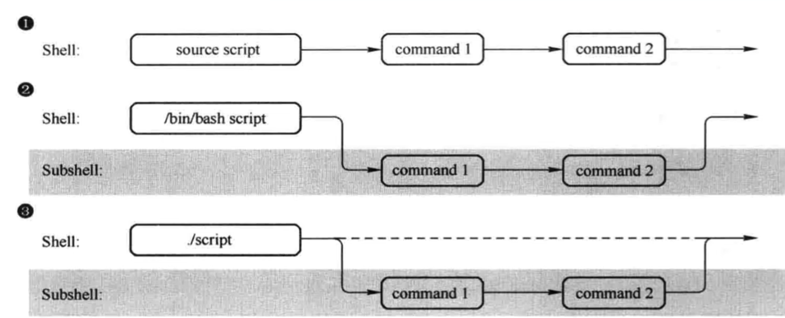

# 父子shell


<div align='left'></div>

<br/>



```bash
# 检查父子shell
ps -ef --foresr
# -f 现实uid pid ppid
```

子shell可以提升效率,提高并发执行的效率.而且当前进程可能被占用。

<div align='center'></div>


<div align='center'></div>


括号语法是shell 特有的。


bash_subshell 返回0表示再当前进程，否则数字表示对应的子shell个数。


特殊符号


## 内置命令


外置命令一定会开启子进程，nginx node mysql等

内置命令不会产生子进程，和shell 是一体的。不需要单独读取某个文件，系统启动的时候默认就在内存中。 compgen -b 所有命令


## 计算


[具体参考代码实现](./compute.sh)