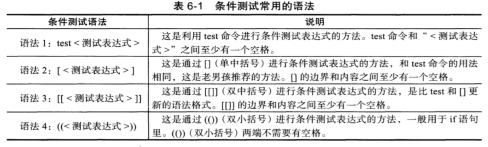

# 条件和逻辑

### shell 条件测试

参考系统内置的脚本是学习脚本最快的方式。

type read 内置
- -p 提示信息
- -t 等待超时

```bash
read -t 5 -p "输入用户名称" your_name your_age
echo $your_name
echo $your_age
```


以下两种实际中用的最多：

- test 为真0  $？
   
   

```bash
test -e test2.txt 
echo $?

# 先判断存在不
echo "console.log(1);" >> note.txt 
test -e note.txt && echo "file exist" || touch note.txt

test  test.txt -ot note.txt 
```

- [] 用的比较多，和test几乎一样，内外前后一定要有空格
使用变量必须添加双引号。  

```bash
node="note.txt"
echo $node #note.txt

# 是不是普通文件
[ -f "${node}" ] && echo ok || echo no  # ok

rm -rf note.txt

[ -f "${node}" ] && echo ok || echo no # no
```
[test.sh](./test.sh)

### 字符串测试


**字符串比较一定记得给变量添加双引号**


- = 判断相等, **左右两边一定要有空格**
- != 判断是不等的
- ! 取反 **要有空格**


[string](./string.sh)


### 数值的测试

[] 中数学符号需要添加转义符号。


经过测试使用字符比较还是最靠谱

```bash
[ 2 -lt 12 ] && echo yes || echo no
```

#### [[]] 
其他和单括号一样，唯一识别特殊符号，且双中支持正则表达式

工作中使用单括号是最多的。

```bash
[[ 2 -gt 10 ]] && echo yes || echo no
```


### 逻辑符号


逻辑判断

- a && b ab都成立
- a || b 当a不成立的时候，才会执行b

如果，在单括号中只能使用 `-a`和`-o`进行判断。

```bash
# 文件存在
[ -f "$fil1" -a -f "$file2" ] && echo yes
```
案例：

[接受用户，验证输入是否等于某个数字](./int.sh)
