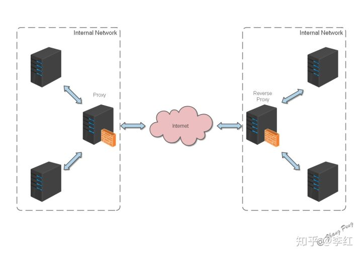

#  nginx常见使用场景
- 静态资源web服务
- 代理服务
- 负载均衡调度器slb
- 动态缓存

```
start nginx : 启动nginx
nginx -s reload  ：修改配置后重新加载生效
nginx -s reopen  ：重新打开日志文件
nginx -c /path/to/nginx.conf  加载配置文件

关闭nginx：
nginx -s stop  :快速停止nginx
nginx -s quit  ：完整有序的停止nginx
nginx -t 测试配置文件是否正常
```
> 可以使用shell脚本启动和关闭

# 什么是反向代理？

> 反向代理（Reverse Proxy）方式是指以代理服务器来接受 internet 上的连接请求，然后将请求转发给内部网络上的服务器，并将从服务器上得到的结果返回给 internet 上请求连接的客户端，此时代理服务器对外就表现为一个反向代理服务器。



```
#运行用户
#user somebody;
#启动进程,通常设置成和cpu的数量相等
worker_processes  1;
#全局错误日志
error_log  D:/Tools/nginx-1.10.1/logs/error.log;
error_log  D:/Tools/nginx-1.10.1/logs/notice.log  notice;
error_log  D:/Tools/nginx-1.10.1/logs/info.log  info;
#PID文件，记录当前启动的nginx的进程ID
pid        D:/Tools/nginx-1.10.1/logs/nginx.pid;
#工作模式及连接数上限
events {
    worker_connections 1024;    #单个后台worker process进程的最大并发链接数
}
#设定http服务器，利用它的反向代理功能提供负载均衡支持
http {
    #设定mime类型(邮件支持类型),类型由mime.types文件定义
    include       D:/Tools/nginx-1.10.1/conf/mime.types;
    default_type  application/octet-stream;
    #设定日志
	log_format  main  '[$remote_addr] - [$remote_user] [$time_local] "$request" '
                      '$status $body_bytes_sent "$http_referer" '
                      '"$http_user_agent" "$http_x_forwarded_for"';
    access_log    D:/Tools/nginx-1.10.1/logs/access.log main;
    rewrite_log     on;
    #sendfile 指令指定 nginx 是否调用 sendfile 函数（zero copy 方式）来输出文件，对于普通应用，
    #必须设为 on,如果用来进行下载等应用磁盘IO重负载应用，可设置为 off，以平衡磁盘与网络I/O处理速度，降低系统的uptime.
    sendfile        on;
    #tcp_nopush     on;
    #连接超时时间
    keepalive_timeout  120;
    tcp_nodelay        on;
	#gzip压缩开关
	#gzip  on;
    #设定实际的服务器列表
    upstream facebook{
        server 127.0.0.1:8089;
    }
    #HTTP服务器
    server {
        #监听80端口，80端口是知名端口号，用于HTTP协议
        listen       80;
        #定义使用www.xx.com访问
        server_name  www.qiuyanlong.com;
		#首页
		index index.html
		#指向webapp的目录
		root D:\01_Workspace\Project\github\zp\SpringNotes\spring-security\spring-shiro\src\main\webapp;
		#编码格式
		charset utf-8;
		#代理配置参数
        proxy_connect_timeout 180;
        proxy_send_timeout 180;
        proxy_read_timeout 180;
        proxy_set_header Host $host;
        proxy_set_header X-Forwarder-For $remote_addr;
        #反向代理的路径（和upstream绑定），location 后面设置映射的路径
        location / {
            proxy_pass http://facebook;
        }
        #静态文件，nginx自己处理
        location ~ ^/(images|javascript|js|css|flash|media|static)/ {
            root D:\01_Workspace\Project\github\zp\SpringNotes\spring-security\spring-shiro\src\main\webapp\views;
            #过期30天，静态文件不怎么更新，过期可以设大一点，如果频繁更新，则可以设置得小一点。
            expires 30d;
        }
        #设定查看Nginx状态的地址
        location /NginxStatus {
            stub_status           on;
            access_log            on;
            auth_basic            "NginxStatus";
            auth_basic_user_file  conf/htpasswd;
        }
        #禁止访问 .htxxx 文件
        location ~ /\.ht {
            deny all;
        }
		#错误处理页面（可选择性配置）
		#error_page   404              /404.html;
		#error_page   500 502 503 504  /50x.html;
        #location = /50x.html {
        #    root   html;
        #}
    }
}

```

`127.0.0.1 www.qiuyanlong.com` 应该是可以访问了,facebook就是我们需要代理访问的服务器。


# 负载均衡

>上一个例子中，代理仅仅指向一个服务器。但是，网站在实际运营过程中，多半都是有多台服务器运行着同样的 app，这时需要使用负载均衡来分流。nginx 也可以实现简单的负载均衡功能。

假设这样一个应用场景：将应用部署在 `192.168.1.11:80`、`192.168.1.12:80`、`192.168.1.13:80` 三台 linux 环境的服务器上。网站域名叫  `www.qiuyanlong.com`，公网  IP 为 `192.168.1.11`。在公网 IP 所在的服务器上部署 nginx，对所有请求做负载均衡处理。

代码[参考](./负载均衡+路由转发.conf)


# https 反向代理配置
> 一些对安全性要求比较高的站点，可能会使用 HTTPS（一种使用 ssl 通信标准的安全 HTTP 协议）。这里不科普 HTTP 协议和 SSL 标准。但是，使用 nginx 配置 https 需要知道几点：

- HTTPS 的固定端口号是 443，不同于 HTTP 的 80 端口
- SSL 标准需要引入安全证书，所以在 nginx.conf 中你需要指定证书和它对应的 key
- 其他和 http 反向代理基本一样，只是在  Server  部分配置有些不同。
```
#HTTP服务器
  server {
      #监听443端口。443为知名端口号，主要用于HTTPS协议
      listen       443 ssl;
      #定义使用www.xx.com访问
      server_name  www.helloworld.com;
      #ssl证书文件位置(常见证书文件格式为：crt/pem)
      ssl_certificate      cert.pem;
      #ssl证书key位置
      ssl_certificate_key  cert.key;
      #ssl配置参数（选择性配置）
      ssl_session_cache    shared:SSL:1m;
      ssl_session_timeout  5m;
      #数字签名，此处使用MD5
      ssl_ciphers  HIGH:!aNULL:!MD5;
      ssl_prefer_server_ciphers  on;
      location / {
          root   /root;
          index  index.html index.htm;
      }
  }
```
https 配置代码[参考](./https_simple.conf) 证书可以申请阿里云免费证书

# 静态站点配置

静态站点或者文件服务器配置[static_file.conf]

# 跨域
- jsonp 比较简单，单纯从代码角度就可以实现跨域。参考node代码[实现](./jsonp.js)
- cors 代码[实现](./cors.conf)  


# 防盗链
```

        location ~* ^.+\.(jpg|gif|png|swf|flv|wma|wmv|asf|mp3|mmf|zip|rar)$ {
            valid_referers none blocked *.baidu.com;
            #valid_referers   http://facebeet.com/;
            if ($invalid_referer) {
            #return 302  http://www.benet.com/img/nolink.jpg;
            return 404;
            break;
            }
            access_log off;
        }
```

# 其他

1： 如果遇到报错：
bash: nginx: command not found 有可能是你再linux命令行环境下运行了windows命令，如果你之前是允许 nginx -s reload报错， 试下 ./nginx -s reload

## 常见配置解析

- 1：`user nobody window` 无效，指定用户组
- 2：`worker_processes number | auto;` 用来设置`worker`进程的个数。
> 那`worker`进程个数又是怎么回事？`nginx`启动时，一般会启动多个工作者进程（`worker process`），以达到最大的系统性能。但是启动work进程数量多少才合适呢？<br/><br/>通常等于CPU数量或者2倍于CPU。

- 3: `pid  logs/nginx.pid; ` 它的作用是指定一个保存nginx主进程ID的文件。


# 杀死进程  windows

```
netstat -aon|findstr "443"
taskkill /pid xxx /f   结束nginx的进程
```


